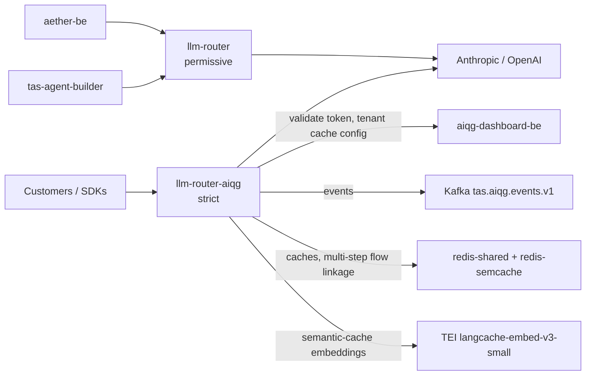

# TAS LLM Router

One HTTP endpoint that speaks both the OpenAI chat-completions dialect and the
Anthropic messages dialect, picks a provider and model for each request, and
records who spent what. It is the AI Quality Gateway (AIQG) ingress: the
customer-facing deployment is literally named `llm-router-aiqg`, and every
governance behaviour below — token authentication, prompt scanning, spend
attribution, event emission — happens on the way through it.

> **Verified 2026-09-23 against `tas-llm-router@06038b9`, and re-checked
> 2026-09-24 against `tas-llm-router@dc1957b`** (code diff plus both
> deployments' live image tags; the probes were not re-run), with read-only
> probes against both live deployments (`/v1/providers`, `/v1/models`,
> `/metrics`, the registry admin routes), the deployments' live image and
> environment, and one authenticated, non-billing call through
> `gateway.air-ops.net`. The two completion examples in the quick start were
> executed on 2026-08-26 and not re-run on this pass, because a completion
> bills a vendor; the token path they depend on was re-exercised on 2026-09-23. Image tags move; re-check
> before trusting a version number. Throughout, `#n` is a pull request in this
> repository and `SEC-n` / `OPS-n` are security and operations items in the
> TAS backlog; they are cited so a claim can be traced, not because the reader
> needs them.

## What this is

Point a client at this gateway instead of at `api.openai.com` or
`api.anthropic.com`, and you get four things the vendor endpoint does not
give you: one credential instead of per-vendor keys, a routing decision that
can pick a cheaper model than the one you asked for, a scan of the prompt
before it leaves the cluster, and a priced event per call attributed to a
tenant — the customer account a gateway token belongs to. Requests and responses stay in the vendor's own wire format, so most
clients need only a changed base URL and a changed key.

It is not a model host — every completion is served by Anthropic or OpenAI over
the network, and the gateway holds no weights. It is not an agent framework and
has no memory between calls; each request stands alone. The historic name in
this repository is "LLM Router WAF" — a web application firewall (WAF) — and
that framing is misleading: the scanning layer inspects prompt and response
content for policy findings, and does not filter by network attributes the way
a firewall does.

## Status & scope

**As of 2026-09-23**, two deployments run in namespace `tas-llm-router`, on
independent image tags that routinely skew:

| Deployment | Image tag today | Reached at | Auth |
|---|---|---|---|
| `llm-router` | `aiqg-v5.75` | `llm-router.tas.scharber.com` (all routes), in-cluster `llm-router.tas-llm-router:8086`, publicly `llm.air-ops.net` (completion paths only, behind Cloudflare Access) | permissive — serves completions with no credential |
| `llm-router-aiqg` | `aiqg-v5.87` | `gateway.aiqg.tas.scharber.com` (all routes, internal), publicly `gateway.air-ops.net` (completion paths only) | strict — `AIQG_STRICT=true`, no token means 401 |

Both are `2/2` ready and both answered live probes on the verification date.
Since 2026-09-21 the cluster has two nodes, `um773dev` and `pinova01`, and
each deployment keeps one replica on each through a
`topologySpreadConstraints` rule (#220), so either deployment survives losing
a node; pod placement was confirmed one-per-node on 2026-09-23.

The permissive deployment exists because internal callers predate the token
scheme; `aether-be` and `tas-agent-builder` still point at it by cluster
address. Its public hostname, `llm.air-ops.net`, is both path-allowlisted to
the six completion routes (SEC-23) and behind a Cloudflare Access policy — an
anonymous request gets Cloudflare's 403 page — so the unauthenticated path is
not reachable from the open internet. It is reachable from anywhere inside the
cluster or on the cluster's network.

**The two deployments run very different code.** The strict gateway has run
`aiqg-v5.87` since 2026-09-21 (#223), which that release commit records as
built from `main` at `e6c24c0` — 33 commits past `aiqg-v5.86`. Of the
commits on `main` after `e6c24c0`, up to `dc1957b`, all but one are that
release commit (#223, a one-line image-tag change in
`k8s/deployment-aiqg-strict.yaml`) and documentation refreshes that touch only
Markdown (#221, #230, #232). The exception is #233, and it is the only Go code
on `main` that the strict gateway does not run. It concerns the judge, a
second model that grades a sample of responses and posts each grade to
`aiqg-dashboard-be`. Those grades now carry which vendor and model were
graded, which model graded them, and a `self_judged` flag set when the two
models are the same (`internal/server/judge.go:156`). Self-judged grades are
still recorded, but the dashboard leaves them out of judged efficacy, its
per-model, per-workflow mean of judge grades on a 0–100 scale
(`aiqg-dashboard-be/internal/store/quality.go:194`). On 2026-09-24 `llm-router-aiqg` was still on
`aiqg-v5.87`, so grades it posts today carry none of these fields — and the
judged-efficacy query treats a grade with no model or no flag as
unattributable and skips it (`aiqg-dashboard-be/internal/store/quality.go:200`),
so until this reaches an image, judge grades reach the dashboard but add
nothing to judged efficacy. What is in the image but
not active there is switched off by configuration, not absent: the model
registry, and the serving of semantic-cache hits (shadow mode), both below. The permissive deployment is still
on `aiqg-v5.75`, which predates `b6070a0`, the `/metrics` rebuild that landed
shortly before `eee4b24` (2026-08-26). The difference is observable from
outside. On 2026-09-23 `llm-router-aiqg` exported the rebuilt series
(`llm_router_request_duration_seconds`, the `llm_router_semcache_*` counters)
and none of the old ones, and answered `/v1/registry/status` with
`503 "model registry is not enabled"`, which is what a build carrying the
registry code says while the registry is off. `llm-router` still exported the
pre-rebuild series (`llm_router_security_score`, `llm_router_threat_level`) and
answered that route with the HTTP router's bare `404 page not found`. Below,
"live on the strict gateway" means merged code running in `aiqg-v5.87`; none
of the Go code merged from `b6070a0` onward runs on the permissive deployment.
What reached both deployments through manifests alone: the public-host path
allowlists (SEC-1, SEC-23), password authentication to both Redis instances
(SEC-24, SEC-26), removal of the unused `wait-for-postgres` init container
(#177), and the replica spread.

> [!UNVERIFIED] The commit behind `aiqg-v5.75` is not recorded — there are no
> git tags, and neither the image nor `--version` carries a commit. What is
> established is an upper bound: it predates `b6070a0`. The `e6c24c0` mapping
> for `aiqg-v5.87` comes from the release commit (#223), which also reports
> that response events are stamped `gateway_version e6c24c0`; that stamp was
> not re-checked on 2026-09-23.

> [!UNVERIFIED] Whether the `aiqg-dashboard-be` build carrying the
> judged-efficacy query cited above is deployed was not checked on 2026-09-24.

Three subsystems that older copies of this file listed as unstarted are
running in production and have been for months: request and cost telemetry
through OpenTelemetry export (`OTEL_EXPORTER_OTLP_ENDPOINT` points at
`otel-collector-shared.tas-shared:4317`) and the priced per-call event stream —
distinct from the router's own Prometheus `/metrics` exporter, whose caveat is
below — response caching
(`AIQG_RESPONSE_CACHE_ENABLED=true`, ten-minute time-to-live, plus a semantic
cache against a dedicated Redis), and routing beyond round-robin
(`FEATURE_ADVANCED_ROUTING=true`, `FEATURE_CIRCUIT_BREAKER=true`). Treat this
repository as a load-bearing production service, not an early prototype.

Genuinely unfinished or in flight, stated plainly:

- **The model registry is deployed on the strict gateway but switched off.** PRs
  #202–#208 added `internal/registry/`: a background sync engine that
  discovers models (OpenAI through its list-models endpoint; Anthropic, which
  has no list endpoint, by sending each configured model a minimal probe
  request) and records each as active, deprecated, or unavailable. When it is
  on, the router consults that cached status before choosing a provider: it
  resolves user-defined aliases (`fast` → a concrete model), substitutes a
  fallback for a model the vendor has withdrawn, and records either rewrite in
  `router_metadata` as `original_model`, `resolved_model`, and
  `fallback_reason`. A deprecated model is still served as asked, with only a
  server-side log warning. Models the registry has never discovered route
  exactly as before. It is switched on
  only by the `registry:` block of the YAML config file
  (`config.example.yaml` shows every field; `enabled: false` is the default) —
  there is no environment-variable override. The image starts the binary with
  `--config configs/config.yaml` (`docker/Dockerfile`), and that baked-in file
  has no `registry:` block, so turning it on for `llm-router-aiqg` needs the
  block added there (or a mounted replacement); the permissive deployment would
  also need a new image. Its admin routes
  (`/v1/registry/status`, `/models`, `/models/{provider}`, `/sync`,
  `/validate`) are documented in [`docs/openapi.yaml`](docs/openapi.yaml),
  return 503 while it is disabled (observed on the strict gateway on
  2026-09-23), and are mounted without the gateway-token
  check, so they are reachable only on the internal hosts.
- **The `/metrics` rebuild is live on the strict gateway only.** Commit
  `b6070a0` replaced an exporter that derived counters from wall-clock time
  with a real Prometheus registry and deleted eight series that had no data
  source; later merges added prompt-cache savings, semantic-cache, judge-spend,
  and registry series on top of it. Since the `aiqg-v5.87` rollout on
  2026-09-21, `llm-router-aiqg` exports those series; `llm-router` still
  returned the old ones on 2026-09-23. Numbers on the router dashboards built
  from `/metrics` are measurements for the strict gateway from 2026-09-21
  onward, and not for the permissive deployment or for earlier dates.
- **Other merged behaviour, live on the strict gateway and absent from the
  permissive deployment**, that a reader of the code will meet:
  Kafka loss at startup now degrades to log-only events instead of exiting
  (#191); the prompt-cache `auto` mode now places `cache_control` breakpoints
  itself instead of passing requests through (#197–#201); the calls the
  gateway makes on its own behalf to evaluate quality — a judge model scoring a
  sample of responses, and shadow replays that re-send a request to a
  candidate model for comparison — are counted as spend, attributed per tenant, and billed
  to a bring-your-own-key (BYOK) tenant's stored vendor key rather than the
  gateway's (#210–#214); and strict mode fails closed when its token list is
  empty (#188).
- **The semantic cache runs in shadow.** `AIQG_SEMCACHE_SHADOW=true` on
  `llm-router-aiqg`, so near-miss hits are recorded and scored but not served
  unless a tenant's own cache configuration opts in. Since 2026-09-21 (#222)
  it embeds with a dedicated Text Embeddings Inference (TEI) server,
  `tei.tas-shared:8080`, serving `redis/langcache-embed-v3-small`, at a 0.87
  similarity threshold. An August cut-over to the same model (#146) also
  raised the threshold to 0.93, found no genuine paraphrase hits, and was
  rolled back to Ollama's `all-minilm` (#218). A side-by-side measurement on
  2026-09-20 blamed the threshold, not the model: at 0.87, `all-minilm` scored
  "Can I cancel" against "Can't I cancel" at 0.9595, a false hit it would
  serve, while langcache scored the pair 0.7694. So the second cut-over changed
  only the embedder. 0.87 is still a prediction from 13 hand-written pairs, not
  a measurement on traffic; on 2026-09-23 every outcome of
  `llm_router_semcache_lookups_total` on the strict gateway read 0. The pods'
  startup log still reports `"embed_model":"all-minilm"`; that field feeds only
  the Ollama path, and TEI serves the one model fixed by its own `--model-id`.
- **`make build` does not work from a standalone clone.** See
  [Build and test](#build-and-test) — this repository needs three sibling
  repositories on disk.

## Quick start

Every completion route on the customer-facing gateway needs a gateway token.
Tokens are self-serve: sign in to the AIQG dashboard (`aiqg.air-ops.net`
publicly, `aiqg.tas.scharber.com` internally), open its Tokens page, and issue
one. The same thing over HTTP is `/api/v1/account/tokens` on
`https://api.aiqg.tas.scharber.com`, authenticated with your Keycloak-issued
JSON Web Token (JWT); the tenant comes from your login, and the plaintext token
is shown once at creation and never again. The dashboard signs in against the
`aether` realm of Keycloak at `keycloak.tas.scharber.com` (client `aiqg-ui`),
and that realm does not allow self-registration: on 2026-09-23 its
registration endpoint answered HTTP 400 "Registration not allowed", and the
dashboard's `/signup` page is a placeholder. A newcomer therefore needs an
account created for them in that realm before they can issue a token.

> [!UNVERIFIED] Who creates `aether` realm accounts for AIQG users, and how a
> new account is tied to a tenant, is not recorded in this repository or in the
> dashboard code checked on 2026-09-23. Ask the platform owner rather than
> guessing.

Tokens carry the prefix `tas_qg_live_`, and the gateway accepts one in any of three headers —
`TAS-Auth`, `Authorization: Bearer`, or `x-api-key` — because a stock vendor
SDK can only populate its own credential slot. All three are lifted onto the
same path at `internal/middleware/aiqg.go:154`.

Which host to call depends on who you are. A customer, or anyone outside the
cluster network, calls `https://gateway.air-ops.net`, which publishes only the
six token-authenticated completion routes (`/v1/chat/completions`,
`/v1/completions`, `/v1/messages`, `/v1/messages/count_tokens`,
`/v1/embeddings`, `/v1/responses`); every other path there is an nginx 404 by
design (SEC-1). An operator on the cluster network, or on a device enrolled in Cloudflare's
zero-trust client (WARP), uses
`https://gateway.aiqg.tas.scharber.com`, which reaches the same strict
deployment with its whole route table. A TAS service inside the cluster calls
`http://llm-router.tas-llm-router:8086`, the permissive deployment.

Call it without a token and you get the failure you are most likely to hit
first (re-run 2026-09-23):

```bash
curl -sS -w '\nHTTP %{http_code}\n' https://gateway.air-ops.net/v1/chat/completions \
  -H 'Content-Type: application/json' \
  -d '{"model":"claude-haiku-4-5-20251001","messages":[{"role":"user","content":"ping"}],"max_tokens":5}'
{"error":{"code":"path_a_auth_required","message":"AIQG ingress requires both TAS-Auth and Authorization headers; TAS-Auth is missing","missing_header":"TAS-Auth","docs":"https://docs.tas.scharber.com/aiqg/auth"}}
HTTP 401
```

"Path A" in the error code is the internal name for this token-authenticated
ingress path. The message's "requires both … headers" is stale wording: one
header carrying a `tas_qg_live_` token is enough, because a token found in
`Authorization: Bearer` or `x-api-key` is copied into `TAS-Auth` before the
check, and a vendor key in `Authorization` has been optional since tenants
could store their own vendor key with the gateway (`internal/middleware/aiqg.go:182`).
The `missing_header` field is the part to read.

A token the gateway does not recognise fails differently, with the same 401
status, which distinguishes "I sent nothing" from "I sent something stale":

```bash
curl -sS -w '\nHTTP %{http_code}\n' https://gateway.air-ops.net/v1/chat/completions \
  -H 'TAS-Auth: tas_qg_live_notarealtoken000' \
  -H 'Content-Type: application/json' \
  -d '{"model":"claude-haiku-4-5-20251001","messages":[{"role":"user","content":"ping"}],"max_tokens":5}'
{"error":{"code":"path_a_auth_required","message":"AIQG ingress requires a recognized TAS-Auth token","reason":"token_unknown","docs":"https://docs.tas.scharber.com/aiqg/auth"}}
HTTP 401
```

On a correctly configured gateway those two are the only 401 bodies:
no token found in any of the three headers, or a token `aiqg-dashboard-be`
does not know (never issued, revoked, or mistyped — the gateway cannot tell
these apart). A third 401, `"reason":"no_resolver_configured"`, means the
gateway itself has no token store wired and is an operator problem, not
yours. Three neighbouring statuses are easy to mistake for auth failures: 403
means the token is valid but its account is suspended; 503
`token_resolver_unavailable` means the gateway could not reach
`aiqg-dashboard-be` to check the token, so retry; and 402 means the tenant is
set to bring-your-own-key only and has no vendor key stored for the vendor the
router picked.

The cheapest way to prove a real token works is token counting, which the
gateway answers from Anthropic's free count endpoint, so it bills nothing.
This call was run on 2026-09-23 with the test token described under
[Configuration](#configuration):

```bash
export TAS_TOKEN=tas_qg_live_...   # issued from the dashboard; never commit it
curl -sS https://gateway.air-ops.net/v1/messages/count_tokens \
  -H "x-api-key: $TAS_TOKEN" \
  -H 'anthropic-version: 2023-06-01' \
  -H 'Content-Type: application/json' \
  -d '{"model":"claude-haiku-4-5-20251001","messages":[{"role":"user","content":"Reply with the single word: pong"}]}'
{"input_tokens":15}
```

A completion additionally needs a vendor key to bill. Either store your own
on the dashboard's Provider keys page (`/provider-keys`), or leave the
account-wide "BYOK-only" box on that page unticked (only a dashboard admin
sees it — a user holding the `aiqg-admin` realm role, which existing admins
grant from Settings ▸ Admin), which lets the gateway fall back to the shared TAS key; with no
stored key and BYOK-only ticked, the completion is refused with the 402
described above. With that in place, a completion in the
OpenAI dialect (executed 2026-08-26):

```bash
curl -sS https://gateway.air-ops.net/v1/chat/completions \
  -H "Authorization: Bearer $TAS_TOKEN" \
  -H 'Content-Type: application/json' \
  -d '{"model":"claude-haiku-4-5-20251001","messages":[{"role":"user","content":"Reply with the single word: pong"}],"max_tokens":16}'
{"id":"msg_011CeSAMLLwRFJhbT7KMiE9K","object":"chat.completion","created":1787783906,"model":"claude-haiku-4-5-20251001","choices":[{"index":0,"message":{"role":"assistant","content":"pong"},"finish_reason":"stop"}],"usage":{"prompt_tokens":15,"completion_tokens":5,"total_tokens":20},"router_metadata":{"provider":"anthropic","model":"claude-haiku-4-5-20251001","routing_reason":["expected_cost abstained: no usable measurements; priced at max_tokens as before"],"estimated_cost":0.0000704,"processing_time":22843,"request_id":"chatcmpl-1787783905997651971","attempt_count":1,"fallback_used":false}}
```

That `router_metadata` block is the part no vendor endpoint returns: which
provider actually served, why the router chose it, and what the call cost.
The Anthropic dialect works the same way, with the token in `x-api-key`, and
answers in Anthropic's own response shape:

```bash
curl -sS https://gateway.air-ops.net/v1/messages \
  -H "x-api-key: $TAS_TOKEN" \
  -H 'anthropic-version: 2023-06-01' \
  -H 'Content-Type: application/json' \
  -d '{"model":"claude-haiku-4-5-20251001","max_tokens":16,"messages":[{"role":"user","content":"Reply with the single word: pong"}]}'
{"id":"msg_011CeSAV9Ahvtkbz9QBVX2Vq","type":"message","role":"assistant","model":"claude-haiku-4-5-20251001","content":[{"type":"text","text":"pong"}],"stop_reason":"end_turn","usage":{"input_tokens":15,"output_tokens":5}}
```

Four read-only routes answer with no credential at all, which is the fastest
way to confirm you are talking to the right thing before you have a token.
They are served only on the internal hosts; on `gateway.air-ops.net` they
return nginx's 404 page. The internal ingress certificate comes from the
cluster's own `tas-ca-issuer`, which your machine will not trust, hence `-k`
(re-run 2026-09-23):

```bash
curl -sSk https://gateway.aiqg.tas.scharber.com/v1/providers
{"count":2,"providers":["openai","anthropic"]}
```

`/v1/models` lists the six model identifiers the router will accept
(`claude-haiku-4-5-20251001`, `claude-opus-4-6`, `claude-sonnet-4-6`,
`gpt-3.5-turbo`, `gpt-4o`, `gpt-4o-mini` on both deployments that day),
`/v1/capabilities` gives context windows and per-thousand-token prices per
model, and `/health` reports per-provider status and the last check time.

## How it fits

The router is the single egress path from TAS to commercial model providers,
which is why the credentials live here and not in each caller.



Both deployments listen on container port **8086**, which is also the service
port. The code's own default is **8080** (`internal/config/config.go:390`); the
deployment overrides it with `LLM_ROUTER_PORT=8086` from the `llm-router-config`
ConfigMap. If you run the binary locally without that variable, it listens on
8080 — that is the only place the two numbers legitimately disagree.

Dependency strength varies, and the difference matters when something is down.
In the code at `HEAD`, only two things stop startup outright: a config file
that fails to load, and no usable provider key — with neither `OPENAI_API_KEY` nor
`ANTHROPIC_API_KEY` set, it exits with `no providers were registered - check
your configuration and API keys`. A failure to initialise the prompt scanner
(Gatekeeper, a sibling repository compiled in) is logged as a warning and
leaves scanning disabled; the process keeps serving.
**Kafka is a hard startup dependency for the permissive deployment, and not
for the strict gateway.** In the `aiqg-v5.75` build that `llm-router` runs,
with `AIQG_EMITTER_TYPE=both`, a broker failure while the emitter is
constructed aborts server construction and the process exits 1, so a pod with
no reachable broker crash-loops. Code merged in #191, which `aiqg-v5.87`
carries, changes that: `internal/server/server.go:201` falls back to the log
emitter, raises the `aiqg_emitter_degraded` gauge to 1, and keeps serving — a
Kafka outage costs `llm-router-aiqg` telemetry, not availability.

> [!UNVERIFIED] Neither behaviour was exercised on 2026-09-23. The crash loop
> is what the code did at `eee4b24`, which `aiqg-v5.75` demonstrably predates
> (see [Status & scope](#status--scope)), and that image's commit is not
> recorded; the fallback is what the code at `e6c24c0` does. Nobody took Kafka
> down to watch either happen.

Redis is quieter: a running pod tolerates losing it, but the
`wait-for-redis` init container blocks every *new* pod, so a Redis outage
freezes rollouts and restarts. Both Redis instances (`redis-shared` and the
semantic cache's `redis-semcache`, in `tas-shared`) require a password since
2026-09-18. The router does not use Postgres at all — there is no database
client in the Go tree, and the old `wait-for-postgres` init container was
removed from the live deployments on 2026-09-21. `aiqg-dashboard-be` sits on
the authentication path of every strict-gateway request, because tokens are
stored hashed and validated remotely, with no cache in front of the lookup —
when it is unreachable, every tokened request gets 503
`token_resolver_unavailable`, valid token or not. It is also where the gateway
fetches each tenant's cache configuration, the per-tenant settings that decide,
among other things, whether semantic-cache hits are served to that tenant.

## Configuration

Configuration comes from a YAML file (`config.example.yaml` shows the full
shape; the image loads `configs/config.yaml`) overlaid by environment
variables, and in the cluster it is almost entirely environment: the
`llm-router-config` ConfigMap in `tas-llm-router` carries 52 keys, `llm-router-secret` supplies the rest, and each deployment
adds its own `env` entries on top (an explicit entry beats the ConfigMap).
These are the ones that change behaviour rather than tune it:

| Setting | Effect | Default in code | What runs in production |
|---|---|---|---|
| `LLM_ROUTER_PORT` | Listen port | `8080` | `8086` on both deployments |
| `AIQG_ENABLED` | Turns the governance layer on | off | `true` |
| `AIQG_STRICT` | No token means 401 instead of pass-through | `false` | `true` on `llm-router-aiqg` only |
| `AIQG_EMITTER_TYPE` | Where priced events go | `log` | `both` — log and Kafka, making Kafka required for the permissive deployment's image |
| `GATEKEEPER_ENABLED` / `GATEKEEPER_FAIL_OPEN` | Prompt scanning, and what happens when the scanner errors | off | `true` / `true` — a scanner failure lets the request through |
| `AIQG_RESPONSE_CACHE_ENABLED` | Exact-match response cache | off | `true`, `AIQG_RESPONSE_CACHE_TTL=10m` |
| `AIQG_SEMCACHE_ENABLED` / `AIQG_SEMCACHE_SHADOW` | Semantic cache, and whether it serves or only observes | off / `true` | `true` / `true` — observing, on `llm-router-aiqg` |
| `AIQG_SEMCACHE_EMBED_PROVIDER` / `AIQG_SEMCACHE_MIN_SIMILARITY` | Embedder and match threshold; the two move together, because each model scores the same pair differently | — | `tei` (TEI serving `redis/langcache-embed-v3-small`) / `0.87` |
| `LLM_ROUTER_DEFAULT_STRATEGY` | Routing when the request does not name a model | `cost_optimized` | `cost_optimized` |
| `registry.enabled` (YAML only) | Model registry: discovery, aliases, fallback | `false` | off — the baked-in `configs/config.yaml` has no `registry:` block; the code runs only in `aiqg-v5.87` |

Secrets are referenced here by location only. Provider keys and the internal
dashboard token live in the `llm-router-secret` Opaque secret in namespace
`tas-llm-router`, under the key names `ANTHROPIC_API_KEY`, `OPENAI_API_KEY`,
and `AIQG_DASHBOARD_INTERNAL_AUTH_TOKEN` among seventeen. The two Redis
passwords are the key `password` in the `redis-shared-auth` and
`redis-semcache-auth` secrets, also in `tas-llm-router`; the deployments splice
them into the Redis URLs at pod start. The bootstrap token file is the
`llm-router-aiqg-tokens` secret in the same namespace, key `aiqg-tokens.yaml`,
mounted at the path in `AIQG_TOKENS_FILE`; it is a fallback only, since the
running gateway resolves tokens through `aiqg-dashboard-be`. For local work,
the untracked env files under `aether-secrets/apps/tas-llm-router/` hold
provider keys (`llm-providers.env`) and a test gateway token
(`aiqg-tokens.env`, key `AIQG_TEST_TAS_AUTH_TOKEN`). Nothing in this
repository should ever contain a token value.

## Build and test

This repository does not build standalone. `go.mod` carries four `replace`
directives pointing at sibling checkouts — `../Gatekeeper` and three modules
under `../aether-shared/` — so a clone on its own fails with
`replacement directory ../Gatekeeper does not exist`. Clone it inside the TAS
monorepo alongside those, or vendor them yourself.

Even inside the monorepo, the default build binds the Hyperscan scanning engine
through cgo, which needs `libhyperscan-dev` and `pkg-config` on the machine:

```bash
go build -o llm-router ./cmd/llm-router
github.com/flier/gohs/internal/hs: exec: "pkg-config": executable file not found in $PATH
```

The `nohs` build tag swaps in Go's `regexp` instead, which is what `make test`
uses and what a contributor without the library wants. The production image
builds the Hyperscan path (`docker/Dockerfile`), so a locally built binary and
the deployed one differ in matcher implementation.

```bash
go build -tags nohs -o llm-router ./cmd/llm-router
./llm-router --version
LLM Router WAF v1.0.0
Build Date: 2026-09-21
```

```bash
go test -tags nohs ./... 2>&1 | grep -c FAIL
0
```

Thirty-two packages carried tests and all passed on 2026-09-21, including the
new `internal/registry` and `internal/registry/adapters` packages. The version
string above is hardcoded in `cmd/llm-router/main.go` and does not track the
image tag; the tag stamped into emitted events is set by `make docker-build`.

Besides the router, `cmd/` holds three tools: `demo-traffic` fills an AIQG
dashboard with realistic traffic (it has its own
[usage guide](cmd/demo-traffic/README.md)), `semcache-calibrate` chooses the
semantic-cache embedder and threshold from the judge's labels on real
colliding prompt pairs, and `clear-score` is a stdin-to-stdout JSON-lines
filter over the shipping response scorer in `pkg/clear` (Cost, Latency,
Efficacy, Assurance, Reliability), so external validation
harnesses test the real Go implementation rather than a copy of it.

Deploying from this repository means `kubectl apply -k k8s/`, never `-f` on a
single file: the live Deployment selectors carry the kustomization's common
labels, so a bare `-f` is rejected on the immutable selector (#220). Each
deployment file pins the image tag it actually runs.

## Where to go next

Three documents go deeper; prefer them over anything else in `docs/`. None of
the three covers the model registry yet — for that, `config.example.yaml` and
the `/v1/registry/*` entries in the OpenAPI file are the current reference.

- **[Operations](docs/ops/llm-router.md)** — for on-call. Health signals,
  restart and rollback procedures with their blast radius, failure modes with
  the literal error strings to search Loki for, and escalation.
- **[Developer guide](docs/dev/llm-router-api.md)** — for integrating or
  extending. Every route, the complete error set with retry guidance, what
  changes when you point a stock vendor SDK at the gateway, and why the design
  took this shape.
- **[Routing guide](docs/concept/routing.md)** — for callers configuring
  routing. Why a request went to a vendor you did not ask for, which routing
  controls change a decision on the deployed gateway and which are inert, and
  how to trace one request's routing after the fact.

Beyond those: [`docs/openapi.yaml`](docs/openapi.yaml) is the machine-readable
contract, also served as a browsable page at `docs.air-ops.net`;
[`docs/`](docs/README.md) holds the AIQG design and analysis notes, including
the caching and semantic-caching write-ups; [`k8s/`](k8s/) has the deployment
manifests; and the [repository working rules](./CLAUDE.md) record local
conventions. Router dashboards live in Grafana at `grafana.tas.scharber.com` —
read the caveat in [Status & scope](#status--scope) before trusting their
numbers.

Licensing terms are in [LICENSE](LICENSE).
