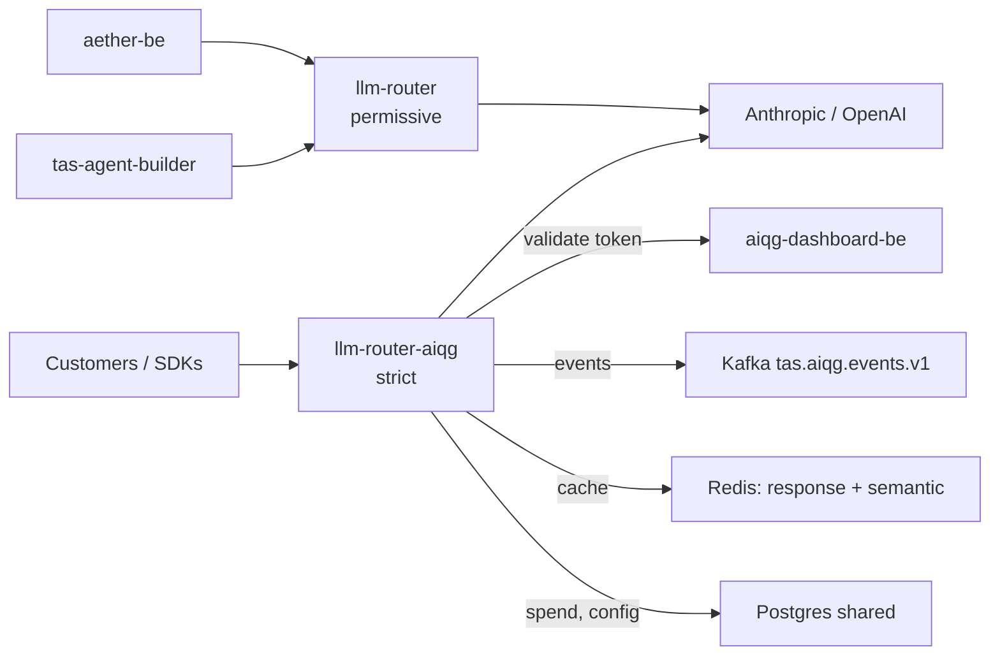

# TAS LLM Router

One HTTP endpoint that speaks both the OpenAI chat-completions dialect and the
Anthropic messages dialect, picks a provider and model for each request, and
records who spent what. It is the AI Quality Gateway (AIQG) ingress: the
customer-facing deployment is literally named `llm-router-aiqg`, and every
governance behaviour below — token authentication, prompt scanning, spend
attribution, event emission — happens on the way through it.

> **Verified 2026-08-26 against `tas-llm-router@eee4b24`** and live probes
> against `gateway.air-ops.net`. Every command and response below was executed
> on that date. Image tags move; re-check before trusting a version number.

## What this is

Point a client at this gateway instead of at `api.openai.com` or
`api.anthropic.com`, and you get four things the vendor endpoint does not
give you: one credential instead of per-vendor keys, a routing decision that
can pick a cheaper model than the one you asked for, a scan of the prompt
before it leaves the cluster, and a priced event per call attributed to a
tenant. Requests and responses stay in the vendor's own wire format, so most
clients need only a changed base URL and a changed key.

It is not a model host — every completion is served by Anthropic or OpenAI over
the network, and the gateway holds no weights. It is not an agent framework and
has no memory between calls; each request stands alone. The historic name in
this repository is "LLM Router WAF" — a web application firewall (WAF) — and
that framing is misleading: the scanning layer inspects prompt and response
content for policy findings, and does not filter by network attributes the way
a firewall does.

## Status & scope

**As of 2026-08-26**, two deployments run in namespace `tas-llm-router`, on
independent image tags that routinely skew:

| Deployment | Image tag today | Reached at | Auth |
|---|---|---|---|
| `llm-router` | `aiqg-v5.75` | `llm-router.tas.scharber.com`, in-cluster `llm-router.tas-llm-router:8086` | permissive — serves completions with no credential |
| `llm-router-aiqg` | `aiqg-v5.86` | `gateway.aiqg.tas.scharber.com`, publicly `gateway.air-ops.net` | strict — `AIQG_STRICT=true`, no token means 401 |

Both are `2/2` ready and both answered live probes on the verification date.
The permissive deployment exists because internal callers predate the token
scheme; `aether-be` and `tas-agent-builder` still point at it by cluster
address. The public hostname for it, `llm.air-ops.net`, sits behind a
Cloudflare Access policy, so the unauthenticated path is not reachable from
the open internet — but it is reachable from anywhere inside the cluster or on
the cluster's network.

Three subsystems that older copies of this file listed as unstarted are
running in production and have been for months: request and cost metrics with
OpenTelemetry export (`OTEL_EXPORTER_OTLP_ENDPOINT` points at
`otel-collector-shared.tas-shared:4317`), response caching
(`AIQG_RESPONSE_CACHE_ENABLED=true`, ten-minute time-to-live, plus a semantic
cache against a dedicated Redis), and routing beyond round-robin
(`FEATURE_ADVANCED_ROUTING=true`, `FEATURE_CIRCUIT_BREAKER=true`). Treat this
repository as a load-bearing production service, not an early prototype.

Genuinely unfinished or in flight, stated plainly:

- **The `/metrics` rebuild is merged but not deployed.** Commit `b6070a0`
  replaced an exporter that derived counters from wall-clock time with a real
  Prometheus registry and deleted eight series that had no data source.
  Scraping either running pod on the verification date still returned the old
  series (`llm_router_security_score`, `llm_router_threat_level`,
  `llm_router_active_api_keys`), and the new `llm_router_request_duration_seconds`
  was absent from both. Until a rollout carries `eee4b24` or later, numbers on
  the router dashboards are not measurements.
- **The semantic cache runs in shadow.** `AIQG_SEMCACHE_SHADOW=true` on
  `llm-router-aiqg`, so near-miss hits are recorded and scored but not served
  unless a tenant's own cache configuration opts in.
- **`make build` does not work from a standalone clone.** See
  [Build and test](#build-and-test) — this repository needs three sibling
  repositories on disk.

## Quick start

Every completion route on the customer-facing gateway needs a gateway token.
Tokens are self-serve: sign in to the AIQG dashboard (`aiqg.air-ops.net`
publicly, `aiqg.tas.scharber.com` internally), open its Tokens page, and issue
one. The same thing over HTTP is `/api/v1/account/tokens` on
`https://api.aiqg.tas.scharber.com`, authenticated with your Keycloak-issued
JSON Web Token (JWT); the tenant comes from your login, and the plaintext token
is shown once at creation and never again. Tokens carry the prefix
`tas_qg_live_`, and the gateway accepts one in any of three headers —
`TAS-Auth`, `Authorization: Bearer`, or `x-api-key` — because a stock vendor
SDK can only populate its own credential slot. All three are lifted onto the
same path at `internal/middleware/aiqg.go:153`.

Call it without one and you get the failure you are most likely to hit first:

```bash
curl -sS https://gateway.air-ops.net/v1/chat/completions \
  -H 'Content-Type: application/json' \
  -d '{"model":"claude-haiku-4-5-20251001","messages":[{"role":"user","content":"ping"}],"max_tokens":5}'
{"error":{"code":"path_a_auth_required","message":"AIQG ingress requires both TAS-Auth and Authorization headers; TAS-Auth is missing","missing_header":"TAS-Auth","docs":"https://docs.tas.scharber.com/aiqg/auth"}}
```

A token the gateway does not recognise fails differently — `"reason":"token_unknown"`
with the same 401 status — which distinguishes "I sent nothing" from "I sent
something stale". With a token in the environment, the OpenAI dialect:

```bash
export TAS_TOKEN=tas_qg_live_...   # issued from the dashboard; never commit it
curl -sS https://gateway.air-ops.net/v1/chat/completions \
  -H "Authorization: Bearer $TAS_TOKEN" \
  -H 'Content-Type: application/json' \
  -d '{"model":"claude-haiku-4-5-20251001","messages":[{"role":"user","content":"Reply with the single word: pong"}],"max_tokens":16}'
{"id":"msg_011CeSAMLLwRFJhbT7KMiE9K","object":"chat.completion","created":1787783906,"model":"claude-haiku-4-5-20251001","choices":[{"index":0,"message":{"role":"assistant","content":"pong"},"finish_reason":"stop"}],"usage":{"prompt_tokens":15,"completion_tokens":5,"total_tokens":20},"router_metadata":{"provider":"anthropic","model":"claude-haiku-4-5-20251001","routing_reason":["expected_cost abstained: no usable measurements; priced at max_tokens as before"],"estimated_cost":0.0000704,"processing_time":22843,"request_id":"chatcmpl-1787783905997651971","attempt_count":1,"fallback_used":false}}
```

That `router_metadata` block is the part no vendor endpoint returns: which
provider actually served, why the router chose it, and what the call cost.
The Anthropic dialect works the same way, with the token in `x-api-key`, and
answers in Anthropic's own response shape:

```bash
curl -sS https://gateway.air-ops.net/v1/messages \
  -H "x-api-key: $TAS_TOKEN" \
  -H 'anthropic-version: 2023-06-01' \
  -H 'Content-Type: application/json' \
  -d '{"model":"claude-haiku-4-5-20251001","max_tokens":16,"messages":[{"role":"user","content":"Reply with the single word: pong"}]}'
{"id":"msg_011CeSAV9Ahvtkbz9QBVX2Vq","type":"message","role":"assistant","model":"claude-haiku-4-5-20251001","content":[{"type":"text","text":"pong"}],"stop_reason":"end_turn","usage":{"input_tokens":15,"output_tokens":5}}
```

Four read-only routes answer with no credential at all, which is the fastest
way to confirm you are talking to the right thing before you have a token:

```bash
curl -sS https://gateway.air-ops.net/v1/providers
{"count":2,"providers":["openai","anthropic"]}
```

`/v1/models` lists the six model identifiers the router will accept,
`/v1/capabilities` gives context windows and per-thousand-token prices per
model, and `/health` reports per-provider status and the last check time.

## How it fits

The router is the single egress path from TAS to commercial model providers,
which is why the credentials live here and not in each caller.



Both deployments listen on container port **8086**, which is also the service
port. The code's own default is **8080** (`internal/config/config.go:370`); the
deployment overrides it with `LLM_ROUTER_PORT=8086` from the `llm-router-config`
ConfigMap. If you run the binary locally without that variable, it listens on
8080 — that is the only place the two numbers legitimately disagree.

Dependency strength varies, and the difference matters when something is down.
**Kafka is a hard startup dependency**: with `AIQG_EMITTER_TYPE=both`, the
emitter is constructed at `internal/server/server.go:383`, a broker failure
there aborts server construction, and the process exits 1 at
`cmd/llm-router/main.go:301` rather than degrading. A pod with no reachable
broker crash-loops. Redis and Postgres are quieter: a running pod tolerates
losing them, but both `wait-for-postgres` and `wait-for-redis` init containers
block every *new* pod, so an outage in either freezes rollouts and restarts.
`aiqg-dashboard-be` sits on the authentication path of every strict-gateway
request, because tokens are stored hashed and validated remotely — when it is
unreachable, valid tokens stop being recognised.

## Configuration

Configuration comes from a YAML file (`config.example.yaml` shows the full
shape) overlaid by environment variables, and in the cluster it is almost
entirely environment: the `llm-router-config` ConfigMap in `tas-llm-router`
carries 55 keys and `llm-router-secret` supplies the rest. These are the ones
that change behaviour rather than tune it:

| Setting | Effect | Default in code | What runs in production |
|---|---|---|---|
| `LLM_ROUTER_PORT` | Listen port | `8080` | `8086` on both deployments |
| `AIQG_ENABLED` | Turns the governance layer on | off | `true` |
| `AIQG_STRICT` | No token means 401 instead of pass-through | `false` | `true` on `llm-router-aiqg` only |
| `AIQG_EMITTER_TYPE` | Where priced events go | `log` | `both` — log and Kafka, making Kafka required |
| `GATEKEEPER_ENABLED` / `GATEKEEPER_FAIL_OPEN` | Prompt scanning, and what happens when the scanner errors | off | `true` / `true` — a scanner failure lets the request through |
| `AIQG_RESPONSE_CACHE_ENABLED` | Exact-match response cache | off | `true`, `AIQG_RESPONSE_CACHE_TTL=10m` |
| `AIQG_SEMCACHE_ENABLED` / `AIQG_SEMCACHE_SHADOW` | Semantic cache, and whether it serves or only observes | off / `true` | `true` / `true` — observing |
| `LLM_ROUTER_DEFAULT_STRATEGY` | Routing when the request does not name a model | `cost_optimized` | `cost_optimized` |

Secrets are referenced here by location only. Provider keys and the internal
dashboard token live in the `llm-router-secret` Opaque secret in namespace
`tas-llm-router`, under the key names `ANTHROPIC_API_KEY`, `OPENAI_API_KEY`,
and `AIQG_DASHBOARD_INTERNAL_AUTH_TOKEN` among sixteen. The bootstrap token
file is the `llm-router-aiqg-tokens` secret in the same namespace, key
`aiqg-tokens.yaml`, mounted at the path in `AIQG_TOKENS_FILE`; it is a fallback
only, since the running gateway resolves tokens through `aiqg-dashboard-be`.
For local work, the untracked env files under
`aether-secrets/apps/tas-llm-router/` hold provider keys and a test gateway
token. Nothing in this repository should ever contain a token value.

## Build and test

This repository does not build standalone. `go.mod` carries four `replace`
directives pointing at sibling checkouts — `../Gatekeeper` and three modules
under `../aether-shared/` — so a clone on its own fails with
`replacement directory ../Gatekeeper does not exist`. Clone it inside the TAS
monorepo alongside those, or vendor them yourself.

Even inside the monorepo, the default build binds the Hyperscan scanning engine
through cgo, which needs `libhyperscan-dev` and `pkg-config` on the machine:

```bash
go build -o llm-router ./cmd/llm-router
github.com/flier/gohs/internal/hs: exec: "pkg-config": executable file not found in $PATH
```

The `nohs` build tag swaps in Go's `regexp` instead, which is what `make test`
uses and what a contributor without the library wants. The production image
builds the Hyperscan path (`docker/Dockerfile`), so a locally built binary and
the deployed one differ in matcher implementation.

```bash
go build -tags nohs -o llm-router ./cmd/llm-router
./llm-router --version
LLM Router WAF v1.0.0
Build Date: 2026-08-26
```

```bash
go test -tags nohs ./... 2>&1 | grep -c FAIL
0
```

Thirty packages carried tests and all passed on the verification date. The
version string above is hardcoded in `cmd/llm-router/main.go` and does not
track the image tag; the tag stamped into emitted events is set by
`make docker-build`.

## Where to go next

Two documents go deeper, and both were refreshed alongside this one, so prefer
them over anything else in `docs/`:

- **[Operations](docs/ops/llm-router.md)** — for on-call. Health signals,
  restart and rollback procedures with their blast radius, failure modes with
  the literal error strings to search Loki for, and escalation.
- **[Developer guide](docs/dev/llm-router-api.md)** — for integrating or
  extending. Every route, the complete error set with retry guidance, what
  changes when you point a stock vendor SDK at the gateway, and why the design
  took this shape.

Beyond those: [`docs/openapi.yaml`](docs/openapi.yaml) is the machine-readable
contract, also served as a browsable page at `docs.air-ops.net`;
[`docs/`](docs/README.md) holds the AIQG design and analysis notes, including
the caching and semantic-caching write-ups; [`k8s/`](k8s/) has the deployment
manifests; and the [repository working rules](./CLAUDE.md) record local
conventions. Router dashboards live in Grafana at `grafana.tas.scharber.com` —
read the caveat in [Status & scope](#status--scope) before trusting their
numbers.

Licensing terms are in [LICENSE](LICENSE).
