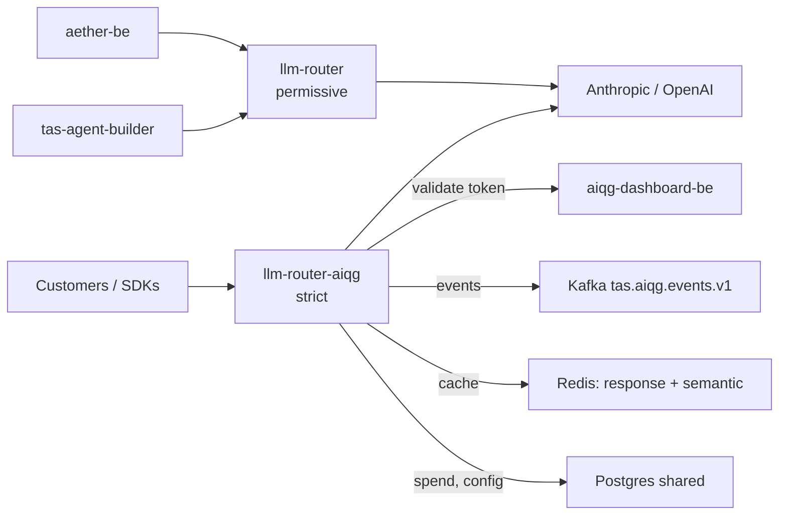

# TAS LLM Router

One HTTP endpoint that speaks both the OpenAI chat-completions dialect and the
Anthropic messages dialect, picks a provider and model for each request, and
records who spent what. It is the AI Quality Gateway (AIQG) ingress for TAS —
Tributary AI Services — and the customer-facing deployment is literally named
`llm-router-aiqg`: token authentication, spend attribution, and event emission
all happen on the way through it. A second, permissive deployment serves
internal callers from the same binary under a different bargain;
[Status & scope](#status--scope) says exactly what that one does and does not
enforce.

> **Verified 2026-08-27 against `tas-llm-router@897e441`** by live probes of
> `gateway.air-ops.net`, of the running pods in namespace `tas-llm-router`, and
> by building and testing the tree. Every command and response below was
> executed on that date. Image tags move; re-check before trusting a version
> number.

## What this is

Point a client at this gateway instead of at `api.openai.com` or
`api.anthropic.com`, and you get four things the vendor endpoint does not
give you: one credential instead of per-vendor keys, a routing decision that
picks which provider serves the call and can substitute a different model
under conditions you configure, a scan of the prompt before it leaves the
cluster, and a priced event per call attributed to a tenant. Requests and
responses stay in the vendor's own wire format, so most clients need only a
changed base URL and a changed key.

It is not a model host — every completion is served by Anthropic or OpenAI over
the network, and the gateway holds no weights. It is not an agent framework and
has no memory between calls; each request stands alone. The historic name in
this repository is "LLM Router WAF" — a web application firewall (WAF) — and
that framing is misleading. The scanning layer is Gatekeeper — the sibling
repository that both the `GATEKEEPER_*` settings and the `../Gatekeeper`
replace directive refer to — and it inspects prompt and response content for
policy findings rather than filtering by network attributes the way a firewall
does.

## Status & scope

**As of 2026-08-27**, two deployments run in namespace `tas-llm-router`, on
independent image tags that routinely skew:

| Deployment | Image tag today | Reached at | Auth |
|---|---|---|---|
| `llm-router` | `aiqg-v5.75` | `llm-router.tas.scharber.com`, in-cluster `llm-router.tas-llm-router:8086` | permissive — serves completions with no credential |
| `llm-router-aiqg` | `aiqg-v5.86` | `gateway.aiqg.tas.scharber.com`, publicly `gateway.air-ops.net` | strict — `AIQG_STRICT=true`, no token means 401 |

Both are `2/2` ready and both answered live probes on the verification date.
The two addresses against the strict row are one service, not two: the public
`gateway.air-ops.net` is a Cloudflare tunnel that rewrites the Host header to
`gateway.aiqg.tas.scharber.com` and hands the request to the same in-cluster
ingress, so either address reaches the same pods. Examples below use the public
name; the `/metrics` note further down uses the internal one.

The permissive deployment exists because internal callers predate the token
scheme; `aether-be` and `tas-agent-builder` still point at it by cluster
address — `ROUTER_SERVICE_BASE_URL` in the `aether-backend-config` ConfigMap
and `ROUTER_BASE_URL` on the `agent-builder` deployment, both resolving to
`llm-router.tas-llm-router:8086`. The public hostname for it,
`llm.air-ops.net`, sits behind a Cloudflare Access policy: an unauthenticated
request there returns `403` carrying `cf-access-domain: llm.air-ops.net`
rather than reaching the router at all. So the unauthenticated path is not
reachable from the open internet — but it is reachable from anywhere inside
the cluster or on the cluster's network.

Permissive does not mean ungoverned, and the line falls per request rather than
per deployment. Both deployments load the AIQG middleware, because
`AIQG_ENABLED=true` comes from the ConfigMap they share; `AIQG_STRICT=false`
changes only what happens when no gateway token is present. Without one the
middleware hands the request to the next handler with no AIQG state attached
(`internal/middleware/aiqg.go:178`), so there is no tenant, no priced event,
and nothing in the event stream — an untokened internal call is invisible to
spend attribution rather than attributed to an unknown tenant. Send a token to
the same deployment and the request takes the identical path the strict gateway
uses, tenant and all.

Prompt scanning is the exception, and it is the half people guess wrong.
Gatekeeper runs in the completion handlers rather than in the AIQG middleware
(`internal/server/server.go:1138` inbound, `internal/server/server.go:1800`
outbound), so it answers to `GATEKEEPER_ENABLED` alone and covers every request
through either deployment, token or not. Two response headers make this
checkable without reading any code: an untokened call to `llm-router` comes
back with `x-tas-scan-status: clean` and no `tas-response-event-id`, while a
tokened call to either deployment carries both.

Three subsystems that older copies of this file listed as unstarted are
running in production and have been for months: request and cost metrics with
OpenTelemetry export (`OTEL_EXPORTER_OTLP_ENDPOINT` points at
`otel-collector-shared.tas-shared:4317`), response caching
(`AIQG_RESPONSE_CACHE_ENABLED=true`, ten-minute time-to-live, plus a semantic
cache against a dedicated Redis), and routing beyond round-robin
(`FEATURE_ADVANCED_ROUTING=true`, `FEATURE_CIRCUIT_BREAKER=true`). Treat this
repository as a load-bearing production service, not an early prototype.

Genuinely unfinished or in flight, stated plainly:

- **The `/metrics` rebuild is merged but still not deployed.** Commit `b6070a0`
  replaced an exporter that derived counters from wall-clock time with a real
  Prometheus registry and deleted eight series that had no data source. Both
  pods still run tags that predate it — `aiqg-v5.75` and `aiqg-v5.86` — and
  scraping `gateway.aiqg.tas.scharber.com/metrics`, the ingress that backs onto
  `llm-router-aiqg:8086`, still returned the old series on the verification
  date (`llm_router_security_score`, `llm_router_threat_level`,
  `llm_router_active_api_keys`), with the new
  `llm_router_request_duration_seconds` absent. `b6070a0` is the fix itself and
  `eee4b24` is the merge commit that landed it on the main branch an hour
  later, so `b6070a0` is the hash to test a candidate image against. Until a
  rollout contains it, numbers on the router dashboards are not measurements.
- **The semantic cache runs in shadow.** `AIQG_SEMCACHE_SHADOW=true` on
  `llm-router-aiqg`, so near-miss hits are recorded and scored but not served
  unless a tenant's own cache configuration opts in.
- **`make build` does not work from a standalone clone.** See
  [Build and test](#build-and-test) — this repository needs three sibling
  repositories on disk.

## Quick start

Every completion route on the customer-facing gateway needs a gateway token.
Issuing one is self-serve once you can sign in: open the AIQG dashboard
(`aiqg.air-ops.net` publicly, `aiqg.tas.scharber.com` internally), go to its
Tokens page, and create one. The same thing over HTTP is
`/api/v1/account/tokens` on `https://api.aiqg.tas.scharber.com`, authenticated
with your Keycloak-issued JSON Web Token (JWT); the tenant comes from your
login, and the plaintext token is shown once at creation and never again.

Signing in is the part that is not self-serve, and it is where a new engineer
stops. The `aether` realm on `keycloak.tas.scharber.com` serves a login page
with no registration link, so somebody has to create your user before any of
the above is reachable. The AIQG account and tenant behind that user are then
created on your first authenticated visit rather than by a separate step — the
dashboard backend provisions them lazily, with no separate provisioning screen
to find. If you get in and see `tenant_unprovisioned` — "AIQG account not
provisioned for this user; contact your administrator" — that is this path
failing, and it is not something you can fix from the token page.

> [!UNVERIFIED] Who creates the Keycloak user and what approval it takes is
> written down nowhere in this repository or in `aiqg-dashboard-be`, and no
> self-serve signup exists to point you at. Ask @jscharber. The realm's missing
> registration link was checked; the human process behind it was not.

Tokens carry the prefix `tas_qg_live_`, and the gateway accepts one in any of
three headers — `TAS-Auth`, `Authorization: Bearer`, or `x-api-key` — because a
stock vendor SDK can only populate its own credential slot. `TAS-Auth` takes
the token bare — `TAS-Auth: tas_qg_live_…`, no scheme word in front of it —
while the other two follow their vendor's convention,
`Authorization: Bearer <token>` and `x-api-key: <token>`. Whichever you use,
the value is lifted into `TAS-Auth` before anything else inspects it
(`internal/middleware/aiqg.go:400`), so one token in one header is the whole
requirement. The same token works against both deployments; the permissive one
does not require it at all.

Tokens do not expire. The `aiqg.token` table behind the dashboard carries
`created_at`, `revoked_at`, and `last_used_at` and no expiry column, and every
lookup filters revoked rows out — so rotation means issuing the replacement
first and revoking the old token second. The gateway keeps no resolver cache
and calls `aiqg-dashboard-be` on every request, which means a revocation takes
effect on the next call rather than after some window.

Call it without a token and you get the failure you are most likely to hit
first:

```bash
curl -sS https://gateway.air-ops.net/v1/chat/completions \
  -H 'Content-Type: application/json' \
  -d '{"model":"claude-haiku-4-5-20251001","messages":[{"role":"user","content":"ping"}],"max_tokens":5}'
{"error":{"code":"path_a_auth_required","message":"AIQG ingress requires both TAS-Auth and Authorization headers; TAS-Auth is missing","missing_header":"TAS-Auth","docs":"https://docs.tas.scharber.com/aiqg/auth"}}
```

Two things in that body will send you the wrong way if you take them at face
value.

"Path A" is this repository's name for the authenticated AIQG route through the
middleware: the branch a request enters once a gateway token has been
recognised, where the `TAS-*` header taxonomy is parsed, timings are collected,
and a priced event is emitted. There is no Path B in the code or on this page —
the name is left over from the design document, and for a caller it means "the
authenticated path".

The message itself is stale. It says the ingress requires *both* `TAS-Auth` and
`Authorization`, but `Authorization` stopped being required when
bring-your-own-key landed: the vendor key can now come from the tenant's stored
credential or from the shared TAS key instead
(`internal/middleware/aiqg.go:182`). The single branch that emits this response
is the one where no gateway token was found in any of the three headers
(`internal/middleware/aiqg.go:175`), which is why `missing_header` always reads
`TAS-Auth`. Believe the behaviour rather than the string: send one token in one
header, and do not add a second header to satisfy the error text.

A token the gateway does not recognise fails differently — same 401 status and
the same `path_a_auth_required` code, but the message reads
`AIQG ingress requires a recognized TAS-Auth token` and the body carries
`"reason":"token_unknown"`. That difference is what tells you "I sent nothing"
apart from "I sent something stale". With a token in the environment, the
OpenAI dialect:

```bash
export TAS_TOKEN=tas_qg_live_...   # issued from the dashboard; never commit it
curl -sS https://gateway.air-ops.net/v1/chat/completions \
  -H "Authorization: Bearer $TAS_TOKEN" \
  -H 'Content-Type: application/json' \
  -d '{"model":"claude-haiku-4-5-20251001","messages":[{"role":"user","content":"Reply with the single word: pong"}],"max_tokens":16}'
{"id":"msg_011CeTP4fqFkhxVxj97J9syS","object":"chat.completion","created":1787839544,"model":"claude-haiku-4-5-20251001","choices":[{"index":0,"message":{"role":"assistant","content":"pong"},"finish_reason":"stop"}],"usage":{"prompt_tokens":15,"completion_tokens":5,"total_tokens":20},"router_metadata":{"provider":"anthropic","model":"claude-haiku-4-5-20251001","routing_reason":["expected_cost abstained: no usable measurements; priced at max_tokens as before","no usable verbosity measurement for claude-haiku-4-5-20251001/(no workflow); priced at max_tokens as before"],"estimated_cost":0.0000704,"processing_time":27904,"request_id":"chatcmpl-1787839544290375324","provider_latency":0,"attempt_count":1,"fallback_used":false}}
```

That `router_metadata` block is the part no vendor endpoint returns: which
provider actually served, why the router chose it, and what the call cost. Two
of its numbers are bare and easy to misread. `estimated_cost` is dollars for
this one call, the same unit the `llm_router_cost_total` metric counts in.
`processing_time` is nanoseconds, and it times only the routing decision — the
`27904` above is 28 microseconds of in-memory provider selection
(`internal/routing/router.go:213`), not the seconds the request actually took,
which the router does not report here at all.

Its `model` field is the one to read if you care whether you got what you asked
for. Routing selects a provider, not a model, so by default the model you named
is the model that runs. It is replaced in three cases and no others: a route
rule in your tenant's policy bundle names a different one
(`internal/server/server.go:1011`), a running experiment's variant overrides it
(`internal/server/server.go:2192`), or the first attempt failed and a fallback
chain tier was reached, in which case the tier supplies its own model rather
than retrying yours (`internal/server/fallback.go:154`). All three append a
line to `routing_reason`, and `router_metadata.model` always reports what
actually served — so a substitution is visible in the response, never silent.

The Anthropic dialect works the same way, with the token in `x-api-key`, and
answers in Anthropic's own response shape:

```bash
curl -sS https://gateway.air-ops.net/v1/messages \
  -H "x-api-key: $TAS_TOKEN" \
  -H 'anthropic-version: 2023-06-01' \
  -H 'Content-Type: application/json' \
  -d '{"model":"claude-haiku-4-5-20251001","max_tokens":16,"messages":[{"role":"user","content":"Reply with the single word: pong"}]}'
{"id":"msg_011CeTP4kEAzs1Gc38JadF5S","type":"message","role":"assistant","model":"claude-haiku-4-5-20251001","content":[{"type":"text","text":"pong"}],"stop_reason":"end_turn","stop_sequence":null,"usage":{"input_tokens":15,"output_tokens":5}}
```

Four read-only routes answer with no credential at all, which is the fastest
way to confirm you are talking to the right thing before you have a token:

```bash
curl -sS https://gateway.air-ops.net/v1/providers
{"count":2,"providers":["openai","anthropic"]}
```

`/v1/models` lists the model identifiers the router will accept — six on the
verification date, three from each provider:

```bash
curl -sS https://gateway.air-ops.net/v1/models
{"object":"list","data":[{"id":"claude-haiku-4-5-20251001","object":"model","created":0,"owned_by":"anthropic"},{"id":"claude-opus-4-6","object":"model","created":0,"owned_by":"anthropic"},{"id":"claude-sonnet-4-6","object":"model","created":0,"owned_by":"anthropic"},{"id":"gpt-3.5-turbo","object":"model","created":0,"owned_by":"openai"},{"id":"gpt-4o","object":"model","created":0,"owned_by":"openai"},{"id":"gpt-4o-mini","object":"model","created":0,"owned_by":"openai"}]}
```

Six is not a number fixed in code. The handler assembles the list at request
time from every configured provider's capability table, deduping by id
(`internal/server/server.go:2605`), so the count tracks configuration — enable
a provider or add a model to one, and this endpoint grows without a code
change. `/v1/capabilities` gives context windows and per-thousand-token prices
per model, and `/health` reports per-provider status and the last check time.

Streaming works on both dialects — send `"stream":true` and you get
`text/event-stream` back — but three things change with it, and they are
decisions rather than gaps. The routing metadata cannot ride in a chunked body,
so it moves to response headers: a streamed call today returns
`x-tas-router-provider`, `x-tas-router-model`, `x-tas-router-estimated-cost`
and the rest alongside the stream itself. Token usage is still stamped off the
chunks (`internal/server/server.go:1774`), so streamed calls are priced and
emit events like buffered ones. What you give up is the outbound scan, which
runs on non-streaming responses only (`internal/server/server.go:1800`), and
the response cache, which never stores a streamed reply
(`pkg/aiqg/responsecache/cache.go:294`). Inbound prompt scanning is unaffected
— a streamed call still comes back carrying `x-tas-scan-status: clean`.

## How it fits

The router is the single egress path from TAS to commercial model providers,
which is why the credentials live here and not in each caller.



Both deployments listen on container port **8086**, which is also the service
port. The code's own default is **8080** (`internal/config/config.go:370`); the
deployment overrides it with `LLM_ROUTER_PORT=8086` from the `llm-router-config`
ConfigMap. If you run the binary locally without that variable, it listens on
8080 — that is the only place the two numbers legitimately disagree.

Dependency strength varies, and the difference matters when something is down.
**Kafka is a hard startup dependency**: with `AIQG_EMITTER_TYPE=both`, the
emitter is constructed at `internal/server/server.go:383`, a broker failure
there aborts server construction, and the process exits 1 at
`cmd/llm-router/main.go:301` rather than degrading. A pod with no reachable
broker crash-loops. Redis and Postgres are quieter: a running pod tolerates
losing them, but both `wait-for-postgres` and `wait-for-redis` init containers
block every *new* pod, so an outage in either freezes rollouts and restarts.
`aiqg-dashboard-be` sits on the authentication path of every strict-gateway
request, because tokens are stored hashed and validated remotely — when it is
unreachable, valid tokens stop being recognised.

Provider credentials fail in a third shape again. A missing `ANTHROPIC_API_KEY`
or `OPENAI_API_KEY` disables that one provider at config load without comment
(`internal/config/config.go:530`); only losing both aborts startup, with
`at least one provider must be configured`. A half-credentialled pod therefore
comes up healthy and serves, and the first symptom is a model that no longer
appears in `/v1/models`.

## Configuration

Configuration comes from a YAML file (`config.example.yaml` shows the full
shape) overlaid by environment variables, and in the cluster it is almost
entirely environment: the `llm-router-config` ConfigMap in `tas-llm-router`
carries 55 keys, `llm-router-secret` supplies the credentials, and the two
deployments add per-deployment overrides in their own pod specs. These are the
settings that change behaviour rather than tune it:

| Setting | Effect | Default in code | What runs in production | Set where |
|---|---|---|---|---|
| `LLM_ROUTER_PORT` | Listen port | `8080` | `8086` on both deployments | ConfigMap |
| `AIQG_ENABLED` | Turns the governance layer on | off | `true` | ConfigMap |
| `AIQG_STRICT` | No token means 401 instead of pass-through | `false` | `true` on `llm-router-aiqg` only | ConfigMap sets `false`; `llm-router-aiqg` pod spec overrides |
| `AIQG_EMITTER_TYPE` | Where priced events go | `log` | `both` — log and Kafka, making Kafka required | ConfigMap |
| `GATEKEEPER_ENABLED` / `GATEKEEPER_FAIL_OPEN` | Prompt scanning, and what happens when the scanner errors | off | `true` / `true` — a scanner failure lets the request through | ConfigMap |
| `AIQG_RESPONSE_CACHE_ENABLED` | Exact-match response cache | off | `true`, with `AIQG_RESPONSE_CACHE_TTL=10m` — on `llm-router-aiqg` only | `llm-router-aiqg` pod spec |
| `AIQG_SEMCACHE_ENABLED` / `AIQG_SEMCACHE_SHADOW` | Semantic cache, and whether it serves or only observes | off / `true` | `true` / `true` — observing, on `llm-router-aiqg` only | `llm-router-aiqg` pod spec |
| `LLM_ROUTER_DEFAULT_STRATEGY` | Routing when the request does not name a model | `cost_optimized` | `cost_optimized` | ConfigMap |

The last column matters more than it looks, because both deployments pull the
same ConfigMap through `envFrom` and it therefore cannot hold a value that
differs between them. `AIQG_STRICT` is in there as `false`; what makes the
customer-facing gateway strict is an override in the `llm-router-aiqg` pod
spec. Both AIQG cache settings are not in the ConfigMap at any value — they
exist only in that pod spec — so reading `llm-router-config` tells you nothing
about whether caching is on, and the permissive `llm-router` deployment runs
neither AIQG cache.

Secrets are referenced here by location only. Provider keys and the internal
dashboard token live in the `llm-router-secret` Opaque secret in namespace
`tas-llm-router`, under the key names `ANTHROPIC_API_KEY`, `OPENAI_API_KEY`,
and `AIQG_DASHBOARD_INTERNAL_AUTH_TOKEN` among sixteen. The bootstrap token
file is the `llm-router-aiqg-tokens` secret in the same namespace, key
`aiqg-tokens.yaml`, mounted at the path in `AIQG_TOKENS_FILE`; it is a fallback
only, since the running gateway resolves tokens through `aiqg-dashboard-be`.
For local work, the untracked env files under
`aether-secrets/apps/tas-llm-router/` hold provider keys and a test gateway
token. Nothing in this repository should ever contain a token value.

## Build and test

This repository does not build standalone. `go.mod` carries four `replace`
directives pointing at sibling checkouts — `../Gatekeeper` and three modules
under `../aether-shared/` — so a clone on its own fails before compilation
begins:

```bash
go build -o llm-router ./cmd/llm-router
internal/middleware/aiqg.go:37:2: github.com/Tributary-ai-services/aether-shared/go-aiqg-resilience@v0.0.0: replacement directory ../aether-shared/go-aiqg-resilience does not exist
pkg/aiqg/experiments/experiments.go:17:2: github.com/Tributary-ai-services/aether-shared/go-aiqg-matcher@v0.0.0: replacement directory ../aether-shared/go-aiqg-matcher does not exist
internal/server/enforcement.go:13:2: github.com/Tributary-ai-services/Gatekeeper@v0.0.0-00010101000000-000000000000: replacement directory ../Gatekeeper does not exist
```

It reports one line per unresolvable import rather than one per missing
directory, so the list repeats. Clone this repository inside the TAS monorepo
alongside those siblings, or vendor them yourself.

Even inside the monorepo, the default build binds the Hyperscan scanning engine
through cgo, which needs `libhyperscan-dev` and `pkg-config` on the machine:

```bash
go build -o llm-router ./cmd/llm-router
github.com/flier/gohs/internal/hs: exec: "pkg-config": executable file not found in $PATH
```

The `nohs` build tag swaps in Go's `regexp` instead, which is what `make test`
uses and what a contributor without the library wants. The production image
builds the Hyperscan path (`docker/Dockerfile`), so a locally built binary and
the deployed one differ in matcher implementation.

```bash
go build -tags nohs -o llm-router ./cmd/llm-router
./llm-router --version
LLM Router WAF v1.0.0
Build Date: 2026-08-27
```

```bash
go test -tags nohs ./... 2>&1 | grep -c FAIL
0
```

Thirty packages carried tests and all passed on the verification date. Neither
line of that `--version` output means what it looks like: `v1.0.0` is a literal
in `cmd/llm-router/main.go:292` and has no relationship to the image tag, and
"Build Date" is `time.Now()` evaluated at run time
(`cmd/llm-router/main.go:293`), so it prints today whenever you ask. The tag
that does identify a build is the one stamped into emitted events by
`make docker-build`.

`cmd/` holds three more main packages besides the server, and it is worth
knowing which of them are real before you assume `cmd/llm-router` is the whole
repository. `cmd/server` is not: its `main()` is empty, left behind by a task
that was never finished. `cmd/semcache-calibrate` re-embeds a corpus of
judge-labelled prompt pairs and sweeps similarity thresholds offline; it is the
tool for answering the question `AIQG_SEMCACHE_MIN_SIMILARITY` encodes, which
the gateway currently runs at `0.87`.
`cmd/demo-traffic` fabricates AIQG traffic, and its default target is not the
gateway at all — it writes synthetic response events straight to Loki so the
dashboard panels have something to draw, calling no vendor. Only
`--target=gateway` and `--target=flows` put real requests through a real
gateway.

`--target=flows` is the one carrying a catalog of seven named flows that
exercise the cost-reduction and caching levers together, and it will list them
without sending any traffic:

```bash
go build -tags nohs -o demo-traffic ./cmd/demo-traffic
./demo-traffic --print-catalog | jq -r '.[] | "\(.id)\t\(.label)"'
it-helpdesk	IT helpdesk / self-service
security-questionnaire	Security questionnaire / RFP
contract-review	Contract clause review
ticket-triage	Ticket triage / routing
incident-burst	Incident burst (thundering herd)
research-rag	Research RAG (applied reduction)
coding-agent	Coding agent (negative control)
```

Pass a subset to `--flow` with `--target=flows`; omitting `--flow` runs all
seven. These flows send real completions through a real gateway and therefore
spend real provider budget, so point them at a test tenant — the run exits 2
rather than guessing if you give it neither a token nor `--dry-run`. The header
comment in `cmd/demo-traffic/flows.go` explains what each flow is designed to
demonstrate and why some of them are expected to lose.

## Where to go next

Two documents go deeper, and both were refreshed alongside this one, so prefer
them over anything else in `docs/`:

- **[Operations](docs/ops/llm-router.md)** — for on-call. Health signals,
  restart and rollback procedures with their blast radius, failure modes with
  the literal error strings to search Loki for, and escalation.
- **[Developer guide](docs/dev/llm-router-api.md)** — for integrating or
  extending. Every route, the complete error set with retry guidance, what
  changes when you point a stock vendor SDK at the gateway, and why the design
  took this shape.

Beyond those: [`docs/openapi.yaml`](docs/openapi.yaml) is the machine-readable
contract, also served as a browsable page at `docs.air-ops.net`;
[`docs/`](docs/README.md) holds the AIQG design and analysis notes, including
the caching and semantic-caching write-ups; [`k8s/`](k8s/) has the deployment
manifests; and the [repository working rules](./CLAUDE.md) record local
conventions. Router dashboards live in Grafana at `grafana.tas.scharber.com` —
read the caveat in [Status & scope](#status--scope) before trusting their
numbers.

Licensing terms are in [LICENSE](LICENSE).
