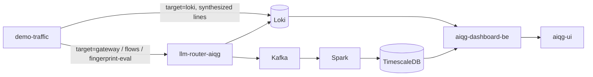

# demo-traffic — AIQG demo and test traffic generator

Populates an empty AI Quality Gateway (AIQG) dashboard with traffic that looks
like a real customer's, and — on two of its targets — measures whether the
gateway's caching and attribution behave the way the product claims.

## What this is

A single-package Go command, run with `go run ./cmd/demo-traffic`. It has four
targets, selected with `--target`, and they differ in the one thing that matters
for cost: whether a vendor model is actually called.

| `--target` | Calls a vendor model? | What it populates |
|---|---|---|
| `loki` (default) | no | Synthesizes response-event log lines and pushes them to Loki. Free, deterministic with `--seed`, and reaches nothing downstream of Loki. |
| `gateway` | yes | Sends attributed chat completions through the strict gateway, so the full Kafka → Spark → TimescaleDB path populates alongside Loki. |
| `flows` | yes | Runs seven ordered enterprise workloads where the step *sequence* is the demonstration: a seed request, paraphrases that should hit the cache, and near-miss probes that must not. |
| `fingerprint-eval` | yes | Sends untagged, tool-bearing requests from five distinct personas and prints `event_id,persona` ground truth, so inferred attribution can be scored offline. |

Four terms recur below. An **attributed** request carries headers that name
the calling agent, flow, and user (`TAS-Agent-Id`, `TAS-Flow-Id`, `baggage:
user.id=…`), so the dashboard can bill it to an agent instead of guessing. The
**strict gateway** is the customer-facing router deployment `llm-router-aiqg`
in namespace `tas-llm-router`, reached at `gateway.aiqg.tas.scharber.com`; it
returns 401 for any request without a gateway token
(`k8s/ingress-aiqg-strict.yaml`). A **near-miss probe** is a prompt worded
almost like an earlier one but asking a different question (logging in to the
virtual private network (VPN) versus logging in to my account); the cache must *not* answer it from the earlier
response. **CLEAR** is the gateway's per-request quality score, 0–100, built
from five dimensions — Cost, Latency, Efficacy, Assurance, Reliability — and it
is the `avg CLEAR` column in the run summary.

It is not a load generator — there is no concurrency and no rate control — and
it is not a test suite. Three targets exist to make dashboard panels show
something believable; `flows` is the one that can fail, and it fails loudly when
a near-miss probe gets a cached answer meant for a different question.

## Status & scope

**As of 2026-09-21** (verified against commit `552d869`), all four targets are in the tree and all four are wired
into `main.go` at `cmd/demo-traffic/main.go:109-144`. Nothing here is deployed:
no Kubernetes manifest, Dockerfile, or Makefile target in this repository
references `demo-traffic`, so `go run` from a checkout is the only way it runs.
There is no scheduled pass — history is built by leaving `--interval` running.

The `loki` and `gateway` targets have been in use since 2026-06 (`3b2fa46`,
`a8685c2`). `fingerprint-eval` landed 2026-06-14 (`08eb916`). The `flows`
catalog is the newest and moved most recently: six flows on 2026-08-16
(`a73275e`), then the `research-rag` flow and three corrections to what it
claims through 2026-08-17 (`0ab5718`, `ce20995`, `6e11c60`, `f924522`).
The only change to the tool since was `dc6811c` (2026-08-26), which corrected
the `--flow` help text and the comments above `flowCatalog` from "six" flows to
**seven** — the count `cmd/demo-traffic/flows.go:139` has held since
`research-rag` landed. `--print-catalog` remains the authoritative list; its
seven ids are `it-helpdesk`, `security-questionnaire`, `contract-review`,
`ticket-triage`, `incident-burst`, `research-rag`, and `coding-agent`.

Two things worth knowing before trusting older notes or the flag help:

- `--model` and `--max-tokens` look like they control `--target=gateway`, and
  their help text says so, but they do not. Each request takes its model and
  output cap from its scenario in `cmd/demo-traffic/gateway.go:147`, and the
  send at `cmd/demo-traffic/gateway.go:237` passes those, not the flags.
  `--model` only appears in the startup banner.
- The dashboard rollups this generator feeds are live, not planned:
  `/api/v1/metrics/agents` and `/api/v1/flows` are both registered in
  `aiqg-dashboard-be`, in `internal/handlers/metrics.go` — lines 54 and 57 of
  that file, in that repository. Earlier revisions of this file described both
  as future.

## Quick start

The default target needs no credential and calls no model, so start there.

```bash
go run ./cmd/demo-traffic --dry-run --flows-per-agent 1 --inferred-flows 1 --seed 42
demo-traffic: tenant=a689c0b2-02ca-46d1-9916-f9a30c00222a account=9088f68b-1fe5-427f-bb7b-8f16fa37a23a agents=4 flows-per-agent=1 inferred-flows=1 seed=42 dry-run=true
mode: single pass

generated (dry-run) 5 flows / 20 step-events  |  total cost $0.2474  |  potential savings $0.1590 (64.3%)
agent                           flows  steps      cost USD     avoidable  avg CLEAR
(inferred / unattributed)           1      6        0.0048        0.0038         94
Coding Copilot                      1      2        0.1076        0.0261         71
Data Extractor                      1      6        0.0065        0.0021         85
Research Orchestrator               1      4        0.1265        0.1265         81
Support Bot                         1      2        0.0020        0.0005         94
```

The real run also prints all 20 event lines as JSON above that summary; they are
elided from the fence for readability. Drop `--dry-run` and the same pass is
pushed to `https://loki.tas.scharber.com` under the `aiqg-demo` tenant instead
of printed.

The other three targets post to the gateway and need a gateway token in
`TAS-Auth`. Issue one from the AI Quality Gateway dashboard's **Tokens** page
(`https://aiqg.tas.scharber.com/tokens`) or by calling
`POST /api/v1/account/tokens` on `https://api.aiqg.tas.scharber.com`; an
existing shared token for this repository's demo tenant lives in
`aether-secrets/apps/tas-llm-router/aiqg-tokens.env`. The token is read from
`--token` or, failing that, the `AIQG_TAS_AUTH_TOKEN` environment variable
(`cmd/demo-traffic/main.go:66`).

`--dry-run` works on the gateway targets too. It prints the request plan —
every request's model and output cap — but no dollar figure; the cost estimate
below is derived from that plan. The last line counts previewed requests as
`sent`:

```bash
go run ./cmd/demo-traffic --target=gateway --dry-run --flows-per-agent 1 --seed 42
demo-traffic: target=gateway url=http://localhost:8086 model=claude-haiku-4-5-20251001 agents=4 flows-per-agent=1 users=[u_alice u_bob u_carol u_dave] dry-run=true
POST http://localhost:8086/v1/chat/completions  agent="Research Orchestrator" user=u_bob flow=4b843edf-61a5-4870-93f9-6fe7dc8c6d04 scenario=happy model=claude-haiku-4-5-20251001 max_tokens=64
POST http://localhost:8086/v1/chat/completions  agent="Research Orchestrator" user=u_bob flow=4b843edf-61a5-4870-93f9-6fe7dc8c6d04 scenario=truncated model=claude-haiku-4-5-20251001 max_tokens=32
POST http://localhost:8086/v1/chat/completions  agent="Research Orchestrator" user=u_bob flow=4b843edf-61a5-4870-93f9-6fe7dc8c6d04 scenario=expensive model=claude-opus-4-6 max_tokens=512
…
gateway pass: sent=15 failed=0
```

The fence shows the first three of that run's 15 requests and its final line; with `--seed` the
preview is reproducible. Without it the flow shapes are random, and at
`--flows-per-agent 1` seeds 1–10 and 42 gave between 11 and 16 requests on
2026-09-21. The default of 4 is roughly four times that. The
scenario cursor cycles all seven Quickstart scenarios
(`cmd/demo-traffic/gateway.go:147`), each with its own model and output cap:
`expensive` is `claude-opus-4-6` at 512 output tokens and `long-context` sends a
~2k-token prompt with a 1024-token cap. This spends real money on the vendor
account behind the demo tenant. `--flows-per-agent` is the dial that scales the
bill; `--max-tokens` does not, because the per-scenario caps override it.

**What a pass costs, at most.** This is a ceiling derived from code, not a
measured bill. Rates come from the gateway's own pricing table
(`pkg/clear/cost.go:32-44`): `claude-haiku-4-5-20251001` at $0.0008 in / $0.004
out per 1K tokens, `claude-opus-4-6` at $0.015 / $0.075, `gpt-4o-mini` at
$0.00015 / $0.0006. Input tokens are prompt length ÷ 4, the gateway's own
conversion (`pkg/clear/cost.go:88`); output is assumed to hit every cap.

| Target | Requests per pass | Ceiling per pass |
|---|---|---|
| `gateway`, one cycle of the seven scenarios | 7 | ≈ $0.049, of which $0.039 is the single `expensive` Opus request |
| `gateway`, `--flows-per-agent 1` | 11–16 | ≈ $0.09–0.10 (the Opus scenario runs twice) |
| `gateway`, default `--flows-per-agent 4` | 52–61 (seeds 1–5 and 42) | ≈ $0.38–0.45 |
| `flows`, all seven | 36, fixed | ≈ $0.05 (~10.3K input + 10,688 capped output tokens, all Haiku) |
| `fingerprint-eval`, default | 20 (5 personas × 4) | under $0.001 (`gpt-4o-mini`, 12-token cap) |

Cache hits on `flows` and outputs that stop short of the cap both make the real
number lower. With `--interval`, multiply by the passes you leave running.
Point `--gateway-url` at the deployed gateway to reach the real pipeline; the flag defaults to
`http://localhost:8086` for local work.

```bash
export AIQG_TAS_AUTH_TOKEN=tas_qg_live_…
go run ./cmd/demo-traffic --target=gateway \
  --gateway-url https://gateway.aiqg.tas.scharber.com --flows-per-agent 2
```

> [!UNVERIFIED] No output is shown for that command because it was not run
> while writing this — a real pass bills a live vendor account. On completion
> it prints one line, `gateway pass: sent=<n> failed=<n>`, from the format
> string at `cmd/demo-traffic/gateway.go:256`.
<!-- unverified-example -->

The `flows` target prints one line per step with the gateway's cache verdict,
and previews cleanly without a token:

```bash
go run ./cmd/demo-traffic --target=flows --dry-run --flow ticket-triage

▶ Ticket triage / routing — ticket-triage
   1. seed       Classify this support ticket into one category: "I can't log in to my account"
   2. paraphrase Classify this support ticket into one category: "Unable to log in to my account"
   3. paraphrase Classify this support ticket into one category: "Login is not working for my ac…
   4. probe      Classify this support ticket into one category: "I can't log in to the VPN"
   5. probe      Classify this support ticket into one category: "I can log in, but billing is w…
```

A `flows` pass is sized by which flows you select, not by a count flag. The
seven flows have fixed step counts — `it-helpdesk` 6, `security-questionnaire`
6, `contract-review` 3, `ticket-triage` 5, `incident-burst` 9, `research-rag` 4,
`coding-agent` 3 — so a default pass is 36 requests. Against a live gateway
the same run adds a per-flow summary comparing measured hit rate to the flow's
modeled expectation, and reports probe rejections separately. Add `--cache-bust` when re-running inside the exact-match cache's
retention window, or every step — including the seed — answers from cache and
the run proves nothing.

`fingerprint-eval` previews the same way. `--flows-per-agent` is reused as
*requests per persona*, so this is five requests; the default of 4 sends 20:

```bash
go run ./cmd/demo-traffic --target=fingerprint-eval --dry-run --flows-per-agent 1
# fingerprint-eval: 5 personas × 1 requests untagged → http://localhost:8086
event_id,persona
(dry-run) weather-bot tools=2 model=gpt-4o-mini
(dry-run) invoice-agent tools=2 model=gpt-4o-mini
(dry-run) search-assistant tools=2 model=gpt-4o-mini
(dry-run) code-helper tools=1 model=gpt-4o-mini
(dry-run) triage-bot tools=2 model=gpt-4o-mini
# done: sent=0 failed=0
```

Each real request is a one-line prompt with the persona's tool definitions,
`max_tokens` 12, and no attribution headers (`cmd/demo-traffic/fpeval.go:90`).
A live run prints one `event_id,persona` line per success, which is the ground
truth to join against the gateway's inferred agent.

### Common failures

```text
error: --target=gateway needs --token or AIQG_TAS_AUTH_TOKEN (set --dry-run to preview without a token)
error: unknown flow "helpdesk" (see --print-catalog)
gateway pass: sent=0 failed=11
!! 2 FALSE HIT(S): a near-miss probe was semantically matched to a DIFFERENT question.
```

The first two were reproduced on 2026-09-21 — run with no token set, and with
`--flow helpdesk` — and both exit with status 2 (`cmd/demo-traffic/main.go:111`,
`cmd/demo-traffic/flows.go:479`).

> [!UNVERIFIED] The last two need a live gateway and were not triggered. They are
> instantiated from the format strings at `cmd/demo-traffic/gateway.go:256` and
> `cmd/demo-traffic/flows.go:561`; the wording is exact, the counts are filled
> in, not transcribed from a run.

The first is the most common: no token was found in either `--token` or the
environment. The second means the id passed to `--flow` is not in the catalog —
`--print-catalog` lists the seven valid ids. A pass where every request is
counted as `failed` usually means the token was rejected or the wrong
`--gateway-url` was used, since any non-2xx response increments that counter
(`cmd/demo-traffic/gateway.go:238`). The last one is not an operational
problem with this tool at all: it means the tenant's semantic-cache threshold
matched a probe to a different question, which is a wrong answer served to a
user, and the run exits without reporting savings.

## How it fits



The split in that diagram is the whole reason there is more than one target. The
`loki` target writes finished log lines directly to Loki, so panels that read
Loki light up in seconds and cost nothing — but it never touches Kafka, so the
TimescaleDB rollups behind `/api/v1/metrics/agents` and `/api/v1/flows` stay
empty. The gateway targets take the long way round and populate both. Neither
target needs anything else in the platform to be running: no Postgres, no
Keycloak, no MinIO.

The tenant is the coupling that catches people out. Every event is stamped with
`--tenant-id`, and the dashboard injects `tenant_id` from the caller's token and
filters every query on it, so a pass generated under one tenant is invisible to
a dashboard viewed as another. The defaults in `cmd/demo-traffic/main.go:41-45`
are the `aiqg-demo` account.

## Configuration and flags

Everything is a flag; the one environment variable is `AIQG_TAS_AUTH_TOKEN`,
which supplies `--token`. Secrets are never read from a file by this tool — the
demo tenant's gateway token lives in
`aether-secrets/apps/tas-llm-router/aiqg-tokens.env`, and you export it yourself.
The flags below are the ones that change what a run does; `go run
./cmd/demo-traffic --help` prints the full set with defaults.

| Flag | Default | Meaning |
|---|---|---|
| `--target` | `loki` | `loki`, `gateway`, `flows`, or `fingerprint-eval` |
| `--dry-run` | `false` | print what would be sent or pushed, send nothing, spend nothing |
| `--flows-per-agent` | `4` | flows per demo agent per pass; the main size dial for `loki` and `gateway` |
| `--inferred-flows` | `3` | unattributed flows per pass (`identity_source=inferred`, no agent id) |
| `--interval` | `0` | if greater than zero, loop forever, one pass per interval |
| `--seed` | `0` | seed for reproducible runs; 0 means time-based |
| `--spread` | `90` | seconds to spread a pass's events over, ending at now |
| `--loki-url` | `https://loki.tas.scharber.com` | Loki base URL; push API at `/loki/api/v1/push` |
| `--tenant-id` | `aiqg-demo` tenant | `tenant_id` stamped on every event |
| `--account-id` | `aiqg-demo` account | `aiqg_account_id` stamped on every event |
| `--org-id` | `""` | optional `X-Scope-OrgID` header for multi-tenant Loki |
| `--insecure` | `true` | skip TLS verification; TAS Loki uses the internal `tas-ca-issuer` authority |
| `--gateway-url` | `http://localhost:8086` | gateway base URL; chat at `/v1/chat/completions` |
| `--token` | `$AIQG_TAS_AUTH_TOKEN` | `TAS-Auth` gateway token |
| `--model` | `claude-haiku-4-5-20251001` | printed in the `--target=gateway` banner only; each scenario sets its own model |
| `--max-tokens` | `8` | no effect on `--target=gateway` sends; each scenario sets its own cap (see Status & scope) |
| `--users` | `u_alice,u_bob,u_carol,u_dave` | `baggage user.id` pool sampled per flow |
| `--flow` | all seven | comma-separated flow ids for `--target=flows` |
| `--print-catalog` | `false` | dump the flow catalog as JSON and exit |
| `--cache-bust` | `false` | append a per-run nonce to every prompt so `--target=flows` starts cold |
| `--compliance-rate` | `0.08` | fraction of synthesized events carrying a compliance finding |
| `--vague-rate` | `0.12` | fraction carrying a vague-input finding |
| `--hedging-rate` | `0.12` | fraction carrying a hedging finding |
| `--error-rate` | `0.02` | fraction that failed upstream (`vendor_error`) |

Not every flag reaches every target, and the size dial differs per target.
This is from the dispatch in `cmd/demo-traffic/main.go:109-144`:

| Target | What sets the size of a pass | Also honoured | Ignored |
|---|---|---|---|
| `loki` | `--flows-per-agent` (× 4 agents) plus `--inferred-flows` | `--seed`, `--spread`, `--interval`, the four `*-rate` flags, `--tenant-id`, `--account-id`, `--loki-url`, `--org-id` | gateway flags |
| `gateway` | `--flows-per-agent` (× 4 agents × each flow's steps) | `--seed`, `--interval`, `--users`, `--gateway-url`, `--token` | `--inferred-flows`, `--spread`, `*-rate`, `--tenant-id`, `--account-id`, `--model`, `--max-tokens` |
| `flows` | `--flow` (which flows; step counts are fixed) | `--cache-bust`, `--interval`, `--users`, `--seed`, `--gateway-url`, `--token` | `--flows-per-agent`, `*-rate`, `--tenant-id`, `--account-id`, `--model`, `--max-tokens` |
| `fingerprint-eval` | `--flows-per-agent`, reused as requests per persona (× 5) | `--gateway-url`, `--token` | everything else, including `--interval` — it is always one pass |

The `*-rate` flags shape **only** synthesized `loki` events
(`cmd/demo-traffic/synth.go:90-128`); the gateway targets send real prompts and
the gateway's own scanners decide what gets flagged. On every gateway target
the tenant comes from the token, not from `--tenant-id`. `--dry-run` and
`--insecure` apply everywhere.

Note that `--insecure` defaults to **true**, which is unusual and deliberate:
the internal certificate authority is not in most local trust stores. It applies
to the gateway client as well as the Loki client.

## What a pass contains

The `loki` and `gateway` targets share the same cast. Traffic is generated as
**agent flows**: each demo agent runs flows whose steps span workflow types,
sharing a `flow_id` / `conversation_id` and linked via `step_id` /
`parent_step_id` — so the per-agent rollup and the flow drill-down both have
real structure. See
[`docs/AIQG-AGENT-FLOW-ATTRIBUTION.md`](../../docs/AIQG-AGENT-FLOW-ATTRIBUTION.md)
for the identity model these fields implement.

| Agent | Flow shape (step → workflow_type) | Multi-turn |
|---|---|---|
| **Research Orchestrator** | planner(`agentic`) → 2–4× retrieve(`rag`) → synthesize(`summarization`) | no |
| **Coding Copilot** | plan(`agentic`) → generate(`code_generation`) → ~40% fix-on-fail(`code_generation`) | up to 2 |
| **Support Bot** | classify(`classification_extraction`) → answer(`single_turn_qa`) | 2–4 turns share one `conversation_id` |
| **Data Extractor** | 3–6 sibling extraction steps(`classification_extraction`) under a root | no |

A configurable number of **inferred / unattributed** flows are also emitted:
`identity_source=inferred`, `flow_id` present (as if reconstructed from the
session), but **no** `agent_id` / `agent_name` — representing uninstrumented
traffic. Named flows carry `identity_source=header`, with a fraction `trace`
(flow id arrived via a W3C `traceparent`: 32-hex `flow_id`, 16-hex `step_id`).
`agent_id` is stable per agent name across runs and seeds.

Agent-flow fields stamped on every step, promoted to top level for LogQL:
`agent_id`, `agent_name`, `agent_version`, `conversation_id`, `flow_id`,
`step_id`, `parent_step_id`, `flow_step_seq`, `identity_source`.

Each step samples one of eight workflow profiles, and each profile tells a
different cost story:

| Profile | workflow_type | Story it tells |
|---|---|---|
| `basic_qa` | single_turn_qa | clean, low-cost baseline |
| `conversational` | single_turn_qa | growing history, reliability dips, hedging |
| `rag` | rag | large retrieved context → **bloat** |
| `mcp_agentic` | agentic | tool loops, retries, **refusals**, latency tails |
| `summarization` | summarization | large in, small out, truncation |
| `code_generation` | code_generation | regenerate-on-bad-code, malformed output |
| `classification_extraction` | classification_extraction | high-volume cheap, JSON-conformance failures |
| `multi_agent_orchestration` | agentic | fan-out token amplification → **headline savings** |

Compliance findings, vague input, and hedging are sprinkled across every profile
at the tunable rates above rather than being separate profiles. Each profile
also has a *signature matcher* guaranteed to fire on the first event of every
pass, so one small pass still puts data in every panel.

For `--target=loki` specifically, scores and dollar costs come from the real
scorer (`clear.Compute`) and the real pricing table (`clear.DollarCost`), so the
five-dimension composite — Cost, Latency, Efficacy, Assurance, Reliability
(CLEAR) — matches what the live gateway would produce for the same inputs. No
vendor model is called.

## Verifying the data landed

These are the dashboard's own queries, from `internal/handlers/metrics.go` and
`avoidable_cost.go` in `aiqg-dashboard-be`, runnable directly against Loki. The
tenant must match the account you view the dashboard as.

```bash
TENANT="a689c0b2-02ca-46d1-9916-f9a30c00222a"   # aiqg-demo
LOKI="https://loki.tas.scharber.com"
END=$(date +%s); START=$((END-900))
q() { curl -skS -G "$LOKI/loki/api/v1/query_range" \
  --data-urlencode "query=$1" \
  --data-urlencode "start=${START}000000000" --data-urlencode "end=${END}000000000" \
  --data-urlencode "step=5m"; echo; }

# Total cost — the /metrics/cost panel
q "sum_over_time({namespace=\"tas-llm-router\"} |= \"aiqg response event\" | json | tenant_id=\"$TENANT\" | unwrap total_cost_usd [5m])"

# Per-agent cost rollup — the attribution view
q "sum by (agent_id) (sum_over_time({namespace=\"tas-llm-router\"} |= \"aiqg response event\" | json | tenant_id=\"$TENANT\" | agent_id!=\"\" | unwrap total_cost_usd [15m]))"

# Named versus guessed flows — header / trace / inferred from this tool; baggage, asserted, principal, … from the live gateway
q "sum by (identity_source) (count_over_time({namespace=\"tas-llm-router\"} |= \"aiqg response event\" | json | tenant_id=\"$TENANT\" | identity_source!=\"\" [15m]))"
```

A non-empty result has `"status":"success"` and at least one series under
`data.result`, each carrying `[timestamp, "value"]` pairs; an empty
`"result":[]` means nothing matched in the window. For example, the
named-versus-guessed query above returned this on 2026-09-21 (stats elided):

```json
{"status":"success","data":{"resultType":"matrix","result":[{"metric":{"identity_source":"principal"},"values":[[1790025000,"1"],[1790025300,"1"]]}]}}
```

That series is real gateway traffic, not this tool's: the live gateway labels
identity with a different vocabulary from the `loki` target (see *Keeping it in
sync with the gateway*).

To tell this tool's synthesized lines apart from real gateway traffic, filter
on the stream label the `loki` target sets on every push,
`source="demo-traffic-generator"` (`cmd/demo-traffic/main.go:96-101`), next to
`namespace="tas-llm-router"` — the label every dashboard query selects on:

```bash
q "sum(count_over_time({namespace=\"tas-llm-router\", source=\"demo-traffic-generator\"} |= \"aiqg response event\" [15m]))"
```

> [!UNVERIFIED] No `loki`-target push landed in the 30 days before 2026-09-21 —
> Loki's label-values endpoint returned no values for `source` — so it was not
> confirmed that Loki keeps that label as pushed. If the query is empty right
> after a successful push, drop the `source` matcher.

**Confirming the Kafka → TimescaleDB path (gateway targets only).** A Loki hit
proves the gateway logged the request, not that it reached TimescaleDB. For
that, call the dashboard backend's rollups on `https://api.aiqg.tas.scharber.com`
and read the `source` field in the response (the `agents` handler, in
`internal/handlers/agents.go` of the `aiqg-dashboard-be` repository):

```bash
curl -sS "https://api.aiqg.tas.scharber.com/api/v1/metrics/agents?days=1" \
  -H "Authorization: Bearer $KEYCLOAK_ACCESS_TOKEN" | jq '{source, groups, agents: [.agents[] | {key, packets, total_cost_usd}]}'
curl -sS "https://api.aiqg.tas.scharber.com/api/v1/flows?days=1&limit=5" \
  -H "Authorization: Bearer $KEYCLOAK_ACCESS_TOKEN" | jq '{source, count}'
```

> [!UNVERIFIED] These two calls were not run for this revision: no Keycloak
> session for the `aiqg-demo` account was available. The routes, query
> parameters, auth requirement, and the `source` field are read from
> `aiqg-dashboard-be` at `c5a1dd8`.
<!-- unverified-example -->

These routes do **not** accept the gateway token. They need a Keycloak access
token from the `aether` realm for a user provisioned into the `aiqg-demo`
account, because the tenant is read from the token's claims; a user with no
tenant gets 403 `tenant_unprovisioned` (`TenantRequired`, in
`internal/middleware/auth.go` of that repository). The aiqg-ui sends
exactly this bearer on its own API calls, so a signed-in session is the easiest
place to copy it from.

`"source": "timescale"` with the four demo agents (Research Orchestrator,
Coding Copilot, Support Bot, Data Extractor) in `agents` means the gateway
pass made it through Kafka and Spark. `"source": "loki"` is **not** proof of
failure on its own: the handler falls back to Loki whenever TimescaleDB errors,
is not configured, or holds only unattributed rows (the TimescaleDB-first
branch of the same `agents` handler). The same field is on
`/api/v1/flows`.

> [!UNVERIFIED] How long a gateway event takes to appear in TimescaleDB is not
> recorded. The Spark job that writes it is
> `aether-shared/k8s-shared-infrastructure/spark/aiqg-aggregator-sparkapp.yaml`,
> and neither it nor the dashboard backend states a trigger interval, so no safe
> wait can be quoted. Re-check over several minutes before treating
> `"source": "loki"` as a failure.

The quickest visual check is to open `https://aiqg.tas.scharber.com` as
`aiqg-demo` and watch the panels fill over the last 15 minutes to an hour. Loki rejects timestamps far in the past, so
generate near "now" and use `--interval` to build history forward rather than
back-dating a week in one pass.

## Keeping it in sync with the gateway

Three couplings will break silently if the gateway changes and this does not.

Scores and cost are computed by importing `pkg/clear`, so a change to the scorer
or the pricing table is picked up with no edit here. The emitted field names
mirror `pkg/aiqg/events/emitter.go`, including the hyphen-to-underscore
sanitization of `tag_<pattern_id>` keys; if the emitter adds or renames a
promoted field, update the field map in `synth.go` and the matcher list in
`catalog.go`. The avoidable-cost categories in `avoidablePatternIDs`
(`cmd/demo-traffic/synth.go:48`) mirror the four categories in
`aiqg-dashboard-be/internal/handlers/avoidable_cost.go` — if those diverge, the
"potential savings" figure in the run summary stops matching the dashboard's.

One coupling has already drifted. The `loki` target stamps `identity_source`
as `header`, `trace`, or `inferred` (`cmd/demo-traffic/main.go:252-273`), but
the live gateway emits `baggage`, `asserted`, `otel`, `trace`, `linked`,
`principal`, `transport`, or `unattributed`
(`pkg/aiqg/events/builder.go:344-365`). Only `trace` is shared. So a panel or
query that splits by `identity_source` shows synthesized and real traffic in
different buckets, and the gateway targets — which send `baggage: user.id` —
land under `baggage`. Aligning the synthesized values is an edit to `main.go`,
not made here.

The `flows` target has a fourth coupling that is not code: its prompts are
hand-mirrored against the ones in `aiqg-ui`, the same way the seven gateway
scenarios mirror `QuickstartPage.tsx`. `--print-catalog` exists as the seam for
serving the catalog from `aiqg-dashboard-be` instead; that decision is open.

## Where to go next

- [`docs/AIQG-AGENT-FLOW-ATTRIBUTION.md`](../../docs/AIQG-AGENT-FLOW-ATTRIBUTION.md)
  — the identity model behind `agent_id` / `flow_id` / `identity_source`, and
  what the gateway infers when the headers are absent.
- [`docs/AIQG-SEMANTIC-CACHING.md`](../../docs/AIQG-SEMANTIC-CACHING.md) — how
  the semantic cache decides a hit, and the guards the `flows` probes exercise.
- [`docs/AIQG-CACHING.md`](../../docs/AIQG-CACHING.md) — the cache layers and
  what each one can and cannot prove about savings.
- [`docs/ops/llm-router.md`](../../docs/ops/llm-router.md) — operating the
  gateway this tool sends traffic through; read this if a pass fails and the
  gateway looks unhealthy.
- [`docs/dev/llm-router-api.md`](../../docs/dev/llm-router-api.md) and
  [`docs/openapi.yaml`](../../docs/openapi.yaml) — the request and response
  contract, including the attribution headers this tool sets.
