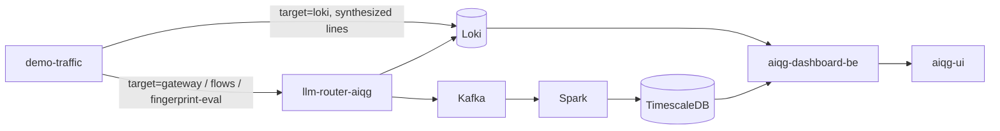

# demo-traffic — AIQG demo and test traffic generator

Populates an empty AI Quality Gateway (AIQG) dashboard with traffic that looks
like a real customer's, and — on two of its targets — measures whether the
gateway's caching and attribution behave the way the product claims.

## What this is

A single-package Go command, run with `go run ./cmd/demo-traffic`. It has four
targets, selected with `--target`, and they differ in the one thing that matters
for cost: whether a vendor model is actually called.

| `--target` | Calls a vendor model? | What it populates |
|---|---|---|
| `loki` (default) | no | Synthesizes response-event log lines and pushes them to Loki. Free, deterministic with `--seed`, and reaches nothing downstream of Loki. |
| `gateway` | yes | Sends attributed chat completions through the strict gateway — the `llm-router-aiqg` deployment that runs with `AIQG_STRICT` set and so answers `401` to a request with no `TAS-Auth` header, rather than the permissive `llm-router` deployment that lets unauthenticated internal callers through. The full Kafka → Spark → TimescaleDB path populates alongside Loki. |
| `flows` | yes | Runs seven ordered enterprise workloads where the step *sequence* is the demonstration: a seed request, paraphrases that should hit the cache, and near-miss probes that must not. |
| `fingerprint-eval` | yes | Sends untagged, tool-bearing requests from five distinct personas and prints `event_id,persona` ground truth, so inferred attribution can be scored offline. |

Both of the paid targets below `gateway` have a size worth knowing before you
run them, and they size differently. A default `flows` pass is **36 requests**
and no flag makes it bigger: it runs all seven flows at their committed step
counts — 6, 6, 3, 5, 9, 4, and 3, counted from `--target=flows --dry-run` on
2026-08-27 — and `--flow` is the only way to change that, by running fewer of
them. A default `fingerprint-eval` pass is **20 requests**, and that one does
scale: it is five personas times `--flows-per-agent`, which defaults to 4
(`cmd/demo-traffic/fpeval.go:121-126`), and the run announces the arithmetic
itself as `# fingerprint-eval: 5 personas × 4 requests untagged`.

It is not a load generator — there is no concurrency and no rate control — and
it is not a test suite. Three targets exist to make dashboard panels show
something believable; `flows` is the one that can fail, and it fails loudly when
a near-miss probe gets a cached answer meant for a different question.

## Status & scope

**As of 2026-08-27**, verified by running this tool at `tas-llm-router@897e441`:
all four targets are in the tree and all four are reachable. Three of them are
dispatched by name at `cmd/demo-traffic/main.go:109-144`; `loki` is the
fall-through underneath them at `cmd/demo-traffic/main.go:146`, which also means
a misspelled `--target` generates Loki traffic rather than complaining. Nothing
here is deployed: no Kubernetes manifest, Dockerfile, or Makefile target in this
repository references `demo-traffic`, so `go run` from a checkout is the only
way it runs. There is no scheduled pass — history is built by leaving
`--interval` running.

The `loki` and `gateway` targets have been in use since 2026-06 (`3b2fa46`,
`a8685c2`). `fingerprint-eval` landed 2026-06-14 (`08eb916`). The `flows`
catalog is the newest and moved most recently: six flows on 2026-08-16
(`a73275e`), then the `research-rag` flow and three corrections to what it
claims through 2026-08-17 (`0ab5718`, `ce20995`, `6e11c60`, `f924522`), then a
count correction on 2026-08-26 (`dc6811c`).

That last commit closed a drift this page used to carry a warning about. The
catalog had grown to seven flows while the source still said six in three
places; `dc6811c` fixed all three, so the warning is retired rather than
restated. At `897e441` the `--flow` help text (`cmd/demo-traffic/main.go:62`),
the comment above the catalog (`cmd/demo-traffic/flows.go:137`), and the design
note at the top of the file (`cmd/demo-traffic/flows.go:11`) all read "seven",
and `flowCatalog` (`cmd/demo-traffic/flows.go:139`) holds seven entries. Running
`--print-catalog` on 2026-08-27 returned them in this order: `it-helpdesk`,
`security-questionnaire`, `contract-review`, `ticket-triage`, `incident-burst`,
`research-rag`, `coding-agent`. Trust that command over any prose, including
this paragraph — it is generated from the catalog itself.

One thing this page used to get wrong in the other direction: the dashboard
rollups this generator feeds are live, not planned. `/api/v1/metrics/agents` and
`/api/v1/flows` are both registered in the sibling `aiqg-dashboard-be`
repository, at `aiqg-dashboard-be/internal/handlers/metrics.go:54` and
`aiqg-dashboard-be/internal/handlers/metrics.go:57`, on the router group that
`aiqg-dashboard-be/cmd/server/main.go:338` mounts at `/api/v1`. Read there on
2026-08-27.

## Quick start

Every `go run ./cmd/demo-traffic` below is relative to the root of a
`tas-llm-router` checkout; there is no installed binary. The default target
needs no credential and calls no model, so start there.

```bash
go run ./cmd/demo-traffic --dry-run --flows-per-agent 1 --inferred-flows 1 --seed 42
demo-traffic: tenant=a689c0b2-02ca-46d1-9916-f9a30c00222a account=9088f68b-1fe5-427f-bb7b-8f16fa37a23a agents=4 flows-per-agent=1 inferred-flows=1 seed=42 dry-run=true
mode: single pass

generated (dry-run) 5 flows / 20 step-events  |  total cost $0.2474  |  potential savings $0.1590 (64.3%)
agent                           flows  steps      cost USD     avoidable  avg CLEAR
(inferred / unattributed)           1      6        0.0048        0.0038         94
Coding Copilot                      1      2        0.1076        0.0261         71
Data Extractor                      1      6        0.0065        0.0021         85
Research Orchestrator               1      4        0.1265        0.1265         81
Support Bot                         1      2        0.0020        0.0005         94
```

Two columns in that summary need a gloss. **Potential savings** — the
`avoidable` column, and the headline percentage — is the share of the run's
spend that landed on requests carrying at least one avoidable-cost matcher:
refusals, context bloat and instruction stuffing, hedging and repetition, and
vague prompts. It is money the gateway believes did not have to be spent, not
money already saved, and it is computed from the same four categories the
dashboard's own breakdown uses (detailed under **Keeping it in sync with the
gateway**). The `avg CLEAR` column is the composite score across the five
dimensions the gateway grades every request on — Cost, Latency, Efficacy,
Assurance, Reliability. Each dimension and the composite run 0–100 and higher is
better (`pkg/clear/clear.go:40`), so Support Bot at 94 is being served better
than Coding Copilot at 71. The real run also prints all 20 event lines as JSON
above that summary; they are elided from the fence for readability.

Drop `--dry-run` and the same pass is pushed to `https://loki.tas.scharber.com` under the `aiqg-demo` tenant instead
of printed.

The other three targets post to the gateway and need a gateway token in
`TAS-Auth`. Issue one from the AI Quality Gateway dashboard's **Tokens** page
(`https://aiqg.tas.scharber.com/tokens`) or by calling
`POST /api/v1/account/tokens` on `https://api.aiqg.tas.scharber.com`; an
existing shared token for this repository's demo tenant lives in
`aether-secrets/apps/tas-llm-router/aiqg-tokens.env`. The token is read from
`--token` or, failing that, the `AIQG_TAS_AUTH_TOKEN` environment variable
(`cmd/demo-traffic/main.go:66`).

`--dry-run` works on the gateway targets too, and it is how to see the request
plan before spending anything. Pass `--seed` as well: the
random-number generator (RNG) is seeded at `cmd/demo-traffic/main.go:83-87`,
before the target is dispatched, so the seed governs the gateway preview and not
only the `loki` synthesis. Two consecutive runs of the command below produced
byte-identical output on 2026-08-27.

```bash
go run ./cmd/demo-traffic --target=gateway --dry-run --flows-per-agent 1 --seed 42
demo-traffic: target=gateway url=http://localhost:8086 model=claude-haiku-4-5-20251001 agents=4 flows-per-agent=1 users=[u_alice u_bob u_carol u_dave] dry-run=true
POST http://localhost:8086/v1/chat/completions  agent="Research Orchestrator" user=u_bob flow=4b843edf-61a5-4870-93f9-6fe7dc8c6d04 scenario=happy model=claude-haiku-4-5-20251001 max_tokens=64
POST http://localhost:8086/v1/chat/completions  agent="Research Orchestrator" user=u_bob flow=4b843edf-61a5-4870-93f9-6fe7dc8c6d04 scenario=truncated model=claude-haiku-4-5-20251001 max_tokens=32
POST http://localhost:8086/v1/chat/completions  agent="Research Orchestrator" user=u_bob flow=4b843edf-61a5-4870-93f9-6fe7dc8c6d04 scenario=expensive model=claude-opus-4-6 max_tokens=512
POST http://localhost:8086/v1/chat/completions  agent="Research Orchestrator" user=u_bob flow=4b843edf-61a5-4870-93f9-6fe7dc8c6d04 scenario=long-context model=claude-haiku-4-5-20251001 max_tokens=1024
POST http://localhost:8086/v1/chat/completions  agent="Research Orchestrator" user=u_bob flow=4b843edf-61a5-4870-93f9-6fe7dc8c6d04 scenario=assurance-finding model=claude-haiku-4-5-20251001 max_tokens=128
POST http://localhost:8086/v1/chat/completions  agent="Research Orchestrator" user=u_bob flow=4b843edf-61a5-4870-93f9-6fe7dc8c6d04 scenario=output-quality model=claude-haiku-4-5-20251001 max_tokens=256
POST http://localhost:8086/v1/chat/completions  agent="Coding Copilot" user=u_alice flow=aa16c45b-102d-4ae7-9b27-8e8ef302edca scenario=safety-policy model=claude-haiku-4-5-20251001 max_tokens=64
POST http://localhost:8086/v1/chat/completions  agent="Coding Copilot" user=u_alice flow=aa16c45b-102d-4ae7-9b27-8e8ef302edca scenario=happy model=claude-haiku-4-5-20251001 max_tokens=64
POST http://localhost:8086/v1/chat/completions  agent="Support Bot" user=u_alice flow=cc92690a-5f08-42b3-a0b7-87a8301c5fde scenario=truncated model=claude-haiku-4-5-20251001 max_tokens=32
POST http://localhost:8086/v1/chat/completions  agent="Support Bot" user=u_alice flow=cc92690a-5f08-42b3-a0b7-87a8301c5fde scenario=expensive model=claude-opus-4-6 max_tokens=512
POST http://localhost:8086/v1/chat/completions  agent="Data Extractor" user=u_dave flow=22ce1667-33b7-473c-8f10-a20ef0f04f16 scenario=long-context model=claude-haiku-4-5-20251001 max_tokens=1024
POST http://localhost:8086/v1/chat/completions  agent="Data Extractor" user=u_dave flow=22ce1667-33b7-473c-8f10-a20ef0f04f16 scenario=assurance-finding model=claude-haiku-4-5-20251001 max_tokens=128
POST http://localhost:8086/v1/chat/completions  agent="Data Extractor" user=u_dave flow=22ce1667-33b7-473c-8f10-a20ef0f04f16 scenario=output-quality model=claude-haiku-4-5-20251001 max_tokens=256
POST http://localhost:8086/v1/chat/completions  agent="Data Extractor" user=u_dave flow=22ce1667-33b7-473c-8f10-a20ef0f04f16 scenario=safety-policy model=claude-haiku-4-5-20251001 max_tokens=64
POST http://localhost:8086/v1/chat/completions  agent="Data Extractor" user=u_dave flow=22ce1667-33b7-473c-8f10-a20ef0f04f16 scenario=happy model=claude-haiku-4-5-20251001 max_tokens=64
gateway pass: sent=15 failed=0
```

Fifteen requests, under that seed. Do not read fifteen as the size of a pass:
without `--seed` the count moves with the random flow shapes, and five
consecutive unseeded previews of the same command on 2026-08-27 gave 15, 12, 15,
14, and 15. Budget from a preview of the run you are about to make, not from
this fence. The default `--flows-per-agent` is 4 rather than 1, roughly
quadrupling whatever you see.

Notice what the preview does not tell you: there is no dollar figure anywhere in
it, because the `gateway` target computes no cost at all, in dry-run or
otherwise. The money numbers in the first fence belong to the free `loki`
target, which synthesizes its own token counts and runs them through the real
pricing table; the gateway targets send real requests and never add them up. So
budget by hand from the plan, and budget from the per-request numbers in the
transcript rather than from the flags — on this target the scenario's own model
and output cap win, and `--max-tokens` and `--model` are never consulted. The
scenario cursor cycles all seven Quickstart scenarios
(`cmd/demo-traffic/gateway.go:147-155`), whose output caps are 64, 32, 512,
1024, 128, 256, and 64 tokens — and `expensive`, the 512-token one, is the only
scenario that uses `claude-opus-4-6` instead of the much cheaper
`claude-haiku-4-5-20251001`, so it dominates the bill out of proportion to its
one-in-seven share of the requests. Input size varies too: `long-context` sends
a deliberately large prompt. Multiply that spread by the request count the
preview showed you, against the vendor's price sheet.

Drop `--dry-run` and the requests leave the process. That spends real money on
the vendor account behind the demo tenant, and `--flows-per-agent` is the only
flag that moves the bill: it is the request multiplier. `--max-tokens` and
`--model` do **not** move it, despite what their help text implies — see the
note under the flag table. Point `--gateway-url` at the deployed gateway to
reach the real pipeline; the flag defaults to `http://localhost:8086` for local
work.

```bash
export AIQG_TAS_AUTH_TOKEN=tas_qg_live_…
go run ./cmd/demo-traffic --target=gateway \
  --gateway-url https://gateway.aiqg.tas.scharber.com --flows-per-agent 2
```

> [!UNVERIFIED] No output is shown for that command because it was not run
> while refreshing this page on 2026-08-27 — a real pass bills a live vendor
> account, so the live send path (`cmd/demo-traffic/gateway.go:237`) went
> unexercised. It ends with the same `gateway pass: sent=… failed=…` line as the
> dry-run above, from the format string at `cmd/demo-traffic/gateway.go:256`;
> that format string was exercised, the network call underneath it was not.
<!-- unverified-example -->

The `flows` target prints one line per step with the gateway's cache verdict,
and previews cleanly without a token:

```bash
go run ./cmd/demo-traffic --target=flows --dry-run --flow ticket-triage

▶ Ticket triage / routing — ticket-triage
   1. seed       Classify this support ticket into one category: "I can't log in to my account"
   2. paraphrase Classify this support ticket into one category: "Unable to log in to my account"
   3. paraphrase Classify this support ticket into one category: "Login is not working for my ac…
   4. probe      Classify this support ticket into one category: "I can't log in to the VPN"
   5. probe      Classify this support ticket into one category: "I can log in, but billing is w…
```

Against a live gateway the same run adds a per-flow summary comparing measured
hit rate to the flow's modeled expectation, and reports probe rejections
separately. Add `--cache-bust` when re-running inside the exact-match cache's
retention window, or every step — including the seed — answers from cache and
the run proves nothing. That window is 5 minutes unless someone changed it: the
gateway falls back to `5 * time.Minute` when no lifetime is configured
(`internal/server/server.go:470`), the deployment-wide value comes from
`AIQG_RESPONSE_CACHE_TTL` (`internal/config/config.go:190-196`), and a tenant
can override it again through its own cache config
(`pkg/aiqg/cacheconfig/cacheconfig.go:57`). If you are re-running within a few
minutes, assume you are inside it.

### Common failures

The two you are most likely to hit need no token and no gateway, so these lines
are transcribed verbatim from running them at `897e441` on 2026-08-27. Both exit
the binary with status 2, which `go run` surfaces as `exit status 2` before
exiting 1 itself:

```text
error: --target=gateway needs --token or AIQG_TAS_AUTH_TOKEN (set --dry-run to preview without a token)
error: unknown flow "helpdesk" (see --print-catalog)
```

The first means no token was found in either `--token` or the environment
(`cmd/demo-traffic/main.go:111`). The second means the id passed to `--flow` is
not in the catalog (`cmd/demo-traffic/flows.go:479`) — `--print-catalog` lists
the seven valid ids, and they are reproduced under **Status & scope** above.

Two more are worth recognising on sight, but both need a live gateway to
produce:

```text
gateway pass: sent=0 failed=11
!! 2 FALSE HIT(S): a near-miss probe was semantically matched to a DIFFERENT question.
```

> [!UNVERIFIED] Those two lines were not observed. The wording is exact — it
> comes from the format strings at `cmd/demo-traffic/gateway.go:256` and
> `cmd/demo-traffic/flows.go:561`, and the first of those two format strings was
> exercised in the dry-run above — but the counts shown here are illustrative
> and were not transcribed from a run that produced them.

A pass where every request is counted as `failed` usually means the token was
rejected or the wrong `--gateway-url` was used, since any non-2xx response
increments that counter (`cmd/demo-traffic/gateway.go:238`). The false-hit line
is not an operational problem with this tool at all: it means the tenant's
semantic-cache threshold matched a probe to a different question, which is a
wrong answer served to a user, and the run exits without reporting savings.

## How it fits



The split in that diagram is the whole reason there is more than one target. The
`loki` target writes finished log lines directly to Loki, so panels that read
Loki light up in seconds and cost nothing — but it never touches Kafka, so the
TimescaleDB rollups behind `/api/v1/metrics/agents` and `/api/v1/flows` stay
empty. The gateway targets take the long way round and populate both. Neither
target needs anything else in the platform to be running: no Postgres, no
Keycloak, no MinIO.

The tenant is the coupling that catches people out, and the word covers two
unrelated things here. `--tenant-id` is an AIQG account identifier written into
the body of every event (`cmd/demo-traffic/synth.go:196`); the dashboard injects
`tenant_id` from the caller's token and filters every query on it, so a pass
generated under one tenant is invisible to a dashboard viewed as another. That
is the one that matters. `--org-id` is unrelated: it sets Loki's own
`X-Scope-OrgID` multi-tenancy header on the push
(`cmd/demo-traffic/loki.go:80-81`), it is empty by default, and the TAS Loki
this tool pushes to does not need it. Neither is a Loki stream label — the push
carries a fixed label set whose only member the dashboard filters on is
`namespace="tas-llm-router"` (`cmd/demo-traffic/main.go:96-101`). The account
defaults in `cmd/demo-traffic/main.go:41-45` are `aiqg-demo`.

## Configuration and flags

Everything is a flag; the one environment variable is `AIQG_TAS_AUTH_TOKEN`,
which supplies `--token`. Secrets are never read from a file by this tool — the
demo tenant's gateway token lives in
`aether-secrets/apps/tas-llm-router/aiqg-tokens.env`, and you export it yourself.
The flags below are the ones that change what a run does; `go run
./cmd/demo-traffic --help` prints the full set with defaults.

| Flag | Default | Meaning |
|---|---|---|
| `--target` | `loki` | `loki`, `gateway`, `flows`, or `fingerprint-eval` |
| `--dry-run` | `false` | print what would be sent or pushed, send nothing, spend nothing |
| `--flows-per-agent` | `4` | the request multiplier: flows per demo agent for `loki` and `gateway`, and requests per persona for `fingerprint-eval`. Not read by `flows` |
| `--inferred-flows` | `3` | unattributed flows per pass (`identity_source=inferred`, no agent id) |
| `--interval` | `0` | if greater than zero, loop forever, one pass per interval |
| `--seed` | `0` | RNG seed; 0 means time-based. Seeded at `cmd/demo-traffic/main.go:83-87` ahead of target dispatch, so it makes the `gateway` and `flows` previews reproducible too, not only `loki` synthesis |
| `--spread` | `90` | seconds to spread a pass's events over, ending at now |
| `--loki-url` | `https://loki.tas.scharber.com` | Loki base URL; push API at `/loki/api/v1/push` |
| `--tenant-id` | `aiqg-demo` tenant | `tenant_id` stamped on every event |
| `--account-id` | `aiqg-demo` account | `aiqg_account_id` stamped on every event |
| `--org-id` | `""` | optional `X-Scope-OrgID` header for multi-tenant Loki |
| `--insecure` | `true` | skip TLS verification; TAS Loki uses the internal `tas-ca-issuer` authority |
| `--gateway-url` | `http://localhost:8086` | gateway base URL; chat at `/v1/chat/completions` |
| `--token` | `$AIQG_TAS_AUTH_TOKEN` | `TAS-Auth` gateway token |
| `--model` | `claude-haiku-4-5-20251001` | **inert** — printed in the `gateway` banner, never sent. See below |
| `--max-tokens` | `8` | **inert** — no send path reads it. See below |
| `--users` | `u_alice,u_bob,u_carol,u_dave` | `baggage user.id` pool sampled per flow |
| `--flow` | all seven | comma-separated flow ids for `--target=flows` |
| `--print-catalog` | `false` | dump the flow catalog as JSON and exit |
| `--cache-bust` | `false` | append a per-run nonce to every prompt so `--target=flows` starts cold |
| `--compliance-rate` | `0.08` | fraction of synthesized events carrying a compliance finding |
| `--vague-rate` | `0.12` | fraction carrying a vague-input finding |
| `--hedging-rate` | `0.12` | fraction carrying a hedging finding |
| `--error-rate` | `0.02` | fraction that failed upstream (`vendor_error`) |

**`--model` and `--max-tokens` do nothing on any target that sends requests.**
This is worth stating plainly because the help text and the banner both suggest
otherwise, and because it changes how you estimate cost. Both flags are stored
on the gateway client (`cmd/demo-traffic/gateway.go:44`), and from there
`MaxTokens` is never read at all while `Model` is read in exactly one place —
the banner line that prints `model=…` at the top of a `gateway` run
(`cmd/demo-traffic/gateway.go:253`). Every actual request takes its model and
its cap from the fixture it belongs to: the scenario for `gateway`
(`cmd/demo-traffic/gateway.go:237`), the flow for `flows`
(`cmd/demo-traffic/flows.go:453`), and a hard-coded 12 tokens for
`fingerprint-eval` (`cmd/demo-traffic/fpeval.go:94`). So a `gateway` banner
reading `model=claude-haiku-4-5-20251001` is not a promise that every request
uses it — the transcript underneath, which shows `claude-opus-4-6` on the
`expensive` scenario, is the truth. To make a pass cheaper, send fewer requests;
there is no flag that makes each one smaller.

Note that `--insecure` defaults to **true**, which is unusual and deliberate:
the internal certificate authority is not in most local trust stores. It applies
to the gateway client as well as the Loki client, and that is the part to
decide about before running the worked example above: pointing `--gateway-url`
at a public host such as `https://gateway.aiqg.tas.scharber.com` while
certificate verification is off means the token in `TAS-Auth` is sent to
whatever answers that name. Pass `--insecure=false` for any run against a host
with a publicly trusted certificate, and keep the default only for the internal
`tas-ca-issuer` endpoints.

## What a pass contains

The `loki` and `gateway` targets share the same cast. Traffic is generated as
**agent flows**: each demo agent runs flows whose steps span workflow types,
sharing a `flow_id` / `conversation_id` and linked via `step_id` /
`parent_step_id` — so the per-agent rollup and the flow drill-down both have
real structure. See
[`docs/AIQG-AGENT-FLOW-ATTRIBUTION.md`](../../docs/AIQG-AGENT-FLOW-ATTRIBUTION.md)
for the identity model these fields implement.

| Agent | Flow shape (step → workflow_type) | Multi-turn |
|---|---|---|
| **Research Orchestrator** | planner(`agentic`) → 2–4× retrieve(`rag`) → synthesize(`summarization`) | no |
| **Coding Copilot** | plan(`agentic`) → generate(`code_generation`) → ~40% fix-on-fail(`code_generation`) | up to 2 |
| **Support Bot** | classify(`classification_extraction`) → answer(`single_turn_qa`) | 2–4 turns share one `conversation_id` |
| **Data Extractor** | 3–6 sibling extraction steps(`classification_extraction`) under a root | no |

A configurable number of **inferred / unattributed** flows are also emitted:
`identity_source=inferred`, `flow_id` present (as if reconstructed from the
session), but **no** `agent_id` / `agent_name` — representing uninstrumented
traffic. Named flows carry `identity_source=header`, with a fraction `trace`
(flow id arrived via a W3C `traceparent`: 32-hex `flow_id`, 16-hex `step_id`).
`agent_id` is stable per agent name across runs and seeds.

Agent-flow fields stamped on every step, promoted to top level for LogQL:
`agent_id`, `agent_name`, `agent_version`, `conversation_id`, `flow_id`,
`step_id`, `parent_step_id`, `flow_step_seq`, `identity_source`.

Each step samples one of eight workflow profiles, and each profile tells a
different cost story:

| Profile | workflow_type | Story it tells |
|---|---|---|
| `basic_qa` | single_turn_qa | clean, low-cost baseline |
| `conversational` | single_turn_qa | growing history, reliability dips, hedging |
| `rag` | rag | large retrieved context → **bloat** |
| `mcp_agentic` | agentic | tool loops, retries, **refusals**, latency tails |
| `summarization` | summarization | large in, small out, truncation |
| `code_generation` | code_generation | regenerate-on-bad-code, malformed output |
| `classification_extraction` | classification_extraction | high-volume cheap, JSON-conformance failures |
| `multi_agent_orchestration` | agentic | fan-out token amplification → **headline savings** |

Compliance findings, vague input, and hedging are sprinkled across every profile
at the tunable rates above rather than being separate profiles. Each profile
also has a *signature matcher* guaranteed to fire on the first event of every
pass, so one small pass still puts data in every panel.

For `--target=loki` specifically, scores and dollar costs come from the real
scorer (`clear.Compute`) and the real pricing table (`clear.DollarCost`), so the
five-dimension composite — Cost, Latency, Efficacy, Assurance, Reliability
(CLEAR) — matches what the live gateway would produce for the same inputs. No
vendor model is called.

## Verifying the data landed

A pass lands in two places and they fail independently, so confirming one
confirms nothing about the other. The `loki` target only ever reaches Loki. The
gateway targets reach Loki *and* the Kafka → Spark → TimescaleDB rollups, and
the rollups are the entire reason to pay for them — so a Loki query returning
rows is not evidence the expensive half arrived. Check both.

### The Loki half

These are the dashboard's own queries, from `aiqg-dashboard-be`
(`aiqg-dashboard-be/internal/handlers/metrics.go` and
`aiqg-dashboard-be/internal/handlers/avoidable_cost.go`), runnable directly
against Loki with no credential. The tenant must match the account you view the
dashboard as.

```bash
TENANT="a689c0b2-02ca-46d1-9916-f9a30c00222a"   # aiqg-demo
LOKI="https://loki.tas.scharber.com"
END=$(date +%s); START=$((END-900))
q() { curl -skS -G "$LOKI/loki/api/v1/query_range" \
  --data-urlencode "query=$1" \
  --data-urlencode "start=${START}000000000" --data-urlencode "end=${END}000000000" \
  --data-urlencode "step=5m"; echo; }

# Total cost — the /metrics/cost panel
q "sum_over_time({namespace=\"tas-llm-router\"} |= \"aiqg response event\" | json | tenant_id=\"$TENANT\" | unwrap total_cost_usd [5m])"

# Per-agent cost rollup — the attribution view
q "sum by (agent_id) (sum_over_time({namespace=\"tas-llm-router\"} |= \"aiqg response event\" | json | tenant_id=\"$TENANT\" | agent_id!=\"\" | unwrap total_cost_usd [15m]))"

# Named versus guessed flows — header / trace / inferred
q "sum by (identity_source) (count_over_time({namespace=\"tas-llm-router\"} |= \"aiqg response event\" | json | tenant_id=\"$TENANT\" | identity_source!=\"\" [15m]))"
```

A query that found nothing still returns HTTP 200 with `success` — the tell is
an empty `result` array, not an error. Asking Loki for a tenant that has never
existed returned this on 2026-08-27, with the `stats` block trimmed:

```json
{"status":"success","data":{"resultType":"matrix","result":[],"stats":{…}}}
```

So "did it land" is `result` being non-empty, and a populated `stats` block
proves only that Loki read some lines while deciding the answer was nothing.

### The rollup half

Nothing you can reach from Loki tells you whether the TimescaleDB rollups
materialized. The dashboard answers that itself: `/api/v1/metrics/agents`
reports which store served the response. It queries TimescaleDB first and
returns `"source": "timescale"`
(`aiqg-dashboard-be/internal/handlers/agents.go:102-105`); if TimescaleDB errors
or carries no attributed identity for the window, it silently falls back to
scanning Loki and returns `"source": "loki"`
(`aiqg-dashboard-be/internal/handlers/agents.go:125-134`). `"loki"` is therefore
the failure signal for this half — the panel will still render, populated from
the cheap path, which is exactly how this goes unnoticed. `/api/v1/flows`
carries the same field.

```bash
curl -sS -H "Authorization: Bearer $AIQG_TAS_AUTH_TOKEN" \
  'https://api.aiqg.tas.scharber.com/api/v1/metrics/agents?days=1' | jq '{source, count, groups}'
```

Note the header: the dashboard interface takes `Authorization: Bearer …`, not
the `TAS-Auth` header the gateway itself takes. Without it the call returns 401
and this body, captured on 2026-08-27:

```json
{"error":{"code":"missing_header","message":"Authorization header missing"}}
```

An authenticated call that found nothing returns 200 with `"count": 0`,
`"groups": 0`, and an empty `agents` array. Treat `"source": "timescale"` plus a
non-zero `count` as the only confirmation that the gateway pass reached the far
end.

> [!UNVERIFIED] How long to wait between a gateway pass and `"source"` turning
> `"timescale"` is not established. No lag figure is recorded anywhere in this
> repository, and measuring one requires a live gateway pass against a vendor
> account, which was not run. If the rollup still reads `"loki"` minutes after a
> pass, that is not yet distinguishable from a broken pipeline — ask the
> platform owner rather than inferring a number from this page.

Or open `https://aiqg.tas.scharber.com` as `aiqg-demo` and watch the panels fill
over the last 15 minutes to an hour. Loki rejects timestamps far in the past, so
generate near "now" and use `--interval` to build history forward rather than
back-dating a week in one pass.

## Keeping it in sync with the gateway

Three couplings will break silently if the gateway changes and this does not.

Scores and cost are computed by importing `pkg/clear`, so a change to the scorer
or the pricing table is picked up with no edit here. The emitted field names
mirror `pkg/aiqg/events/emitter.go`, including the hyphen-to-underscore
sanitization of `tag_<pattern_id>` keys; if the emitter adds or renames a
promoted field, update the field map in `cmd/demo-traffic/synth.go` and the
matcher list in `cmd/demo-traffic/catalog.go`. The avoidable-cost categories in `avoidablePatternIDs`
(`cmd/demo-traffic/synth.go:48`) mirror the four categories in
`aiqg-dashboard-be/internal/handlers/avoidable_cost.go` — if those diverge, the
"potential savings" figure in the run summary stops matching the dashboard's.

The `flows` target has a fourth coupling that is not code: its prompts are
hand-mirrored against the ones in `aiqg-ui`, the same way the seven gateway
scenarios mirror `QuickstartPage.tsx`. `--print-catalog` exists as the seam for
serving the catalog from `aiqg-dashboard-be` instead; that decision is open.

There is a fifth, and `dc6811c` is the evidence it bites: the number of flows is
written out in prose in four places — the `--flow` help string
(`cmd/demo-traffic/main.go:62`), the design note at the top of `flows.go`
(`cmd/demo-traffic/flows.go:11`), the comment above `flowCatalog`
(`cmd/demo-traffic/flows.go:137`), and this page — and nothing checks any of
them against the slice. Adding a flow means editing all four by hand, and only
`--print-catalog` will tell you which one you missed.

## Where to go next

- [`docs/AIQG-AGENT-FLOW-ATTRIBUTION.md`](../../docs/AIQG-AGENT-FLOW-ATTRIBUTION.md)
  — the identity model behind `agent_id` / `flow_id` / `identity_source`, and
  what the gateway infers when the headers are absent.
- [`docs/AIQG-SEMANTIC-CACHING.md`](../../docs/AIQG-SEMANTIC-CACHING.md) — how
  the semantic cache decides a hit, and the guards the `flows` probes exercise.
- [`docs/AIQG-CACHING.md`](../../docs/AIQG-CACHING.md) — the cache layers and
  what each one can and cannot prove about savings.
- [`docs/ops/llm-router.md`](../../docs/ops/llm-router.md) — operating the
  gateway this tool sends traffic through; read this if a pass fails and the
  gateway looks unhealthy.
- [`docs/dev/llm-router-api.md`](../../docs/dev/llm-router-api.md) and
  [`docs/openapi.yaml`](../../docs/openapi.yaml) — the request and response
  contract, including the attribution headers this tool sets.
