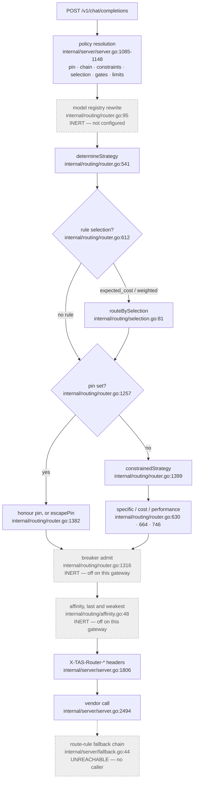

# Routing in the TAS LLM Router

> **Names to fix before anything else.** **TAS** is Tributary AI Services, the
> platform this router belongs to; it prefixes almost every header, hostname and
> service name you will see here, and carries no meaning beyond "ours". **AIQG**
> is the AI Quality Gateway, the TAS product this router is the request-handling
> half of; those letters turn up in hostnames, request headers, environment
> variables and event names throughout, and they always mean that product. The
> **strict gateway** is
> the customer-facing deployment of this router (`llm-router-aiqg`, started with
> `AIQG_STRICT=true`), which rejects any request that does not carry both a
> `TAS-Auth` token and an `Authorization` header; the other deployment,
> `llm-router`, lets internal callers through without either, and everything in
> this document was exercised against the strict one. An **event** is a JSON
> record the gateway emits about a request — two per request, a *request event*
> written when it arrives and a *response event* written when it finishes,
> carrying vendor, model, token counts and cost. Events go to **Loki**, the
> cluster's log store — a database of log lines that services write to and that
> Grafana queries — and not back to you; the only piece of an event you ever hold
> is its id, in a response header. Several answers in this document live in Loki,
> and whether you can reach it is a question the forensics section settles.
>
> **Two commits, and how far apart they now are.** Every line citation in this
> document is against `tas-llm-router@dc1957b` (2026-09-24). The only code change
> since the previous refresh at `e574173` is in `internal/server/judge.go`, which
> no citation in the routing and server paths below points into, so those
> citations carry over unchanged. Every live capture was taken on 2026-08-27 from the deployed strict
> gateway `gateway.aiqg.tas.scharber.com` (deployment `llm-router-aiqg` in
> namespace `tas-llm-router`, image tag `aiqg-v5.86`), whose events stamp
> `gateway_version: 39e8d77`. **No capture in this document was re-taken for this
> refresh** — it is a code-only pass, and the captures are inherited.
>
> The gap between those two has widened, so it was measured rather than assumed.
> `39e8d77` is an ancestor of `e574173`, with 86 commits between them. Across
> that range `internal/routing/router.go` gained 143 lines and **lost none**:
> every line the captures exercised is still there, unmodified. The additions are
> three — a model-registry hook at the top of `Route()`, a check that a pinned
> vendor actually advertises your model, and a read-only accessor for the
> breaker's gateway-wide default. The first is inert unless a registry is
> configured and none is; the second fires only on a pinned request, and no
> pinned request was ever captured. So no captured outcome is contradicted by
> the code now running. `internal/server/server.go` moved further — 202 lines added,
> 161 removed, mostly metrics instrumentation and a refactor that pulled both
> streaming handlers onto one shared chunk pump — and one of those changes *is*
> caller-visible, at the end of a broken stream; it is called out in "Retry
> safety" below.
>
> **What is actually running, and how to check it yourself.** The image the
> Deployment names has moved from `aiqg-v5.86` to `aiqg-v5.87`, and an image tag
> is not a commit, so the tag was resolved rather than trusted. The deployed
> gateway stamps `gateway_version: e6c24c0` on its events — that field is how
> anyone can do this check, by reading any recent response event and taking the
> value. `e6c24c0` is `feat(semcache): switch to TEI + langcache-embed-v3-small,
> keeping 0.87 (#222)`, dated 2026-09-21 — a change to the embedding service
> behind the semantic response cache, text-embeddings-inference (TEI), which
> touches no routing code at all. It is an ancestor of `dc1957b`, behind
> by five commits: the release commit that recorded the tag, three documentation
> refreshes, and `dc1957b` itself, which changes what the quality judge records
> (see "Efficacy" below). The Deployment still named `aiqg-v5.87` when re-read on
> 2026-09-24, so that judge change is merged but not running.
>
> That resolution settles the question this document would otherwise leave open.
> `git diff e6c24c0..dc1957b` across `internal/routing`, `internal/server`,
> `internal/middleware`, `internal/providers` and `internal/config` touches only
> `internal/server/judge.go` and its test —
> `router.go` and `server.go` are byte-identical between the running build and
> the source cited here. So every behaviour described below, including the three
> that arrived in September (the pin-versus-model check, the registry hook, and
> the `X-TAS-Stream-Fallback` header), **is present in the build serving traffic
> today**. Where this document says "since 2026-09", that means deployed, not
> merely merged.
>
> What that does *not* do is make anything observed. No traffic was sent for this
> refresh, and the captures below are still from `aiqg-v5.86` / `39e8d77` on
> 2026-08-27. The resolution makes the *Source* rows trustworthy as descriptions
> of the running code; it does not turn any of them into a measurement.
>
> Where a behaviour is read from source rather than observed, the text says so.

## Why this exists

You send this gateway a chat completion with a `model` field. Something then
decides which vendor account, which credential, and which endpoint will see your
prompt. That decision is routing, and it is not a lookup table.

Seven things can move it: the model name itself, a policy rule your tenant
administrator wrote, the health of each vendor, a passive circuit breaker, a
per-conversation cache preference, a fallback chain, and a registry that can
rewrite the model name you sent. Most of those live outside your request, so a
request that ran yesterday can be routed differently today with no change on your
side. The outcome is reported in a response header you have to know to look for.

Not all seven are live on the deployed gateway, and the gap between what is built
and what currently decides anything is wide enough to waste a working day. The
section "What is actually deciding anything today" is the inventory; read it
before configuring anything.

The consequences are not academic. Routing decides what you are billed, how long
you wait, and — the part that matters to a compliance owner — which vendor
receives your prompt text. A tenant that has declared a vendor forbidden needs to
know that the declaration binds at request time, not only when a rule was
written. This document explains the decision so you can predict it, and so you
can reconstruct it afterwards from what the gateway hands back.

### Every reason your request can reach a vendor you did not ask for

This is the question most people open this document with, so here is the whole
list in one place. Each row says how you would recognise it from what the gateway
hands back.

Four words in that table are load-bearing and are used throughout, so take them
here. A **route rule** is a piece of policy your tenant administrator saves in
the AI Quality Gateway dashboard; the gateway fetches the matching one while your
request is in flight, and it can carry any of a vendor to prefer, a failover
plan, a list of vendors you are forbidden to use, quality floors, and a choice of
ranking strategy. You cannot see it from a response, and nothing you put in a
request creates or changes one. A **pin** is the part of a rule that names a
vendor — the field is called `provider_override` — and it outranks the ranking
strategy. **Ejection**, also called *passive outlier detection*, is the gateway
watching real request outcomes and taking a vendor out of contention when enough
of them fail; it is distinct from the health probe, which asks the vendor
directly every thirty seconds, and it is switched off here. **Affinity** is a
preference for keeping one conversation on one vendor so that vendor's prompt
cache stays warm, which makes repeat requests cheaper; it is also switched off.

| Cause | How you would know | Live here? |
|---|---|---|
| **You named a model only one vendor sells.** The model *is* the vendor choice; asking for `gpt-4o` is asking for openai | `X-TAS-Router-Provider` matches the model's owner. This is not a surprise so much as the rule people forget | Yes |
| **A rule your tenant administrator wrote names a vendor** — a *pin*, set as `provider_override` on a route rule you cannot see from here | `X-TAS-Router-Provider` names a vendor you did not choose, and `router_metadata.routing_reason` contains `pinned by route rule: <vendor>` | Yes, if your tenant has such a rule |
| **The same rule also replaced your model.** A pin may carry a model as well as a vendor, and then your `model` field is overwritten before routing starts | `X-TAS-Router-Model` differs from what you sent — **and that is the only signal.** The rewrite appends nothing to `routing_reason`; the pin is recorded, the model substitution is not (`internal/server/server.go:1092-1097`) | Yes, if your tenant has such a rule |
| **Your tenant forbids the vendor** the strategy picked, so a permitted one was used instead | `routing_reason` contains `strategy chose <vendor>, which tenant constraints deny; used <other>` | Yes, if constraints are configured |
| **The pinned vendor could not be used** — denied, unconfigured, failing its health probe, or not selling your model — so the pin was dropped | `routing_reason` begins `pinned provider <vendor> ` and names which of the four it was | Yes |
| **Your own `fallback_config` sent it elsewhere** after the first vendor failed. This is a body field you set, and it ignores `preferred_chain` entirely | `X-TAS-Router-Fallback-Used: true`, and `routing_reason` contains `Fallback to <vendor>` | Yes, only when you set it |
| **Two vendors advertise the same model name** and the cheaper one won | `X-TAS-Router-Provider` is whichever priced lower. Cannot happen with the six models shipped today; an operator adding an alias to both vendors creates it | No, not as configured |
| **A rule's failover chain advanced a tier**, replacing both vendor and model | `X-TAS-Router-Fallback-Used: true` with a model you never sent | **No** — the chain's code has no reachable caller |
| **The circuit breaker moved you off a failing vendor** | `routing_reason` contains `breaker ejected <vendor>; routed to <other>` | **No** — off gateway-wide |
| **Affinity held you on a warm-cache vendor** | An affinity line in `routing_reason` | **No** — off gateway-wide, and its recording step is unreachable |
| **The model registry rewrote your model name** before any of the above ran | `router_metadata.original_model` and `resolved_model` both appear | **No** — the registry is not enabled |

Four of those eleven cannot happen on this gateway today. That is the gap this
document exists to make visible, and the next section is the inventory behind it.

If you are holding a response right now and want the short version: read
`X-TAS-Router-Provider` and `X-TAS-Router-Model` for *what* happened, and
`router_metadata.routing_reason` in the body for *why*. If the reason is empty or
the body is a streaming response, the why is gone — see "Why did my request go
there?" for what remains.

## Mental model

**The router selects a vendor. It never calls one.**

That single sentence explains most of what is otherwise confusing here.
`Route()` (`internal/routing/router.go:230`) takes your request, returns a
provider handle plus a metadata record, and then it is finished. It never sees
the vendor's response, never learns whether the call succeeded, and never
retries. Everything after selection belongs to the completion handler in
`internal/server/`.

Two consequences follow directly, and they are the two you will meet first.

The first is that this gateway fails on **two sides of the vendor call**, and
which side you are on decides whether you paid. Everything the router does is
before the call; everything the completion handler does is during or after it.

Here is the whole billing rule, in one place. It is the rule the rest of this
document refers back to, so it is worth reading once properly rather than
inferring it later.

| What you get back | Did it cost you? |
|---|---|
| `503 Routing failed: ...` (`internal/server/server.go:1375`) | **No.** Selection never chose a vendor, so nothing was dialled |
| `402 provider_key_required: ...` (`internal/server/server.go:1472-1473`) | **No.** Credential resolution runs before the call |
| `500 Streaming failed: ...` (`internal/server/server.go:2462`) | **No.** On both adapters this error can only be raised before a single token could be generated — see below |
| `500 Completion failed: ...` (`internal/server/server.go:1930`) | **Unknowable from the response.** Some causes billed, some not, and a retry can make it several |
| `200` whose stream ends in an `error` event | **Yes.** Tokens were generated and billed; you were handed a truncated answer |
| `200` | Yes, as expected |

Two of those rows surprise people — the third and the fourth.

**`Streaming failed` is free, and that is provable rather than likely.** The
Anthropic adapter's only error return happens while converting your request,
before anything is sent (`internal/providers/anthropic/provider.go:141-147`). The
OpenAI adapter returns an error in two places — the same request conversion, and
the stream-open call itself (`internal/providers/openai/provider.go:159-163`),
which fails at connect or on the vendor's HTTP rejection. Both are before
generation starts. Neither can
return this error once tokens are flowing; once they are, you have a `200` and
the row below applies.

**`Completion failed` is the one you cannot resolve from where you are sitting.**
One status covers a vendor's rejection of your request, a transport failure that
never reached the model, and a timeout that arrived after the model had generated
and billed a full answer. The handler has a single error exit, so nothing in the
status code, the headers, or the body shape separates them; the message text
carries the vendor's own words and is the only signal, and it is not a structured
one. If `retry_config` was set, this one response can stand for up to
`max_attempts` separate generations. There is no client-side way to tell — see
"Retry safety" for what you can do about that, which is mostly to avoid the
ambiguity rather than to resolve it.

Two more failures exist in the code and cannot fire on this gateway, which is
worth knowing because both would be billed: a response that the outbound content
scan blocks returns `403 response blocked by content policy` **after** a
successful, paid vendor call, and a scan that errors returns
`500 response content scan failed` in the same position. Neither can happen here.
Blocking is gated on `block_on_critical`, which the configuration this gateway
loads sets to `false` for both directions (`configs/config.yaml:111`,
`configs/config.yaml:119`), and `ShouldBlock` returns false outright when that
flag is off (`internal/gatekeeper/gatekeeper.go:515-516`); the scan-error path is
gated on `GATEKEEPER_FAIL_OPEN`, which the live ConfigMap sets to `"true"`
(re-read 2026-09-23). If either setting is ever changed, a paid `403` becomes
reachable, and it is the most expensive outcome in this table because you are
charged for a generation you are not given.

The second is that **the router picks a vendor, not a model**. Your `model`
string is carried through and handed to whichever vendor was selected, and the
two are kept in step only indirectly. The main coupling is the cost table: a
vendor that has no price for your model name cannot be costed, and an uncostable
vendor is dropped from the candidate set — a **candidate** being any registered
vendor still in contention at that point in the decision, defined properly a
section below. One path now checks the pairing
directly — a rule that pins a vendor is dropped when that vendor does not
advertise your model (`internal/routing/router.go:1290-1292`) — but that check
guards the pin and nothing else. Everywhere else the coupling stays indirect,
and the places where it breaks are where the surprises live.

The inputs are ordered, and the order is deliberate. Reading downward, each layer
may override the one above it:



The three greyed hops and the dashed one are drawn because they are in the code,
and because two of them can be switched on by a per-tenant control. As deployed
today none of them moves any decision. The next section says which controls do.

The registry hop is the newest of the four and the easiest to mistake for live,
because it is the only one whose job is to **change your `model` field** rather
than to change the vendor. It would resolve an alias to a concrete model name,
and substitute a replacement when the model it resolved has been marked
unavailable. It runs before everything else, so if it were on, every later step
would be reasoning about the substituted name rather than the one you sent.

The precedence is stated as a design rule in the source: tenant constraints
outrank health, health outranks an operator's pin, and a pin outranks affinity
(`internal/routing/affinity.go:38-47`). Affinity is deliberately last because it
is an economic preference, and letting an economic preference defeat a
compliance control would be the wrong failure.

What routing does **not** own: it does not translate wire formats, does not scan
content, does not hold your vendor keys, and does not decide whether a response
is cached. Those are separate stages in the same handler.

## What is actually deciding anything today

More of this subsystem is built than is live. Before you spend an afternoon
configuring a control, check it here. Three groups, by who can change it.

"Evidence" says how the row was established. *Observed* means a request was sent
through `gateway.aiqg.tas.scharber.com` on 2026-08-27 and the outcome was read
from the response, the log, or the event — or, for the gateway-configuration
rows, that the running Deployment and ConfigMap were read directly rather than
inferred from a manifest in the repository. *Source* means it was read from the
code at `dc1957b` and no live traffic exercised it. That distinction earns its
place here: this same document found four configuration knobs that parse cleanly,
validate at startup, and change nothing, so "the code says so" is weaker evidence
than it looks.

**No *Observed* row below was re-observed for the 2026-09-23 or 2026-09-24
refreshes**, both code-only. Each was re-checked a weaker way instead: the code path it rests on
was compared against the build that produced it, and none of those paths has lost
a line. The gateway-configuration rows are the exception — those were re-read
from the live `llm-router-aiqg` Deployment and the `llm-router-config` ConfigMap
on 2026-09-23, which is the same evidence that established them, so they are
current rather than inherited.

**"Scope" is the column to read before you generalise.** *Gateway* means the row
holds for every caller — it follows from the deployed model table or from code
with no tenant input. *Tenant* means it was observed on one tenant, and that
tenant has a route rule supplying a selection strategy, which every capture in
this document shows in its routing reason. Your tenant may have no rule, a
different rule, or different vendor constraints, in which case a *Tenant* row
describes that tenant and not yours. Treating those rows as gateway behaviour is
the mistake this column exists to prevent.

A few more terms are used from here on and are worth fixing now.

A **candidate** is a registered vendor still in contention at some step: healthy,
permitted by your tenant's constraints, able to support the features your request
needs, and — once pricing runs — able to price the model you named. Selection
ranks candidates; the filters decide who is one.

**Efficacy** and **assurance** are the two quality measurements a rule can set a
floor on, and they are not the same kind of number. *Efficacy* is a 0-100 score
for how well a model and workflow pair has been answering; a rule sets a minimum.
*Assurance* is not a score at all — it is the worst severity that content
scanning has found for that pair, and a rule sets the highest severity it will
still accept. Both are defined against the model-and-workflow pair, never against
a vendor.

Efficacy comes in two forms, and a rule can floor each separately. *Structural*
efficacy is read from how the vendor said the answer ended, so it sees
truncation and filtering but not a wrong answer. *Judged* efficacy is the mean
score a second model — the judge — gave a sample of responses, and it has its
own floor (`aether-shared/go-aiqg-resilience/signals.go:122-135`). That floor
only acts once the model-and-workflow pair has enough *judged* samples, counted
separately from its structural ones: the rule's `min_samples`, or 200 if the rule
sets none (`aether-shared/go-aiqg-resilience/signals.go:155`,
`aether-shared/go-aiqg-resilience/signals.go:176-181`). Below that count the
gate does not guess. By default it **admits** the candidate and records a reason
beginning "judged efficacy gate abstained"; only a rule that sets
`on_insufficient_data: exclude` removes it instead
(`aether-shared/go-aiqg-resilience/signals.go:303-318`).

One consequence of the judged form is worth knowing before you set that floor.
When the judge model is the same model that served the response, the score is
still recorded but marked `self_judged` (`internal/server/judge.go:156`), and
the aggregate that routing reads leaves those scores out — as it does any score
that does not carry the flag at all
(`aiqg-dashboard-be/internal/store/quality.go:182-200`). So a model never votes
on its own eligibility. The cost is evidence: if your judge is the model you
serve most, most of that model's judged samples do not count, and a judged floor
on it is more likely to sit below the sample count and admit it by default than
to test it. The provenance flag arrived in `dc1957b`, after the build the
gateway runs (`aiqg-v5.87`), so today's judged scores are written without it.
`[!UNVERIFIED]` Whether the deployed dashboard already applies the exclusion was
not checked. If it does, every judged score written until a release that sets
the flag is deployed counts as self-judged, so no model has judged evidence, and
every judged floor admits every candidate by default until new scores
accumulate. Under `on_insufficient_data: exclude` it would reject them all, and
the routing gate then yields and keeps the whole set rather than fail the request
(`internal/routing/signals.go:76-110`), so the outcome is the same.

**Verbosity** is how long a model's answers tend to be — specifically the mean
number of output tokens it produces for a given workflow, measured from past
traffic. It matters because output is priced several times higher than input, so
a model's verbosity, not its headline price, decides much of what a request
costs. The table of those measurements is what one of the ranking strategies
reads.

To **abstain** is what that strategy does when it has no measurement it is
allowed to trust. It does not guess and it does not fail; it falls back to the
older pricing method, picks whatever that picks, and writes a line saying it
abstained. You will see the word throughout because on this gateway it abstains
on every request.

A rule's **selection block** is the part of a route rule that chooses the ranking
strategy — the reason a request can be ranked by a method you never asked for.

A **workflow** is the second key, alongside the model, on every measurement this
subsystem consults. You set it with the `TAS-Workflow` request header, and it
accepts a closed set of six values: `single_turn_qa`, `rag`, `agentic`,
`summarization`, `code_generation`, and `classification_extraction`
(`internal/middleware/aiqg_headers.go:126-133`). A value outside that set is
**discarded silently** — no error, no warning, and the header is treated as
absent, so `TAS-Workflow: qa` is the same as sending nothing. When you send
nothing the gateway classifies the request from its shape
(`internal/workflow/classifier.go:22`) and records that on the event as
`workflow_inferred`, but routing's measurement lookups read the header only
(`internal/server/server.go:1142`). That is why the walkthrough below reports
`(no workflow)` while its own event says `single_turn_qa`.

**Controls you set on your tenant or your request**

Every row marked *Observed* in this table was captured on 2026-08-27 against
image `aiqg-v5.86`; none was re-observed for this refresh. The gateway now runs
`aiqg-v5.87` (commit `e6c24c0`), whose routing and server code is byte-identical
to the source cited here — so a row marked *Source* describes what is running,
and a row marked *Observed* describes what an older build did on one day.

| Control | Effect today | Scope | Evidence (Observed = 2026-08-27, `v5.86`) |
|---|---|---|---|
| `model` in the request body | Selects the vendor whenever exactly one vendor advertises the name | Gateway | Observed |
| `optimize_for` in the body | Never reaches a decision. Every name in the deployed table is served by exactly one vendor, so the strategy is always `specific`, which is chosen before `optimize_for` is consulted; an unknown name fails at selection instead. A rule selection pre-empts it as well | Gateway | Source (reasoning); Observed (ignored, on a rule-carrying tenant) |
| `retry_config` / `fallback_config` in the body | The only failover that runs. See "The fallback that does work" | Gateway | Observed |
| `TAS-Conversation-Id` header | No effect — affinity is off gateway-wide, and the recording step is unreachable in code | Gateway | Observed |
| `TAS-Workflow` header | Chooses which verbosity and quality row is looked up. Accepts six values only; anything else is silently discarded | Gateway | Observed |
| Rule pin (`provider_override`) | Overrides the strategy; escapes to the chain or the strategy when unusable. Since 2026-09 a pin is also unusable when the pinned vendor does not advertise your model, which used to produce a paid 500 | Tenant | Source |
| Tenant vendor constraints | Refuse a denied vendor at request time; fail the request when nothing is permitted | Tenant | Source |
| Rule fallback chain | Does not run — the walk has no reachable caller, for any tenant | Gateway | Observed (absent) |
| Rule selection `expected_cost` | Runs and abstains, picking what the price table would have picked. Whether it runs at all depends on your rule; that it abstains depends on the measurement floor, which is gateway-wide | Tenant (runs) / Gateway (abstains) | Observed |
| Rule selection `weighted` | Splits traffic by relative weights, hashing the conversation identity so a conversation stays put. Whether configuring it changes anything is untested | Tenant | Source |
| Rule quality gates | Remove candidates below an efficacy floor (structural, judged, or both) or above an assurance severity, before pricing, and yield rather than empty the set. Whether configuring them changes anything is untested | Tenant | Source |
| Rule context / output limits | Do not run — same unreachable branch as the chain, for any tenant | Gateway | Observed (absent) |
| Image content in a request | No vendor advertises vision any more, so a request that mixes image parts with tools or an explicit `required_features` has an empty candidate set and fails routing. Image parts on a plain request are dropped by the translator instead | Gateway | Source |

**Gateway configuration, which only an operator can change**

These rows are the current ones: every entry marked *Observed* here was re-read
from the live Deployment and ConfigMap on 2026-09-23, not inherited from the
August captures.

| Setting | Effect today | Evidence (Observed = live config, 2026-09-23) |
|---|---|---|
| `router.default_strategy` (`LLM_ROUTER_DEFAULT_STRATEGY`) | None. Validated at startup, never read | Source |
| `router.max_cost_threshold` and body `max_cost` | None. Parsed onto the request, read by nothing | Source |
| `router.default_retry` / `router.default_fallback` | None. Never applied; only body-level config engages retry | Source |
| `FEATURE_ADVANCED_ROUTING`, `FEATURE_CIRCUIT_BREAKER` | None. Present in the ConfigMap (both `"true"`, re-read 2026-09-23), absent from the source | Observed (present) / Source (unread) |
| `registry.enabled` — the model registry | Off, and not reachable without a new image. It is a YAML-only key with no environment binding and no default; the only config file the container reads is `configs/config.yaml` baked into the image, and that file has no `registry:` block. Nothing mounts over it | Source (code + image config + live Deployment spec) |
| `AIQG_BREAKER_ENABLED` | Unset, so no vendor is ever ejected unless a tenant control enables it. Outcomes are still recorded, which is bookkeeping, not protection | Observed |
| `AIQG_AFFINITY_ENABLED` | Unset, so affinity is off unless a tenant control enables it | Observed |
| `HEALTH_CHECK_INTERVAL` (30s) | Active. Drives the probe that can make a vendor uncandidatable | Observed |

**"Unless a tenant control enables it" — where that control lives.** Two rows
above say the breaker and affinity are off gateway-wide but can be switched on
per tenant, so it is worth being exact about what that means for you. The control
is not a request header and not a body field; nothing you can put in a request
reaches it. It arrives on the policy bundle that the dashboard backend returns
when the gateway resolves your tenant's policy, alongside your route rules
(`internal/middleware/aiqg.go:1303-1308`), and the router folds it over the
gateway default at the moment each feature is consulted
(`internal/routing/router.go:915-917`). So it is set where route rules are set —
the dashboard, under Governance → Policies → Routing, which holds runtime
controls next to the rules themselves. If you do not have dashboard access, this
is not reachable by you and the person to ask is whoever administers your
tenant's policies. No response from this gateway reports whether it is on for
you; the only signal is indirect, in `router_metadata.routing_reason`, which
gains a breaker or affinity line only when one of them actually moved a decision.

**Facts about the code that no configuration can change**

Rows marked *Source* here are current as of `dc1957b`, which for these files is
the same code the gateway is running. Rows marked *Observed* are from the
2026-08-27 captures against image `aiqg-v5.86`.

| Fact | Consequence | Evidence (Source = `dc1957b`; Observed = 2026-08-27, `v5.86`) |
|---|---|---|
| `completeWithFallback` has no reachable caller | The rule chain, pre-flight context check, tenant output cap, and served-affinity recording all never run | Source (call graph) confirmed by Observed: an over-window prompt that the pre-flight check would have caught was forwarded to the vendor and returned 200 |
| `round_robin` is unreachable | Nothing can select it; it is not an option | Source. `determineStrategy` returns only the other three and no other caller sets it; no configuration path reaches the constant |
| Vendor adapters refuse to price unknown models | An unrecognised model name fails at selection with 503 rather than routing anywhere | Observed, twice |
| A chain tier replaces the model as well as the vendor | Were the chain live, your response could name a model you did not send | Source |
| Body-level fallback does not re-check that vendor and model agree | A `fallback_config` retry re-sends your model name to a vendor that does not serve it, so cross-vendor fallback cannot succeed on this gateway | Observed |
| A pin *is* now checked against your model | A rule pinning a vendor that does not advertise your model is dropped with a recorded reason rather than producing a paid 500. A vendor whose model list is empty is exempt — an empty list means "cannot tell", not "serves nothing" | Source |
| Streaming never retries | `retry_config` is not consulted on the streaming path, and no `RecordOutcome` call is made there. Since 2026-09 a stream that dies mid-answer ends with an explicit error event instead of the ordinary terminator | Source |

The rest of this document explains each of these. If you read only the table,
the two rows that will cost you time are the unreachable chain and the abstaining
`expected_cost`.

## How it works end to end

A completion arrives at `handleChatCompletion`
(`internal/server/server.go:1063`). All three completion surfaces — the OpenAI
chat surface, `/v1/messages`, and `/v1/responses` — translate their bodies and
then call this one function (`internal/server/anthropic_messages.go:509` and
`internal/server/responses_api.go:339`), so everything below applies identically
to all three.

Before routing runs, the handler resolves your tenant's policy onto the request
context (`internal/server/server.go:1085-1148`): a provider pin, per-request
resilience overrides, tenant feature controls, context and output limits, quality
gates, a selection strategy with its hysteresis settings — the margin an
alternative must beat before a switch is allowed — and its measured verbosity
table, and a fallback chain with the tenant's vendor constraints. These ride the
context rather than the request body on purpose — the request body is serialised
toward a vendor, and routing metadata must never end up in a vendor payload
(`internal/routing/pin.go:12-15`).

That policy comes from a synchronous call to the dashboard backend, and it
happens **twice** per request. The first resolution runs at receipt, before the
model is known. The second runs at routing time, once the model and the inferred
workflow are available, so that rules targeting a model or a workflow can match
at all (`internal/server/server.go:1085`,
`internal/middleware/aiqg.go:796`). Both calls carry a two-second timeout
(`pkg/aiqg/policy/policy.go:167`), and the second one **fails silently**: on any
error it returns and leaves the receipt-time resolution in place
(`internal/middleware/aiqg.go:812-814`). A slow or unreachable policy backend
therefore does not error your request — it quietly drops every model-targeted
rule, and your request routes as though you had configured nothing.

Then `Route()` runs, in this order.

**The model registry — inert as deployed.** Before anything else,
`resolveViaRegistry` (`internal/routing/router.go:95`) would look your `model`
up in a registry of models discovered from the vendors themselves. An alias
resolves to the concrete model behind it; a model whose cached status is
`unavailable` is swapped for a replacement; a model marked `deprecated` is served
as-is with a warning in the log. It rewrites `req.Model` in place, so everything
downstream — strategy, pricing, the pin check — sees the new name. A model the
registry has never heard of is left alone, which is what keeps the feature
additive. The first line of the function returns when no registry is attached,
and none is: `registry.enabled` is a YAML key with no environment binding, and
the `configs/config.yaml` the container loads has no `registry:` block. Nothing
you can set on a request or a tenant turns it on.

**Strategy.** `determineStrategy` (`internal/routing/router.go:541`) returns
`specific` when the model name identifies a vendor, otherwise it maps the
optional `optimize_for` field to `cost_optimized` or `performance`, defaulting to
`cost_optimized`.

**Rule selection can pre-empt all of that.** `routeByStrategy` consults
`routeBySelection` first (`internal/routing/router.go:612`), and if a matched
route rule asked for `expected_cost` or `weighted`, that rule decides and the
strategy computed a moment earlier is never used. This is observable: sending
`"optimize_for": "performance"` on the deployed gateway produced a routing reason
of `expected_cost abstained`, meaning the rule ran and the request's own
preference was ignored.

**The pin.** `routeWithPin` (`internal/routing/router.go:1257`) honours a
rule-supplied provider unless one of four things is true: the tenant's
constraints deny it, it is not configured on this gateway, it is unhealthy, or
— the newest of the four — it does not advertise the model you asked for
(`internal/routing/router.go:1290-1292`). On any of those,
`escapePin` (`internal/routing/router.go:1382`) enters the fallback chain at
tier 1 if one exists, and otherwise falls through to the configured strategy —
recording the reason either way, so a pin that was not honoured is visible rather
than inferred.

**The breaker — inert as deployed.** `admitOrReselect`
(`internal/routing/router.go:1316`) would ask passive outlier detection whether
the chosen target may receive this request, and reselect if not; if nothing else
were available it would proceed anyway and say so
(`internal/routing/router.go:1357-1361`), because ejection exists to shift traffic
and with nowhere to shift it refusing every request is worse. On this gateway the
first line of that function returns immediately: `breakerEnabled` folds the tenant
control over the gateway default, and the default is off
(`internal/routing/router.go:915-917`). No request is currently reselected or
denied by it.

You can check that for yourself rather than taking this document's word for it.
`GET /v1/breaker` reports the fleet's ejection state, and it needs no TAS token,
like `/v1/models`. Read its `state` field, which since 2026-09 distinguishes
three cases a single boolean could not: `unavailable` means no store is attached,
`off` means the breaker is running but does nothing for a request that carries no
tenant control, and `on` means ejection is in force gateway-wide
(`internal/server/breaker_status.go:39-50`). The trap the field exists to close
is that `targets: []` reads as a clean bill of health in all three. An empty list
under `state: off` means nothing was being watched. This document has not run
that call — the breaker's state here was read from the Deployment and the
ConfigMap, which carry no `AIQG_BREAKER_ENABLED` at all.

**Affinity — inert as deployed.** `applyAffinity`
(`internal/routing/affinity.go:48`) would prefer the vendor holding a warm prompt
cache for this conversation, unless a pin named someone else or the affine vendor
were unhealthy. It is off by the same mechanism, and the step that would record a
target for it to prefer is on the unreachable branch described below.

### What the `model` field actually does

`isSpecificProviderRequested` (`internal/routing/router.go:560`) counts how many
registered vendors advertise the name you sent and returns true only when the
count is exactly one (`internal/routing/router.go:570`). On the deployed gateway
the model table is assembled from two places, neither of which an operator can
edit without a new image. The Anthropic three come from `configs/config.yaml`
baked into the container, which the image's own start command loads
(`docker/Dockerfile:96`); the OpenAI three come from the compiled-in defaults
(`internal/config/config.go:461-520`), because that file's `openai:` block is
commented out and so never overrides them. The deployment's ConfigMap carries no
model list at all. The two sources agree on every price and window, and together
they give six names across two vendors with no overlap:

| Name | Vendor | Input per 1k | Output per 1k | Context window |
|---|---|---|---|---|
| `gpt-4o` | openai | $0.005 | $0.015 | 128,000 |
| `gpt-4o-mini` | openai | $0.00015 | $0.0006 | 128,000 |
| `gpt-3.5-turbo` | openai | $0.0015 | $0.002 | 16,385 |
| `claude-opus-4-6` | anthropic | $0.015 | $0.075 | 1,000,000 |
| `claude-sonnet-4-6` | anthropic | $0.003 | $0.015 | 1,000,000 |
| `claude-haiku-4-5-20251001` | anthropic | $0.0008 | $0.004 | 200,000 |

You do not have to take that table on trust, and you should not — every value in
it ships inside the image, so it changes with a deployment rather than with a
config edit you can see.
`GET /v1/models` reports what the running gateway actually advertises, and its
`owned_by` field is the vendor mapping this whole section is about. It needs no
authentication, so it works before you have a token:

```bash
curl -sS https://gateway.aiqg.tas.scharber.com/v1/models
{"object":"list","data":[{"id":"claude-haiku-4-5-20251001","object":"model","created":0,"owned_by":"anthropic"},{"id":"claude-opus-4-6","object":"model","created":0,"owned_by":"anthropic"},{"id":"claude-sonnet-4-6","object":"model","created":0,"owned_by":"anthropic"},{"id":"gpt-3.5-turbo","object":"model","created":0,"owned_by":"openai"},{"id":"gpt-4o","object":"model","created":0,"owned_by":"openai"},{"id":"gpt-4o-mini","object":"model","created":0,"owned_by":"openai"}]}
```

If a name is absent from that list, sending it produces the 503 described below.
If two entries share an `id` with different owners, you are in the multi-vendor
case. The endpoint is built from the same capability matrix routing uses
(`internal/server/server.go:2734`), so it cannot drift from the router's view —
with one future caveat. The endpoint reads the statically configured model lists
only; it does not read the model registry. If the registry is ever enabled, an
alias it resolves will route successfully while remaining absent from this
listing, and absence will stop meaning "will 503".

So for these six names, `model` does pin the vendor. If that vendor is unhealthy,
`routeToSpecificProvider` returns an error rather than substituting
(`internal/routing/router.go:638-640`) — you get a 503, never a silent swap to a
different vendor's model.

Three cases behave differently, and they are worth knowing precisely.

**A name no vendor advertises.** The match count is zero, so the strategy becomes
cost-optimised, and `routeByCost` (`internal/routing/router.go:664`) asks every
candidate to price the request. Both vendor adapters refuse to price a model they
do not know (`internal/providers/openai/provider.go:259`,
`internal/providers/anthropic/provider.go:323`), so the candidate list empties and
routing fails with `could not estimate costs for any provider`
(`internal/routing/router.go:703`). A typo therefore produces a loud 503 before
any vendor is contacted — confirmed live, twice, below in Failure modes. This
contradicts the design note that anticipated a silent fall-through to the
cheapest vendor; the cost estimator's refusal to price unknown models closes that
hole as a side effect.

If a selection rule is in play — as it is for the tenant used throughout this
document — the same thing happens one step earlier and arrives at the same place.
`expected_cost` prices each candidate, skips every one that has no price
(`internal/routing/expected_cost.go:171`), finds the surviving set empty, and
declines to handle the request at all
(`internal/routing/selection.go:139-141`). Declining returns control to the
strategy switch, which runs cost routing, which fails for the reason above. So
the 503 captures in Failure modes almost certainly took the longer path; the
error text is identical either way, which is why the path is invisible from
outside.

**A name two vendors advertise.** The match count is two, so the model no longer
identifies a vendor and cost routing chooses between them on price. Your `model`
string is unchanged and goes to whichever is cheaper. With the shipped table this
cannot happen, because no name is listed twice — but an operator who adds an
alias to both vendor lists creates exactly this, and nothing warns them.

**A name one vendor advertises, when a rule selects `expected_cost`.** The rule
pre-empts the specific strategy, prices every eligible candidate for your model
name, and skips any candidate with no price (`internal/routing/expected_cost.go:115-117`,
and `internal/routing/expected_cost.go:171` skips unpriced candidates). The
surviving candidate is the vendor that advertises the model, so the outcome
matches the specific strategy — reached by a different route, and reported with a
different reason.

### When a pin and your model name disagree

This is the collision the mental model warns about, and it has a definite answer.
A rule's routing target carries a provider and, optionally, a model
(`internal/server/server.go:1092-1097`). When the target names **both**, your
`model` is overwritten before routing begins and the two agree by construction —
your response comes back with a model you did not send, which the
`X-TAS-Router-Model` header reports.

When the target names **only a provider**, nothing rewrites your model, and the
pin is now checked against it. `providerServesModel`
(`internal/routing/router.go:594`) asks whether the pinned vendor advertises the
name you sent, and if it does not, the pin is treated as unusable exactly like a
denied or unhealthy one: `escapePin` takes over, the chain's tier 1 runs if a
chain exists, and otherwise the configured strategy does — with
`pinned provider <name> does not serve model <model>` recorded on the decision
(`internal/routing/router.go:1290-1292`). With the shipped model table, where
each name belongs to exactly one vendor, the strategy then sends the request to
the vendor that actually serves your model. You get an answer, at the price of
your rule's pin being quietly overridden, and the reason is in
`router_metadata.routing_reason`.

Until 2026-09 that same request produced a paid `500 Completion failed: ...`
carrying the vendor's own not-found wording. If you have a runbook entry or an
alert built on that shape, it no longer fires for this cause.

**One carve-out decides whether the check protects you.** A vendor whose
configured model list is *empty* is treated as serving everything, so a pin to it
is never dropped (`internal/routing/router.go:596-597`). Both vendors on this gateway
carry a populated list, so the check is active for both — but a provider added
without a model list, relying on passthrough, gets the old behaviour back and
nothing says so.

The practical consequence is unchanged: if your tenant has a provider pin, treat
the `model` field as advisory and confirm with `X-TAS-Router-Provider` and
`X-TAS-Router-Model` what actually ran. All of this is read from source — no
pinned rule was available to exercise, then or now, and the reason that matters
is set out in "What is actually deciding anything today".

### The strategies, including one you cannot reach

`cost_optimized` prices every healthy, feature-compatible candidate and takes the
cheapest (`internal/routing/router.go:707-712`). `performance` takes the lowest
estimated latency (`internal/routing/router.go:758-766`), where the estimate is
the last active health-probe round trip (`internal/routing/router.go:1115-1122`) —
not observed completion latency, and for the OpenAI adapter the probe is a model
listing (`internal/providers/openai/provider.go:306`), which says little about
how fast completions are.

`round_robin` is defined (`internal/routing/router.go:150`) and implemented
(`internal/routing/router.go:797`), and nothing can select it: `determineStrategy`
returns only the other three, and no other caller sets it. It is unreachable
configuration, not an option.

### expected_cost, and the fact that it abstains

`expected_cost` exists because the default cost estimate prices output at
`max_tokens` — the ceiling — defaulting to 100 when unset, while output is most
of the bill (`internal/routing/expected_cost.go:13-21`). It replaces that ceiling
with a measured mean output length per model and workflow, capped by `max_tokens`
because a truncated answer is still an answer you paid for
(`internal/routing/expected_cost.go:135-137`).

A measurement may steer routing only when it is not stale and has at least 100
samples (`aether-shared/go-aiqg-resilience/selection.go:209`,
`aether-shared/go-aiqg-resilience/selection.go:216-221`). The comment above that
constant records that when it was measured on 2026-08-21 against 30 days of
events, exactly one model-and-workflow pair cleared it.

When no measurement qualifies, the code refuses to pretend. It prices at
`max_tokens` as before and stamps
`expected_cost abstained: no usable measurements; priced at max_tokens as before`
onto the decision (`internal/routing/selection.go:151`). Every completion this
document captured on 2026-08-27 carried that string. So on the deployed gateway,
today, `expected_cost` is running and is not changing any decision: it selects the
same vendor the price table would have selected, and reports honestly that it did
not measure anything. Treat it as instrumented but not yet deciding.

The same honesty applies to `weighted` (`internal/routing/weighted.go:36`), which
splits traffic by relative weights. It hashes a stability key rather than drawing
a random number, so the same conversation lands on the same vendor every turn and
a 90/10 canary means 10% of conversations rather than a 10% chance per request.
No weighted decision was observed on this gateway; the behaviour above is read
from source.

### Quality gates, which filter rather than trade

If a rule declares quality floors, `gateCandidates`
(`internal/routing/signals.go:82`) removes candidates that fall below them
*before* selection prices anything. The ordering is the design: a quality term
inside a cost function can always be bought past by a large enough price
advantage, whereas a floor cannot (`internal/routing/signals.go:13-31`). One
carve-out matters to you: the gate never returns an empty set. If every candidate
fails, it yields, serves the request, and records that it yielded
(`internal/routing/signals.go:109-111`) — a quality control that takes the service
down is a worse outcome than the one it prevents.

### Why it stays put — the answer first, then the machinery

If you are asking "a cheaper vendor was available, why did my request not move to
it", the answer on this gateway today is almost certainly none of the three
mechanisms below. It is this:

**There was never a second candidate to move to.** You named a model. Exactly one
vendor advertises it, and the other vendor cannot price a model it does not know,
so the cost estimator drops it (`internal/routing/router.go:688-692` skips a
candidate whose `EstimateCost` errors; `internal/routing/expected_cost.go:171`
does the same inside `expected_cost`). What reaches the comparison step is a
single survivor. No alternative was rejected as too expensive or too similar —
there was no alternative. The cheaper vendor you had in mind is cheaper for *its*
models, and asking for it means sending its model name.

That is why every capture in this document reports
`expected_cost abstained: no usable measurements` and no switching line at all:
the switch machinery was never reached. The walkthrough's hop 5 shows the same
thing from the other side — hysteresis is evaluated only when the proposal
differs from the vendor that owns the requested model, and it did not.

The three mechanisms below *are* what would hold a request in place once there
genuinely are two candidates for one model name, which needs either a rule
selecting `weighted`, or an operator listing the same model under both vendors.
They are also easy to confuse with one another, and each leaves a different
trace, so they are worth telling apart before you go looking for one.

**Affinity** keeps a conversation on the vendor whose prompt cache is warm. It
needs a conversation identity, taken from the `TAS-Conversation-Id` header or a
W3C baggage session id (`internal/server/affinity.go:96-103`); single-shot traffic
with neither has no identity and affinity does not engage.

**Switching hysteresis** governs `expected_cost`. Hysteresis here means
deliberate reluctance to change a decision already made: an alternative has to be
better by a stated margin before the router will move to it; being cheaper by
any amount is not enough.
`ShouldSwitch`
(`internal/routing/switching.go:69`) refuses a move unless the improvement clears
a threshold, defaulting to 25%, raised by a further 15 points when the current
vendor holds a warm cache that the move would discard
(`aether-shared/go-aiqg-resilience/selection.go:117-119`,
`internal/routing/switching.go:98-101`). A refusal is recorded verbatim, so you
can search for it: the string is `improvement 12.4% is below the 25% threshold`
with the real numbers filled in, and when a warm cache raised the threshold it
gains the suffix ` (raised because switching would discard a warm prompt cache)`
(`internal/routing/switching.go:122-131`). That suffix exists because an operator
who set 25% and watched a 30% improvement get refused would otherwise conclude
the router was broken. No such string appeared in any capture for this document,
for the reason given at the top of this section.

**Dwell** is a time floor on top of that: after a switch, no further switch for
the configured window (`internal/routing/switching.go:111-118`), refusing with
`within the dwell window; last switch was 42s ago` — again with the real elapsed
time filled in, and again never seen here. The last switch time is held in shared
Redis so replicas cannot each switch once inside the same window
(`internal/routing/dwell.go:12-16`). If Redis is unreachable the store
fails open and reports no record (`internal/routing/dwell.go:40-42`) — losing
dwell costs some flapping, whereas blocking every switch would freeze routing
during a cache outage.

### The fallback chain, and where it currently stops

A chain is an ordered list of vendor-and-model tiers. Two properties matter to
you. First, a tier replaces **both** the vendor and the model
(`internal/server/fallback.go:154-155`) — carrying your model name forward would
reproduce the failure that reached the chain, so tier 2 answers with tier 2's
model, and your response will name a model you did not ask for. Second, the chain
is walked by the completion handler rather than by the router
(`internal/server/fallback.go:16-21`), because only the caller knows whether an
attempt actually failed.

That walk lives in `completeWithFallback` (`internal/server/fallback.go:44`), and
on the deployed gateway it does not execute. `handleChatCompletion` dispatches to
`handleNonStreamingCompletionWithRetry` (`internal/server/server.go:1411`), which
calls `attemptCompletionWithRetryAndFallback`
(`internal/server/server.go:2494`) — a separate, older path driven by the
client-supplied `retry_config` and `fallback_config` body fields.
`completeWithFallback` has exactly one caller,
`handleNonStreamingCompletion` (`internal/server/server.go:1755`), which in turn
has one caller inside `handleStreamingCompletion`
(`internal/server/server.go:1881`) — and `handleStreamingCompletion` has no
callers at all. The whole branch is unreachable.

Four behaviours ride on that branch and therefore do not run today: the
route-rule fallback chain, the pre-flight context-window check
(`internal/server/fallback.go:61`), the tenant output cap
(`internal/server/fallback.go:71`), and the recording of the served vendor that
makes affinity stick on the next turn (`internal/server/fallback.go:78`). This
was confirmed live, not only read: a 70,000-character prompt sent to
`gpt-3.5-turbo` estimates as 17,500 tokens against that model's 16,385-token
window, which `CheckLimits` (`internal/routing/limits.go:96`) would have flagged;
the gateway returned HTTP 200 having sent the request to OpenAI unchanged.
Passive outlier detection still *records* outcomes on the live path
(`internal/server/server.go:2563`), so that data is not lost — but recording
without ejection changes no routing decision. Do not count it as a safeguard.

### The fallback that does work

The live path is driven by two optional body fields that predate route rules.
They are TAS extensions to the vendor request shape, decoded directly on
`/v1/chat/completions` and carried through the translators on `/v1/messages` and
`/v1/responses` (`internal/server/tas_extensions.go:5-20`), so they are settable
from a stock SDK through its extra-body mechanism.

| Field | Type | Default when omitted | What it does |
|---|---|---|---|
| `retry_config.max_attempts` | integer | 1 (no retry) | Total vendor calls to the selected vendor. Values below 1 are raised to 1 |
| `retry_config.backoff_type` | `"exponential"` or `"linear"` | exponential | Exponential is `base_delay × 2^n`; linear is `base_delay × (n+1)` |
| `retry_config.base_delay` | Go duration in nanoseconds | 0 | Starting delay. A zero delay retries immediately |
| `retry_config.max_delay` | Go duration in nanoseconds | 0 (uncapped) | Ceiling on the computed delay |
| `retry_config.retryable_errors` | array of strings | see below | Substrings matched against the error text |
| `fallback_config.enabled` | boolean | false | Try another vendor after the retries are exhausted |
| `fallback_config.preferred_chain` | array of vendor names | — | **Ignored on this path** |
| `fallback_config.max_cost_increase` | number | — | **Ignored on this path** |
| `fallback_config.require_same_features` | boolean | — | **Ignored on this path** |

Four properties of this path will decide whether it is any use to you.

**There is no upper bound on `max_attempts`.** The type comment says 1–5
(`internal/types/requests.go:202`), and the code clamps only the lower end
(`internal/server/server.go:2533-2538`). A request asking for 50 attempts gets 50.

**Retryability is substring matching on the error text.** With
`retryable_errors` omitted, an error is retried when its text contains `timeout`,
`connection`, `unavailable`, or `rate limit`
(`internal/server/server.go:2674-2678`). Supplying your own list replaces those
four entirely. This is textual, not status-code based, so it is only as stable as
the wording each vendor SDK produces.

**The fallback ignores the three fields that shape it.**
`getFallbackProviders` (`internal/server/server.go:2691`) returns every registered
vendor except the one that failed. It reads none of `preferred_chain`,
`max_cost_increase`, or `require_same_features` — its own comment calls it a
simplified implementation that ought to use the router's chain logic.

**Your model name is not rewritten for the new vendor.** The fallback re-attempts
with the request untouched (`internal/server/server.go:2602`). With the shipped
model table, where no name is served by both vendors, the second vendor is
therefore always asked for a model it does not have. Cross-vendor fallback cannot
succeed on this gateway as configured. Observed:

```bash
curl -sS -k -w '\nHTTP %{http_code}\n' https://gateway.aiqg.tas.scharber.com/v1/chat/completions \
  -H 'Content-Type: application/json' -H "TAS-Auth: $AIQG_TEST_TAS_AUTH_TOKEN" \
  -H 'Authorization: Bearer placeholder' -H 'TAS-Cache: no-store' \
  -d '{"model":"gpt-3.5-turbo","messages":[{"role":"user","content":"hi"}],
       "max_tokens":999999,"fallback_config":{"enabled":true}}'
{"error":{"code":500,"message":"Completion failed: all fallback providers failed","type":"api_error"},"timestamp":1787805761}
HTTP 500
```

The oversized `max_tokens` forces OpenAI to reject the request; the gateway then
tried Anthropic with the model name `gpt-3.5-turbo` and failed there too. Its two
log lines, from Loki, show the attempt and the give-up:

```json
{"fallback_provider":"anthropic","level":"info","msg":"Trying fallback provider","time":"2026-08-27T04:42:41Z"}
{"error":"all fallback providers failed","level":"error","msg":"All completion attempts failed","provider":"openai","time":"2026-08-27T04:42:41Z"}
```

The `Request routed` line for that request also shows what an unbounded
`max_tokens` does to the estimate: `"cost":1.9999980000000002`, which is
999,999 output tokens at `gpt-3.5-turbo` prices. The estimate is used to rank
candidates, and no threshold anywhere rejects it.

So the usable configuration is same-vendor retry: set `retry_config`, leave
`fallback_config` off, and treat cross-vendor failover as unavailable until the
rule chain is wired up. Here is that configuration as a request that runs.

The one detail worth getting right first is the delay format. `base_delay` and
`max_delay` are Go durations, which encode over JSON as **integer nanoseconds**.
A duration string is a hard rejection at the decoder, before any routing happens:

```bash
curl -sS -k https://gateway.aiqg.tas.scharber.com/v1/chat/completions \
  -H 'Content-Type: application/json' -H "TAS-Auth: $AIQG_TEST_TAS_AUTH_TOKEN" \
  -H 'Authorization: Bearer placeholder' \
  -d '{"model":"claude-haiku-4-5-20251001","messages":[{"role":"user","content":"hi"}],
       "max_tokens":4,"retry_config":{"max_attempts":2,"base_delay":"1s"}}'
{"error":{"code":400,"message":"Invalid JSON: json: cannot unmarshal string into Go struct field RetryConfig.retry_config.base_delay of type time.Duration","type":"api_error"},"timestamp":1787810455}
```

With integers it is accepted. Three attempts, one second of base delay doubling
each time, capped at eight seconds:

```bash
curl -sS -k -D - https://gateway.aiqg.tas.scharber.com/v1/chat/completions \
  -H 'Content-Type: application/json' -H "TAS-Auth: $AIQG_TEST_TAS_AUTH_TOKEN" \
  -H 'Authorization: Bearer placeholder' -H 'TAS-Cache: no-store' \
  -d '{"model":"claude-haiku-4-5-20251001",
       "messages":[{"role":"user","content":"Reply with the single word: routed"}],
       "max_tokens":8,
       "retry_config":{"max_attempts":3,"backoff_type":"exponential",
                       "base_delay":1000000000,"max_delay":8000000000,
                       "retryable_errors":["connection","unavailable"]}}'

HTTP/2 200
x-tas-router-attempt-count: 1
x-tas-router-estimated-cost: 0.0000384
x-tas-router-model: claude-haiku-4-5-20251001
x-tas-router-provider: anthropic
x-tas-router-request-id: chatcmpl-1787810466389825962
```

`1000000000` is one second and `8000000000` is eight. The delays are computed as
`base_delay × 2^n` and capped, so this retries after 1s and 2s. The explicit
`retryable_errors` list narrows the four defaults to two, which reduces how often
a retry fires but — as the next section shows with the real error strings — does
**not** make the retries that do fire free. Omitting the field restores the
default four, `timeout` included. Note `x-tas-router-attempt-count: 1` on a
request that succeeded first time — and see the next section for why that number
would still read `1` if it had not.

### Retry safety, and what you cannot know from here

If you are writing retry logic around this gateway, four gaps matter, and none of
them has a workaround inside the product today.

**There is no idempotency key.** No request header, body field, or context value
in the request path carries one, and no de-duplication exists on any surface. A
retry — yours or the gateway's — is a second billable generation, not a replay of
the first. The exact-match response cache is the nearest thing, and it is a cache
rather than a guarantee: it is keyed on request content, skipped for
non-deterministic requests by default, and bypassable with `TAS-Cache`.

**Which makes the shipped default retryable list a double-billing default.** Put
the two previous facts together: `timeout` is one of the four substrings retried
when you do not supply your own list, and a timeout is precisely the failure where
the vendor most likely *did* generate and bill the completion and only the
response was lost. With no idempotency key, retrying it buys a second generation
at full price and there is no mechanism anywhere that could collapse the two.

**No `retryable_errors` list can fix that, and an earlier version of this document
was wrong to suggest one could.** It recommended
`["connection", "unavailable"]` on the grounds that those match only failures
which never reached the model. They do not. The match is
`strings.Contains` against the error text
(`internal/server/server.go:2671-2687`), and the text is whatever the vendor SDK
and the Go runtime produced, wrapped as `<vendor> api call failed: ...`
(`internal/providers/openai/provider.go:133`). The substring knows nothing about
how far the request got. Three real transport error strings show why. These are
`syscall.ECONNREFUSED`, `ECONNRESET` and `ETIMEDOUT` as the Go runtime renders
them, run through the same `strings.Contains` test the gateway applies — checked
locally against Go itself, not observed coming out of the gateway:

| Error text | Reached the model? | Matches `connection` | Matches `timeout` |
|---|---|---|---|
| `connection refused` | No — nothing was sent | yes | no |
| `connection reset by peer` | **Possibly** — the connection died after the request was written, which can be mid-generation | yes | no |
| `connection timed out` | Depends which phase timed out — connecting, or waiting for a response to a request already sent | yes | **no** |

The first two are indistinguishable to a `connection` filter, and one of them can
be billed. The third is worse than that: a reader who drops `timeout` from the
list specifically to avoid paying twice still retries a connection that timed
out, because the string `connection timed out` does not contain the substring
`timeout`. The names in that list do not mean what they appear to mean.

So the honest position: **there is no `retryable_errors` list that guarantees a
free retry.** If you set `retry_config`, you are accepting that some retries will
be second generations you pay for. Choose the value by deciding how much
duplicate spend an automatic retry is worth to you, not by trying to find a safe
list. If duplicate spend is unacceptable, leave `retry_config` unset — the
default is a single attempt — and retry in your own code, where you can decide
per failure with whatever context you have about the first one.

**Which failures are free to retry, stated once.** This follows from the billing
rule in "Mental model", but it is worth having as guidance rather than as an
inference:

- `503 Routing failed` — **free.** No vendor was chosen. Retrying costs nothing but latency.
- `402 provider_key_required` — **free**, and retrying will not help; the credential has to change first.
- `500 Streaming failed` — **free.** The stream never opened.
- `500 Completion failed` — **not safe.** It may have been billed and you cannot tell; a retry may be your second paid generation, or your third.
- A `200` that ends in a stream `error` event — **already billed.** Retrying is a fresh, separate charge.

**`X-TAS-Router-Attempt-Count` does not count vendor calls on this path.** It is
set from the router's own metadata, whose retry loop runs inside selection
(`internal/routing/router.go:334-404`) and returns on the first healthy candidate.
The loop that makes repeat vendor calls
(`internal/server/server.go:2543`) never updates it. A request retried three times
against one vendor still reports `1`. Treat the header as "did selection retry",
not "how many generations you paid for".

**A vendor rate-limit or authentication rejection has no distinct handling.**
Neither status nor `Retry-After` is passed through: the completion path has one
error exit and it is 500, so a vendor 429 reaches you as a 500 with the vendor's
message inside. Whether it is retried depends entirely on you having sent
`retry_config` — without one there is a single attempt — and the default
retryable list contains `rate limit`, so a 429 is retried while an
authentication rejection, matching none of the four default substrings, is not.
Both arrive looking identical from the outside, so you have to read the message
text to tell a throttle from a bad key.

**Streaming never retries, and a truncated answer used to be invisible.** A
streaming request is served by `handleStreamingCompletionWithRetry`
(`internal/server/server.go:2454`) despite the name: it calls
`attemptStreamingWithFallback`, whose own comment says "no mid-stream retry"
(`internal/server/server.go:2512`). Your `retry_config` is not consulted on that
path at any point, and unlike the non-streaming path it makes no `RecordOutcome`
call, so a streaming failure still contributes nothing to the breaker's
bookkeeping. A streaming failure before the first byte returns a **third** error
string, `500 Streaming failed: ...` (`internal/server/server.go:2462`); a failure
after the stream has opened cannot change the status code at all, because the 200
was already written. If you need retry on streaming, it has to be yours.

What *did* change, in 2026-09, is what a mid-stream death looks like to you.
Both vendor adapters now push a terminal error frame onto the chunk stream when
the upstream connection breaks (`internal/providers/openai/provider.go:185`,
`internal/providers/anthropic/provider.go:208`), and the shared pump renders it in whichever
dialect you are reading — an OpenAI-shaped `{"error":…}` frame followed by
`[DONE]`, Anthropic's native `error` event, or the Responses API's `error` event
(`internal/server/server.go:1832-1836`). Before that, a stream that died halfway
through was closed off with the same normal terminator a completed stream gets —
`[DONE]` on the OpenAI surface, `message_stop` on the Anthropic one — because the
handler called its encoder's `done()` whichever way the chunk channel ended. A
truncated answer and a finished one were byte-identical.

Two things follow. Your client can now tell a truncated answer from a complete
one without counting tokens; and the gateway's own quality accounting can too,
because the failed stream is stamped with a `finish_reason` of `error`, which
scores zero rather than being read as a clean completion
(`pkg/clear/efficacy.go:42-47`). Neither changes the status code, which is still
the 200 that was written before the first chunk.

**A failure response carries no timing and no routing detail, so you cannot tell
a billed failure from a free one.** The `router_metadata` block — and with it
`processing_time`, the estimate, and the reasoning — appears only on a successful
response. Every 500 and 503 captured for this document returned an error object
and a timestamp and nothing else.

Say that plainly, because it is the answer to a question you will have: **on a
`500 Completion failed`, there is nothing in the response that tells you whether
a generation was billed.** The timing fields that would settle it —
`end_to_end_ms` and `vendor_ttfb_ms`, where a first byte from the vendor means
the model started producing — exist only on the paired event in Loki, and the
Loki host resolves to a private cluster address, so a caller outside the cluster
cannot open it at all. There is no header, no body field, and no endpoint on this
gateway that exposes the same thing.

What you do get on every response, errors included, is the
`TAS-Response-Event-Id` header. It is generated and set before your request
reaches the handler (`internal/middleware/aiqg.go:326-327`), so it survives a
failure that produces nothing else. That is not an answer — it is a handle. Log
it, and someone with cluster access can resolve the billing question for that
exact request. If you need to answer it yourself, the only reliable route is
reconciliation against your vendor invoice or your dashboard's spend view, after
the fact.

> [!UNVERIFIED] Whether this is a regression or a staged rollout is still not
> recorded. The chain landed in `626060d` ("walk the fallback chain;
> `provider_override` becomes a real pin"), and no commit message, code comment,
> or issue found at `dc1957b` explains why the retry-variant handlers were left
> calling the older path. Re-checked on this refresh: 89 commits after `39e8d77` the call
> graph is unchanged and nothing has been written down about it. Confirm with the
> service owner before relying on a configured chain.

## Worked walkthrough

One request, followed hop by hop with the values it actually produced. Sent on
2026-08-27 through the strict gateway with a real tenant token. `TAS-Cache:
no-store` bypasses the response cache so the routing path runs rather than a
cached answer being replayed.

**These values were not re-captured for the 2026-09-23 or 2026-09-24 refreshes.** They are the
original capture, against image `aiqg-v5.86`; the Deployment now names
`aiqg-v5.87`, whose code is byte-identical to the source cited here. Every hop
below was re-read against that source and none of the code it describes has
changed, so the narrative holds — but the identifiers,
the timestamps, and the `processing_time` belong to that one request in August
and will not reproduce. The one number worth re-deriving yourself is the estimate
in hop 4, because it is the only one you can compute from the price table
without sending anything.

**Getting a token of your own.** Every authenticated example here needs a
`TAS-Auth` value beginning `tas_qg_live_`, and it is self-serve rather than
something to request from an operator. In the AI Quality Gateway dashboard it is
the Tokens page (`/tokens`, surfaced as a setup step at
`aiqg-dashboard-be/internal/handlers/next_steps.go:83`). The same thing over the
API is `POST /api/v1/account/tokens` against `https://api.aiqg.tas.scharber.com`,
authenticated with your own Keycloak session rather than with a gateway token;
your tenant is taken from that session, so there is no tenant field to supply. It
answers 201 and returns the plaintext token **once**
(`aiqg-dashboard-be/internal/handlers/tokens.go:106`) — after that only its
identifier is retrievable, so store it when you create it. `GET` on the same path
lists what you hold, and a delete against `/api/v1/account/tokens/:id` revokes one
(`aiqg-dashboard-be/internal/handlers/tokens.go:31-33`). Unauthenticated, that
host answers 401.

The captures below read their token from a shell variable populated from an
operator secret file on this machine; the value appears nowhere in this document,
and yours will differ.

```bash
curl -sS -k -D - https://gateway.aiqg.tas.scharber.com/v1/chat/completions \
  -H 'Content-Type: application/json' \
  -H "TAS-Auth: $AIQG_TEST_TAS_AUTH_TOKEN" \
  -H 'Authorization: Bearer placeholder' \
  -H 'TAS-Cache: no-store' \
  -d '{"model":"claude-haiku-4-5-20251001",
       "messages":[{"role":"user","content":"Reply with the single word: routed"}],
       "max_tokens":8}'

HTTP/2 200
tas-response-event-id: 028c66fe-0a19-4d47-b52c-7f1e380905e1
x-request-id: 269b6122ce4c8eaf7276fb2051c4754e
x-tas-router-attempt-count: 1
x-tas-router-estimated-cost: 0.0000384
x-tas-router-model: claude-haiku-4-5-20251001
x-tas-router-provider: anthropic
x-tas-router-request-id: chatcmpl-1787804565840781885
x-tas-scan-status: clean
```

`Authorization: Bearer placeholder` is not a redaction. The strict ingress
requires the header to be present but ignores its value for vendor
authentication; the vendor key is resolved separately, and this request used the
shared gateway credential (`credential_source: tas_shared` on the event).

**Hop 1 — policy resolution** (`internal/server/server.go:1085-1148`). The tenant
resolved to `a689c0b2-02ca-46d1-9916-f9a30c00222a`, the workflow classified as
`single_turn_qa`, and a rule attached a selection block. No pin, no chain, no
gates were visible in the outcome. Read from the event and the routing reasons;
the rule's own contents were not inspected.

**Hop 2 — strategy** (`internal/routing/router.go:541`). Exactly one vendor
advertises `claude-haiku-4-5-20251001`, so `determineStrategy` returned
`specific`. That value reached the log line and nothing else.

**Hop 3 — the rule pre-empts it** (`internal/routing/router.go:612`). Because a
selection block was present, `routeBySelection` handled the request and the
`specific` strategy was discarded.

**Hop 4 — pricing** (`internal/routing/selection.go:120`). Input tokens are
estimated as characters over four (`internal/routing/selection.go:187`): the
34-character prompt gives 8 tokens. No verbosity measurement cleared the
100-sample floor, so expected output fell back to `max_tokens`, which is 8. At
haiku's prices that is 8/1000 × $0.0008 + 8/1000 × $0.004 = **$0.0000384**, which
is exactly the `x-tas-router-estimated-cost` header above. OpenAI was priced too
and returned no price for this model name, so it was skipped as unpriced
(`internal/routing/expected_cost.go:171`).

**Hop 5 — hysteresis, skipped** (`internal/routing/selection.go:159`). Switching
is evaluated only when the proposal differs from the vendor that owns the
requested model. It did not, so nothing was compared and dwell was not consulted.

**Hop 6 — breaker and affinity, both inert.** Neither `AIQG_BREAKER_ENABLED` nor
`AIQG_AFFINITY_ENABLED` is set on the running pod, and both default to false
(`internal/config/config.go:723`, `internal/config/config.go:743` read the
environment only when non-empty). A per-tenant control can still enable either;
this tenant did not. No affinity line appeared in the reasoning, and a two-turn
test sharing one `TAS-Conversation-Id` moved freely between vendors.

**Hop 7 — the answer.** The response body carries the decision in full:

```json
"router_metadata": {
  "provider": "anthropic",
  "model": "claude-haiku-4-5-20251001",
  "routing_reason": [
    "expected_cost abstained: no usable measurements; priced at max_tokens as before",
    "no usable verbosity measurement for claude-haiku-4-5-20251001/(no workflow); priced at max_tokens as before"
  ],
  "estimated_cost": 0.0000384,
  "processing_time": 18406,
  "request_id": "chatcmpl-1787804565840781885",
  "attempt_count": 1,
  "fallback_used": false
}
```

The `(no workflow)` in the second line is the verbosity lookup's own view: the
table is keyed on the `TAS-Workflow` header, which this request did not send,
even though the event separately records an inferred workflow of
`single_turn_qa`. Actual usage came back as 15 prompt tokens and 5 completion
tokens against the estimate of 8 and 8 — the estimator is deliberately crude,
and it is used to compare candidates, not to bill you.

## Why did my request go there?

Three surfaces answer this, and they disagree about how much they tell you.

**The response headers** are the fastest answer and the only one a client library
can act on. They are set before the body is written so they work for streaming
too (`internal/server/server.go:1806`), and they are listed in
`Access-Control-Expose-Headers` so browser clients can read them
(`internal/server/server.go:1036`).

| Header | Meaning | Set when |
|---|---|---|
| `X-TAS-Router-Provider` | The vendor that served it | provider name is non-empty |
| `X-TAS-Router-Model` | The model actually sent upstream | model is non-empty |
| `X-TAS-Router-Request-Id` | The gateway's own request id | request id is non-empty |
| `X-TAS-Router-Attempt-Count` | Attempts made; 1 means no retry | always |
| `X-TAS-Router-Fallback-Used` | Present and `true` only after a fallback | fallback occurred |
| `X-TAS-Router-Estimated-Cost` | Pre-flight estimate in dollars, not the bill | estimate is above zero |

Two of these are absent rather than false when nothing happened:
`X-TAS-Router-Fallback-Used` is omitted on a normal request, and
`X-TAS-Router-Estimated-Cost` is omitted when the estimate is zero. Treat absence
as the negative case rather than as an error.

`X-TAS-Router-Fallback-Used` has also become ambiguous in code, though not yet in
practice. It is set from a single boolean that now has two causes: a vendor
failover, and a model registry substituting an unavailable model
(`internal/routing/router.go:290-297`). The second cannot happen while the
registry is off, so today the header still means what the table says — but if the
registry is ever enabled, `fallback_used: true` will no longer tell you whether a
vendor changed or only a model name did. The `fallback_reason` field described
below is what separates them.

One header exists in the source and never reaches you: `X-TAS-Stream-Fallback`,
set when a streaming request has to be answered as a single JSON body because the
vendor could not stream. It is set only on `handleStreamingCompletion`
(`internal/server/server.go:1888`), which is on the unreachable branch described
under "The fallback chain". It is also absent from the
`Access-Control-Expose-Headers` list, so a browser client could not read it even
if it were sent. Do not build on it.

**The `router_metadata` block** in a non-streaming response body is the only place
the *reasoning* appears (`internal/types/responses.go:97`). Each layer that
influenced the decision appends a sentence: which strategy ran, whether a pin was
honoured, whether the breaker moved you, whether affinity held, why a switch was
refused. This is the surface to read when the vendor name alone does not explain
what happened. Streaming responses do not carry it — the headers are all a
streaming client gets, by design, because the synthetic first chunk that used to
carry this broke strict SDK stream parsers (`internal/server/server.go:1801-1805`).
The live streaming handler sets those headers from the same helper before writing
the status line (`internal/server/server.go:2477`), so they are as reliable there
as on a normal response; it is only the reasoning that is lost.

Three fields joined that block in 2026-09 and you will not see any of them today,
because all three come from the model registry and the registry is off
(`internal/types/responses.go:113-120`). They are worth knowing about because
they are the only way to tell that your `model` was rewritten before routing
began. `original_model` is what you sent, `resolved_model` is what actually ran,
and `fallback_reason` names why — `model_unavailable` when a model the vendor has
withdrawn was replaced. All three are omitted when the registry changed nothing,
which today is every request. An alias that resolved to its concrete target
without any substitution sets the first two and leaves `fallback_reason` empty. The field's own
code comment offers `model_deprecated` as an example value; no code path sets it,
because a deprecated model is served unchanged and only logged. Treat
`model_unavailable` as the one value you can expect.

**So log `router_metadata` on your side — this is the single most useful thing in
this document.** It is the only surface anywhere that carries the reasoning. It
exists only in the body of the originating response, nothing persists it, and it
is absent from streaming responses and from every error response. If you do not
capture it at the moment you receive it, "why did that request route there" has no
answer afterwards: the event tells you where the request went and not why, and the
log line carries no identifier you could attribute it with. Store it next to your
own request id together with the `tas-response-event-id` header, which is the
value that later joins your record to the platform's. The rest of this section is
what you can still do when you did not.

**The service log and the event** both record the decision, and both omit the
reasoning. The log line looks like this in Loki:

```json
{"attempts":1,"cost":0.0000384,"duration_ms":0,"fallback_used":false,
 "level":"info","msg":"Request routed","provider":"anthropic",
 "strategy":"specific","time":"2026-08-27T04:22:45Z"}
```

Read the `strategy` field with care. It is the value `determineStrategy` computed
(`internal/routing/router.go:255`, logged at `internal/routing/router.go:328`),
not the strategy that decided. The line above belongs to the walkthrough request
that was actually routed by `expected_cost`, and it reports `specific`. When the
two disagree, `router_metadata.routing_reason` is right and the log is stale.
`duration_ms: 0` is genuine — selection is in-memory and finishes inside a
millisecond.

The paired AI Quality Gateway (AIQG) events carry `vendor`, `model`, `workflow`,
token accounting, and cost, but no routing reason, no strategy, and no candidate
list. So an operator reconstructing a routing decision from Loki alone can see
*where* a request went and not *why*. Query them like this — the `query=` name is
required, and omitting it makes the whole call fail rather than silently ignoring
the filter:

```bash
curl -sS -k -G 'https://loki.tas.scharber.com/loki/api/v1/query_range' \
  --data-urlencode 'query={namespace="tas-llm-router"} |= "aiqg response event"' \
  --data-urlencode 'limit=1' --data-urlencode 'since=1h' \
  | jq -r '.data.result[0].values[0][1] | fromjson | {ce_id, vendor, model, http_status, workflow}'
{
  "ce_id": "2a435834-4a4b-4a72-8b4f-30d92f4a593c",
  "vendor": "openai",
  "model": "gpt-3.5-turbo",
  "http_status": 500,
  "workflow": "single_turn_qa"
}
```

One label to distrust: a routing failure is recorded on the event as
`"status":"vendor_error"` even though no vendor was involved. The 503 captured
below produced an event with `http_status: 503`, `status: vendor_error`,
`end_to_end_ms: 4`, and no `vendor` field at all. The missing `vendor` is the
tell.

### Correlating one request across the three surfaces

The walkthrough response carried two identifiers besides the router's own. This
is what each one reaches, and what it does not.

| Identifier | Where it appears again | Notes |
|---|---|---|
| `tas-response-event-id` | `ce_id` and `response_event_id` on the response event | The direct handle on the event pair |
| `x-request-id` | `client_request_id` on the **request** event only | Follow `request_event_id` from there to the response event |
| `X-TAS-Router-Request-Id` | Nowhere | The `chatcmpl-…` id is internal to the response body |
| `Request routed` log line | Nothing | Carries no identifier of any kind |

Searching Loki for a client request id lands on the request event, which names
its partner:

```bash
curl -sS -k -G 'https://loki.tas.scharber.com/loki/api/v1/query_range' \
  --data-urlencode 'query={namespace="tas-llm-router"} |= "269b6122ce4c8eaf7276fb2051c4754e"' \
  --data-urlencode 'limit=1' --data-urlencode 'since=6h' \
  | jq -r '.data.result[0].values[0][1] | fromjson | {ce_type, request_event_id, model, vendor}'
{
  "ce_type": "com.tas.aiqg.request.v1",
  "request_event_id": "5c14934b-6e28-447c-956e-64c1d4b199cd",
  "model": "claude-haiku-4-5-20251001",
  "vendor": "anthropic"
}
```

That gives you `request_event_id`, and one more query closes the chain onto the
response event, which is where vendor, model, status and actual cost live:

```bash
curl -sS -k -G 'https://loki.tas.scharber.com/loki/api/v1/query_range' \
  --data-urlencode 'query={namespace="tas-llm-router"} |= "5c14934b-6e28-447c-956e-64c1d4b199cd" |= "response event"' \
  --data-urlencode 'limit=1' --data-urlencode 'since=12h' \
  | jq -r '.data.result[0].values[0][1] | fromjson | {ce_type, ce_id, vendor, model, http_status, actual_cost_usd}'
{
  "ce_type": "com.tas.aiqg.response.v1",
  "ce_id": "028c66fe-0a19-4d47-b52c-7f1e380905e1",
  "vendor": "anthropic",
  "model": "claude-haiku-4-5-20251001",
  "http_status": 200,
  "actual_cost_usd": 0.000032000000000000005
}
```

The second `|=` filter is what separates the pair: the request event's identifier
appears in both members, so without it the query can return either one.

**Whether you can run these at all is a network question, not a permissions one.**
The Loki ingress carries no authentication of any kind — checked on the live
cluster, its ingress has no auth annotations — so anyone who can reach the host
can read every tenant's events. It resolves to a private address on the cluster's
own network, so from outside that network it is unreachable rather than forbidden,
and a tenant user on the public internet has no path to it. If you are inside and
these queries work, treat what you can see as broader than your own traffic. If
you are outside, the response body is your only record, which is the point of the
next paragraph.

Searching for `X-TAS-Router-Request-Id` returns nothing; the same search for
`chatcmpl-1787804565840781885` had no hits over six hours while its event pair
was plainly present. The `Request routed` log line is the sharpest limitation:
it records the decision but nothing that ties it to a request, so with concurrent
traffic you cannot say which line belongs to which call.

The dashboard's traffic detail is the other place worth knowing about, with a
caveat. The administrator guide states that it "shows the routing reason on each
request" (`tas-aiqg/AIQG_POLICY_ROUTING_ADMIN_GUIDE.md:230`). The string
`routing_reason` does not appear anywhere in the dashboard backend or its
frontend, and the event schema has no field to carry it, so that claim cannot
currently hold. Expect the traffic detail to show vendor, model, cost, and
timing — the event fields — and not the reasoning.

### Finding out which rule is on your tenant

Every explanation above eventually points at "a route rule matched", and the rule
is not visible from any response the gateway returns. The routing reason names the
strategy a rule selected but never the rule, its matcher, or its priority.

Rules live in the dashboard, not in this gateway. In the product they are at
Governance → Policies → Routing, which also holds runtime controls and vendor
constraints (`tas-aiqg/AIQG_POLICY_ROUTING_ADMIN_GUIDE.md:222`). The backing
listing is `GET /route-rules` on the dashboard backend
(`aiqg-dashboard-be/internal/handlers/policies.go:98`), scoped to your tenant.
Matching is lowest priority number first, first match wins, and no match falls
through to the default bundle.

If you do not have dashboard access, this is a genuine dead end from the gateway
side, and the useful thing to ask for is specific rather than general: which route
rule matches my model and workflow, what selection strategy does it set, does it
pin a provider or a model, and does it declare vendor constraints. Those four
answers plus `router_metadata.routing_reason` account for every decision this
document describes.

## Design rationale

This section explains why the subsystem is shaped as it is, and it describes
design intent rather than current behaviour — several mechanisms argued for below
are switched off on this gateway, as the inventory records. Read it to understand
the ordering you would get if everything were enabled, not as a statement that
everything is.

The precedence order is the central decision, and the source argues for it
directly. Affinity is consulted last and given the weakest voice because it is an
economic optimisation, and the ordering comment
(`internal/routing/affinity.go:38-47`) spells out the failure it prevents: a warm
cache on a denied vendor is a compliance breach, and a warm cache on an ejected
vendor is worthless. Folding affinity into selection would have made it
negotiable against price, so it was kept outside as a post-pass that yields to
everything above it.

Tenant constraints bind at request time rather than only at write time
(`internal/routing/router.go:1265-1271`). Rules are validated when saved, but a
constraint can be tightened afterwards, and the moment a tenant declares a vendor
forbidden, traffic must stop reaching it — including through rules written before
the declaration. Enforcing only at write time would have left every pre-existing
rule as a standing exception, which is the one thing a compliance control cannot
have. This is also why a denied vendor with no permitted alternative fails the
request outright (`internal/routing/router.go:1417-1421`), while an ejected vendor
with no alternative is used anyway: a constraint says *never*, whereas an ejection
says *not right now*.

Whether a rule's `provider_override` is a hard pin or a preference was an open
question in the design note, and the shipped answer is a compromise stated in
`internal/routing/router.go:1364-1381`: a pin whose only sanctioned escape is the
fallback chain, plus a temporary fall-through to the configured strategy when no
chain exists. Failing outright would have turned a momentary vendor blip into a
tenant outage for every rule that had not yet adopted failover — punishing
operators for not having taken up a feature that had shipped minutes earlier. The
comment says the branch should narrow to nothing as chains become normal and can
then be made an error.

The pin's fourth escape — the one added in 2026-09 for a vendor that does not
serve your model — is the same argument applied to a different failure, and it
names its cost in the code. The symptom it fixes is an opaque upstream 404
arriving as a bare 500, with nothing on the decision to explain it; the fix makes
the mismatch a recorded escape like the other three. The cost is that the check
has to decide what an *empty* model list means, and it chooses "cannot tell"
rather than "serves nothing" (`internal/routing/router.go:586-593`). Choosing the
other way would have been a stricter guard and would have broken every provider
configured for passthrough, turning a fix for one opaque failure into a new one.
The comment is explicit that the case being fixed is specifically a non-empty
list that excludes the model.

Quality is enforced as a floor rather than a term in the cost function
(`internal/routing/signals.go:13-31`). A weighted term can always be bought past
by a large enough price advantage; a lexicographic filter cannot, so there is
never a dollar-versus-quality trade to argue about. The same file explains why
gates read efficacy and assurance directly rather than a composite score: a model
scoring perfectly on every quality dimension lands at 67 composite, so routing on
the composite would let a dashboard weighting change silently re-route production
traffic.

Hysteresis shipped in the same change as `expected_cost` rather than after it,
and `internal/routing/switching.go:12-39` shows the arithmetic behind that.
Anthropic prices a cache write at 1.25× base input and a read at 0.10×, so
abandoning a warm prefix costs a one-off 1.15 × input-price × prefix tokens — at
a measured 3,324-token prefix, $0.00306 against a cached request costing
$0.000486. A 5% per-request saving needs 126 further requests to break even. A
router free to chase 5% every minute never reaches request 126; it pays the write
repeatedly while reporting a saving on each individual decision. Shipping the
cheaper-vendor chooser without the brake would have shipped that machine.

## Trade-offs and alternatives

**Abstention over a plausible number.** `expected_cost` could have fallen back to
the `max_tokens` guess and still reported itself as measured. It does not
(`internal/routing/expected_cost.go:36-40`): an operator who believes a
measurement-driven strategy is running has no reason to investigate, so a router
that silently reverts to the behaviour it was meant to replace is worse than one
that never shipped. The cost of that honesty is what this document had to report
above — a headline capability that is live and is currently changing nothing.

**A yielding quality gate.** Gates never empty the candidate set
(`internal/routing/signals.go:109-111`). The accepted risk is that under a broad
enough quality collapse the gate stops guarding; the rejected alternative was
returning an error, which converts a possible quality problem into a certain
outage. Constraints deliberately do not yield, because they are rules about what
is permitted rather than judgements about past behaviour.

**Deliberately crude token estimation.** Input is approximated as characters over
four in two places (`internal/routing/selection.go:187`,
`internal/routing/limits.go:39-45`). For pricing, input is a small share of the
bill and a better estimate would refine the term that barely matters. For limits,
a request close enough to the boundary for estimator error to matter is caught by
the vendor anyway. The visible cost is that estimates and actuals diverge — the
walkthrough estimated 8 input tokens where the vendor counted 15.

**Chain walking in the caller, not the router.** Keeping `Route()` free of the
attempt loop keeps selection pure and testable, at the price of a second place
where routing decisions are made and, as shipped, a second place that can be left
unwired — which is exactly what happened.

**Configuration that looks live and is not.** Four knobs read as routing controls
and change nothing. `router.default_strategy` is parsed and validated at startup
(`internal/config/config.go:955`) and never consulted, because
`determineStrategy` hard-codes cost optimisation as its default
(`internal/routing/router.go:554`). `router.max_cost_threshold` and a request's
`max_cost` field are parsed onto the request
(`internal/server/tas_extensions.go:31`) and read by nothing. `router.default_retry`
and `router.default_fallback` are never applied to a request, so retry and
fallback engage only when a client sends `retry_config` or `fallback_config` in
the body — and this one is the sharpest of the four, because the config file the
container actually loads sets `default_fallback.enabled: true` with three
attempts and a retryable-error list (`configs/config.yaml:20-32`). An operator
reading that file has every reason to believe cross-vendor failover is on for all
traffic by default. It is not applied anywhere. The deployment's ConfigMap also sets `FEATURE_ADVANCED_ROUTING` and
`FEATURE_CIRCUIT_BREAKER`, neither of which appears anywhere in the source.

**A whole subsystem that looks live and is not reachable.** The model registry is
the newest and largest example, and it fails differently from the four knobs
above: it is off not because a default was left at false but because the switch
is somewhere an operator cannot reach. Its switch is a YAML key,
`registry.enabled`, with no environment binding; the only configuration file the
container reads is `configs/config.yaml` from inside the image, and that file has
no `registry:` block. Everything else this gateway is configured with arrives as
environment variables from a ConfigMap, which cannot reach the key. So the
registry's aliases, its vendor discovery, its deprecation handling
and its five admin endpoints — which answer `503 model registry is not enabled`
(`internal/server/registry_admin.go:86`) — are all unreachable without editing a
manifest. The trade-off taken deliberately is the nil check at the top of
`resolveViaRegistry`: the feature was built to be a no-op when absent rather than
to require a migration, which is why nothing about routing changed when it
landed. The cost is that "it is built" and "you can turn it on" have come apart,
and only reading a Deployment spec tells them apart.

**Vision reported as unsupported, on purpose.** Both vendor adapters now answer
`SupportsVision: false` even though both vendors support images, because the
gateway's own request translation has no arm that carries image content
(`internal/providers/openai/provider.go:83-89`). The alternative was to keep
reporting the vendor's capability and let an integrator build against
`/v1/capabilities`, then discover at runtime that their images were silently
dropped. The accepted cost lands on routing: a request that combines image parts
with tools or an explicit feature requirement now has no candidate that satisfies
it, and fails at selection with `no providers support required features` rather
than succeeding with the images stripped. That is a louder failure for the same
underlying gap, which is the point, but it is a behaviour change for anyone who
was relying on the quiet one.

## Failure modes

**Routing failed: could not estimate costs for any provider.** HTTP 503. The
model name matched no registered vendor, so cost routing had no candidate it
could price. Confirmed live on 2026-08-27, both for a deliberate typo and for
`claude-3-5-sonnet-20241022` — a real Anthropic model that this gateway does not
list:

```bash
curl -sS -k -w '\nHTTP %{http_code}\n' https://gateway.aiqg.tas.scharber.com/v1/chat/completions \
  -H 'Content-Type: application/json' -H "TAS-Auth: $AIQG_TEST_TAS_AUTH_TOKEN" \
  -H 'Authorization: Bearer placeholder' \
  -d '{"model":"claude-3-5-sonnet-20241022","messages":[{"role":"user","content":"hi"}],"max_tokens":8}'
{"error":{"code":503,"message":"Routing failed: could not estimate costs for any provider","type":"api_error"},"timestamp":1787804593}
HTTP 503
```

Fix: send one of the six names in the table above, or have the model added to the
gateway's table. Confirm by re-sending and reading `X-TAS-Router-Provider`.
Nothing was billed — the event for this request shows `end_to_end_ms: 4` and no
`vendor` field.

**Routing failed: provider <name> is not healthy.** HTTP 503. Your model
identifies one vendor and the active probe has that vendor marked unhealthy
(`internal/routing/router.go:640`). The router will not substitute a different
vendor's model. The upstream cause appears in Loki as a probe failure carrying the
vendor's own words:

```json
{"error":"anthropic health check failed: POST \"https://api.anthropic.com/v1/messages\": 529  {\"type\":\"error\",\"error\":{\"type\":\"overloaded_error\",\"message\":\"Overloaded\"}}",
 "level":"warning","msg":"Health check failed for anthropic","time":"2026-08-25T15:01:40Z"}
```

Fix on your side: retry, or send a model served by the other vendor. Probes run
every 30 seconds (`internal/routing/router.go:162`), so recovery is visible within
one interval at `https://gateway.aiqg.tas.scharber.com/health`, which lists each
vendor's status and last probe latency.

**Routing failed: no healthy providers available.** HTTP 503. No vendor passed
the health filter (`internal/routing/router.go:667`). With ejection off, the only
way to reach this is for the active probe to have failed against every vendor at
once — the ejection half of that filter cannot currently contribute. No
occurrences in the last 14 days of Loki as of 2026-08-27 for this namespace; the
string is quoted from source.

**Routing failed: no providers support required features.** HTTP 503. The feature
filter emptied the candidate set (`internal/routing/router.go:672-674`). Since
both vendor adapters began reporting `SupportsVision: false`, the way to reach
this is a request that carries image content *and* either tools, functions, or an
explicit `required_features` — the filter only runs when one of those three is
present, so image content on its own skips it and is dropped by the translator
instead. Nothing was billed. Fix: send the images to a vendor directly, or drop
the tools from the request and accept that the images will not arrive. This
string is quoted from source; no live request was sent to produce it.

**Completion failed: ...** HTTP 500. Selection succeeded and the vendor call did
not (`internal/server/server.go:1930`). The vendor's own message is wrapped
inside, so read past the prefix. This is the one row of the billing rule in
"Mental model" that you cannot resolve: it covers a rejection the model produced,
a transport failure that never reached the model, and a timeout that arrived
after a full answer had been generated and billed — and nothing in the status,
the headers, or the body shape tells them apart. Assume you may have paid, and if
`retry_config` was set, that you may have paid more than once. Note
that a health probe passing does not mean completions work: the OpenAI probe is a
model listing (`internal/providers/openai/provider.go:306`), which says nothing
about whether generation succeeds. Passive outlier detection was built as the
second, independent input that closes that gap — and it is switched off here, so
the gap is open. A vendor whose completions are failing while its probe passes
stays a candidate indefinitely, and every request to it fails at your expense.
Handle that with your own `retry_config` and your own vendor-level backoff; there
is no ejection behind you. One cause has been taken off this list: a rule pinning
a vendor that does not serve your model used to arrive here as a paid 500, and
now escapes the pin before any vendor is dialled.

**Streaming failed: ...** HTTP 500, and the only 500 on this gateway you can be
sure was free. It is raised when the stream could not be opened at all
(`internal/server/server.go:2462`) — which on the Anthropic adapter can only be a
malformed request and on the OpenAI adapter can only be a connect failure or the
vendor's own rejection of the request, both before generation. Your
`retry_config` is not consulted here, so this is a single attempt regardless of
what you sent. Fix: read the wrapped vendor message; if it names a request
problem, correct the request, and if it names a transport problem, retry it
yourself at no cost. Quoted from source; no live streaming failure was captured.

**A streaming answer stops early, and the status code is still 200.** The
symptom is a stream that ends with an `error` event instead of its normal
terminator — `{"error":…}` then `[DONE]` on the OpenAI surface, a native `error`
event on `/v1/messages` and `/v1/responses`. The status line was written before
the first chunk, so it cannot change, and a client that only checks the status
code will record this as a success. **This one was billed**: the vendor generated
tokens before it died, and you keep the partial text. Before 2026-09 the stream
was closed with the ordinary terminator and this case was invisible; if your
client predates that, it is still silently treating truncated answers as
complete. Fix: parse for the terminal error frame, and treat a truncated answer
as a failed request you have already paid for rather than as a short answer.
Quoted from source; no live mid-stream failure was captured.

**Your rule's pinned vendor was not used, and nothing failed.** No error text;
the symptom is a 200 whose `X-TAS-Router-Provider` names a vendor your rule did
not pin. Four causes, all of them recorded on the decision rather than inferred:
your tenant's constraints deny the pinned vendor, it is not configured on this
gateway, its health probe is failing, or it does not advertise the model you
sent. The reason string is in `router_metadata.routing_reason` and begins
`pinned provider <name> ` — that prefix is the thing to search your own logs for.
There is no fix from the client side beyond changing the model or the rule; the
point of the escape is that the request is served rather than refused. Read from
source; no pinned rule was available to exercise.

**A configured fallback chain never engages.** No error text; the symptom is that
`X-TAS-Router-Fallback-Used` never appears and a failure returns 500 rather than
advancing a tier. Cause: the chain walk is unreachable on the deployed handler
path, as traced above under "The fallback chain". No workaround exists from the
client side; a client-supplied `fallback_config` in the request body reaches a
different, older code path (`internal/server/server.go:2586`) that does not honour
the rule's tier list.

**Your route rules stop applying, with no error.** No error text; the symptom is
a request routed as though no rule existed, and a `routing_reason` that names a
strategy you did not configure. Cause: the routing-time policy resolution failed
or timed out and was discarded silently (`internal/middleware/aiqg.go:812-814`),
so only the receipt-time resolution — made before the model was known — survives.
What you can do about it from outside: send the same request again. The failure
is a two-second timeout against the dashboard backend, so it is usually transient
and the next request picks the rule up again; a reason that keeps naming the
wrong strategy across several attempts is the signal to escalate. If the
dashboard itself is slow or erroring for you in the browser, that is the same
backend and the same symptom.

For whoever operates the gateway rather than calls it: confirm with
`kubectl get deploy aiqg-dashboard-be -n aiqg`. This path writes no log line of
its own, so a resolve failure leaves no trace in the log store either — the
absence of evidence is the diagnosis.

**Affinity never holds across turns.** No error text; the symptom is a
conversation that does not stay on one vendor despite `TAS-Conversation-Id` being
sent. Two independent causes: affinity is off by default on this gateway, and the
recording of the served vendor sits on the same unreachable branch as the chain
(`internal/server/fallback.go:78`), so even switching it on would leave nothing
for the next turn to stick to.

The test that established this needs its own sentence, because it looks at first
like a counter-example to the vendor guarantee above. Two turns shared one
conversation id and deliberately named **different** models — `gpt-4o-mini` on
turn one, `claude-haiku-4-5-20251001` on turn two — and were served by openai then
anthropic. Each turn went to the vendor that advertises the model it named, which
is the guarantee working exactly as described. Affinity's effect is visible only
when it *disagrees* with the strategy, so naming two models is the only way to
test it: had affinity held, turn two would have been steered back to openai
carrying an Anthropic model name, and would have failed at the vendor. The check
that now catches this for a rule pin does not apply here — it guards
`routeWithPin` only, and affinity is a separate post-pass. It went to anthropic,
so affinity did not hold. Sending the same model name on both turns would have
proved nothing either way.

## Glossary

**Affinity** — a preference for the vendor holding a warm prompt cache for this
conversation. The weakest input to a routing decision.

**Assurance** — one of the two quality dimensions a gate can read. Not a score: it
is the worst content-scan finding severity observed for that model and workflow,
and a floor sets the highest severity still allowed
(`aether-shared/go-aiqg-resilience/signals.go:136-138`,
`aether-shared/go-aiqg-resilience/signals.go:255-256`).

**Breaker (passive outlier detection)** — ejects a vendor whose real requests are
failing, independently of the active health probe. Off by default on this
gateway; a per-tenant control can enable it.

**Chain / tier** — an ordered failover plan. A tier names both a vendor and a
model, and reaching it replaces both.

**Composite** — a single blended quality number shown on dashboards. Deliberately
**not** used for gating: it renormalises over whichever dimensions were present,
so a model scoring perfectly on every dimension still lands at 67, and routing on
it would let a dashboard weighting change re-route production traffic.

**Constraint** — a tenant declaration that a vendor must never be used. Outranks
everything, and is checked at request time.

**Credential source** — which key paid for a request, recorded on the event.
`tas_shared` means the gateway's own vendor key; `stored` means a key your account
supplied and the gateway holds encrypted; `upstream_header` means you sent the
vendor key yourself on that request. Routing does not read it, but it explains
whose bill a routing decision lands on.

**Dwell** — the minimum time between two switches for one routing context, held
in shared Redis so all replicas agree.

**Efficacy** — the other quality dimension a gate can read: a 0–100 score for a
model and workflow, against which a rule sets a minimum
(`aether-shared/go-aiqg-resilience/signals.go:114-121`). Scored from how a
response ended: a clean stop or a tool call is 100, a length cut-off 60, and a
content-filter block or a stream that died mid-answer 0
(`pkg/clear/efficacy.go:38-47`). The broken-stream case was added in 2026-09; a
truncated stream used to score as a clean completion. That is *structural*
efficacy; *judged* efficacy, a sampled score from a second model, has its own
floor and leaves out scores a model gave its own responses — see the definition
near the top.

**Hysteresis** — resistance to changing a decision that is already made. Here it
means the extra margin an alternative vendor must beat before `expected_cost` is
allowed to move to it, so a small, temporary price advantage does not cause
constant switching.

**Model registry** — a store of models discovered from the vendors themselves,
which can resolve an alias to a concrete model name and replace a model the
vendor has withdrawn. It rewrites your `model` field before any routing runs.
Built, and not enabled on this gateway; see "What is actually deciding anything
today".

**Pin** — a vendor named by a matched route rule. Preferred over the strategy,
escapable through the chain when it cannot be honoured — which means denied by
constraints, not configured, unhealthy, or not advertising your model.

**Route rule** — tenant policy resolved before routing, supplying any of: a pin,
a chain, constraints, a selection strategy, quality floors, and limits.

**Selection strategy** — how candidates are ranked: `cost_optimized`,
`performance`, `specific`, `expected_cost`, or `weighted`.

**Stability key** — the identity that weighted selection hashes and dwell keys on,
so both are deterministic per conversation rather than per request. It is the same
value affinity uses: the `TAS-Conversation-Id` header, or a W3C baggage session
id, or empty (`internal/server/affinity.go:96-103`). Empty means weighted
selection has nothing to be stable against.

**Strict gateway / Path A ingress** — the customer-facing deployment
(`llm-router-aiqg`, `AIQG_STRICT=true`), which rejects any request lacking both a
`TAS-Auth` token and an `Authorization` header. *Path A* is this product's
internal name for that authenticated customer-facing route into the gateway; you
will meet it in log lines such as `aiqg.path_a_auth_rejected` and in the error
code `path_a_auth_required`, and it means the same thing as "strict gateway"
here. The `Authorization` value is
required to be present but is not used to authenticate to a vendor, which is why
the captures here send a literal placeholder in it. The non-strict deployment
(`llm-router`) lets internal callers through without either.

**Verbosity measurement** — the mean output length for a model and workflow,
usable by `expected_cost` only above 100 samples and when not stale.

**Workflow** — the second key, alongside the model, on every verbosity and quality
measurement. You may set it with the `TAS-Workflow` header, whose accepted values
are the closed set `single_turn_qa`, `rag`, `agentic`, `summarization`,
`code_generation`, and `classification_extraction`
(`internal/middleware/aiqg_headers.go:126-133`); a value outside that set is
discarded rather than rejected. When you send nothing, the gateway classifies the
request from its shape (`internal/workflow/classifier.go:22`) and records the
result as `workflow_inferred` on the event. The two are not interchangeable for
routing: the verbosity lookup reads the header only, which is why the walkthrough
reports `(no workflow)` while its event says `single_turn_qa`.

## Related

- [Developer guide](../dev/llm-router-api.md) — the wire contract, the full error
  set, and the telemetry surfaces.
- The dashboard, at Governance → Policies → Routing — the only place your
  tenant's route rules, runtime controls, and vendor constraints are visible or
  editable. Nothing in this gateway's responses names the rule that matched.
- [Operations guide](../ops/llm-router.md) — health signals, restarts, and
  credential rotation.
- [OpenAPI specification](../openapi.yaml) — the response headers described above
  are declared there.
- `aether-shared/data-models/aiqg/routing-decision.md` — the design proposal this
  subsystem was built from, still marked `status: proposed` and last updated
  2026-08-19. Most of its plan shipped, so read it as a record of intent rather
  than of behaviour. Two of its statements will mislead you directly: its
  execution order puts affinity first, where the code puts it last
  (`internal/routing/affinity.go:38-47`), and it lists provider pinning, ordered
  failover, enforcement, and context limits as unbuilt when all four have shipped.
- `aether-shared/data-models/aiqg/route-rule.md` — the rule schema, last updated
  2026-05-31 and still marked `status: planned`. It describes rules stored in
  Neo4j; they are stored in PostgreSQL. It also documents a `mode` field with a
  `dry_run` setting, which does not exist — a rule you create is live
  immediately, so there is no observation period to promote it from.

