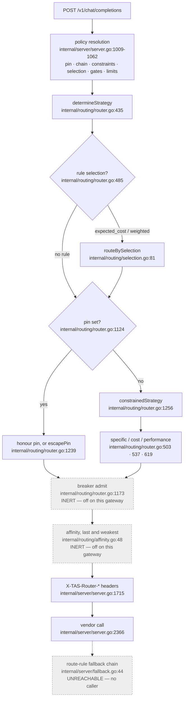

# Routing in the TAS LLM Router

> **Two commits, and how they relate.** Every line citation in this document is
> against `tas-llm-router@897e441`. Every live capture was taken on 2026-08-27
> from the deployed strict gateway `gateway.aiqg.tas.scharber.com` (deployment
> `llm-router-aiqg` in namespace `tas-llm-router`, image tag `aiqg-v5.86`), whose
> events stamp `gateway_version: 39e8d77`.
>
> Those are not the same commit, so the relationship was checked rather than
> assumed. `39e8d77` is an ancestor of `897e441`, and across the twelve commits
> between them `internal/routing/` is **byte-identical** — the routing package
> the captures exercised is the package cited here. `internal/server/server.go`
> does differ, by 173 lines, and the diff is entirely metrics instrumentation: a
> Prometheus registry, a metrics middleware wrapper, and token-and-cost
> observation calls. No routing symbol is added, removed, or altered. So the
> behaviour described holds for the deployed build, while `server.go` **line
> numbers** are `897e441` positions and sit up to roughly 120 lines away from the
> same code in the deployed build's source.
>
> Where a behaviour is read from source rather than observed, the text says so.

## Why this exists

You send this gateway a chat completion with a `model` field. Something then
decides which vendor account, which credential, and which endpoint will see your
prompt. That decision is routing, and it is not a lookup table.

Six things can move it: the model name itself, a policy rule your tenant
administrator wrote, the health of each vendor, a passive circuit breaker, a
per-conversation cache preference, and a fallback chain. Most of those live
outside your request, so a request that ran yesterday can be routed differently
today with no change on your side. The outcome is reported in a response header
you have to know to look for.

Not all six are live on the deployed gateway, and the gap between what is built
and what currently decides anything is wide enough to waste a working day. The
section "What is actually deciding anything today" is the inventory; read it
before configuring anything.

The consequences are not academic. Routing decides what you are billed, how long
you wait, and — the part that matters to a compliance owner — which vendor
receives your prompt text. A tenant that has declared a vendor forbidden needs to
know that the declaration binds at request time, not only when a rule was
written. This document explains the decision so you can predict it, and so you
can reconstruct it afterwards from what the gateway hands back.

## Mental model

**The router selects a vendor. It never calls one.**

That single sentence explains most of what is otherwise confusing here.
`Route()` (`internal/routing/router.go:139`) takes your request, returns a
provider handle plus a metadata record, and then it is finished. It never sees
the vendor's response, never learns whether the call succeeded, and never
retries. Everything after selection belongs to the completion handler in
`internal/server/`.

Two consequences follow directly, and they are the two you will meet first.

The first is that this gateway has **two distinct failure surfaces at two
distinct prices**. A selection failure is HTTP 503 with the message
`Routing failed: ...` (`internal/server/server.go:1291`). It happens before any
vendor is dialled, so nothing was billed and nothing left the cluster. An
execution failure is HTTP 500 with `Completion failed: ...`
(`internal/server/server.go:1796`), and by the time you see it one or more vendor
calls have already been made and paid for. Reading the status code tells you
which side of that line you are on.

The second is that **the router picks a vendor, not a model**. Your `model`
string is carried through unchanged and handed to whichever vendor was selected.
Nothing downstream re-checks that the two agree. The only thing that normally
keeps them in step is the cost table: a vendor that has no price for your model
name cannot be costed, and an uncostable vendor is dropped from the candidate
set. That coupling is indirect, and the places where it breaks are where the
surprises live.

The inputs are ordered, and the order is deliberate. Reading downward, each layer
may override the one above it:



The two greyed hops and the dashed one are drawn because they are in the code and
because a per-tenant control can switch two of them on. As deployed today they do
not move any decision. The next section says which controls do.

The precedence is stated as a design rule in the source: tenant constraints
outrank health, health outranks an operator's pin, and a pin outranks affinity
(`internal/routing/affinity.go:38-47`). Affinity is deliberately last because it
is an economic preference, and letting an economic preference defeat a
compliance control would be the wrong failure.

What routing does **not** own: it does not translate wire formats, does not scan
content, does not hold your vendor keys, and does not decide whether a response
is cached. Those are separate stages in the same handler.

## What is actually deciding anything today

More of this subsystem is built than is live. Before you spend an afternoon
configuring a control, check it here. Three groups, by who can change it.

"Evidence" says how the row was established. *Observed* means a request was sent
through `gateway.aiqg.tas.scharber.com` on 2026-08-27 and the outcome was read
from the response, the log, or the event. *Source* means it was read from the code
at `897e441` and no live traffic exercised it. That distinction earns its place
here: this same document found four configuration knobs that parse cleanly,
validate at startup, and change nothing, so "the code says so" is weaker evidence
than it looks.

**"Scope" is the column to read before you generalise.** *Gateway* means the row
holds for every caller — it follows from the deployed model table or from code
with no tenant input. *Tenant* means it was observed on one tenant, and that
tenant has a route rule supplying a selection strategy, which every capture in
this document shows in its routing reason. Your tenant may have no rule, a
different rule, or different vendor constraints, in which case a *Tenant* row
describes that tenant and not yours. Treating those rows as gateway behaviour is
the mistake this column exists to prevent.

Two terms are used from here on and are worth fixing now.

A **candidate** is a registered vendor still in contention at some step: healthy,
permitted by your tenant's constraints, able to support the features your request
needs, and — once pricing runs — able to price the model you named. Selection
ranks candidates; the filters decide who is one.

A **workflow** is the second key, alongside the model, on every measurement this
subsystem consults. You set it with the `TAS-Workflow` request header, and it
accepts a closed set of six values: `single_turn_qa`, `rag`, `agentic`,
`summarization`, `code_generation`, and `classification_extraction`
(`internal/middleware/aiqg_headers.go:126-133`). A value outside that set is
**discarded silently** — no error, no warning, and the header is treated as
absent, so `TAS-Workflow: qa` is the same as sending nothing. When you send
nothing the gateway classifies the request from its shape
(`internal/workflow/classifier.go:22`) and records that on the event as
`workflow_inferred`, but routing's measurement lookups read the header only
(`internal/server/server.go:1058`). That is why the walkthrough below reports
`(no workflow)` while its own event says `single_turn_qa`.

**Controls you set on your tenant or your request**

| Control | Effect today | Scope | Evidence |
|---|---|---|---|
| `model` in the request body | Selects the vendor whenever exactly one vendor advertises the name | Gateway | Observed |
| `optimize_for` in the body | Never reaches a decision. Every name in the deployed table is served by exactly one vendor, so the strategy is always `specific`, which is chosen before `optimize_for` is consulted; an unknown name fails at selection instead. A rule selection pre-empts it as well | Gateway | Source (reasoning); Observed (ignored, on a rule-carrying tenant) |
| `retry_config` / `fallback_config` in the body | The only failover that runs. See "The fallback that does work" | Gateway | Observed |
| `TAS-Conversation-Id` header | No effect — affinity is off gateway-wide, and the recording step is unreachable in code | Gateway | Observed |
| `TAS-Workflow` header | Chooses which verbosity and quality row is looked up. Accepts six values only; anything else is silently discarded | Gateway | Observed |
| Rule pin (`provider_override`) | Overrides the strategy; escapes to the chain or the strategy when unusable | Tenant | Source |
| Tenant vendor constraints | Refuse a denied vendor at request time; fail the request when nothing is permitted | Tenant | Source |
| Rule fallback chain | Does not run — the walk has no reachable caller, for any tenant | Gateway | Observed (absent) |
| Rule selection `expected_cost` | Runs and abstains, picking what the price table would have picked. Whether it runs at all depends on your rule; that it abstains depends on the measurement floor, which is gateway-wide | Tenant (runs) / Gateway (abstains) | Observed |
| Rule selection `weighted` | Splits traffic by relative weights, hashing the conversation identity so a conversation stays put. Whether configuring it changes anything is untested | Tenant | Source |
| Rule quality gates | Remove candidates below an efficacy floor or above an assurance severity, before pricing, and yield rather than empty the set. Whether configuring them changes anything is untested | Tenant | Source |
| Rule context / output limits | Do not run — same unreachable branch as the chain, for any tenant | Gateway | Observed (absent) |

**Gateway configuration, which only an operator can change**

| Setting | Effect today | Evidence |
|---|---|---|
| `router.default_strategy` (`LLM_ROUTER_DEFAULT_STRATEGY`) | None. Validated at startup, never read | Source |
| `router.max_cost_threshold` and body `max_cost` | None. Parsed onto the request, read by nothing | Source |
| `router.default_retry` / `router.default_fallback` | None. Never applied; only body-level config engages retry | Source |
| `FEATURE_ADVANCED_ROUTING`, `FEATURE_CIRCUIT_BREAKER` | None. Present in the ConfigMap, absent from the source | Source |
| `AIQG_BREAKER_ENABLED` | Unset, so no vendor is ever ejected unless a tenant control enables it. Outcomes are still recorded, which is bookkeeping, not protection | Observed |
| `AIQG_AFFINITY_ENABLED` | Unset, so affinity is off unless a tenant control enables it | Observed |
| `HEALTH_CHECK_INTERVAL` (30s) | Active. Drives the probe that can make a vendor uncandidatable | Observed |

**Facts about the code that no configuration can change**

| Fact | Consequence | Evidence |
|---|---|---|
| `completeWithFallback` has no reachable caller | The rule chain, pre-flight context check, tenant output cap, and served-affinity recording all never run | Source (call graph) confirmed by Observed: an over-window prompt that the pre-flight check would have caught was forwarded to the vendor and returned 200 |
| `round_robin` is unreachable | Nothing can select it; it is not an option | Source. `determineStrategy` returns only the other three and no other caller sets it; no configuration path reaches the constant |
| Vendor adapters refuse to price unknown models | An unrecognised model name fails at selection with 503 rather than routing anywhere | Observed, twice |
| A chain tier replaces the model as well as the vendor | Were the chain live, your response could name a model you did not send | Source |
| Nothing re-checks that vendor and model agree | A pin without a model, or a body-level fallback, can send your model name to the wrong vendor | Observed for body-level fallback; Source for the pin |
| Streaming never retries | `retry_config` is not consulted on the streaming path, and no vendor outcome is recorded there | Source |

The rest of this document explains each of these. If you read only the table,
the two rows that will cost you time are the unreachable chain and the abstaining
`expected_cost`.

## How it works end to end

A completion arrives at `handleChatCompletion`
(`internal/server/server.go:979`). All three completion surfaces — the OpenAI
chat surface, `/v1/messages`, and `/v1/responses` — translate their bodies and
then call this one function (`internal/server/anthropic_messages.go:509` and
`internal/server/responses_api.go:339`), so everything below applies identically
to all three.

Before routing runs, the handler resolves your tenant's policy onto the request
context (`internal/server/server.go:1009-1062`): a provider pin, per-request
resilience overrides, tenant feature controls, context and output limits, quality
gates, a selection strategy with its hysteresis settings — the margin an
alternative must beat before a switch is allowed — and its measured verbosity
table, and a fallback chain with the tenant's vendor constraints. These ride the
context rather than the request body on purpose — the request body is serialised
toward a vendor, and routing metadata must never end up in a vendor payload
(`internal/routing/pin.go:12-15`).

That policy comes from a synchronous call to the dashboard backend, and it
happens **twice** per request. The first resolution runs at receipt, before the
model is known. The second runs at routing time, once the model and the inferred
workflow are available, so that rules targeting a model or a workflow can match
at all (`internal/server/server.go:1001`,
`internal/middleware/aiqg.go:779`). Both calls carry a two-second timeout
(`pkg/aiqg/policy/policy.go:167`), and the second one **fails silently**: on any
error it returns and leaves the receipt-time resolution in place
(`internal/middleware/aiqg.go:795-797`). A slow or unreachable policy backend
therefore does not error your request — it quietly drops every model-targeted
rule, and your request routes as though you had configured nothing.

Then `Route()` runs, in this order.

**Strategy.** `determineStrategy` (`internal/routing/router.go:435`) returns
`specific` when the model name identifies a vendor, otherwise it maps the
optional `optimize_for` field to `cost_optimized` or `performance`, defaulting to
`cost_optimized`.

**Rule selection can pre-empt all of that.** `routeByStrategy` consults
`routeBySelection` first (`internal/routing/router.go:485`), and if a matched
route rule asked for `expected_cost` or `weighted`, that rule decides and the
strategy computed a moment earlier is never used. This is observable: sending
`"optimize_for": "performance"` on the deployed gateway produced a routing reason
of `expected_cost abstained`, meaning the rule ran and the request's own
preference was ignored.

**The pin.** `routeWithPin` (`internal/routing/router.go:1124`) honours a
rule-supplied provider unless the tenant's constraints deny it, it is not
configured on this gateway, or it is unhealthy. On any of those,
`escapePin` (`internal/routing/router.go:1239`) enters the fallback chain at
tier 1 if one exists, and otherwise falls through to the configured strategy —
recording the reason either way, so a pin that was not honoured is visible rather
than inferred.

**The breaker — inert as deployed.** `admitOrReselect`
(`internal/routing/router.go:1173`) would ask passive outlier detection whether
the chosen target may receive this request, and reselect if not; if nothing else
were available it would proceed anyway and say so
(`internal/routing/router.go:1214-1218`), because ejection exists to shift traffic
and with nowhere to shift it refusing every request is worse. On this gateway the
first line of that function returns immediately: `breakerEnabled` folds the tenant
control over the gateway default, and the default is off
(`internal/routing/router.go:782-785`). No request is currently reselected or
denied by it.

**Affinity — inert as deployed.** `applyAffinity`
(`internal/routing/affinity.go:48`) would prefer the vendor holding a warm prompt
cache for this conversation, unless a pin named someone else or the affine vendor
were unhealthy. It is off by the same mechanism, and the step that would record a
target for it to prefer is on the unreachable branch described below.

### What the `model` field actually does

`isSpecificProviderRequested` (`internal/routing/router.go:454`) counts how many
registered vendors advertise the name you sent and returns true only when the
count is exactly one (`internal/routing/router.go:464`). On the deployed gateway
the model table comes from the compiled-in defaults
(`internal/config/config.go:441-500`), because the deployment's ConfigMap carries
no model list. That gives six names across two vendors with no overlap:

| Name | Vendor | Input per 1k | Output per 1k | Context window |
|---|---|---|---|---|
| `gpt-4o` | openai | $0.005 | $0.015 | 128,000 |
| `gpt-4o-mini` | openai | $0.00015 | $0.0006 | 128,000 |
| `gpt-3.5-turbo` | openai | $0.0015 | $0.002 | 16,385 |
| `claude-opus-4-6` | anthropic | $0.015 | $0.075 | 1,000,000 |
| `claude-sonnet-4-6` | anthropic | $0.003 | $0.015 | 1,000,000 |
| `claude-haiku-4-5-20251001` | anthropic | $0.0008 | $0.004 | 200,000 |

You do not have to take that table on trust, and you should not — it is compiled
in, so it changes with a deployment rather than with a config edit you can see.
`GET /v1/models` reports what the running gateway actually advertises, and its
`owned_by` field is the vendor mapping this whole section is about. It needs no
authentication, so it works before you have a token:

```bash
curl -sS https://gateway.aiqg.tas.scharber.com/v1/models
{"object":"list","data":[{"id":"claude-haiku-4-5-20251001","object":"model","created":0,"owned_by":"anthropic"},{"id":"claude-opus-4-6","object":"model","created":0,"owned_by":"anthropic"},{"id":"claude-sonnet-4-6","object":"model","created":0,"owned_by":"anthropic"},{"id":"gpt-3.5-turbo","object":"model","created":0,"owned_by":"openai"},{"id":"gpt-4o","object":"model","created":0,"owned_by":"openai"},{"id":"gpt-4o-mini","object":"model","created":0,"owned_by":"openai"}]}
```

If a name is absent from that list, sending it produces the 503 described below.
If two entries share an `id` with different owners, you are in the multi-vendor
case. The endpoint is built from the same capability matrix routing uses
(`internal/server/server.go:2606`), so it cannot drift from the router's view.

So for these six names, `model` does pin the vendor. If that vendor is unhealthy,
`routeToSpecificProvider` returns an error rather than substituting
(`internal/routing/router.go:512-514`) — you get a 503, never a silent swap to a
different vendor's model.

Three cases behave differently, and they are worth knowing precisely.

**A name no vendor advertises.** The match count is zero, so the strategy becomes
cost-optimised, and `routeByCost` (`internal/routing/router.go:537`) asks every
candidate to price the request. Both vendor adapters refuse to price a model they
do not know (`internal/providers/openai/provider.go:245`,
`internal/providers/anthropic/provider.go:306`), so the candidate list empties and
routing fails with `could not estimate costs for any provider`
(`internal/routing/router.go:576`). A typo therefore produces a loud 503 before
any vendor is contacted — confirmed live, twice, below in Failure modes. This
contradicts the design note that anticipated a silent fall-through to the
cheapest vendor; the cost estimator's refusal to price unknown models closes that
hole as a side effect.

If a selection rule is in play — as it is for the tenant used throughout this
document — the same thing happens one step earlier and arrives at the same place.
`expected_cost` prices each candidate, skips every one that has no price
(`internal/routing/expected_cost.go:171`), finds the surviving set empty, and
declines to handle the request at all
(`internal/routing/selection.go:139-141`). Declining returns control to the
strategy switch, which runs cost routing, which fails for the reason above. So
the 503 captures in Failure modes almost certainly took the longer path; the
error text is identical either way, which is why the path is invisible from
outside.

**A name two vendors advertise.** The match count is two, so the model no longer
identifies a vendor and cost routing chooses between them on price. Your `model`
string is unchanged and goes to whichever is cheaper. With the shipped table this
cannot happen, because no name is listed twice — but an operator who adds an
alias to both vendor lists creates exactly this, and nothing warns them.

**A name one vendor advertises, when a rule selects `expected_cost`.** The rule
pre-empts the specific strategy, prices every eligible candidate for your model
name, and skips any candidate with no price (`internal/routing/expected_cost.go:115-117`,
and `internal/routing/expected_cost.go:171` skips unpriced candidates). The
surviving candidate is the vendor that advertises the model, so the outcome
matches the specific strategy — reached by a different route, and reported with a
different reason.

### When a pin and your model name disagree

This is the collision the mental model warns about, and it has a definite answer.
A rule's routing target carries a provider and, optionally, a model
(`internal/server/server.go:1008-1013`). When the target names **both**, your
`model` is overwritten before routing begins and the two agree by construction —
your response comes back with a model you did not send, which the
`X-TAS-Router-Model` header reports.

When the target names **only a provider**, nothing rewrites your model. The pin
selects that vendor, your model string travels unchanged, and the vendor is asked
for a model it does not serve. Nothing between the pin and the vendor call
compares them: the pin path builds its decision from the provider name alone
(`internal/routing/router.go:1152-1160`) and never consults the model except to
price it. The result is a vendor rejection surfacing as
`500 Completion failed: ...` with that vendor's own not-found wording inside — a
paid failure, on the 500 side of the line, rather than the 503 an unknown model
produces when no pin is involved.

The practical consequence: if your tenant has a provider pin, treat the `model`
field as advisory and confirm with `X-TAS-Router-Provider` and
`X-TAS-Router-Model` what actually ran. This behaviour is read from source — no
pinned rule was available to exercise, and the reason that matters is set out in
"What is actually deciding anything today".

### The strategies, including one you cannot reach

`cost_optimized` prices every healthy, feature-compatible candidate and takes the
cheapest (`internal/routing/router.go:580-585`). `performance` takes the lowest
estimated latency (`internal/routing/router.go:631-639`), where the estimate is
the last active health-probe round trip (`internal/routing/router.go:982-990`) —
not observed completion latency, and for the OpenAI adapter the probe is a model
listing (`internal/providers/openai/provider.go:276`), which says little about
how fast completions are.

`round_robin` is defined (`internal/routing/router.go:59`) and implemented
(`internal/routing/router.go:670`), and nothing can select it: `determineStrategy`
returns only the other three, and no other caller sets it. It is unreachable
configuration, not an option.

### expected_cost, and the fact that it abstains

`expected_cost` exists because the default cost estimate prices output at
`max_tokens` — the ceiling — defaulting to 100 when unset, while output is most
of the bill (`internal/routing/expected_cost.go:13-21`). It replaces that ceiling
with a measured mean output length per model and workflow, capped by `max_tokens`
because a truncated answer is still an answer you paid for
(`internal/routing/expected_cost.go:135-137`).

A measurement may steer routing only when it is not stale and has at least 100
samples (`aether-shared/go-aiqg-resilience/selection.go:209`,
`aether-shared/go-aiqg-resilience/selection.go:216-221`). The comment above that
constant records that when it was measured on 2026-08-21 against 30 days of
events, exactly one model-and-workflow pair cleared it.

When no measurement qualifies, the code refuses to pretend. It prices at
`max_tokens` as before and stamps
`expected_cost abstained: no usable measurements; priced at max_tokens as before`
onto the decision (`internal/routing/selection.go:151`). Every completion this
document captured on 2026-08-27 carried that string. So on the deployed gateway,
today, `expected_cost` is running and is not changing any decision: it selects the
same vendor the price table would have selected, and reports honestly that it did
not measure anything. Treat it as instrumented but not yet deciding.

The same honesty applies to `weighted` (`internal/routing/weighted.go:36`), which
splits traffic by relative weights. It hashes a stability key rather than drawing
a random number, so the same conversation lands on the same vendor every turn and
a 90/10 canary means 10% of conversations rather than a 10% chance per request.
No weighted decision was observed on this gateway; the behaviour above is read
from source.

### Quality gates, which filter rather than trade

If a rule declares quality floors, `gateCandidates`
(`internal/routing/signals.go:82`) removes candidates that fall below them
*before* selection prices anything. The ordering is the design: a quality term
inside a cost function can always be bought past by a large enough price
advantage, whereas a floor cannot (`internal/routing/signals.go:13-31`). One
carve-out matters to you: the gate never returns an empty set. If every candidate
fails, it yields, serves the request, and records that it yielded
(`internal/routing/signals.go:109-111`) — a quality control that takes the service
down is a worse outcome than the one it prevents.

### Affinity, dwell, and switching — why it stays put

Three separate mechanisms produce the answer "it stayed where it was", and they
are easy to confuse.

**Affinity** keeps a conversation on the vendor whose prompt cache is warm. It
needs a conversation identity, taken from the `TAS-Conversation-Id` header or a
W3C baggage session id (`internal/server/affinity.go:96-103`); single-shot traffic
with neither has no identity and affinity does not engage.

**Switching hysteresis** governs `expected_cost`. `ShouldSwitch`
(`internal/routing/switching.go:69`) refuses a move unless the improvement clears
a threshold, defaulting to 25%, raised by a further 15 points when the current
vendor holds a warm cache that the move would discard
(`aether-shared/go-aiqg-resilience/selection.go:117-119`,
`internal/routing/switching.go:98-101`). The refusal names the warm cache
explicitly, because an operator who set 25% and watched a 30% improvement get
refused would otherwise conclude the router was broken
(`internal/routing/switching.go:122-131`).

**Dwell** is a time floor on top of that: after a switch, no further switch for
the configured window (`internal/routing/switching.go:111-118`), with the last
switch time held in shared Redis so replicas cannot each switch once inside the
same window (`internal/routing/dwell.go:12-16`). If Redis is unreachable the store
fails open and reports no record (`internal/routing/dwell.go:40-42`) — losing
dwell costs some flapping, whereas blocking every switch would freeze routing
during a cache outage.

### The fallback chain, and where it currently stops

A chain is an ordered list of vendor-and-model tiers. Two properties matter to
you. First, a tier replaces **both** the vendor and the model
(`internal/server/fallback.go:154-155`) — carrying your model name forward would
reproduce the failure that reached the chain, so tier 2 answers with tier 2's
model, and your response will name a model you did not ask for. Second, the chain
is walked by the completion handler rather than by the router
(`internal/server/fallback.go:16-21`), because only the caller knows whether an
attempt actually failed.

That walk lives in `completeWithFallback` (`internal/server/fallback.go:44`), and
on the deployed gateway it does not execute. `handleChatCompletion` dispatches to
`handleNonStreamingCompletionWithRetry` (`internal/server/server.go:1323`), which
calls `attemptCompletionWithRetryAndFallback`
(`internal/server/server.go:2366`) — a separate, older path driven by the
client-supplied `retry_config` and `fallback_config` body fields.
`completeWithFallback` has exactly one caller,
`handleNonStreamingCompletion` (`internal/server/server.go:1666`), which in turn
has one caller inside `handleStreamingCompletion`
(`internal/server/server.go:1744`) — and `handleStreamingCompletion` has no
callers at all. The whole branch is unreachable.

Four behaviours ride on that branch and therefore do not run today: the
route-rule fallback chain, the pre-flight context-window check
(`internal/server/fallback.go:61`), the tenant output cap
(`internal/server/fallback.go:71`), and the recording of the served vendor that
makes affinity stick on the next turn (`internal/server/fallback.go:78`). This
was confirmed live, not only read: a 70,000-character prompt sent to
`gpt-3.5-turbo` estimates as 17,500 tokens against that model's 16,385-token
window, which `CheckLimits` (`internal/routing/limits.go:96`) would have flagged;
the gateway returned HTTP 200 having sent the request to OpenAI unchanged.
Passive outlier detection still *records* outcomes on the live path
(`internal/server/server.go:2435`), so that data is not lost — but recording
without ejection changes no routing decision. Do not count it as a safeguard.

### The fallback that does work

The live path is driven by two optional body fields that predate route rules.
They are TAS extensions to the vendor request shape, decoded directly on
`/v1/chat/completions` and carried through the translators on `/v1/messages` and
`/v1/responses` (`internal/server/tas_extensions.go:5-20`), so they are settable
from a stock SDK through its extra-body mechanism.

| Field | Type | Default when omitted | What it does |
|---|---|---|---|
| `retry_config.max_attempts` | integer | 1 (no retry) | Total vendor calls to the selected vendor. Values below 1 are raised to 1 |
| `retry_config.backoff_type` | `"exponential"` or `"linear"` | exponential | Exponential is `base_delay × 2^n`; linear is `base_delay × (n+1)` |
| `retry_config.base_delay` | Go duration in nanoseconds | 0 | Starting delay. A zero delay retries immediately |
| `retry_config.max_delay` | Go duration in nanoseconds | 0 (uncapped) | Ceiling on the computed delay |
| `retry_config.retryable_errors` | array of strings | see below | Substrings matched against the error text |
| `fallback_config.enabled` | boolean | false | Try another vendor after the retries are exhausted |
| `fallback_config.preferred_chain` | array of vendor names | — | **Ignored on this path** |
| `fallback_config.max_cost_increase` | number | — | **Ignored on this path** |
| `fallback_config.require_same_features` | boolean | — | **Ignored on this path** |

Four properties of this path will decide whether it is any use to you.

**There is no upper bound on `max_attempts`.** The type comment says 1–5
(`internal/types/requests.go:202`), and the code clamps only the lower end
(`internal/server/server.go:2406-2410`). A request asking for 50 attempts gets 50.

**Retryability is substring matching on the error text.** With
`retryable_errors` omitted, an error is retried when its text contains `timeout`,
`connection`, `unavailable`, or `rate limit`
(`internal/server/server.go:2544-2551`). Supplying your own list replaces those
four entirely. This is textual, not status-code based, so it is only as stable as
the wording each vendor SDK produces.

**The fallback ignores the three fields that shape it.**
`getFallbackProviders` (`internal/server/server.go:2563`) returns every registered
vendor except the one that failed. It reads none of `preferred_chain`,
`max_cost_increase`, or `require_same_features` — its own comment calls it a
simplified implementation that ought to use the router's chain logic.

**Your model name is not rewritten for the new vendor.** The fallback re-attempts
with the request untouched (`internal/server/server.go:2474`). With the shipped
model table, where no name is served by both vendors, the second vendor is
therefore always asked for a model it does not have. Cross-vendor fallback cannot
succeed on this gateway as configured. Observed:

```bash
curl -sS -k -w '\nHTTP %{http_code}\n' https://gateway.aiqg.tas.scharber.com/v1/chat/completions \
  -H 'Content-Type: application/json' -H "TAS-Auth: $AIQG_TEST_TAS_AUTH_TOKEN" \
  -H 'Authorization: Bearer placeholder' -H 'TAS-Cache: no-store' \
  -d '{"model":"gpt-3.5-turbo","messages":[{"role":"user","content":"hi"}],
       "max_tokens":999999,"fallback_config":{"enabled":true}}'
{"error":{"code":500,"message":"Completion failed: all fallback providers failed","type":"api_error"},"timestamp":1787805761}
HTTP 500
```

The oversized `max_tokens` forces OpenAI to reject the request; the gateway then
tried Anthropic with the model name `gpt-3.5-turbo` and failed there too. Its two
log lines, from Loki, show the attempt and the give-up:

```json
{"fallback_provider":"anthropic","level":"info","msg":"Trying fallback provider","time":"2026-08-27T04:42:41Z"}
{"error":"all fallback providers failed","level":"error","msg":"All completion attempts failed","provider":"openai","time":"2026-08-27T04:42:41Z"}
```

The `Request routed` line for that request also shows what an unbounded
`max_tokens` does to the estimate: `"cost":1.9999980000000002`, which is
999,999 output tokens at `gpt-3.5-turbo` prices. The estimate is used to rank
candidates, and no threshold anywhere rejects it.

So the usable configuration is same-vendor retry: set `retry_config`, leave
`fallback_config` off, and treat cross-vendor failover as unavailable until the
rule chain is wired up. Here is that configuration as a request that runs.

The one detail worth getting right first is the delay format. `base_delay` and
`max_delay` are Go durations, which encode over JSON as **integer nanoseconds**.
A duration string is a hard rejection at the decoder, before any routing happens:

```bash
curl -sS -k https://gateway.aiqg.tas.scharber.com/v1/chat/completions \
  -H 'Content-Type: application/json' -H "TAS-Auth: $AIQG_TEST_TAS_AUTH_TOKEN" \
  -H 'Authorization: Bearer placeholder' \
  -d '{"model":"claude-haiku-4-5-20251001","messages":[{"role":"user","content":"hi"}],
       "max_tokens":4,"retry_config":{"max_attempts":2,"base_delay":"1s"}}'
{"error":{"code":400,"message":"Invalid JSON: json: cannot unmarshal string into Go struct field RetryConfig.retry_config.base_delay of type time.Duration","type":"api_error"},"timestamp":1787810455}
```

With integers it is accepted. Three attempts, one second of base delay doubling
each time, capped at eight seconds:

```bash
curl -sS -k -D - https://gateway.aiqg.tas.scharber.com/v1/chat/completions \
  -H 'Content-Type: application/json' -H "TAS-Auth: $AIQG_TEST_TAS_AUTH_TOKEN" \
  -H 'Authorization: Bearer placeholder' -H 'TAS-Cache: no-store' \
  -d '{"model":"claude-haiku-4-5-20251001",
       "messages":[{"role":"user","content":"Reply with the single word: routed"}],
       "max_tokens":8,
       "retry_config":{"max_attempts":3,"backoff_type":"exponential",
                       "base_delay":1000000000,"max_delay":8000000000,
                       "retryable_errors":["connection","unavailable"]}}'

HTTP/2 200
x-tas-router-attempt-count: 1
x-tas-router-estimated-cost: 0.0000384
x-tas-router-model: claude-haiku-4-5-20251001
x-tas-router-provider: anthropic
x-tas-router-request-id: chatcmpl-1787810466389825962
```

`1000000000` is one second and `8000000000` is eight. The delays are computed as
`base_delay × 2^n` and capped, so this retries after 1s and 2s. The explicit
`retryable_errors` list is the one from the double-billing note above; omitting
the field entirely would restore the default four, `timeout` included. Note
`x-tas-router-attempt-count: 1` on a request that succeeded first time — and see
the next section for why that number would still read `1` if it had not.

### Retry safety, and what you cannot know from here

If you are writing retry logic around this gateway, four gaps matter, and none of
them has a workaround inside the product today.

**There is no idempotency key.** No request header, body field, or context value
in the request path carries one, and no de-duplication exists on any surface. A
retry — yours or the gateway's — is a second billable generation, not a replay of
the first. The exact-match response cache is the nearest thing, and it is a cache
rather than a guarantee: it is keyed on request content, skipped for
non-deterministic requests by default, and bypassable with `TAS-Cache`.

**Which makes the shipped default retryable list a double-billing default.** Put
the two previous facts together: `timeout` is one of the four substrings retried
when you do not supply your own list, and a timeout is precisely the failure where
the vendor most likely *did* generate and bill the completion and only the
response was lost. With no idempotency key, retrying it buys a second generation
at full price and there is no mechanism anywhere that could collapse the two. If
you set `retry_config` at all, the safest list is an explicit one that omits
`timeout` — `"retryable_errors": ["connection", "unavailable"]` retries the
failures where the request demonstrably did not reach the model, and leaves
timeouts to a decision you make with your own visibility into what the first
attempt returned.

**`X-TAS-Router-Attempt-Count` does not count vendor calls on this path.** It is
set from the router's own metadata, whose retry loop runs inside selection
(`internal/routing/router.go:228-296`) and returns on the first healthy candidate.
The loop that makes repeat vendor calls
(`internal/server/server.go:2403`) never updates it. A request retried three times
against one vendor still reports `1`. Treat the header as "did selection retry",
not "how many generations you paid for".

**A vendor rate-limit or authentication rejection has no distinct handling.**
Neither status nor `Retry-After` is passed through: the completion path has one
error exit and it is 500, so a vendor 429 reaches you as a 500 with the vendor's
message inside. Whether it is retried depends entirely on you having sent
`retry_config` — without one there is a single attempt — and the default
retryable list contains `rate limit`, so a 429 is retried while an
authentication rejection, matching none of the four default substrings, is not.
Both arrive looking identical from the outside, so you have to read the message
text to tell a throttle from a bad key.

**Streaming never retries, and records nothing.** A streaming request is served by
`handleStreamingCompletionWithRetry` (`internal/server/server.go:2314`) despite the
name: it calls `attemptStreamingWithFallback`, whose own comment says "no
mid-stream retry" (`internal/server/server.go:2384`). Your `retry_config` is not
consulted on that path at any point, and unlike the non-streaming path it makes no
`RecordOutcome` call, so a streaming failure contributes nothing even to the
bookkeeping. A streaming failure before the first byte returns a **third** error
string, `500 Streaming failed: ...` (`internal/server/server.go:2322`); a failure
after the stream has opened cannot change the status code at all, because the 200
was already written. If you need retry on streaming, it has to be yours.

**A failure response carries no timing and no routing detail.** The
`router_metadata` block — and with it `processing_time`, the estimate, and the
reasoning — appears only on a successful response. Every 500 and 503 captured for
this document returned an error object and a timestamp and nothing else. The
paired event is where `end_to_end_ms` and `vendor_ttfb_ms` live.

> [!UNVERIFIED] Whether this is a regression or a staged rollout is not recorded.
> The chain landed in `626060d` ("walk the fallback chain; provider_override
> becomes a real pin"), and no commit message, code comment, or issue found at
> `897e441` explains why the retry-variant handlers were left calling the older
> path. Confirm with the service owner before relying on a configured chain.

## Worked walkthrough

One request, followed hop by hop with the values it actually produced. Sent on
2026-08-27 through the strict gateway with a real tenant token. `TAS-Cache:
no-store` bypasses the response cache so the routing path runs rather than a
cached answer being replayed.

**Getting a token of your own.** Every authenticated example here needs a
`TAS-Auth` value beginning `tas_qg_live_`, and it is self-serve rather than
something to request from an operator. In the AI Quality Gateway dashboard it is
the Tokens page (`/tokens`, surfaced as a setup step at
`aiqg-dashboard-be/internal/handlers/next_steps.go:83`). The same thing over the
API is `POST /api/v1/account/tokens` against `https://api.aiqg.tas.scharber.com`,
authenticated with your own Keycloak session rather than with a gateway token;
your tenant is taken from that session, so there is no tenant field to supply. It
answers 201 and returns the plaintext token **once**
(`aiqg-dashboard-be/internal/handlers/tokens.go:106`) — after that only its
identifier is retrievable, so store it when you create it. `GET` on the same path
lists what you hold, and a delete against `/api/v1/account/tokens/:id` revokes one
(`aiqg-dashboard-be/internal/handlers/tokens.go:31-33`). Unauthenticated, that
host answers 401.

The captures below read their token from a shell variable populated from an
operator secret file on this machine; the value appears nowhere in this document,
and yours will differ.

```bash
curl -sS -k -D - https://gateway.aiqg.tas.scharber.com/v1/chat/completions \
  -H 'Content-Type: application/json' \
  -H "TAS-Auth: $AIQG_TEST_TAS_AUTH_TOKEN" \
  -H 'Authorization: Bearer placeholder' \
  -H 'TAS-Cache: no-store' \
  -d '{"model":"claude-haiku-4-5-20251001",
       "messages":[{"role":"user","content":"Reply with the single word: routed"}],
       "max_tokens":8}'

HTTP/2 200
tas-response-event-id: 028c66fe-0a19-4d47-b52c-7f1e380905e1
x-request-id: 269b6122ce4c8eaf7276fb2051c4754e
x-tas-router-attempt-count: 1
x-tas-router-estimated-cost: 0.0000384
x-tas-router-model: claude-haiku-4-5-20251001
x-tas-router-provider: anthropic
x-tas-router-request-id: chatcmpl-1787804565840781885
x-tas-scan-status: clean
```

`Authorization: Bearer placeholder` is not a redaction. The strict ingress
requires the header to be present but ignores its value for vendor
authentication; the vendor key is resolved separately, and this request used the
shared gateway credential (`credential_source: tas_shared` on the event).

**Hop 1 — policy resolution** (`internal/server/server.go:1009-1062`). The tenant
resolved to `a689c0b2-02ca-46d1-9916-f9a30c00222a`, the workflow classified as
`single_turn_qa`, and a rule attached a selection block. No pin, no chain, no
gates were visible in the outcome. Read from the event and the routing reasons;
the rule's own contents were not inspected.

**Hop 2 — strategy** (`internal/routing/router.go:435`). Exactly one vendor
advertises `claude-haiku-4-5-20251001`, so `determineStrategy` returned
`specific`. That value reached the log line and nothing else.

**Hop 3 — the rule pre-empts it** (`internal/routing/router.go:485`). Because a
selection block was present, `routeBySelection` handled the request and the
`specific` strategy was discarded.

**Hop 4 — pricing** (`internal/routing/selection.go:120`). Input tokens are
estimated as characters over four (`internal/routing/selection.go:187`): the
34-character prompt gives 8 tokens. No verbosity measurement cleared the
100-sample floor, so expected output fell back to `max_tokens`, which is 8. At
haiku's prices that is 8/1000 × $0.0008 + 8/1000 × $0.004 = **$0.0000384**, which
is exactly the `x-tas-router-estimated-cost` header above. OpenAI was priced too
and returned no price for this model name, so it was skipped as unpriced
(`internal/routing/expected_cost.go:171`).

**Hop 5 — hysteresis, skipped** (`internal/routing/selection.go:159`). Switching
is evaluated only when the proposal differs from the vendor that owns the
requested model. It did not, so nothing was compared and dwell was not consulted.

**Hop 6 — breaker and affinity, both inert.** Neither `AIQG_BREAKER_ENABLED` nor
`AIQG_AFFINITY_ENABLED` is set on the running pod, and both default to false
(`internal/config/config.go:703`, `internal/config/config.go:723` read the
environment only when non-empty). A per-tenant control can still enable either;
this tenant did not. No affinity line appeared in the reasoning, and a two-turn
test sharing one `TAS-Conversation-Id` moved freely between vendors.

**Hop 7 — the answer.** The response body carries the decision in full:

```json
"router_metadata": {
  "provider": "anthropic",
  "model": "claude-haiku-4-5-20251001",
  "routing_reason": [
    "expected_cost abstained: no usable measurements; priced at max_tokens as before",
    "no usable verbosity measurement for claude-haiku-4-5-20251001/(no workflow); priced at max_tokens as before"
  ],
  "estimated_cost": 0.0000384,
  "processing_time": 18406,
  "request_id": "chatcmpl-1787804565840781885",
  "attempt_count": 1,
  "fallback_used": false
}
```

The `(no workflow)` in the second line is the verbosity lookup's own view: the
table is keyed on the `TAS-Workflow` header, which this request did not send,
even though the event separately records an inferred workflow of
`single_turn_qa`. Actual usage came back as 15 prompt tokens and 5 completion
tokens against the estimate of 8 and 8 — the estimator is deliberately crude,
and it is used to compare candidates, not to bill you.

## Why did my request go there?

Three surfaces answer this, and they disagree about how much they tell you.

**The response headers** are the fastest answer and the only one a client library
can act on. They are set before the body is written so they work for streaming
too (`internal/server/server.go:1715`), and they are listed in
`Access-Control-Expose-Headers` so browser clients can read them
(`internal/server/server.go:952`).

| Header | Meaning | Set when |
|---|---|---|
| `X-TAS-Router-Provider` | The vendor that served it | provider name is non-empty |
| `X-TAS-Router-Model` | The model actually sent upstream | model is non-empty |
| `X-TAS-Router-Request-Id` | The gateway's own request id | request id is non-empty |
| `X-TAS-Router-Attempt-Count` | Attempts made; 1 means no retry | always |
| `X-TAS-Router-Fallback-Used` | Present and `true` only after a fallback | fallback occurred |
| `X-TAS-Router-Estimated-Cost` | Pre-flight estimate in dollars, not the bill | estimate is above zero |

Two of these are absent rather than false when nothing happened:
`X-TAS-Router-Fallback-Used` is omitted on a normal request, and
`X-TAS-Router-Estimated-Cost` is omitted when the estimate is zero. Treat absence
as the negative case rather than as an error.

**The `router_metadata` block** in a non-streaming response body is the only place
the *reasoning* appears (`internal/types/responses.go:84`). Each layer that
influenced the decision appends a sentence: which strategy ran, whether a pin was
honoured, whether the breaker moved you, whether affinity held, why a switch was
refused. This is the surface to read when the vendor name alone does not explain
what happened. Streaming responses do not carry it — the headers are all a
streaming client gets, by design, because the synthetic first chunk that used to
carry this broke strict SDK stream parsers (`internal/server/server.go:1709-1713`).
The live streaming handler sets those headers from the same helper before writing
the status line (`internal/server/server.go:2337`), so they are as reliable there
as on a normal response; it is only the reasoning that is lost.

**So log `router_metadata` on your side — this is the single most useful thing in
this document.** It is the only surface anywhere that carries the reasoning. It
exists only in the body of the originating response, nothing persists it, and it
is absent from streaming responses and from every error response. If you do not
capture it at the moment you receive it, "why did that request route there" has no
answer afterwards: the event tells you where the request went and not why, and the
log line carries no identifier you could attribute it with. Store it next to your
own request id together with the `tas-response-event-id` header, which is the
value that later joins your record to the platform's. The rest of this section is
what you can still do when you did not.

**The service log and the event** both record the decision, and both omit the
reasoning. The log line looks like this in Loki:

```json
{"attempts":1,"cost":0.0000384,"duration_ms":0,"fallback_used":false,
 "level":"info","msg":"Request routed","provider":"anthropic",
 "strategy":"specific","time":"2026-08-27T04:22:45Z"}
```

Read the `strategy` field with care. It is the value `determineStrategy` computed
(`internal/routing/router.go:159`, logged at `internal/routing/router.go:217`),
not the strategy that decided. The line above belongs to the walkthrough request
that was actually routed by `expected_cost`, and it reports `specific`. When the
two disagree, `router_metadata.routing_reason` is right and the log is stale.
`duration_ms: 0` is genuine — selection is in-memory and finishes inside a
millisecond.

The paired AI Quality Gateway (AIQG) events carry `vendor`, `model`, `workflow`,
token accounting, and cost, but no routing reason, no strategy, and no candidate
list. So an operator reconstructing a routing decision from Loki alone can see
*where* a request went and not *why*. Query them like this — the `query=` name is
required, and omitting it makes the whole call fail rather than silently ignoring
the filter:

```bash
curl -sS -k -G 'https://loki.tas.scharber.com/loki/api/v1/query_range' \
  --data-urlencode 'query={namespace="tas-llm-router"} |= "aiqg response event"' \
  --data-urlencode 'limit=1' --data-urlencode 'since=1h' \
  | jq -r '.data.result[0].values[0][1] | fromjson | {ce_id, vendor, model, http_status, workflow}'
{
  "ce_id": "2a435834-4a4b-4a72-8b4f-30d92f4a593c",
  "vendor": "openai",
  "model": "gpt-3.5-turbo",
  "http_status": 500,
  "workflow": "single_turn_qa"
}
```

One label to distrust: a routing failure is recorded on the event as
`"status":"vendor_error"` even though no vendor was involved. The 503 captured
below produced an event with `http_status: 503`, `status: vendor_error`,
`end_to_end_ms: 4`, and no `vendor` field at all. The missing `vendor` is the
tell.

### Correlating one request across the three surfaces

The walkthrough response carried two identifiers besides the router's own. This
is what each one reaches, and what it does not.

| Identifier | Where it appears again | Notes |
|---|---|---|
| `tas-response-event-id` | `ce_id` and `response_event_id` on the response event | The direct handle on the event pair |
| `x-request-id` | `client_request_id` on the **request** event only | Follow `request_event_id` from there to the response event |
| `X-TAS-Router-Request-Id` | Nowhere | The `chatcmpl-…` id is internal to the response body |
| `Request routed` log line | Nothing | Carries no identifier of any kind |

Searching Loki for a client request id lands on the request event, which names
its partner:

```bash
curl -sS -k -G 'https://loki.tas.scharber.com/loki/api/v1/query_range' \
  --data-urlencode 'query={namespace="tas-llm-router"} |= "269b6122ce4c8eaf7276fb2051c4754e"' \
  --data-urlencode 'limit=1' --data-urlencode 'since=6h' \
  | jq -r '.data.result[0].values[0][1] | fromjson | {ce_type, request_event_id, model, vendor}'
{
  "ce_type": "com.tas.aiqg.request.v1",
  "request_event_id": "5c14934b-6e28-447c-956e-64c1d4b199cd",
  "model": "claude-haiku-4-5-20251001",
  "vendor": "anthropic"
}
```

That gives you `request_event_id`, and one more query closes the chain onto the
response event, which is where vendor, model, status and actual cost live:

```bash
curl -sS -k -G 'https://loki.tas.scharber.com/loki/api/v1/query_range' \
  --data-urlencode 'query={namespace="tas-llm-router"} |= "5c14934b-6e28-447c-956e-64c1d4b199cd" |= "response event"' \
  --data-urlencode 'limit=1' --data-urlencode 'since=12h' \
  | jq -r '.data.result[0].values[0][1] | fromjson | {ce_type, ce_id, vendor, model, http_status, actual_cost_usd}'
{
  "ce_type": "com.tas.aiqg.response.v1",
  "ce_id": "028c66fe-0a19-4d47-b52c-7f1e380905e1",
  "vendor": "anthropic",
  "model": "claude-haiku-4-5-20251001",
  "http_status": 200,
  "actual_cost_usd": 0.000032000000000000005
}
```

The second `|=` filter is what separates the pair: the request event's identifier
appears in both members, so without it the query can return either one.

**Whether you can run these at all is a network question, not a permissions one.**
The Loki ingress carries no authentication of any kind — checked on the live
cluster, its ingress has no auth annotations — so anyone who can reach the host
can read every tenant's events. It resolves to a private address on the cluster's
own network, so from outside that network it is unreachable rather than forbidden,
and a tenant user on the public internet has no path to it. If you are inside and
these queries work, treat what you can see as broader than your own traffic. If
you are outside, the response body is your only record, which is the point of the
next paragraph.

Searching for `X-TAS-Router-Request-Id` returns nothing; the same search for
`chatcmpl-1787804565840781885` had no hits over six hours while its event pair
was plainly present. The `Request routed` log line is the sharpest limitation:
it records the decision but nothing that ties it to a request, so with concurrent
traffic you cannot say which line belongs to which call.

The dashboard's traffic detail is the other place worth knowing about, with a
caveat. The administrator guide states that it "shows the routing reason on each
request" (`tas-aiqg/AIQG_POLICY_ROUTING_ADMIN_GUIDE.md:230`). The string
`routing_reason` does not appear anywhere in the dashboard backend or its
frontend, and the event schema has no field to carry it, so that claim cannot
currently hold. Expect the traffic detail to show vendor, model, cost, and
timing — the event fields — and not the reasoning.

### Finding out which rule is on your tenant

Every explanation above eventually points at "a route rule matched", and the rule
is not visible from any response the gateway returns. The routing reason names the
strategy a rule selected but never the rule, its matcher, or its priority.

Rules live in the dashboard, not in this gateway. In the product they are at
Governance → Policies → Routing, which also holds runtime controls and vendor
constraints (`tas-aiqg/AIQG_POLICY_ROUTING_ADMIN_GUIDE.md:222`). The backing
listing is `GET /route-rules` on the dashboard backend
(`aiqg-dashboard-be/internal/handlers/policies.go:98`), scoped to your tenant.
Matching is lowest priority number first, first match wins, and no match falls
through to the default bundle.

If you do not have dashboard access, this is a genuine dead end from the gateway
side, and the useful thing to ask for is specific rather than general: which route
rule matches my model and workflow, what selection strategy does it set, does it
pin a provider or a model, and does it declare vendor constraints. Those four
answers plus `router_metadata.routing_reason` account for every decision this
document describes.

## Design rationale

This section explains why the subsystem is shaped as it is, and it describes
design intent rather than current behaviour — several mechanisms argued for below
are switched off on this gateway, as the inventory records. Read it to understand
the ordering you would get if everything were enabled, not as a statement that
everything is.

The precedence order is the central decision, and the source argues for it
directly. Affinity is consulted last and given the weakest voice because it is an
economic optimisation, and the ordering comment
(`internal/routing/affinity.go:38-47`) spells out the failure it prevents: a warm
cache on a denied vendor is a compliance breach, and a warm cache on an ejected
vendor is worthless. Folding affinity into selection would have made it
negotiable against price, so it was kept outside as a post-pass that yields to
everything above it.

Tenant constraints bind at request time rather than only at write time
(`internal/routing/router.go:1132-1138`). Rules are validated when saved, but a
constraint can be tightened afterwards, and the moment a tenant declares a vendor
forbidden, traffic must stop reaching it — including through rules written before
the declaration. Enforcing only at write time would have left every pre-existing
rule as a standing exception, which is the one thing a compliance control cannot
have. This is also why a denied vendor with no permitted alternative fails the
request outright (`internal/routing/router.go:1274-1278`), while an ejected vendor
with no alternative is used anyway: a constraint says *never*, whereas an ejection
says *not right now*.

Whether a rule's `provider_override` is a hard pin or a preference was an open
question in the design note, and the shipped answer is a compromise stated in
`internal/routing/router.go:1221-1238`: a pin whose only sanctioned escape is the
fallback chain, plus a temporary fall-through to the configured strategy when no
chain exists. Failing outright would have turned a momentary vendor blip into a
tenant outage for every rule that had not yet adopted failover — punishing
operators for not having taken up a feature that had shipped minutes earlier. The
comment says the branch should narrow to nothing as chains become normal and can
then be made an error.

Quality is enforced as a floor rather than a term in the cost function
(`internal/routing/signals.go:13-31`). A weighted term can always be bought past
by a large enough price advantage; a lexicographic filter cannot, so there is
never a dollar-versus-quality trade to argue about. The same file explains why
gates read efficacy and assurance directly rather than a composite score: a model
scoring perfectly on every quality dimension lands at 67 composite, so routing on
the composite would let a dashboard weighting change silently re-route production
traffic.

Hysteresis shipped in the same change as `expected_cost` rather than after it,
and `internal/routing/switching.go:12-39` shows the arithmetic behind that.
Anthropic prices a cache write at 1.25× base input and a read at 0.10×, so
abandoning a warm prefix costs a one-off 1.15 × input-price × prefix tokens — at
a measured 3,324-token prefix, $0.00306 against a cached request costing
$0.000486. A 5% per-request saving needs 126 further requests to break even. A
router free to chase 5% every minute never reaches request 126; it pays the write
repeatedly while reporting a saving on each individual decision. Shipping the
cheaper-vendor chooser without the brake would have shipped that machine.

## Trade-offs and alternatives

**Abstention over a plausible number.** `expected_cost` could have fallen back to
the `max_tokens` guess and still reported itself as measured. It does not
(`internal/routing/expected_cost.go:36-40`): an operator who believes a
measurement-driven strategy is running has no reason to investigate, so a router
that silently reverts to the behaviour it was meant to replace is worse than one
that never shipped. The cost of that honesty is what this document had to report
above — a headline capability that is live and is currently changing nothing.

**A yielding quality gate.** Gates never empty the candidate set
(`internal/routing/signals.go:109-111`). The accepted risk is that under a broad
enough quality collapse the gate stops guarding; the rejected alternative was
returning an error, which converts a possible quality problem into a certain
outage. Constraints deliberately do not yield, because they are rules about what
is permitted rather than judgements about past behaviour.

**Deliberately crude token estimation.** Input is approximated as characters over
four in two places (`internal/routing/selection.go:187`,
`internal/routing/limits.go:39-45`). For pricing, input is a small share of the
bill and a better estimate would refine the term that barely matters. For limits,
a request close enough to the boundary for estimator error to matter is caught by
the vendor anyway. The visible cost is that estimates and actuals diverge — the
walkthrough estimated 8 input tokens where the vendor counted 15.

**Chain walking in the caller, not the router.** Keeping `Route()` free of the
attempt loop keeps selection pure and testable, at the price of a second place
where routing decisions are made and, as shipped, a second place that can be left
unwired — which is exactly what happened.

**Configuration that looks live and is not.** Four knobs read as routing controls
and change nothing. `router.default_strategy` is parsed and validated at startup
(`internal/config/config.go:935`) and never consulted, because
`determineStrategy` hard-codes cost optimisation as its default
(`internal/routing/router.go:448`). `router.max_cost_threshold` and a request's
`max_cost` field are parsed onto the request
(`internal/server/tas_extensions.go:31`) and read by nothing. `router.default_retry`
and `router.default_fallback` are never applied to a request, so retry and
fallback engage only when a client sends `retry_config` or `fallback_config` in
the body. The deployment's ConfigMap also sets `FEATURE_ADVANCED_ROUTING` and
`FEATURE_CIRCUIT_BREAKER`, neither of which appears anywhere in the source.

## Failure modes

**Routing failed: could not estimate costs for any provider.** HTTP 503. The
model name matched no registered vendor, so cost routing had no candidate it
could price. Confirmed live on 2026-08-27, both for a deliberate typo and for
`claude-3-5-sonnet-20241022` — a real Anthropic model that this gateway does not
list:

```bash
curl -sS -k -w '\nHTTP %{http_code}\n' https://gateway.aiqg.tas.scharber.com/v1/chat/completions \
  -H 'Content-Type: application/json' -H "TAS-Auth: $AIQG_TEST_TAS_AUTH_TOKEN" \
  -H 'Authorization: Bearer placeholder' \
  -d '{"model":"claude-3-5-sonnet-20241022","messages":[{"role":"user","content":"hi"}],"max_tokens":8}'
{"error":{"code":503,"message":"Routing failed: could not estimate costs for any provider","type":"api_error"},"timestamp":1787804593}
HTTP 503
```

Fix: send one of the six names in the table above, or have the model added to the
gateway's table. Confirm by re-sending and reading `X-TAS-Router-Provider`.
Nothing was billed — the event for this request shows `end_to_end_ms: 4` and no
`vendor` field.

**Routing failed: provider <name> is not healthy.** HTTP 503. Your model
identifies one vendor and the active probe has that vendor marked unhealthy
(`internal/routing/router.go:513`). The router will not substitute a different
vendor's model. The upstream cause appears in Loki as a probe failure carrying the
vendor's own words:

```json
{"error":"anthropic health check failed: POST \"https://api.anthropic.com/v1/messages\": 529  {\"type\":\"error\",\"error\":{\"type\":\"overloaded_error\",\"message\":\"Overloaded\"}}",
 "level":"warning","msg":"Health check failed for anthropic","time":"2026-08-25T15:01:40Z"}
```

Fix on your side: retry, or send a model served by the other vendor. Probes run
every 30 seconds (`internal/routing/router.go:71`), so recovery is visible within
one interval at `https://gateway.aiqg.tas.scharber.com/health`, which lists each
vendor's status and last probe latency.

**Routing failed: no healthy providers available.** HTTP 503. No vendor passed
the health filter (`internal/routing/router.go:540`). With ejection off, the only
way to reach this is for the active probe to have failed against every vendor at
once — the ejection half of that filter cannot currently contribute. No
occurrences in the last 14 days of Loki for this namespace; the string is quoted
from source.

**Completion failed: ...** HTTP 500. Selection succeeded and the vendor call did
not (`internal/server/server.go:1796`). The vendor's own message is wrapped
inside, so read past the prefix — and read it carefully, because this one status
covers two cases with opposite economics. A rejection the model produced
(a refused request, a content filter, an oversized `max_tokens`) or a timeout
after generation began may well have been billed. A failure that never reached
the model — name resolution, a refused connection, a transport-level error —
was not billed, and retrying it is free. The completion path has a single error
exit, so nothing in the status code or the response shape separates them; the
message text is the only signal, which is why the paired event's
`vendor_ttfb_ms` is worth checking before assuming you paid. Note
that a health probe passing does not mean completions work: the OpenAI probe is a
model listing (`internal/providers/openai/provider.go:276`), which says nothing
about whether generation succeeds. Passive outlier detection was built as the
second, independent input that closes that gap — and it is switched off here, so
the gap is open. A vendor whose completions are failing while its probe passes
stays a candidate indefinitely, and every request to it fails at your expense.
Handle that with your own `retry_config` and your own vendor-level backoff; there
is no ejection behind you.

**A configured fallback chain never engages.** No error text; the symptom is that
`X-TAS-Router-Fallback-Used` never appears and a failure returns 500 rather than
advancing a tier. Cause: the chain walk is unreachable on the deployed handler
path, as traced above under "The fallback chain". No workaround exists from the
client side; a client-supplied `fallback_config` in the request body reaches a
different, older code path (`internal/server/server.go:2458`) that does not honour
the rule's tier list.

**Your route rules stop applying, with no error.** No error text; the symptom is
a request routed as though no rule existed, and a `routing_reason` that names a
strategy you did not configure. Cause: the routing-time policy resolution failed
or timed out and was discarded silently (`internal/middleware/aiqg.go:795-797`),
so only the receipt-time resolution — made before the model was known — survives.
Confirm by checking whether the dashboard backend is answering:
`kubectl get deploy aiqg-dashboard-be -n aiqg`. This path has no dedicated log
line, so a resolve failure is invisible in Loki.

**Affinity never holds across turns.** No error text; the symptom is a
conversation that does not stay on one vendor despite `TAS-Conversation-Id` being
sent. Two independent causes: affinity is off by default on this gateway, and the
recording of the served vendor sits on the same unreachable branch as the chain
(`internal/server/fallback.go:78`), so even switching it on would leave nothing
for the next turn to stick to.

The test that established this needs its own sentence, because it looks at first
like a counter-example to the vendor guarantee above. Two turns shared one
conversation id and deliberately named **different** models — `gpt-4o-mini` on
turn one, `claude-haiku-4-5-20251001` on turn two — and were served by openai then
anthropic. Each turn went to the vendor that advertises the model it named, which
is the guarantee working exactly as described. Affinity's effect is visible only
when it *disagrees* with the strategy, so naming two models is the only way to
test it: had affinity held, turn two would have been steered back to openai
carrying an Anthropic model name, which is the pin-versus-model collision
described earlier and would have failed at the vendor. It went to anthropic, so
affinity did not hold. Sending the same model name on both turns would have
proved nothing either way.

## Glossary

**Affinity** — a preference for the vendor holding a warm prompt cache for this
conversation. The weakest input to a routing decision.

**Assurance** — one of the two quality dimensions a gate can read. Not a score: it
is the worst content-scan finding severity observed for that model and workflow,
and a floor sets the highest severity still allowed
(`aether-shared/go-aiqg-resilience/signals.go:260-265`).

**Breaker (passive outlier detection)** — ejects a vendor whose real requests are
failing, independently of the active health probe. Off by default on this
gateway; a per-tenant control can enable it.

**Chain / tier** — an ordered failover plan. A tier names both a vendor and a
model, and reaching it replaces both.

**Composite** — a single blended quality number shown on dashboards. Deliberately
**not** used for gating: it renormalises over whichever dimensions were present,
so a model scoring perfectly on every dimension still lands at 67, and routing on
it would let a dashboard weighting change re-route production traffic.

**Constraint** — a tenant declaration that a vendor must never be used. Outranks
everything, and is checked at request time.

**Credential source** — which key paid for a request, recorded on the event.
`tas_shared` means the gateway's own vendor key; `stored` means a key your account
supplied and the gateway holds encrypted; `upstream_header` means you sent the
vendor key yourself on that request. Routing does not read it, but it explains
whose bill a routing decision lands on.

**Dwell** — the minimum time between two switches for one routing context, held
in shared Redis so all replicas agree.

**Efficacy** — the other quality dimension a gate can read: a 0–100 score for a
model and workflow, against which a rule sets a minimum
(`aether-shared/go-aiqg-resilience/signals.go:256-259`).

**Hysteresis** — resistance to changing a decision that is already made. Here it
means the extra margin an alternative vendor must beat before `expected_cost` is
allowed to move to it, so a small, temporary price advantage does not cause
constant switching.

**Pin** — a vendor named by a matched route rule. Preferred over the strategy,
escapable through the chain when it cannot be honoured.

**Route rule** — tenant policy resolved before routing, supplying any of: a pin,
a chain, constraints, a selection strategy, quality floors, and limits.

**Selection strategy** — how candidates are ranked: `cost_optimized`,
`performance`, `specific`, `expected_cost`, or `weighted`.

**Stability key** — the identity that weighted selection hashes and dwell keys on,
so both are deterministic per conversation rather than per request. It is the same
value affinity uses: the `TAS-Conversation-Id` header, or a W3C baggage session
id, or empty (`internal/server/affinity.go:96-103`). Empty means weighted
selection has nothing to be stable against.

**Strict gateway / Path A ingress** — the customer-facing deployment
(`llm-router-aiqg`, `AIQG_STRICT=true`), which rejects any request lacking both a
`TAS-Auth` token and an `Authorization` header. The `Authorization` value is
required to be present but is not used to authenticate to a vendor, which is why
the captures here send a literal placeholder in it. The non-strict deployment
(`llm-router`) lets internal callers through without either.

**Verbosity measurement** — the mean output length for a model and workflow,
usable by `expected_cost` only above 100 samples and when not stale.

**Workflow** — the second key, alongside the model, on every verbosity and quality
measurement. You may set it with the `TAS-Workflow` header, whose accepted values
are the closed set `single_turn_qa`, `rag`, `agentic`, `summarization`,
`code_generation`, and `classification_extraction`
(`internal/middleware/aiqg_headers.go:126-133`); a value outside that set is
discarded rather than rejected. When you send nothing, the gateway classifies the
request from its shape (`internal/workflow/classifier.go:22`) and records the
result as `workflow_inferred` on the event. The two are not interchangeable for
routing: the verbosity lookup reads the header only, which is why the walkthrough
reports `(no workflow)` while its event says `single_turn_qa`.

## Related

- [Developer guide](../dev/llm-router-api.md) — the wire contract, the full error
  set, and the telemetry surfaces.
- The dashboard, at Governance → Policies → Routing — the only place your
  tenant's route rules, runtime controls, and vendor constraints are visible or
  editable. Nothing in this gateway's responses names the rule that matched.
- [Operations guide](../ops/llm-router.md) — health signals, restarts, and
  credential rotation.
- [OpenAPI specification](../openapi.yaml) — the response headers described above
  are declared there.
- `aether-shared/data-models/aiqg/routing-decision.md` — the design proposal this
  subsystem was built from, still marked `status: proposed` and last updated
  2026-08-19. Most of its plan shipped, so read it as a record of intent rather
  than of behaviour. Two of its statements will mislead you directly: its
  execution order puts affinity first, where the code puts it last
  (`internal/routing/affinity.go:38-47`), and it lists provider pinning, ordered
  failover, enforcement, and context limits as unbuilt when all four have shipped.
- `aether-shared/data-models/aiqg/route-rule.md` — the rule schema, last updated
  2026-05-31 and still marked `status: planned`. It describes rules stored in
  Neo4j; they are stored in PostgreSQL. It also documents a `mode` field with a
  `dry_run` setting, which does not exist — a rule you create is live
  immediately, so there is no observation period to promote it from.

