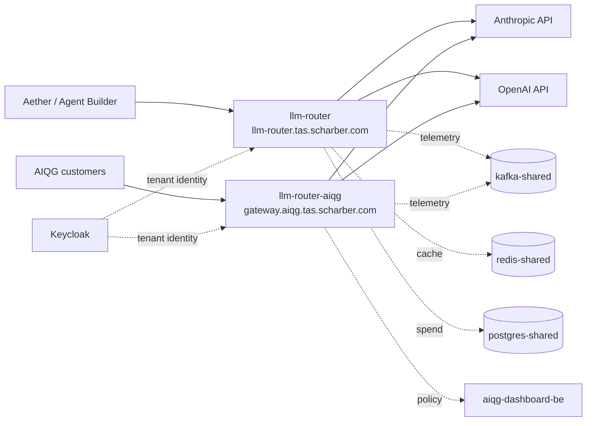

# LLM Router — Operations

> **Verified 2026-08-24 against `tas-llm-router@c211d31`.** All counts, image
> tags, and error signatures below are from that date. Re-verify before trusting
> any number here.

**Before you start:** everything below assumes your `kubectl` context points at
the TAS k3s cluster with read access to the `tas-llm-router` and `tas-shared`
namespaces, and that you can reach `*.tas.scharber.com` from where you are.
Confirm with `kubectl config current-context` and `kubectl get pods -n tas-llm-router`
before trusting any command here to be diagnosing the right thing.

## Why this exists

The LLM Router is the single egress path from TAS to commercial language-model
providers. Every call that Aether, the Agent Builder, and the AI Quality Gateway
(AIQG) make to Anthropic or OpenAI passes through it, so that credentials live in
one place, spend is attributed to a tenant, and prompts are scanned before they
leave the cluster.

When it is down, every feature that generates text stops: Aether chat, agent
execution, workflow steps that call a model, and AIQG scanning. Document upload,
search, vector indexing, and the graph database are unaffected — they do not
route through it. Users see request failures rather than degraded answers,
because the router **fails closed**: when it cannot complete the scan-and-route
path it rejects the request rather than forwarding an unscanned prompt to a
provider. There is no bypass mode to switch on.

There are **two independent deployments** in the `tas-llm-router` namespace, and
confusing them is the most common triage mistake. See the mental model below
before acting.

## Mental model



`llm-router` serves internal TAS traffic. `llm-router-aiqg` serves external AIQG
gateway customers. They are separate deployments, separate services, separate
ingress hosts, and they **run different image versions**:

| Deployment | Serves | Ingress host | Image tag (2026-08-24) | Replicas |
|---|---|---|---|---|
| `llm-router` | Internal TAS traffic | `llm-router.tas.scharber.com` | `aiqg-v5.75` | 2, fixed |
| `llm-router-aiqg` | External AIQG customers | `gateway.aiqg.tas.scharber.com` | `aiqg-v5.85` | 2, fixed |

Both tags carry the `aiqg-` prefix regardless of which deployment they run on —
that prefix is the image release line, not an indicator of which deployment it
belongs to. The tags are ordered, so `aiqg-v5.85` on `llm-router-aiqg` is
**ahead** of `aiqg-v5.75` on `llm-router`: the AIQG deployment receives releases
first and the internal deployment lags it. A fix present in one deployment is not necessarily present in the
other. There is no HorizontalPodAutoscaler; replica counts are fixed in the
deployment spec and nothing restores them automatically beyond the ReplicaSet.

What it owns: provider credentials, routing and fallback between providers,
retry policy, spend attribution, and prompt scanning. What it does **not** own:
the models themselves, the prompts (callers build those), tenant identity
(Keycloak), or the policy definitions (AIQG dashboard backend).

The sentence worth keeping: **both deployments are stateless request proxies —
losing a pod loses the requests in flight through it and nothing else.** Nothing
durable lives in the pod; there is no queue to drain and no local state to
recover, so restarting is cheap and is rarely the wrong move.

## How it works end to end

A caller sends a chat-completion request to the service on port 8086, reaching
it through one of the NGINX ingress hosts. The router authenticates the caller
via a `TAS-Auth` token, resolves which tenant the request belongs to, and selects
a provider from that tenant's priority list. Before the call leaves the cluster
it scans the prompt and records the decision.

It then calls the provider over the public internet. On a failure it retries
according to its retry policy and walks the fallback chain to the next provider
if one is configured. If every attempt fails, the caller receives an error —
the router does not return a partial or synthetic answer.

Throughout, it writes telemetry to `kafka-shared.tas-shared:9092`, uses
`redis-shared.tas-shared:6379` for response caching and for short-lived
request-correlation state, records spend in
`postgres-shared.tas-shared:5432/tas_shared`, and exports traces to
`otel-collector-shared.tas-shared:4317`. The AIQG deployment additionally
consults `aiqg-dashboard-be.aiqg.svc.cluster.local:8095` for policy.

The dependency that matters most at 3am is the **public internet egress** to
`api.anthropic.com` and `api.openai.com`. It is the least controlled hop in the
path and the source of every failure signature observed on the verification date.

## Health & signals

Triage in order. You have sixty seconds.

**1. Is it up, and are its providers reachable?**

```bash
curl -sS -k https://llm-router.tas.scharber.com/health
{"providers":{"anthropic":{"status":"healthy","response_time_ms":799,"last_checked":1787620250},"openai":{"status":"healthy","response_time_ms":683,"last_checked":1787620249}},"status":"healthy","timestamp":1787620265}
```

**Healthy looks like:** top-level `"status":"healthy"`, both providers
`"healthy"`, and `response_time_ms` in the high hundreds — 683ms and 799ms were
the observed values on the verification date. Treat sustained values above
roughly 3000ms, or either provider reporting anything other than `healthy`, as
degraded rather than down.

`-k` is required: the ingress certificate is issued by the internal
`tas-ca-issuer`, which is not in a laptop trust store. Without it curl returns
nothing and exit code 60. `-k` suppresses certificate validation only — it does
not mask an application error. **Every command output in this document is a real
capture taken on the verification date**, not an illustration — the curl bodies,
the pod listing, and the node resource figures alike. For the AIQG deployment use
`https://gateway.aiqg.tas.scharber.com/health`, which returns the same shape.

This endpoint reports **point-in-time** provider status. It is not a history —
see the second failure mode below before concluding that healthy means nothing
has been failing.

**2. Does a real request actually succeed?**

`/health` checks that the router can reach the providers. It does not prove a
caller can get an answer, because the credential path differs. This is the
confirmation step for the most severe failure mode, so run it before declaring
recovery:

```bash
curl -sS -k https://llm-router.tas.scharber.com/v1/chat/completions \
  -H "TAS-Auth: $TAS_TOKEN" -H "Content-Type: application/json" \
  -d '{"model":"claude-sonnet-4-6","messages":[{"role":"user","content":"ping"}],"max_tokens":8}'
{"id":"chatcmpl-...","object":"chat.completion","model":"claude-sonnet-4-6","choices":[{"index":0,"message":{"role":"assistant","content":"pong"},"finish_reason":"stop"}]}
```

A `TAS-Auth` token is required on every completion endpoint. Tokens live in
`aether-secrets`, a separate repository in the TAS monorepo holding secrets and
configuration — not in this repository and not in this document. You need a
token in hand before an incident; this check is unrunnable without one.

**3. Are the pods actually running?**

```bash
kubectl get pods -n tas-llm-router
NAME                               READY   STATUS    RESTARTS   AGE
llm-router-7c5987584b-knpcd        1/1     Running   0          7d18h
llm-router-7c5987584b-mw4zd        1/1     Running   0          7d18h
llm-router-aiqg-5478654975-72s8t   1/1     Running   0          46m
llm-router-aiqg-5478654975-7llbx   1/1     Running   0          45m
```

Two replicas each is the expected steady state. **Ready does not mean working
here** — both deployments use a `tcpSocket` probe on port 8086, not an HTTP
health check. A pod with invalid provider credentials passes its probe, reports
Ready, and serves traffic that fails at the provider. Never conclude from
`1/1 Running` that requests are succeeding; step 2 is what proves that.

**4. What is failing right now?**

```bash
curl -sS -k -G 'https://loki.tas.scharber.com/loki/api/v1/query_range' \
  --data-urlencode 'query={namespace="tas-llm-router"} | json | level="error"' \
  --data-urlencode 'limit=50'
{"status":"success","data":{"resultType":"streams","result":[...]}}
```

Do not use `kubectl logs` — each deployment runs two replicas and a single pod's
tail silently omits half the traffic. If the Loki ingress is unreachable, port-forward
instead: `kubectl port-forward -n tas-shared svc/loki-shared 3100:3100` and query
`http://localhost:3100`.

**Baseline error volume.** Provider health-check failures are constant background
noise on this cluster: 86 for OpenAI and 80 for Anthropic over 48 hours — 166
events, roughly 3–4 per hour combined — with no user-visible outage. A rate in
that range is normal. A step change — tens per minute, or errors that are not health-check
failures — is the signal.

**5. Is it this service or a dependency?** The distinguishing signal is *where*
the error text points. Errors naming `api.anthropic.com` or `api.openai.com` are
provider or egress problems and the router is behaving correctly by reporting
them. Errors naming `redis-shared`, `postgres-shared`, `kafka-shared`,
`aiqg-dashboard-be`, or Keycloak are TAS-internal dependency failures — see the
dependency table below. A pod that is `CrashLoopBackOff` or failing its probe is
the router itself.

**Metrics.** Scraping either metrics path **through the ingress returns one
random replica**, so counters appear to jump between values on consecutive curls
— each pod keeps its own. Prometheus is unaffected: it uses endpoint discovery
and scrapes all four pods individually. Seventeen series are exported under the
`llm_router_` prefix at `/metrics` on the same port 8086, including `llm_router_requests_total`,
`llm_router_errors_total`, `llm_router_provider_health`,
`llm_router_rate_limit_hits_total`, and `llm_router_cost_total`. Query them
through Prometheus at `prometheus-shared.tas-shared:9090` or Grafana.
>
> [!WARNING] **The `llm_router_*` family serves placeholder values, not live
> telemetry.** On 2026-08-24 these counters did not move across repeated scrapes,
> `llm_router_auth_attempts_total` read 1.43e9, and the real `invalid x-api-key`
> failures visible in Loki did not appear in `llm_router_errors_total` at all.
> Both scrape jobs report healthy, so monitoring looks green while carrying
> meaningless data — do not diagnose from these numbers, and do not build alerts
> on them (`rate()` over a static counter is 0 forever). The `aiqg_*` family on
> `/aiqg/metrics` is live and is what the new alerts use.

## Dependency failure effects

Which dependency failures look like the router failing, and what each one does.

| Dependency | Address | Effect when it fails |
|---|---|---|
| Anthropic / OpenAI | `api.anthropic.com`, `api.openai.com` | Completions fail with provider error text. The router is reporting correctly, not failing. Fallback moves to the next provider in the tenant's list if one is configured. |
| Keycloak | Cluster identity service | Tenant resolution and caller authentication. Symptom is unconfirmed — see the note below. |
| `redis-shared` | `redis-shared.tas-shared:6379` | Response cache and request-correlation state. Effect on request success is unconfirmed. |
| `postgres-shared` | `postgres-shared.tas-shared:5432` | Spend attribution. Effect on request success is unconfirmed. |
| `kafka-shared` | `kafka-shared.tas-shared:9092` | Telemetry and audit events. Effect on request success is unconfirmed. |
| `aiqg-dashboard-be` | `aiqg-dashboard-be.aiqg:8095` | Policy lookup for the AIQG deployment only. Effect on request success is unconfirmed. |

> [!UNVERIFIED] No internal-dependency failure was observed in the Loki window
> used to build this document, so no literal error text is available for any row
> marked unconfirmed, and whether each failure blocks a request or degrades
> silently was not determined. Do not assume "fails closed" extends to these —
> it is documented only for the scan-and-route path. Confirm with the service
> owner before relying on any of these rows during an incident.

## Common operations

### Restart a deployment

**Blast radius:** requests in flight through the restarting pod fail. With two
replicas and a rolling update the service stays up, but there is no connection
draining, so in-flight calls are dropped rather than completed.

```bash
kubectl rollout restart deploy/llm-router -n tas-llm-router
kubectl rollout status deploy/llm-router -n tas-llm-router --timeout=180s
deployment "llm-router" successfully rolled out
```

**Cost:** seconds of elevated error rate. This is the safe default action — the
service is stateless, so a restart cannot corrupt anything.

**Caveat for `llm-router-aiqg`:** its rolling update strategy is `maxSurge: 1,
maxUnavailable: 0` — Kubernetes must schedule one *additional* pod before
removing an old one, and is not permitted to drop below the desired replica
count while doing so. On this single-node cluster a restart therefore stalls
with the new pod `Pending` if the node lacks headroom. `llm-router` uses
`maxUnavailable: 25%`, which permits removing a pod first, and does not have
this constraint.

Check headroom before restarting the AIQG deployment:

```bash
kubectl describe node um773dev | grep -A8 "Allocated resources"
Allocated resources:
  (Total limits may be over 100 percent, i.e., overcommitted.)
  Resource           Requests       Limits
  --------           --------       ------
  cpu                14960m (93%)   33900m (211%)
  memory             27530Mi (92%)  66702Mi (223%)
```

**Those were the real figures on 2026-08-24: 93% of CPU and 92% of memory
already reserved by requests.** At that level there is very little room to
schedule an additional pod, so a `llm-router-aiqg` restart is at real risk of
stalling. Kubernetes assigns each pod a quality-of-service class from the resources it
declares, and that class decides which pods the kubelet evicts first when the
node runs short. `llm-router-aiqg` declares none, making it **BestEffort** — the
class evicted first, but also the class that reserves nothing. Because it
requests nothing it may still schedule — but any Burstable or Guaranteed pod competing for the same
window will not. Treat a stalled AIQG rollout as the expected outcome on a
loaded node, not as a broken image.

If a rollout stalls, run `kubectl get pods -n tas-llm-router` and look for
`Pending` before assuming the image is bad.

### Roll back

**Blast radius:** same as a restart, plus you revert whatever the current version
changed. The two deployments version independently — roll back only the one that
is failing, and confirm which one from the image table above.

```bash
kubectl rollout history deploy/llm-router-aiqg -n tas-llm-router
REVISION  CHANGE-CAUSE
kubectl rollout undo deploy/llm-router-aiqg -n tas-llm-router
deployment.apps/llm-router-aiqg rolled back
```

`CHANGE-CAUSE` is not populated on these deployments, so revision history does
not tell you what each revision contained. Identify the last known-good revision
from the image tag with
`kubectl rollout history deploy/llm-router-aiqg -n tas-llm-router --revision=N`.

### Scale

**Blast radius:** none when scaling up within available node capacity; scaling to
zero takes the service down entirely.

```bash
kubectl scale deploy/llm-router -n tas-llm-router --replicas=3
deployment.apps/llm-router scaled
```

Both deployments share one node (`um773dev`). Scaling up consumes the headroom
that rolling updates need — check allocated resources first, as above.

### Rotate provider credentials

**Blast radius:** every request using the rotated provider fails until pods pick
up the new value, across every tenant at once. There is no staged rollout.

Credentials come from the environment and are read at process start, so a
rollout restart is required after the secret changes. Secrets live in the
`aether-secrets` material, not in this repository and not in this document.
Confirm the rotation took effect with `/health` **and** the real-completion check
in step 2 of triage, not by reading the secret back.

> [!UNVERIFIED] The end-to-end rotation procedure — which secret object, which
> key, and who authorizes the change — is not documented here and was not
> confirmed. This is the highest-likelihood 3am page (see the standing issue
> below) and the gap is the most operationally significant one in this document.

## Failure modes

Sourced from Loki over the 48 hours preceding 2026-08-24. Four distinct error
signatures were observed. Alerting at the time covered only semantic-cache spend,
not availability (see escalation).

| Symptom | Literal error text | Cause | Fix | Confirm |
|---|---|---|---|---|
| Anthropic calls fail; callers see errors while pods look healthy | `anthropic api call failed: POST "https://api.anthropic.com/v1/messages": 401 Unauthorized ... {"type":"error","error":{"type":"authentication_error","message":"invalid x-api-key"}}` | Provider API key invalid, expired, or revoked | Rotate the Anthropic credential, then `kubectl rollout restart` the affected deployment | `/health` shows anthropic healthy **and** the real-completion check in triage step 2 succeeds |
| Errors in logs, but `/health` reports healthy | `openai health check failed: Get "https://api.openai.com/v1/models": read tcp 10.42.0.97:46304->162.159.140.245:443: read: connection reset by peer` | Transient egress reset to the provider. Observed 86 times for OpenAI and 80 for Anthropic in 48h without a corresponding outage | None if the rate stays near 3–4/hour — this is background noise on this cluster's egress | Rate is flat at baseline rather than climbing; `/health` still reports healthy |
| Every retry exhausted, caller gets a hard failure | `All completion attempts failed` (level `error`), preceded by `Completion attempt failed` (level `warning`, with `"attempt":1`) | The underlying provider error is not retryable. Observed 17 times in 48h, each paired one-to-one with an `Anthropic API call failed` — retries did not rescue a single one | Fix the underlying provider error; a 401 will never succeed on retry | The warning-level attempt lines stop appearing |
| Log lines missing for a pod that recently restarted | `failed to try resolving symlinks in path "/var/log/pods/tas-llm-router_llm-router-aiqg-...": lstat ...: no such file or directory` | Alloy, the log collector, chasing a path for a pod that no longer exists. **Not a router failure** | None — ignore | The message stops once collection settles after the rollout |

**Standing issue as of 2026-08-24:** 51 occurrences of `invalid x-api-key`
against Anthropic in the preceding 48 hours. This was an active credential
problem on that date, not a historical one. Confirm current state before
assuming it has been resolved.

**Not covered here:** rate limiting (`llm_router_rate_limit_hits_total` is
exported but no 429 signature was observed in the window), request timeouts, and
caller authentication failures. Absence from this table means not observed in a
48-hour window, not impossible.

## Escalation & ownership

**Owner:** John Scharber. This is a single-maintainer service; there is no
rotation and no second on-call.

> [!UNVERIFIED] No contact channel, response-time expectation, or fallback
> contact is recorded. At 3am this document cannot tell you how to reach the one
> person who can authorize a credential rotation — which is also the most likely
> reason you were paged. Fill this in before relying on this document for an
> out-of-hours incident.

> [!IMPORTANT] **Alerting covers cost, not availability.** As of 2026-08-24 the
> only alerts touching this service were `AIQGSemCacheJudgeBudgetExhausted` and
> `AIQGSemCacheJudgeBudgetNearCap` — both semantic-cache spend governance.
> Nothing paged on the service being down, on error rate, or on provider health,
> so every triage step in this document assumed you already knew something was
> wrong. Five availability and quality alerts were added on 2026-08-24 and are
> **live and evaluating** (`llm_router_availability` group in the
> `prometheus-shared-rules` ConfigMap): LLMRouterAllReplicasDown,
> LLMRouterReplicaDown, AIQGRequestTierDegraded, AIQGEventEmissionFailing,
> AIQGEmitLatencyHigh.
>
> **They still will not reach you.** Alertmanager routes every alert to
> `http://127.0.0.1:5001/`, the upstream example receiver. Nothing listens on
> that port in the alertmanager pod (it serves only 9093/9094, single container,
> no webhook sidecar), and the mail (SMTP) config points at `localhost:587` with a
> placeholder `tas.yourdomain.com` sender. Email and Slack receivers are present
> but commented out. A firing alert is therefore detected, grouped, and dropped.
> Configuring a real receiver is the remaining half of the production blocker —
> until then, detection exists and notification does not.
>
> This cluster runs Prometheus as a plain Deployment, **not** the Prometheus
> Operator. There is no `PrometheusRule` custom resource definition (CRD) — `kubectl get prometheusrules`
> returns "server doesn't have a resource type" regardless of what rules exist.
> Rules live in the `prometheus-shared-rules` ConfigMap in `tas-shared`. Check
> there, or query `/api/v1/rules` on `prometheus-shared:9090`.

**Escalate when** any of these hold:

- External AIQG customers are affected — `gateway.aiqg.tas.scharber.com` fails the real-completion check while `llm-router.tas.scharber.com` passes, or both fail
- Completions fail for more than 15 minutes and the cause is not a transient egress reset
- The failure needs one of the actions listed under "do not attempt alone"
- A rollout has stalled with pods `Pending` and scaling down is not an acceptable remedy

Internal-only failures with a known transient cause and a flat error rate do not
warrant an out-of-hours page.

**Attach when escalating:** the Loki query and the exact time window you used,
`kubectl get pods -n tas-llm-router -o wide` output, the image tag of the
affected deployment, whether the failure reproduces against both ingress hosts
or only one, and the result of the real-completion check.

**Do not attempt alone:** rotating provider credentials (it affects every tenant
at once and there is no staged rollout), and scaling either deployment beyond
three replicas on this single node.

## Limits & trade-offs

Both deployments run on one node, `um773dev`. There is no multi-node
redundancy — node loss takes down every replica of both deployments
simultaneously. Two replicas protect against pod-level failure only.

The two deployments have different Kubernetes quality-of-service classes, which
decides which pods the kubelet evicts first when the node runs short of memory.
`llm-router` declares resource requests (250m CPU / 512Mi) and limits (1 CPU /
2Gi), making it **Burstable**. `llm-router-aiqg` declares no resources at all,
making it **BestEffort** — the class the kubelet evicts *first* under node
pressure. This follows the TAS resource policy of defaulting to BestEffort until
a workload is profiled, but the consequence is that external gateway customers
are served by the least protected workload in the namespace.

No NetworkPolicy exists in this namespace, so any pod in the cluster can reach
port 8086 directly, bypassing the ingress and whatever the ingress enforces.

## Related

- Repository: `tas-llm-router`, OpenAPI specification at `docs/openapi.yaml`
- Port allocations: `aether-shared/services-and-ports.md`
- Public documentation ingress: `docs.air-ops.net`
- Grafana and Loki: `https://grafana.tas.scharber.com`, `https://loki.tas.scharber.com`
