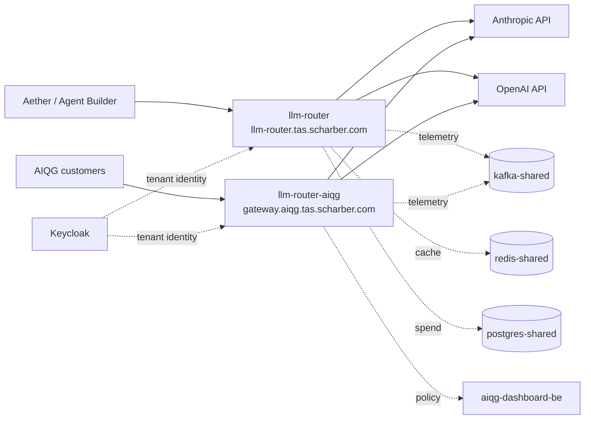

# LLM Router — Operations

> **Verified 2026-08-25 against `tas-llm-router@eee4b24`.** All counts, image
> tags, and error signatures below are from that date unless a line says
> otherwise. Re-verify before trusting any number here.
>
> **Read the metrics subsection under "Health & signals" before you look at a
> Grafana panel for this service.** The `llm_router_*` exporter was rewritten at
> `eee4b24`; the fix is merged but **not yet deployed**, and every historical
> value for those series is fabricated.

**Before you start:** everything below assumes your `kubectl` context points at
the TAS k3s cluster with read access to the `tas-llm-router` and `tas-shared`
namespaces, and that you can reach `*.tas.scharber.com` from where you are.
Confirm both before trusting any command here to be diagnosing the right thing:

```bash
kubectl config current-context
default
```

`default` is the expected value — that is the context name k3s installs, and it
is what this cluster reported on 2026-08-25. Anything else means you are pointed
at a different cluster and every command below will describe the wrong system.
Then confirm you can actually read the namespace with `kubectl get pods -n
tas-llm-router`, whose healthy output is in triage step 3.

## Why this exists

The LLM Router is the single egress path from TAS to commercial language-model
providers. Every call that Aether, the Agent Builder, and the AI Quality Gateway
(AIQG) make to Anthropic or OpenAI passes through it, so that credentials live in
one place, spend is attributed to a tenant, and prompts are scanned before they
leave the cluster.

When it is down, every feature that generates text stops: Aether chat, agent
execution, workflow steps that call a model, and AIQG scanning. Document upload,
search, vector indexing, and the graph database are unaffected — they do not
route through it. Users see request failures rather than degraded answers,
because the router **fails closed**: when it cannot complete the scan-and-route
path it rejects the request rather than forwarding an unscanned prompt to a
provider. There is no bypass mode to switch on.

There are **two independent deployments** in the `tas-llm-router` namespace, and
confusing them is the most common triage mistake. See the mental model below
before acting.

## Mental model



`llm-router` serves internal TAS traffic. `llm-router-aiqg` serves external AIQG
gateway customers. They are separate deployments, separate services, separate
ingress hosts, and they **run different image versions**:

| Deployment | Serves | Ingress host | Image tag (2026-08-25) | Replicas |
|---|---|---|---|---|
| `llm-router` | Internal TAS traffic | `llm-router.tas.scharber.com` | `aiqg-v5.75` | 2, fixed |
| `llm-router-aiqg` | External AIQG customers | `gateway.aiqg.tas.scharber.com` | `aiqg-v5.86` | 2, fixed |

Both tags carry the `aiqg-` prefix regardless of which deployment they run on —
that prefix is the image release line, not an indicator of which deployment it
belongs to. The tags are ordered, so `aiqg-v5.86` on `llm-router-aiqg` is
**ahead** of `aiqg-v5.75` on `llm-router`: the AIQG deployment receives releases
first and the internal deployment lags it. A fix present in one deployment is not necessarily present in the
other. There is no HorizontalPodAutoscaler; replica counts are fixed in the
deployment spec and nothing restores them automatically beyond the ReplicaSet.

What it owns: provider credentials, routing and fallback between providers,
retry policy, spend attribution, and prompt scanning. What it does **not** own:
the models themselves, the prompts (callers build those), tenant identity
(Keycloak), or the policy definitions (AIQG dashboard backend).

The sentence worth keeping: **both deployments are stateless request proxies —
losing a pod loses the requests in flight through it and nothing else.** Nothing
durable lives in the pod; there is no queue to drain and no local state to
recover, so restarting is cheap and is rarely the wrong move.

## How it works end to end

A caller sends a chat-completion request to the service on port 8086, reaching
it through one of the NGINX ingress hosts. The router authenticates the caller
via a `TAS-Auth` token, resolves which tenant the request belongs to, and selects
a provider from that tenant's priority list. Before the call leaves the cluster
it scans the prompt and records the decision.

It then calls the provider over the public internet. On a failure it retries
according to its retry policy and walks the fallback chain to the next provider
if one is configured. If every attempt fails, the caller receives an error —
the router does not return a partial or synthetic answer.

Throughout, it writes telemetry to `kafka-shared.tas-shared:9092`, uses
`redis-shared.tas-shared:6379` for response caching and for short-lived
request-correlation state, records spend in
`postgres-shared.tas-shared:5432/tas_shared`, and exports traces to
`otel-collector-shared.tas-shared:4317`. The AIQG deployment additionally
consults `aiqg-dashboard-be.aiqg.svc.cluster.local:8095` for policy.

The dependency that matters most at 3am is the **public internet egress** to
`api.anthropic.com` and `api.openai.com`. It is the least controlled hop in the
path and the source of every failure signature observed on the verification date.

## Health & signals

Triage in order. You have sixty seconds.

**1. Is it up, and are its providers reachable?**

```bash
curl -sS -k https://llm-router.tas.scharber.com/health
{"providers":{"anthropic":{"status":"healthy","response_time_ms":767,"last_checked":1787710958},"openai":{"status":"healthy","response_time_ms":583,"last_checked":1787710957}},"status":"healthy","timestamp":1787710962}
```

**Healthy looks like:** top-level `"status":"healthy"`, both providers
`"healthy"`, and `response_time_ms` in the high hundreds — 583ms and 767ms were
the observed values on the verification date. Treat sustained values above
roughly 3000ms, or either provider reporting anything other than `healthy`, as
degraded rather than down.

`-k` is required: the ingress certificate is issued by the internal
`tas-ca-issuer`, which is not in a laptop trust store. Without it curl returns
nothing and exit code 60. `-k` suppresses certificate validation only — it does
not mask an application error. For the AIQG deployment use
`https://gateway.aiqg.tas.scharber.com/health`, which returns the same shape.

**On the outputs in this document.** Every read-only command here was executed
against the live cluster on the verification date and its real output pasted —
the curl bodies, the pod and revision listings, the Loki and Prometheus
responses, and the node figures alike. Two conventions apply. Loki responses
carry a large `stats` object that says nothing an operator needs, so it appears
as `"stats":{...}` where it was cut; everything before it is verbatim. Long
listings are trimmed with a `...` line, and the trimmed rows are always more of
the same. The four commands that *change* something (restart, scale, roll back)
or that need a credential this document does not carry were **not** executed;
each is marked `<!-- unverified-example -->` in its code block and shows the
expected shape rather than an observed one. Nothing else here is an
illustration — if a value looks odd, it is odd because the system is.

This endpoint reports **point-in-time** provider status. It is not a history —
see the second failure mode below before concluding that healthy means nothing
has been failing.

**2. Does a real request actually succeed?**

`/health` checks that the router can reach the providers. It does not prove a
caller can get an answer, because the credential path differs. This is the
confirmation step for the most severe failure mode, so run it before declaring
recovery:

```bash
curl -sS -k https://llm-router.tas.scharber.com/v1/chat/completions \
  -H "TAS-Auth: $TAS_TOKEN" -H "Content-Type: application/json" \
  -d '{"model":"claude-sonnet-4-6","messages":[{"role":"user","content":"ping"}],"max_tokens":8}'
<!-- unverified-example --> not run: needs a TAS-Auth token. Expected shape:
{"id":"chatcmpl-...","object":"chat.completion","model":"claude-sonnet-4-6","choices":[{"index":0,"message":{"role":"assistant","content":"pong"},"finish_reason":"stop"}]}
```

A `TAS-Auth` token is required on every completion endpoint, and this check is
unrunnable without one. **Get a token before you need it** — the two places this
document tells you to use one are its own recovery-confirmation step and the
evidence you attach when escalating, so acquiring it mid-incident is the worst
time.

Where they live, by location only — never paste a token into a ticket, a chat
message, or this document:

| Location | What is there |
|---|---|
| Secret `llm-router-aiqg-tokens` in namespace `tas-llm-router`, key `aiqg-tokens.yaml` | The gateway's own token roster. Mounted into the pod at `/app/secrets/aiqg/aiqg-tokens.yaml` via `AIQG_TOKENS_FILE`. This is the authoritative list of what the running gateway will accept. |
| The `aether-secrets` repository | The source of record the cluster secret is populated from, and where a token is provisioned or rotated. |

Reading the cluster secret requires `get secret` in `tas-llm-router`, which is a
higher privilege than the rest of this document assumes. If you do not have it,
that is an escalation — ask the owner for a token rather than working around the
gap, and note in the ticket that you could not run the real-completion check.

**3. Are the pods actually running?**

```bash
kubectl get pods -n tas-llm-router
NAME                               READY   STATUS    RESTARTS   AGE
llm-router-7c5987584b-knpcd        1/1     Running   0          8d
llm-router-7c5987584b-mw4zd        1/1     Running   0          8d
llm-router-aiqg-77c574cc9b-l9xhn   1/1     Running   0          20h
llm-router-aiqg-77c574cc9b-pxv5k   1/1     Running   0          20h
```

Two replicas each is the expected steady state. **Ready does not mean working
here** — both deployments use a `tcpSocket` probe on port 8086, not an HTTP
health check. A pod with invalid provider credentials passes its probe, reports
Ready, and serves traffic that fails at the provider. Never conclude from
`1/1 Running` that requests are succeeding; step 2 is what proves that.

**4. What is failing right now?**

```bash
curl -sS -k -G 'https://loki.tas.scharber.com/loki/api/v1/query_range' \
  --data-urlencode 'query={namespace="tas-llm-router"} | json | level="error"' \
  --data-urlencode 'limit=50'
{"status":"success","data":{"resultType":"streams","result":[],"stats":{...}}}
```

**`"result":[]` is the healthy answer** and is what this returned on 2026-08-25 —
no error-level lines in the default one-hour window. It is not a failed query;
Loki omits the stream entirely when nothing matches. A failed query returns
`"status":"error"` with a `message` field instead.

When there *are* errors, each entry is a JSON log line inside a stream. Widening
the window to 24 hours on the same date returned three streams, of which this is
a real entry:

```bash
{"error":"POST \"https://api.anthropic.com/v1/messages\": 529  (Request-ID: req_011CePftRxWJSBTQ9iXxPLvQ) {\"type\":\"error\",\"error\":{\"type\":\"overloaded_error\",\"message\":\"Overloaded\"},\"request_id\":\"req_011CePftRxWJSBTQ9iXxPLvQ\"}","level":"error","msg":"Anthropic health check failed","time":"2026-08-25T15:03:59Z"}
```

Read `msg` first — it names the failure class — then `error` for the provider's
own text. Here it is a health check, not a caller request, and HTTP 529
`overloaded_error` is Anthropic shedding load at their end. That is the same
"errors in the log while `/health` reports healthy" pattern as the second failure
mode below, and it needs no action unless the volume climbs.

To widen the window yourself, pass explicit bounds in nanoseconds:

```bash
END=$(date +%s); START=$((END-86400))
curl -sS -k -G 'https://loki.tas.scharber.com/loki/api/v1/query_range' \
  --data-urlencode 'query={namespace="tas-llm-router"} | json | level="error"' \
  --data-urlencode "start=${START}000000000" --data-urlencode "end=${END}000000000" \
  --data-urlencode 'limit=5' --data-urlencode 'direction=backward'
```

Do not use `kubectl logs` — each deployment runs two replicas and a single pod's
tail silently omits half the traffic. If the Loki ingress is unreachable, port-forward
instead: `kubectl port-forward -n tas-shared svc/loki-shared 3100:3100` and query
`http://localhost:3100`.

**Baseline error volume, and the number to compare against.** Provider
health-check failures are background noise on this cluster and do not indicate an
outage on their own. Rather than eyeballing a log stream, count them — this
returns a single number in about a second:

```bash
curl -sS -k -G 'https://loki.tas.scharber.com/loki/api/v1/query' \
  --data-urlencode 'query=sum(count_over_time({namespace="tas-llm-router"} | json | level="error" [15m]))'
{"status":"success","data":{"resultType":"vector","result":[],"stats":{...}}}
```

**Read it against these thresholds:**

| Count in 15m | Reading |
|---|---|
| Empty result or 0 | Normal. This was the live value on 2026-08-25, and over the preceding 6 hours. |
| 1–10 | Normal. Health-check resets arrive in bursts; the 24-hour total on 2026-08-25 was 16. |
| 11–50 | Investigate. Check whether the errors are health-check failures or completion failures before escalating. |
| Over 50 | Treat as an incident and go to triage step 2 — that is more than three per minute, well above anything observed. |

An empty `result` array means zero, not a failed query; Loki omits the series
when the count is zero. Swap `[15m]` for `[1h]` or `[24h]` to widen the window —
the 2026-08-24 measurement of 166 events over 48 hours, 86 for OpenAI and 80 for
Anthropic, is the longer-run baseline for comparison.

The shape matters more than the count. Errors naming a provider health check are
noise at any of the volumes above; the same volume of `All completion attempts
failed` is an outage.

**5. Is it this service or a dependency?** The distinguishing signal is *where*
the error text points. Errors naming `api.anthropic.com` or `api.openai.com` are
provider or egress problems and the router is behaving correctly by reporting
them. Errors naming `redis-shared`, `postgres-shared`, `kafka-shared`,
`aiqg-dashboard-be`, or Keycloak are TAS-internal dependency failures — see the
dependency table below. A pod that is `CrashLoopBackOff` or failing its probe is
the router itself.

**Metrics.** Scraping either metrics path **through the ingress returns one
random replica**, so counters appear to jump between values on consecutive curls
— each pod keeps its own. Prometheus is unaffected: it uses endpoint discovery
and scrapes all four pods individually. `/metrics` is served on the same port
8086 and is registered at `internal/server/server.go:898`. Query the series
through Prometheus at `prometheus-shared.tas-shared:9090` or Grafana.

The exporter behind `/metrics` was replaced at commit `eee4b24`, and whether a
number on a panel means anything depends entirely on which side of that commit
it was recorded on — and on whether the pod you are scraping is running an image
that contains it. Establish both before you read a value. The three blocks below
cover the history, the new exporter, and what is actually running today.

> [!CAUTION] **Every `llm_router_*` datapoint recorded before `eee4b24` is
> fabricated. Do not baseline against it.** Until that commit, the handler built
> the exposition text with `fmt.Sprintf` and derived nearly every counter from
> wall-clock time as `150 + (time.Now().Unix()/10)*3` and similar. The values
> therefore rose smoothly forever whether or not a request was served: `rate()`
> returned a plausible constant of roughly 0.8 requests/sec, and
> `llm_router_cost_total` accrued about $0.05 every ten seconds — on the order of
> $13k/month of spend that never happened, on a gateway whose purpose is cost
> attribution.
>
> Two consequences an on-call engineer has to carry. First, **a "traffic has
> stopped" alert could not fire** on this service, because the counter always
> moved; the absence of such an alert firing over that period is not evidence
> that traffic flowed. Second, **any threshold, capacity plan, or dashboard
> baseline tuned against that history is wrong** and has to be re-derived from
> data recorded after this commit. Treat the series as beginning at zero on the
> day the new image is deployed.

**What is real after `eee4b24`.** `/metrics` is now served by `promhttp` from a
dedicated `client_golang` registry (`internal/metrics/metrics.go:48`), and the
regression test scrapes twice with no traffic in between and fails if any value
moved (`internal/metrics/metrics_test.go:21`). The series and where each number
comes from:

| Series | Sourced from | Trust it for |
|---|---|---|
| `llm_router_requests_total` | HTTP middleware around the completion handlers, `internal/metrics/middleware.go:74` | Request rate and status-code mix. Labels are `provider`, `method`, `status_code`. |
| `llm_router_request_duration_seconds` | Same middleware, `internal/metrics/middleware.go:75` | **New series.** End-to-end latency as the caller sees it, including scanning, routing, and fallback hops. |
| `llm_router_active_connections` | In-flight gauge, `internal/metrics/middleware.go:61` | Concurrency right now. Previously the constant 5. |
| `llm_router_tokens_total` | `resp.Usage` on each completed call, `internal/server/server.go:1681` | Token volume by provider and direction. |
| `llm_router_cost_total` | The pricing call that also produces the tenant's spend record, `internal/server/server.go:1683` | Dollar spend. The metric and the billing record are computed by the same code path on the same numbers, so a discrepancy between this panel and a tenant's invoice is not possible — if they differ, one of them was read over a different time window. |
| `llm_router_blocked_requests_total` | Policy enforcement, `internal/server/enforcement.go:127` | Requests refused by policy, labelled `inbound` or `outbound`. |
| `llm_router_provider_health` | Read from the router at scrape time, `internal/server/server.go:338` | Provider reachability. Cannot go stale, because nothing mirrors it. |

Two behaviours of the new middleware change what the numbers mean. It wraps
**outside** the AIQG gateway middleware (`internal/server/server.go:853`), so a
request the gateway rejects with a 401 is now counted as traffic; under the old
exporter an authentication outage was invisible in the request count. And the
`provider` label reads `none` when routing never chose a provider — an auth
rejection, a validation failure, or a policy block — so an auth outage does not
masquerade as a vendor problem.

Only the six completion routes are instrumented: `/v1/chat/completions`,
`/v1/completions`, `/v1/messages`, `/v1/messages/count_tokens`, `/v1/embeddings`,
and `/v1/responses` (`internal/server/server.go:857`). `/health`, `/metrics`,
`/v1/models`, and the management routes are excluded, so a fifteen-second scrape
interval does not dominate the request rate.

> [!WARNING] **Three of the new series are registered but never written to.**
> `llm_router_errors_total`, `llm_router_auth_attempts_total`, and
> `llm_router_rate_limit_hits_total` are declared at
> `internal/metrics/metrics.go:113`, `:124`, and `:144` and registered at
> `internal/metrics/metrics.go:152`, but no non-test code increments any of
> them. A counter vector with no observed label combination exports nothing, so
> after the rollout these three read **"No data"** rather than zero, and the
> error-rate and rate-limit panels on `llm-router-overview` stay blank. Read a
> blank panel here as missing instrumentation, not as an absence of errors — use
> the Loki query in step 4 for error volume instead.
>
> `llm_router_blocked_requests_total` counts only **enforce-mode** blocks: in
> observe mode `applyEnforcement` returns before reaching the counter
> (`internal/server/enforcement.go:108`). A zero here therefore means "nothing
> was blocked", which is not the same as "nothing matched". See the note on
> enforcement modes below before reading anything into it.

**Enforcement modes, and why a zero can mislead you.** Three nouns appear in this
area and they nest, so take them in order:

- A **policy bundle** is the unit a tenant is assigned. It is defined and managed
  in the AIQG dashboard, not in the router, and the router resolves which one
  applies to each request. This is the object the code and the wire format call
  `policy_bundle`, and it is what the `TAS-Policy-Bundle` request header pins.
  It is the authority on everything below.
- A **rule** is one entry inside a bundle: a pattern identifier (`pii-ssn`,
  `cred-api-key`) mapped to an action — `block`, `redact`, or `log`.
- The bundle's **enforcement mode** decides whether those actions are carried out
  at all.

There are two modes:

- **observe** — the scan runs and every match is recorded, but the request is
  forwarded unchanged. Nothing is blocked and nothing is counted.
- **enforce** — a match whose rule action is `block` causes the router to refuse
  the request with HTTP 422 and the message `blocked by policy: <pattern-ids>`.

Observe is the default: a request whose tenant has no resolvable bundle gets
observe with no rules (`internal/middleware/aiqg.go:1190`), on the reasoning that
an operator who has not chosen enforcement has not consented to it. TAS has
historically left bundles in observe as a deliberate demonstration setting, so
observe is the case you should expect.

> [!UNVERIFIED] AIQG product material and the dashboard also use the phrase
> "policy pack". That term appears nowhere in the router's code, headers, or
> logs — only *bundle* does — so whether a pack is the same object as a bundle,
> or a grouping of several, was not confirmed. Treat them as probably the same
> thing and ask the owner before acting on a distinction between them.

You cannot tell a tenant's mode from this document or from the router — it comes
from the tenant's bundle in the AIQG dashboard. What you *can* do from Loki is
see which mode was applied to real traffic, because observe-mode matches log a
distinct line:

```bash
curl -sS -k -G 'https://loki.tas.scharber.com/loki/api/v1/query_range' \
  --data-urlencode 'query={namespace="tas-llm-router"} |= "Policy would have acted"' \
  --data-urlencode 'limit=20'
{"status":"success","data":{"resultType":"streams","result":[],"stats":{...}}}
```

`"result":[]` on 2026-08-25 — no observe-mode matches in the last hour, which on
a gateway serving almost no traffic means the scanner had nothing to look at, not
that policy is inactive. Widen the window with the explicit `start`/`end` bounds
shown in triage step 4 before concluding anything from an empty result.

Hits on `Policy would have acted (observe mode)` mean the scanner is matching and
deliberately not blocking. Enforced blocks log `Policy blocked the request` at
`warning` instead. If you see the first and none of the second, the zero on
`llm_router_blocked_requests_total` is correct and expected, not a broken metric.

**Eight series were removed** and have no replacement:
`llm_router_security_score`, `llm_router_threat_level`,
`llm_router_active_api_keys`, `llm_router_input_sanitized_total`,
`llm_router_validation_failures_total`, `llm_router_security_events_total`,
`llm_router_audit_events_total`, and `llm_router_rate_limit_usage`. Each existed
only as a constant inside the old handler — a fixed security score of 85 and a
threat level of 0, which a dashboard rendered as though it were a measurement. A
test now fails if any of them reappears without instrumentation behind it
(`internal/metrics/metrics_test.go:51`). The operational cost is that the two
Grafana security dashboards for this service go blank after the rollout; see
"Limits & trade-offs". No alerting rule referenced any of the eight, so no alert
breaks.

The `client_ip` label is also gone from `llm_router_requests_total`. It carried
five hardcoded addresses and would have become one time series per distinct
caller against real traffic.

The hardcoded `service="llm-router"` label is gone from the exposition too, but
this does **not** break dashboard queries: the `llm-router` scrape job sets
`service` from the Kubernetes service name by relabeling, which is where
`service="llm-router"` and `service="llm-router-aiqg"` in Prometheus already come
from. What disappears is the duplicate `exported_service="llm-router"` that
Prometheus was appending to every sample.

> [!IMPORTANT] **The fix is merged but not deployed as of 2026-08-25.** Live
> scrapes on that date returned the old seventeen fabricated families from both
> deployments — `llm-router` on `aiqg-v5.75` and `llm-router-aiqg` on
> `aiqg-v5.86` — with `llm_router_requests_total` reading 536,313,438 and
> `llm_router_cost_total{model="gpt-4o"}` reading $8,938,567.30, both matching
> the clock formula exactly. Until an image built from `eee4b24` or later is
> rolled out, the `[!CAUTION]` block above describes the running system, not its
> history.

**Which exporter is a given pod serving?** `llm_router_request_duration_seconds`
did not exist before `eee4b24`, so its presence is the test. Scraping through the
ingress hits one random replica, which is useless for a per-pod answer — ask
Prometheus, which scrapes all four pods individually and keeps the `pod` label:

```bash
curl -sS -k -G 'https://prometheus.tas.scharber.com/api/v1/query' \
  --data-urlencode 'query=count by (instance, service) (llm_router_request_duration_seconds_count)'
{"status":"success","data":{"resultType":"vector","result":[]}}
```

An empty `result` means no pod is running the new exporter — that was the state
on 2026-08-25. Each `instance` that appears is a pod that has it. To scrape one
named pod directly instead, bypass the ingress with a port-forward:

```bash
kubectl port-forward -n tas-llm-router pod/llm-router-aiqg-77c574cc9b-l9xhn 18086:8086 &
fwd=$!
sleep 3
curl -sS http://localhost:18086/metrics | grep -c llm_router_request_duration_seconds
0
kill $fwd
```

The `sleep` matters — the forward is not listening the instant the command
returns, and without it curl fails with a connection refused. `kill $fwd` closes
it; a forgotten port-forward holds local port 18086 and quietly survives the rest
of your session.

A count of `0` is the old exporter, non-zero is the new one. Substitute a current
pod name from triage step 3 — the names change on every rollout.

**The `aiqg_*` family is the one you can act on today.** It lives on a separate
registry at `/aiqg/metrics`, was never affected by any of this, and is what the
availability alerts are built from. Scraped live on 2026-08-25:

| Series | What it tells you |
|---|---|
| `aiqg_requests_total` | Response events emitted — the closest thing to a real request counter until `eee4b24` ships. Per-pod, no labels. |
| `aiqg_request_tier_total` | Quality tier by `dimension` (`assurance`, `composite`, `cost`, `efficacy`) and `tier`. Only `tier="healthy"` had been observed. |
| `aiqg_events_emitted_total` | Telemetry emission by `emitter` (`kafka`, `log`) and `outcome`. A non-`success` outcome means spend attribution is losing records. |
| `aiqg_emit_duration_seconds` | Histogram of emission latency. |
| `aiqg_scan_findings_total` | Prompt-scan findings. No samples on 2026-08-25. |
| `aiqg_semcache_judge_*` | Thirteen series covering semantic-cache judging and its daily dollar budget — `budget_cap_usd`, `budget_remaining_usd`, `budget_spent_usd`, `graded_total`, `false_hits_total`, and similar. These back the two spend alerts. |

Two queries worth knowing. Is the gateway serving anything at all:

```bash
curl -sS -k -G 'https://prometheus.tas.scharber.com/api/v1/query' \
  --data-urlencode 'query=sum by (service) (rate(aiqg_requests_total[15m]))'
{"status":"success","data":{"resultType":"vector","result":[{"metric":{"service":"llm-router"},"value":[1787712492.415,"0"]},{"metric":{"service":"llm-router-aiqg"},"value":[1787712492.415,"0"]}]}}
```

**Both deployments present, each with a value, is the pass condition.** A rate of
`0` means no requests in the last fifteen minutes — normal on this low-traffic
cluster and what was observed on 2026-08-25. What would be a failure is a
*missing* `service` entry: that means Prometheus has no recent sample from those
pods at all, which is the same condition `LLMRouterAllReplicasDown` alerts on.
Judge this query by whether both rows appear, not by the number.

And is telemetry failing, which is silent otherwise:

```bash
curl -sS -k -G 'https://prometheus.tas.scharber.com/api/v1/query' \
  --data-urlencode 'query=sum by (emitter, outcome) (aiqg_events_emitted_total)'
{"status":"success","data":{"resultType":"vector","result":[{"metric":{"emitter":"kafka","outcome":"success"},"value":[1787712492.291,"3"]},{"metric":{"emitter":"log","outcome":"success"},"value":[1787712492.291,"3"]}]}}
```

Both counters carrying `outcome="success"` and no other outcome is the healthy
shape. These are counters on a low-traffic gateway, so small absolute numbers are
normal; a rising non-`success` count is the signal, not the magnitude.

The same "declared but never written" caveat applies here: a counter with no
observations exports nothing, so `aiqg_scan_findings_total` reading "No data" in
a fresh scrape means no scan has run since the pod started, not that scanning is
broken. Prometheus retains the series from before the last restart, which is why
it appears in a label listing but not in a live scrape.

## Dependency failure effects

Which dependency failures look like the router failing, and what each one does.

| Dependency | Address | Effect when it fails |
|---|---|---|
| Anthropic / OpenAI | `api.anthropic.com`, `api.openai.com` | Completions fail with provider error text. The router is reporting correctly, not failing. Fallback moves to the next provider in the tenant's list if one is configured. |
| Keycloak | Cluster identity service | Tenant resolution and caller authentication. Symptom is unconfirmed — see the note below. |
| `redis-shared` | `redis-shared.tas-shared:6379` | Response cache and request-correlation state. Effect on request success is unconfirmed. |
| `postgres-shared` | `postgres-shared.tas-shared:5432` | Spend attribution. Effect on request success is unconfirmed. |
| `kafka-shared` | `kafka-shared.tas-shared:9092` | Telemetry and audit events. Effect on request success is unconfirmed. |
| `aiqg-dashboard-be` | `aiqg-dashboard-be.aiqg:8095` | Policy lookup for the AIQG deployment only. Effect on request success is unconfirmed. |

> [!UNVERIFIED] No internal-dependency failure was observed in the Loki window
> used to build this document, so no literal error text is available for any row
> marked unconfirmed, and whether each failure blocks a request or degrades
> silently was not determined. Do not assume "fails closed" extends to these —
> it is documented only for the scan-and-route path. Confirm with the service
> owner before relying on any of these rows during an incident.

**What to do when you have no signature to match.** Because the symptoms are
unknown, work from the dependency's own health rather than from the router's
logs. Check the dependency directly before spending time in the router:

```bash
kubectl get pods -n tas-shared -l 'app in (redis-shared,postgres-shared,kafka-shared)'
NAME                            READY   STATUS      RESTARTS      AGE
kafka-shared-0                  1/1     Running     4 (50d ago)   110d
postgres-shared-0               1/1     Running     1 (50d ago)   253d
redis-shared-7d87d5645c-cnjp4   1/1     Running     0             38d
redis-shared-85c7875cfd-jdbqw   0/1     Completed   0             253d
redis-shared-85c7875cfd-rnng4   0/1     Completed   1 (288d ago)   342d
```

All three healthy on 2026-08-25. The `Completed` rows are old Redis ReplicaSets
that have already terminated — ignore them and read only the `Running` ones.

Then, rather than searching for an error string you do not have, look at what the
router logged around the failure without a level filter — an unknown failure mode
may not be logged at `error` at all:

```bash
curl -sS -k -G 'https://loki.tas.scharber.com/loki/api/v1/query_range' \
  --data-urlencode 'query={namespace="tas-llm-router"} |~ "redis|postgres|kafka|dial tcp|connection refused"' \
  --data-urlencode 'limit=50'
{"status":"success","data":{"resultType":"streams","result":[],"stats":{...}}}
```

`"result":[]` was the 2026-08-25 result and is the healthy state: the router is
not complaining about any shared dependency. Any hit here is worth reading in
full, because this document has no recorded signature to match it against — you
are looking at something new, and it belongs in the escalation notes.

Two things are known and worth acting on. Postgres and Redis are hard *startup*
dependencies for `llm-router-aiqg`: its init containers block until both accept a
connection, so if either is down a restarting pod never starts, whatever the
runtime effect turns out to be. And a request that completes proves the whole
scan-and-route path worked, so the real-completion check in triage step 2
distinguishes "a dependency is degrading something" from "requests are failing"
faster than reading logs does. If you do determine a signature during an
incident, record it — that is the gap this note exists to close.

## Common operations

### Restart a deployment

**Read this before you pick a deployment — the two behave differently, and the
riskier one is the internal deployment, not the customer-facing one.**

| | `llm-router` (internal) | `llm-router-aiqg` (customers) |
|---|---|---|
| Strategy | `maxSurge: 25%, maxUnavailable: 25%` | `maxSurge: 1, maxUnavailable: 0` |
| Removes a pod first? | **Yes** | No — waits for the new pod to be Ready |
| Can a stall cost a replica? | **Yes.** It declares requests (250m / 512Mi), and the node was 93% reserved on 2026-08-25, so the replacement can land `Pending` after an old pod is already gone | No. Old pods keep serving until the replacement is Ready |
| Worst case | Degraded: one replica serving instead of two | Delayed: new version does not arrive, service unaffected |

So the reassurance below applies fully to `llm-router-aiqg` and with a caveat to
`llm-router`. Check node headroom before restarting `llm-router`; you do not need
to before restarting `llm-router-aiqg`. Both cases are worked through after the
command.

**Blast radius:** requests in flight through the restarting pod fail. With two
replicas and a rolling update the service stays up, but there is no connection
draining, so in-flight calls are dropped rather than completed.

```bash
kubectl rollout restart deploy/llm-router -n tas-llm-router
kubectl rollout status deploy/llm-router -n tas-llm-router --timeout=180s
<!-- unverified-example --> not run: changes cluster state. Expected shape:
deployment "llm-router" successfully rolled out
```

**Cost:** seconds of elevated error rate. The service is stateless, so a restart
cannot corrupt anything — the risk is availability during the roll, not data.

**Caveat for `llm-router-aiqg`:** its rolling update strategy is `maxSurge: 1,
maxUnavailable: 0` — Kubernetes must schedule one *additional* pod and see it
become Ready before it is allowed to remove an old one. `llm-router` uses
`maxSurge: 25%, maxUnavailable: 25%`, which permits removing a pod first.

**The old pods keep serving for the entire time a new pod is stuck.**
`maxUnavailable: 0` forbids terminating a running replica until the replacement
reports Ready, so a stalled AIQG rollout means the new version is not arriving —
it does not mean the service is down. Confirm that rather than assuming it: if
`kubectl get pods -n tas-llm-router` shows two `llm-router-aiqg` pods `1/1
Running` alongside the stuck one, customers are still being served by the old
version, and this is not a page. A stalled rollout is an urgent-tomorrow
problem; only a failing real-completion check (triage step 2) is an outage.

**Request headroom is not what stalls it.** `llm-router-aiqg` declares no
resource requests at all — the container spec is `{}`, and both init containers
are the same — which makes its pods **BestEffort**. Confirm that for yourself:

```bash
kubectl get pods -n tas-llm-router -o custom-columns=Pod:.metadata.name,QoS:.status.qosClass
Pod                                QoS
llm-router-7c5987584b-knpcd        Burstable
llm-router-7c5987584b-mw4zd        Burstable
llm-router-aiqg-77c574cc9b-l9xhn   BestEffort
llm-router-aiqg-77c574cc9b-pxv5k   BestEffort
```

The scheduler fits a
pod by comparing its *requests* against what is unreserved on the node, and a
pod requesting nothing always fits. The node being at 93% of CPU requests
therefore cannot leave an AIQG pod `Pending`. Per the TAS resource policy that
is the intended trade: BestEffort pods schedule regardless of request pressure,
and pay for it by being the first the kubelet evicts under real memory pressure.

What can actually stall an AIQG rollout, in the order worth checking:

1. **Init containers not completing.** Each pod runs `wait-for-postgres` and
   `wait-for-redis`, busybox loops that block until `postgres-shared.tas-shared:5432`
   and `redis-shared.tas-shared:6379` accept a TCP connection. If either shared
   service is down the new pod sits in `Init:0/2` indefinitely. This is the most
   likely cause on this cluster and it is a dependency failure, not a router one.
2. **Image pull failure** — pod status `ErrImagePull` or `ImagePullBackOff`,
   usually the registry at `registry-api.tas.scharber.com` or a tag that was
   never pushed.
3. **Readiness never passing** — pod `Running` but `0/1`, so `maxUnavailable: 0`
   waits forever. The probe is a `tcpSocket` on 8086 with a 10s initial delay.
4. **Real memory pressure or a lost node.** A bare `kubectl get node` does not
   print conditions, so ask for them:

   ```bash
   kubectl get node um773dev -o jsonpath='{range .status.conditions[*]}{.type}={.status}{"\n"}{end}'
   MemoryPressure=False
   DiskPressure=False
   PIDPressure=False
   Ready=True
   ```

   That was the 2026-08-25 state and is the pass condition: every pressure
   condition `False` and `Ready=True`. `MemoryPressure=True` or `Ready` anything
   but `True` is your cause.
5. **Pod-count ceiling.** This is the one capacity limit that is
   request-independent, so it is the only one that *would* block a BestEffort
   pod. Compare the ceiling against what is actually running:

   ```bash
   kubectl get node um773dev -o jsonpath='{.status.capacity.pods}{"\n"}'
   110
   kubectl get pods -A --field-selector spec.nodeName=um773dev,status.phase=Running --no-headers | wc -l
   96
   ```

   96 of 110 on 2026-08-25 — fourteen slots free, so this was not the
   constraint. Read the second number approaching the first as the cause. The
   `status.phase=Running` filter matters: without it the count includes
   `Completed` pods and reads far above the real number.

Diagnose in one command, and let the pod's phase pick the cause from the list
above:

```bash
kubectl get pods -n tas-llm-router -o wide
NAME                               READY   STATUS    RESTARTS   AGE   IP            NODE
llm-router-7c5987584b-knpcd        1/1     Running   0          8d    10.42.0.131   um773dev
llm-router-7c5987584b-mw4zd        1/1     Running   0          8d    10.42.0.130   um773dev
llm-router-aiqg-77c574cc9b-l9xhn   1/1     Running   0          20h   10.42.0.152   um773dev
llm-router-aiqg-77c574cc9b-pxv5k   1/1     Running   0          20h   10.42.0.151   um773dev

kubectl describe pod -n tas-llm-router -l app=llm-router-aiqg | grep -A15 Events:
Events:                      <none>
```

That is the healthy steady state: four pods `1/1 Running` and no events. During a
stalled rollout you will see a fifth pod in `Pending`, `Init:0/2`, or
`ImagePullBackOff`, and the `Events:` section carries the scheduler's or
kubelet's reason instead of `<none>`.

Remedies by cause: for (1) fix or wait for the shared dependency — the rollout
completes on its own once `nc` succeeds; for (2) correct the image tag with
`kubectl set image` and re-check that the busybox init containers were not
clobbered, then roll back if the tag does not exist; for (3) and (4) roll back
with the procedure below; for (5) escalate rather than evicting someone else's
pods. Do not "fix" a stalled AIQG rollout by scaling it down — that removes the
old replicas that are currently serving customers.

**Where headroom does matter: `llm-router`.** That deployment declares requests
(250m CPU / 512Mi), so its replacement pod does have to fit the node's request
budget. Check before restarting it:

```bash
kubectl describe node um773dev | grep -A8 "Allocated resources"
Allocated resources:
  (Total limits may be over 100 percent, i.e., overcommitted.)
  Resource           Requests       Limits
  --------           --------       ------
  cpu                14960m (93%)   33900m (211%)
  memory             27530Mi (92%)  66702Mi (223%)
  ...
```

**Those were the real figures on 2026-08-25: 93% of CPU and 92% of memory
already reserved by requests.** With that little unreserved, a replacement
`llm-router` pod asking for 250m CPU and 512Mi can legitimately land `Pending`.
Because `llm-router` uses `maxUnavailable: 25%` it removes an old pod first, so
here a stalled rollout *can* cost you a replica — the opposite of the AIQG case.
Two replicas means losing one leaves one serving, which is degraded rather than
down, but do not start a second restart on top of it.

These percentages describe *reservations*, not consumption. A node at 93% of CPU
requests may be nearly idle; the number constrains what the scheduler will admit,
not how fast the service runs.

### Roll back

**Blast radius:** same as a restart, plus you revert whatever the current version
changed. The two deployments version independently — roll back only the one that
is failing, and confirm which one from the image table above.

```bash
kubectl rollout history deploy/llm-router-aiqg -n tas-llm-router
deployment.apps/llm-router-aiqg
REVISION  CHANGE-CAUSE
105       <none>
106       <none>
...
114       <none>
115       <none>
```

**There is history to roll back to** — eleven revisions, 105 through 115, on
2026-08-25. What is missing is `CHANGE-CAUSE`: every row reads `<none>`, so the
list tells you revisions exist but not what any of them contained. Do not read
the empty column as an empty history.

Pick a target by inspecting a revision rather than guessing. `--revision=N`
prints that revision's full pod template, including the image tag, which is what
actually identifies it:

```bash
kubectl rollout history deploy/llm-router-aiqg -n tas-llm-router --revision=111
deployment.apps/llm-router-aiqg with revision #111
Pod Template:
  Labels:	aiqg-mode=strict
	app=llm-router-aiqg
	...
	pod-template-hash=6cb4b8bbd8
  Annotations:	kubectl.kubernetes.io/restartedAt: 2026-08-24T14:10:00-10:00
  Init Containers:
   wait-for-postgres:
    Image:	busybox:1.36
```

Read the `Image:` line for the `llm-router` container (further down the same
output) to get the tag, and the `restartedAt` annotation to date the revision.
Walk backwards from the current revision until you find the last tag known to be
good, then roll back to it:

```bash
kubectl rollout undo deploy/llm-router-aiqg -n tas-llm-router --to-revision=111
<!-- unverified-example --> not run: changes cluster state. Expected shape:
deployment.apps/llm-router-aiqg rolled back
```

Omitting `--to-revision` goes back exactly one revision, which is the right move
only when you know the current one is the problem.

### Scale

**Blast radius:** none when scaling up within available node capacity; scaling to
zero takes the service down entirely.

```bash
kubectl scale deploy/llm-router -n tas-llm-router --replicas=3
<!-- unverified-example --> not run: changes cluster state. Expected shape:
deployment.apps/llm-router scaled
```

Both deployments share one node (`um773dev`). Scaling up consumes the headroom
that rolling updates need — check allocated resources first, as above.

### Rotate provider credentials

**Blast radius:** every request using the rotated provider fails until pods pick
up the new value, across every tenant at once. There is no staged rollout.

Credentials come from the environment and are read at process start, so a
rollout restart is required after the secret changes. Secrets live in the
`aether-secrets` material, not in this repository and not in this document.
Confirm the rotation took effect with `/health` **and** the real-completion check
in step 2 of triage, not by reading the secret back.

> [!UNVERIFIED] The end-to-end rotation procedure — which secret object, which
> key, and who authorizes the change — is not documented here and was not
> confirmed. This is the highest-likelihood 3am page (see the standing issue
> below) and the gap is the most operationally significant one in this document.

## Failure modes

Sourced from Loki over the 48 hours preceding 2026-08-24. Four distinct error
signatures were observed. Alerting at the time covered only semantic-cache spend,
not availability (see escalation).

| Symptom | Literal error text | Cause | Fix | Confirm |
|---|---|---|---|---|
| Anthropic calls fail; callers see errors while pods look healthy | `anthropic api call failed: POST "https://api.anthropic.com/v1/messages": 401 Unauthorized ... {"type":"error","error":{"type":"authentication_error","message":"invalid x-api-key"}}` | Provider API key invalid, expired, or revoked | Rotate the Anthropic credential, then `kubectl rollout restart` the affected deployment | `/health` shows anthropic healthy **and** the real-completion check in triage step 2 succeeds |
| Errors in logs, but `/health` reports healthy | `openai health check failed: Get "https://api.openai.com/v1/models": read tcp 10.42.0.97:46304->162.159.140.245:443: read: connection reset by peer` | Transient egress reset to the provider. Observed 86 times for OpenAI and 80 for Anthropic in 48h without a corresponding outage | None if the rate stays near 3–4/hour — this is background noise on this cluster's egress | Rate is flat at baseline rather than climbing; `/health` still reports healthy |
| Every retry exhausted, caller gets a hard failure | `All completion attempts failed` (level `error`), preceded by `Completion attempt failed` (level `warning`, with `"attempt":1`) | The underlying provider error is not retryable. Observed 17 times in 48h, each paired one-to-one with an `Anthropic API call failed` — retries did not rescue a single one | Fix the underlying provider error; a 401 will never succeed on retry | The warning-level attempt lines stop appearing |
| Log lines missing for a pod that recently restarted | `failed to try resolving symlinks in path "/var/log/pods/tas-llm-router_llm-router-aiqg-...": lstat ...: no such file or directory` | Alloy, the log collector, chasing a path for a pod that no longer exists. **Not a router failure** | None — ignore | The message stops once collection settles after the rollout |

**Standing issue as of 2026-08-24:** 51 occurrences of `invalid x-api-key`
against Anthropic in the preceding 48 hours. This was an active credential
problem on that date, not a historical one. Confirm current state before
assuming it has been resolved.

**Not covered by the table above:** rate limiting, request timeouts, and caller
authentication failures. Absence means not observed in the 48-hour window, not
impossible. You cannot fall back to the metrics for any of the three —
`llm_router_rate_limit_hits_total`, `llm_router_auth_attempts_total`, and
`llm_router_errors_total` are declared but never incremented, so they report
nothing regardless of what happens. Loki is the only source, so here is a
directed query and the expected shape for each rather than an open-ended search.

**Rate limiting.** The limiter answers HTTP 429 with a JSON body containing
`"message": "Rate limit exceeded"` and `"type": "rate_limit_error"`, plus
`X-RateLimit-Limit`, `X-RateLimit-Remaining`, `X-RateLimit-Reset`, and
`Retry-After` headers (`internal/security/ratelimit.go:281`). The refusal is
written to the caller, not logged as an error, so search the whole stream rather
than filtering on level:

```bash
curl -sS -k -G 'https://loki.tas.scharber.com/loki/api/v1/query_range' \
  --data-urlencode 'query={namespace="tas-llm-router"} |~ "Rate limit (exceeded|reset)"' \
  --data-urlencode 'limit=50'
{"status":"success","data":{"resultType":"streams","result":[],"stats":{...}}}
```

`"result":[]` on 2026-08-25 — no rate limiting in the window, which is the
expected healthy state. A caller reporting 429s with nothing in Loki is consistent with this: confirm
from the caller's side by looking for the `Retry-After` header on their response.

**Request timeouts.** A timeout is not its own signature — it is classified as a
retryable error by substring match on `timeout`, `connection`, `unavailable`, or
`rate limit` (`internal/server/server.go:2547`), and then surfaces through the
retry path already in the table above. Search for the retry lines and read the
embedded provider error:

```bash
curl -sS -k -G 'https://loki.tas.scharber.com/loki/api/v1/query_range' \
  --data-urlencode 'query={namespace="tas-llm-router"} |~ "Completion attempt failed|All completion attempts failed" |~ "timeout|deadline|context canceled"' \
  --data-urlencode 'limit=50'
{"status":"success","data":{"resultType":"streams","result":[],"stats":{...}}}
```

`"result":[]` on 2026-08-25 is the healthy state: no timeout-flavoured retries in
the window.

Repeated `Completion attempt failed` at `warning` that never reaches `All
completion attempts failed` means retries are rescuing the calls — slow, not
broken. The pair appearing together is a user-visible failure.

**Caller authentication failures.** Two distinct paths, and they look different:

```bash
curl -sS -k -G 'https://loki.tas.scharber.com/loki/api/v1/query_range' \
  --data-urlencode 'query={namespace="tas-llm-router"} |~ "Authentication failed|Missing authentication token|path_a_auth_required"' \
  --data-urlencode 'limit=50'
{"status":"success","data":{"resultType":"streams","result":[],"stats":{...}}}
```

`"result":[]` on 2026-08-25 — no caller authentication failures in the window,
the expected healthy state.

`Authentication failed` is logged at `warning` with `path`, `method`,
`remote_ip`, and `user_agent` fields (`internal/security/auth.go:205`) — a
well-formed token that was not accepted.

`path_a_auth_required` needs its name unpacked. **Path A is the AIQG processing
path**: the route a request takes when it carries both a `TAS-Auth` header (which
identifies the TAS tenant) and an `Authorization` header (the provider
credential). A request with both enters Path A and gets the full treatment —
header parsing, timing collection, policy resolution, scanning, and event
emission. There is no "Path B"; the alternatives are not a second pipeline but
two ways of not entering this one, and which you get depends on the ingress
(`internal/middleware/aiqg.go:9`):

- **The customer-facing gateway runs strict.** A request missing either header is
  rejected with 401 and a body whose `code` is `path_a_auth_required` and whose
  `missing_header` field names the one that was absent
  (`internal/middleware/aiqg.go:1133`). You can confirm an AIQG pod is in this
  mode from its label: `aiqg-mode=strict`, visible in the revision output shown
  under "Roll back".
- **The internal ingress runs permissive.** A request with no `TAS-Auth` passes
  through unchanged with no AIQG state attached, preserving the internal routing
  behaviour that predates AIQG. This is why the same missing header produces a
  401 on `gateway.aiqg.tas.scharber.com` and nothing at all on
  `llm-router.tas.scharber.com`.

Distinguishing the two log lines matters: `Authentication failed` is a credential
problem, and `path_a_auth_required` is a client not sending a header at all. The
second usually means a caller changed their client; it is their fix, not yours.

## Escalation & ownership

**Owner:** John Scharber. This is a single-maintainer service; there is no
rotation and no second on-call.

> [!UNVERIFIED] No contact channel, response-time expectation, or fallback
> contact is recorded. At 3am this document cannot tell you how to reach the one
> person who can authorize a credential rotation — which is also the most likely
> reason you were paged. Fill this in before relying on this document for an
> out-of-hours incident.

> [!IMPORTANT] **Alerting covers cost, not availability.** As of 2026-08-24 the
> only alerts touching this service were `AIQGSemCacheJudgeBudgetExhausted` and
> `AIQGSemCacheJudgeBudgetNearCap` — both semantic-cache spend governance.
> Nothing paged on the service being down, on error rate, or on provider health,
> so every triage step in this document assumed you already knew something was
> wrong. Five availability and quality alerts were added on 2026-08-24 and are
> **live and evaluating** (`llm_router_availability` group in the
> `prometheus-shared-rules` ConfigMap): LLMRouterAllReplicasDown,
> LLMRouterReplicaDown, AIQGRequestTierDegraded, AIQGEventEmissionFailing,
> AIQGEmitLatencyHigh.
>
> **They still will not reach you.** Alertmanager routes every alert to
> `http://127.0.0.1:5001/`, the upstream example receiver. Nothing listens on
> that port in the alertmanager pod (it serves only 9093/9094, single container,
> no webhook sidecar), and the mail (SMTP) config points at `localhost:587` with a
> placeholder `tas.yourdomain.com` sender. Email and Slack receivers are present
> but commented out. A firing alert is therefore detected, grouped, and dropped.
> Configuring a real receiver is the remaining half of the production blocker —
> until then, detection exists and notification does not.
>
> This cluster runs Prometheus as a plain Deployment, **not** the Prometheus
> Operator. There is no `PrometheusRule` custom resource definition (CRD) — `kubectl get prometheusrules`
> returns "server doesn't have a resource type" regardless of what rules exist.
> Rules live in the `prometheus-shared-rules` ConfigMap in `tas-shared`. Two
> ways to read them. What Prometheus has actually loaded — the authoritative
> answer, since a ConfigMap edit that never reached the pod will not show here:
>
> ```bash
> curl -sS -k -G 'https://prometheus.tas.scharber.com/api/v1/rules' | \
>   python3 -c "import sys,json
> for g in json.load(sys.stdin)['data']['groups']:
>     print(g['name'], '->', ', '.join(r['name'] for r in g['rules']))"
> llm_router_availability -> LLMRouterAllReplicasDown, LLMRouterReplicaDown, AIQGRequestTierDegraded, AIQGEventEmissionFailing, AIQGEmitLatencyHigh
> aiqg_semcache_judge -> AIQGSemCacheJudgeBudgetExhausted, AIQGSemCacheJudgeBudgetNearCap
> ```
>
> Seven rules across two groups is the 2026-08-25 state and matches the list
> above. And the source the pod loads from:
>
> ```bash
> kubectl get cm prometheus-shared-rules -n tas-shared -o go-template='{{range $k,$v := .data}}{{$k}}{{"\n"}}{{end}}'
> llm-router-availability-alerts.yml
> semcache-judge-alerts.yml
> ```
>
> Read one in full with `kubectl get cm prometheus-shared-rules -n tas-shared -o
> jsonpath='{.data.llm-router-availability-alerts\.yml}'`. A group present in the
> ConfigMap but absent from `/api/v1/rules` means Prometheus has not reloaded
> it.
>
> Those five alerts are built on `up` and on the `aiqg_*` family only. None of
> them references an `llm_router_*` series, which was deliberate — the family was
> fabricated when they were written, so any `rate()` over it would have looked
> like coverage while never firing. The practical consequence today is that the
> exporter rewrite at `eee4b24` changes no alerting behaviour in either
> direction: nothing breaks when the eight removed series disappear, and nothing
> starts paging when the real ones arrive. Alerting on real request rate, error
> rate, or latency is still to be written.

**Escalate when** any of these hold:

- External AIQG customers are affected — `gateway.aiqg.tas.scharber.com` fails the real-completion check while `llm-router.tas.scharber.com` passes, or both fail
- Completions fail for more than 15 minutes and the cause is not a transient egress reset
- The failure needs one of the actions listed under "do not attempt alone"
- A rollout has stalled with pods `Pending` and scaling down is not an acceptable remedy

Internal-only failures with a known transient cause and a flat error rate do not
warrant an out-of-hours page.

**Attach when escalating:** the Loki query and the exact time window you used,
`kubectl get pods -n tas-llm-router -o wide` output, the image tag of the
affected deployment, whether the failure reproduces against both ingress hosts
or only one, and the result of the real-completion check.

**Do not attempt alone:** rotating provider credentials (it affects every tenant
at once and there is no staged rollout), and scaling either deployment beyond
three replicas on this single node.

## Limits & trade-offs

Both deployments run on one node, `um773dev`. There is no multi-node
redundancy — node loss takes down every replica of both deployments
simultaneously. Two replicas protect against pod-level failure only.

The two deployments have different Kubernetes quality-of-service classes, which
decides which pods the kubelet evicts first when the node runs short of memory.
`llm-router` declares resource requests (250m CPU / 512Mi) and limits (1 CPU /
2Gi), making it **Burstable**. `llm-router-aiqg` declares no resources at all,
making it **BestEffort** — the class the kubelet evicts *first* under node
pressure. This follows the TAS resource policy of defaulting to BestEffort until
a workload is profiled, but the consequence is that external gateway customers
are served by the least protected workload in the namespace.

The trade cuts both ways, and the direction matters when you are deciding
whether to restart something. Requesting nothing means an AIQG pod is never
refused admission for lack of request headroom, so its rollouts do not stall on
a node that is 93% reserved — but it is also the first thing killed when the
node runs genuinely short of memory, and it has no floor of its own to fall back
on. `llm-router` has the mirror-image profile: protected from eviction ahead of
its sibling, and the one that can fail to schedule when the node is reserved out.

No NetworkPolicy exists in this namespace, so any pod in the cluster can reach
port 8086 directly, bypassing the ingress and whatever the ingress enforces.

**The two Grafana security dashboards for this service stop rendering once
`eee4b24` is deployed.** `llm-router-security` and `llm-router-security-working`
draw almost every panel from the eight series the rewrite removed — security
score, threat level, active API keys, sanitized inputs, validation failures, and
security events. Those panels were reporting constants baked into the old
handler, so nothing measured is being lost, but nothing replaces them either:
there is no instrumentation behind those concepts to expose, and building it is
feature work rather than a metrics change. Expect the dashboards to be empty and
do not treat that as a collection failure. `llm-router-overview` keeps most of
its panels and gains two that had never had data — the p50 and p95 latency
panels query `llm_router_request_duration_seconds_bucket`, a series that did not
exist until this commit.

This is the accepted trade-off of the rewrite: fewer signals, all of them true,
rather than a full dashboard of constants. The gap it leaves is that error rate,
authentication outcomes, and rate limiting have no metric at all until someone
wires the three declared-but-unwritten counters to their call sites.

## Related

- Repository: `tas-llm-router`, OpenAPI specification at `docs/openapi.yaml`
- Port allocations: `aether-shared/services-and-ports.md`
- Public documentation ingress: `docs.air-ops.net`
- Grafana and Loki: `https://grafana.tas.scharber.com`, `https://loki.tas.scharber.com`
