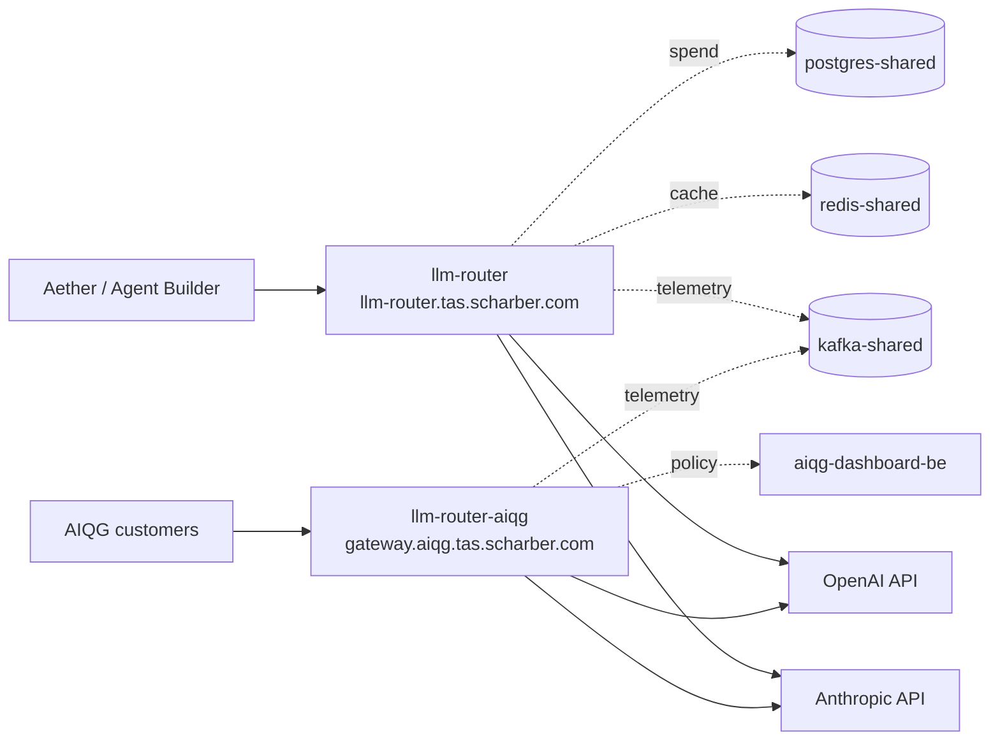

# LLM Router — Operations

## Why this exists

The LLM Router is the single egress path from TAS to commercial language-model
providers. Every call that Aether, the Agent Builder, and the AI Quality Gateway
(AIQG) make to Anthropic or OpenAI passes through it, so that credentials live in
one place, spend is attributed to a tenant, and prompts are scanned before they
leave the cluster.

When it is down, every feature that generates text stops: Aether chat, agent
execution, workflow steps that call a model, and AIQG scanning. Document upload,
search, vector indexing, and the graph database are unaffected — they do not
route through it. Users see request failures rather than degraded answers,
because the router fails closed rather than bypassing the scan.

There are **two independent deployments** in this namespace, and confusing them
is the most common triage mistake. See the mental model below before acting.

## Mental model



`llm-router` serves internal TAS traffic. `llm-router-aiqg` serves external AIQG
gateway customers. They are separate deployments, separate services, separate
ingress hosts, and they **run different image versions** — at time of writing
`aiqg-v5.75` and `aiqg-v5.85` respectively. A fix present in one is not
necessarily present in the other.

What it owns: provider credentials, routing and fallback between providers,
retry policy, spend attribution, and prompt scanning. What it does **not** own:
the models themselves, the prompts (callers build those), tenant identity
(Keycloak), or the policy definitions (AIQG dashboard backend).

The sentence worth keeping: **both deployments are stateless request proxies —
losing a pod loses the requests in flight through it and nothing else.** There
is no queue to drain and no local state to recover, so restarting is cheap and
is rarely the wrong move.

## How it works end to end

A caller sends a chat-completion request to the service on port 8086, reaching
it through one of the NGINX ingress hosts. The router authenticates the caller,
resolves which tenant the request belongs to, and selects a provider from that
tenant's priority list. Before the call leaves the cluster it scans the prompt
and records the decision.

It then calls the provider over the public internet. On a failure it retries
according to its retry policy and walks the fallback chain to the next provider
if one is configured. If every attempt fails, the caller receives an error —
the router does not return a partial or synthetic answer.

Throughout, it writes telemetry to `kafka-shared.tas-shared:9092`, reads and
writes cache and linkage state in `redis-shared.tas-shared:6379`, records spend
in `postgres-shared.tas-shared:5432/tas_shared`, and exports traces to
`otel-collector-shared.tas-shared:4317`. The AIQG deployment additionally
consults `aiqg-dashboard-be.aiqg.svc.cluster.local:8095` for policy.

The dependency that matters most at 3am is the **public internet egress** to
`api.anthropic.com` and `api.openai.com`. It is the least controlled hop in the
path and the source of most observed failures.

## Health & signals

Triage in order. You have sixty seconds.

**1. Is it up, and are its providers reachable?**

```bash
curl -sS -k https://llm-router.tas.scharber.com/health
{"providers":{"anthropic":{"status":"healthy","response_time_ms":799,"last_checked":1787620250},"openai":{"status":"healthy","response_time_ms":683,"last_checked":1787620249}},"status":"healthy","timestamp":1787620265}
```

`-k` is required: the ingress certificate is issued by the internal
`tas-ca-issuer`, which is not in a laptop trust store. Without it curl returns
nothing and exit code 60. For the AIQG deployment use
`https://gateway.aiqg.tas.scharber.com/health`, which returns the same shape.

This endpoint reports **point-in-time** provider status. It is not a history —
see the third failure mode below before concluding that healthy means nothing
has been failing.

**2. Are the pods actually running?**

```bash
kubectl get pods -n tas-llm-router
NAME                               READY   STATUS    RESTARTS   AGE
llm-router-7c5987584b-knpcd        1/1     Running   0          7d18h
llm-router-7c5987584b-mw4zd        1/1     Running   0          7d18h
llm-router-aiqg-5478654975-72s8t   1/1     Running   0          46m
llm-router-aiqg-5478654975-7llbx   1/1     Running   0          45m
```

Two replicas each is the expected steady state. **Ready does not mean working
here** — both deployments use a `tcpSocket` probe on port 8086, not an HTTP
health check. A pod with invalid provider credentials passes its probe, reports
Ready, and serves traffic that fails at the provider. Never conclude from
`1/1 Running` that requests are succeeding.

**3. What is failing right now?**

```bash
curl -sS -k -G 'https://loki.tas.scharber.com/loki/api/v1/query_range' \
  --data-urlencode 'query={namespace="tas-llm-router"} | json | level="error"' \
  --data-urlencode 'limit=50'
{"status":"success","data":{"resultType":"streams","result":[...]}}
```

Do not use `kubectl logs` — each deployment runs two replicas and a single pod's
tail silently omits half the traffic. If the Loki ingress is unreachable, port-forward
instead: `kubectl port-forward -n tas-shared svc/loki-shared 3100:3100` and query
`http://localhost:3100`.

**4. Is it this service or a dependency?** The distinguishing signal is *where*
the error text points. Errors naming `api.anthropic.com` or `api.openai.com` are
provider or egress problems and the router is behaving correctly by reporting
them. Errors naming `redis-shared`, `postgres-shared`, `kafka-shared`, or
`aiqg-dashboard-be` are TAS-internal dependency failures. A pod that is
`CrashLoopBackOff` or failing its probe is the router itself.

**Metrics.** Seventeen series are exported under the `llm_router_` prefix at
`/metrics`, including `llm_router_requests_total`, `llm_router_errors_total`,
`llm_router_provider_health`, `llm_router_rate_limit_hits_total`, and
`llm_router_cost_total`. Query them through Prometheus at
`prometheus-shared.tas-shared:9090` or Grafana.

## Common operations

### Restart a deployment

**Blast radius:** requests in flight through the restarting pod fail. With two
replicas and a rolling update the service stays up, but there is no connection
draining, so in-flight calls are dropped rather than completed.

```bash
kubectl rollout restart deploy/llm-router -n tas-llm-router
kubectl rollout status deploy/llm-router -n tas-llm-router --timeout=180s
deployment "llm-router" successfully rolled out
```

**Cost:** seconds of elevated error rate. This is the safe default action — the
service is stateless, so a restart cannot corrupt anything.

**Caveat for `llm-router-aiqg`:** its rolling update strategy is `maxSurge: 1,
maxUnavailable: 0`, meaning Kubernetes must schedule a new pod *before* removing
an old one. On this single-node cluster a restart can stall with the new pod
Pending if the node lacks headroom. `llm-router` uses `maxUnavailable: 25%` and
does not have this constraint. If a rollout stalls, check for Pending pods before
assuming the image is bad.

### Roll back

**Blast radius:** same as a restart, plus you revert whatever the current version
changed. The two deployments version independently — roll back only the one that
is failing.

```bash
kubectl rollout undo deploy/llm-router-aiqg -n tas-llm-router
kubectl rollout history deploy/llm-router-aiqg -n tas-llm-router
deployment.apps/llm-router-aiqg
REVISION  CHANGE-CAUSE
```

### Scale

**Blast radius:** none when scaling up beyond available node capacity is avoided;
scaling to zero takes the service down entirely.

```bash
kubectl scale deploy/llm-router -n tas-llm-router --replicas=3
deployment.apps/llm-router scaled
```

Both deployments share one node (`um773dev`). Scaling up consumes headroom that
rolling updates need — see the QoS note under limits.

### Rotate provider credentials

**Blast radius:** every request using the rotated provider fails until pods pick
up the new value. Credentials come from the environment and are read at process
start, so a rollout restart is required after the secret changes.

Secrets live in the `aether-secrets` material, not in this repository and not in
this document. Confirm the rotation took effect with `/health` and a real
completion, not by reading the secret back.

## Failure modes

Sourced from Loki over the 48 hours preceding the verification date. Four
distinct error signatures were observed; no Prometheus alert rules exist for
this service (see escalation).

| Symptom | Literal error text | Cause | Fix | Confirm |
|---|---|---|---|---|
| Anthropic calls fail; callers see errors while pods look healthy | `anthropic api call failed: POST "https://api.anthropic.com/v1/messages": 401 Unauthorized ... {"type":"error","error":{"type":"authentication_error","message":"invalid x-api-key"}}` | Provider API key invalid, expired, or revoked | Rotate the Anthropic credential, then `kubectl rollout restart` the affected deployment | `/health` shows anthropic healthy **and** a real completion succeeds |
| Errors in logs, but `/health` reports healthy | `openai health check failed: Get "https://api.openai.com/v1/models": read tcp 10.42.0.97:46304->162.159.140.245:443: read: connection reset by peer` | Transient egress reset to the provider. Observed 86 times for OpenAI and 80 for Anthropic in 48h without a corresponding outage | None if intermittent — this is background noise on this cluster's egress | Error count is flat rather than climbing; `/health` still reports healthy |
| Every retry exhausted, caller gets a hard failure | `All completion attempts failed` (level `error`), preceded by `Completion attempt failed` (level `warning`, with `"attempt":1`) | The underlying provider error is not retryable. Observed 17 times in 48h, each paired one-to-one with an `Anthropic API call failed` — retries did not rescue a single one | Fix the underlying provider error; a 401 will never succeed on retry | The warning-level attempt lines stop appearing |
| Log lines missing for a pod that recently restarted | `failed to try resolving symlinks in path "/var/log/pods/tas-llm-router_llm-router-aiqg-...": lstat ...: no such file or directory` | Alloy, the log collector, chasing a path for a pod that no longer exists. **Not a router failure** | None — ignore | The message stops once collection settles after the rollout |

**Standing issue at verification time:** 51 occurrences of `invalid x-api-key`
against Anthropic were present in the preceding 48 hours. This is an active
credential problem, not a historical one. Confirm current state before assuming
it has been resolved.

## Escalation & ownership

**Owner:** John Scharber. This is a single-maintainer service; there is no
rotation and no second on-call.

**There are no Prometheus alert rules for this service.** A check across all
namespaces returned no `PrometheusRule` matching `llm-router`. Nothing will page
you — failures surface when a user reports them or when someone looks at Grafana.
Treat the absence of alerts as a known gap, not as evidence of health.

**Attach when escalating:** the Loki query and the exact time window you used,
`kubectl get pods -n tas-llm-router -o wide` output, the image tag of the
affected deployment, and whether the failure reproduces against both ingress
hosts or only one.

**Do not attempt alone:** rotating provider credentials (it affects every tenant
at once and there is no staged rollout), and scaling either deployment beyond
three replicas on this single node.

## Limits & trade-offs

Both deployments run on one node, `um773dev`. There is no multi-node
redundancy — node loss takes down every replica of both deployments
simultaneously. Two replicas protect against pod-level failure only.

The two deployments have different quality-of-service classes, which decides who
dies first under memory pressure. `llm-router` is Burstable (requests 250m CPU /
512Mi, limits 1 CPU / 2Gi). `llm-router-aiqg` declares no resources at all and is
therefore BestEffort — it is the **first thing the kubelet evicts** when the node
comes under pressure. This is deliberate under the TAS resource policy, but it
means external gateway customers are served by the least protected workload in
the namespace.

No NetworkPolicy exists in this namespace, so any pod in the cluster can reach
port 8086 directly, bypassing the ingress and whatever the ingress enforces.

## Related

- Repository: `tas-llm-router`, OpenAPI specification at `docs/openapi.yaml`
- Port allocations: `aether-shared/services-and-ports.md`
- Public documentation ingress: `docs.air-ops.net`
- Grafana and Loki: `https://grafana.tas.scharber.com`, `https://loki.tas.scharber.com`
