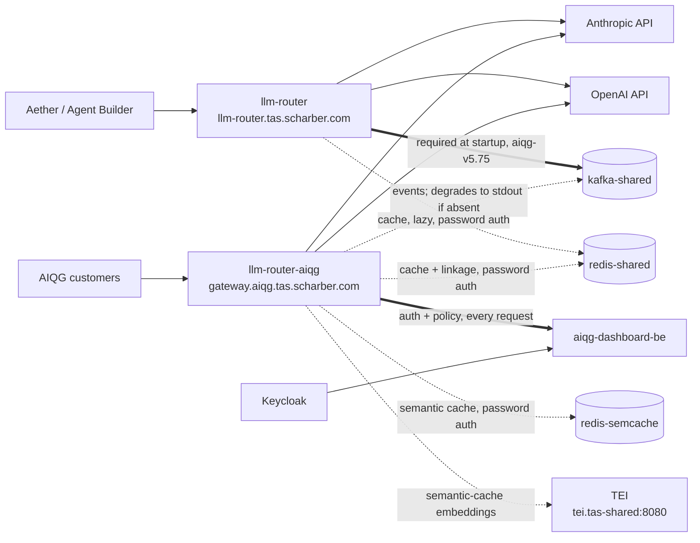

# LLM Router — Operations

> **Verified 2026-09-23 against `tas-llm-router@06038b9`**, a targeted refresh
> of the 2026-09-21 pass against `552d869`, itself refreshing an earlier pass
> against `eee4b24` on 2026-08-25. The 2026-09-23 refresh re-checked what the
> `llm-router-aiqg` image bump and semantic-cache embedder switch changed; lines
> that carry an older date were observed on that date and not re-run. Re-verify
> before trusting any number here.
>
> **Read the metrics subsection under "Health & signals" before you look at a
> Grafana panel for this service.** The `llm_router_*` exporter was rewritten at
> `eee4b24`. Since 2026-09-21 it runs on `llm-router-aiqg`, whose values are now
> real; `llm-router` still runs the old exporter, and **every `llm_router_*`
> value with `service="llm-router"` is fabricated**.
>
> **The code and the cluster have diverged for one deployment, and this document
> describes both.** On 2026-09-21 `llm-router-aiqg` moved to `aiqg-v5.87`, built
> from `e6c24c0`, which contains everything merged through `552d869` (#223). The
> semantic-cache embedder switch (#222) arrived separately, as configuration:
> revision 120 carried it on the *previous* image `aiqg-v5.86`, thirteen minutes
> before `v5.87` shipped. The internal `llm-router` still
> runs `aiqg-v5.75`, the image it ran in August, and has none of it — not the
> metrics rewrite, a Kafka outage no longer being fatal, the wired
> error/auth/rate-limit counters, the model registry and its admin API, nor the
> semantic-cache and evaluation-spend metrics. Where behaviour differs, the text
> says which deployment it applies to, and "at `552d869`" still marks code that
> `llm-router` will receive on its next deploy. The section "What the next
> deploy changes" under "Common operations" collects them in one place, with the
> one-line test for which code a pod is running.

**Before you start:** everything below assumes your `kubectl` context points at
the TAS k3s cluster with read access to the `tas-llm-router` and `tas-shared`
namespaces, and that you can reach `*.tas.scharber.com` from where you are.
Confirm both before trusting any command here to be diagnosing the right thing:

```bash
kubectl config current-context
default
```

`default` is the expected value — that is the context name k3s installs, and it
is what this cluster reported on 2026-08-25, 2026-09-21, and 2026-09-23. Anything else means you are pointed
at a different cluster and every command below will describe the wrong system.
Then confirm you can actually read the namespace with `kubectl get pods -n
tas-llm-router`, whose healthy output is in triage step 3.

## Why this exists

The LLM Router is the single egress path from TAS to commercial language-model
providers. Every call that Aether, the Agent Builder, and the AI Quality Gateway
(AIQG) make to Anthropic or OpenAI passes through it, so that credentials live in
one place, spend is attributed to a tenant, and prompts are scanned before they
leave the cluster.

When it is down, every feature that generates text stops: Aether chat, agent
execution, workflow steps that call a model, and AIQG scanning. Document upload,
search, vector indexing, and the graph database are unaffected — they do not
route through it. Users see request failures rather than degraded answers,
because the router **fails closed**: when it cannot complete the scan-and-route
path it rejects the request rather than forwarding an unscanned prompt to a
provider. There is no bypass mode to switch on.

There are **two independent deployments** in the `tas-llm-router` namespace, and
confusing them is the most common triage mistake. See the mental model below
before acting.

## Mental model



**Edge weight is the point of this diagram.** The thick edges are hard
dependencies whose loss stops the service: without Kafka the process will not
start, and without `aiqg-dashboard-be` every authenticated request fails closed.
The dotted edges are tolerated at runtime by an already-running pod. Keycloak
connects to the dashboard, not to the router — the router holds no Keycloak
configuration at all. All of this was measured on 2026-08-26; see "Dependency
failure effects".

Three things changed after that measurement. **Postgres is gone from the
picture**: the router has no Postgres consumer anywhere in its code, so the
`DATABASE_URL` key was removed from `llm-router-config` and the
`wait-for-postgres` init container from both deployments (#177, both confirmed
absent on the live cluster 2026-09-21). **Both Redis instances now require a
password** (SEC-24, SEC-26, #216), read from Secrets `redis-shared-auth` and
`redis-semcache-auth` in `tas-llm-router`, key `password` in each. And the
**Kafka edge is thick only for `llm-router`** — the code at `552d869`, which
`llm-router-aiqg` has run since 2026-09-21, degrades to logging events instead
of exiting (#191); see "Dependency failure effects". The edge to Text Embeddings
Inference (TEI), the semantic cache's embedding server, is new on 2026-09-21 and
is explained under "How it works end to end".

`llm-router` serves internal TAS traffic. `llm-router-aiqg` serves external AIQG
gateway customers. They are separate deployments, separate services, separate
ingress hosts, and they **run different image versions**:

| Deployment | Serves | Ingress host | Image tag (observed 2026-09-23) | Replicas |
|---|---|---|---|---|
| `llm-router` | Internal TAS traffic | `llm-router.tas.scharber.com` | `aiqg-v5.75`, unchanged since August | 2, fixed, one per node |
| `llm-router-aiqg` | External AIQG customers | `gateway.aiqg.tas.scharber.com` | `aiqg-v5.87`, since 2026-09-21 21:48 UTC (was `aiqg-v5.86`) | 2, fixed, one per node |

The live check, which prints the full image reference:

```bash
kubectl get deploy -n tas-llm-router -o custom-columns=NAME:.metadata.name,IMAGE:.spec.template.spec.containers[0].image
NAME              IMAGE
llm-router        registry-api.tas.scharber.com/tas-llm-router:aiqg-v5.75
llm-router-aiqg   registry-api.tas.scharber.com/tas-llm-router:aiqg-v5.87
```

**Five ingress hosts front these two deployments, and only two of them answer
`/health`.** The two public `air-ops.net` hosts are path-allowlisted: nginx
serves only the six completion endpoints (`/v1/chat/completions`,
`/v1/completions`, `/v1/messages`, `/v1/messages/count_tokens`,
`/v1/embeddings`, `/v1/responses`), each as an `Exact` path, and answers
everything else — `/health`, `/metrics`, `/v1/models`, `/v1/breaker`, `/docs` —
with its own `404` before the request reaches the router. Until September both
hosts published the router's entire route table (SEC-1, SEC-23).

| Host | Backend | What reaches the router | Gate in front | `/health` on 2026-09-21 |
|---|---|---|---|---|
| `llm-router.tas.scharber.com` | `llm-router` | Everything (`/` prefix) | Internal network only | `200`, JSON |
| `gateway.aiqg.tas.scharber.com` | `llm-router-aiqg` | Everything (`/` prefix) | Internal network only | `200`, JSON |
| `gateway.air-ops.net` | `llm-router-aiqg` | The six completion paths | None at Cloudflare; each request needs a `TAS-Auth` token | `404` from nginx |
| `llm.air-ops.net` | `llm-router` | The six completion paths | Cloudflare Access service token | `403`, Cloudflare Access error page |
| `docs.air-ops.net` | `llm-router` | `/docs` only | None | `404` from nginx |

Sources: `k8s/ingress-gateway-airops.yaml:83` and `k8s/ingress-llm-airops.yaml:65`
for the path lists; the `/health` column was observed from outside the cluster.
**A `404` or `403` on `/health` from a public host is the design, not an
outage** — probe health on the two internal hosts. The public hosts also carry an
nginx `limit-rps: "50"` annotation and a 300-second read timeout, and sit behind
Cloudflare, which gives up at 100 seconds with its own error `524`; long
non-streaming completions from public clients can hit that first.

> [!UNVERIFIED] Every public request reaches nginx from `cloudflared`, so nginx
> may count all public traffic as one client for `limit-rps`, which would make
> 50 requests/second a gateway-wide ceiling rather than a per-caller one. This
> was inferred from the topology, not measured, and no throttling was observed
> on 2026-09-21. If public callers report `503`s under load that the router's
> own logs do not show, suspect this first.

Both tags carry the `aiqg-` prefix regardless of which deployment they run on —
that prefix is the image release line, not an indicator of which deployment it
belongs to. The tags are ordered, so `aiqg-v5.87` on `llm-router-aiqg` is
**ahead** of `aiqg-v5.75` on `llm-router`: the AIQG deployment receives releases
first and the internal deployment lags it. A fix present in one deployment is not necessarily present in the
other. There is no HorizontalPodAutoscaler; replica counts are fixed in the
deployment spec and nothing restores them automatically beyond the ReplicaSet.

Since 2026-09-21 the cluster has two nodes, `um773dev` and `pinova01`, and each
deployment carries a `topologySpreadConstraints` rule (`maxSkew: 1` on
`kubernetes.io/hostname`, `whenUnsatisfiable: ScheduleAnyway`) that places one
replica on each (#220). It is a preference, not a guarantee — see "Restart a
deployment" for why a rollout can still land both replicas on one node.

What it owns: provider credentials, routing and fallback between providers,
retry policy, spend attribution, and prompt scanning. What it does **not** own:
the models themselves, the prompts (callers build those), tenant identity
(Keycloak), or the policy definitions (AIQG dashboard backend).

The sentence worth keeping: **both deployments are stateless request proxies —
losing a pod loses the requests in flight through it and nothing else.** Nothing
durable lives in the pod; there is no queue to drain and no local state to
recover, so a restart cannot corrupt anything.

The one caveat to that, and it is the exception worth carrying alongside the
rule: a restart is cheap only when the dependencies a pod needs *to start* are
up. Kafka must be reachable or the `llm-router` process exits (its `aiqg-v5.75`
image; `llm-router-aiqg` now starts without it), and the
`wait-for-redis` init container blocks until Redis answers. During an outage of
either, a running pod may be serving fine while a replacement could not start at
all — so restarting is the one thing not to reach for. See "Dependency failure
effects". (Postgres was the third blocker until the init container that waited
on it was removed; it no longer gates startup.)

## How it works end to end

A caller sends a chat-completion request to the service on port 8086, reaching
it through one of the NGINX ingress hosts. The router authenticates the caller
via a `TAS-Auth` token, resolves which tenant the request belongs to, and selects
a provider from that tenant's priority list. Before the call leaves the cluster
it scans the prompt and records the decision.

It then calls the provider over the public internet. On a failure it retries
according to its retry policy and walks the fallback chain to the next provider
if one is configured. If every attempt fails, the caller receives an error —
the router does not return a partial or synthetic answer.

Throughout, it writes telemetry to `kafka-shared.tas-shared:9092`, uses
`redis-shared.tas-shared:6379` for response caching and for short-lived
request-correlation state, and exports traces to
`otel-collector-shared.tas-shared:4317`.

> [!UNVERIFIED] The trace export in that sentence is not borne out by the code at
> `552d869`. The collector address is set in `llm-router-config`, but the router
> contains no OpenTelemetry library and never reads that setting. Nothing was
> found that sends traces anywhere. Treat the collector as not a dependency, as
> the table under "Dependency failure effects" does, and ask the owner whether
> tracing was intended.

The AIQG deployment additionally consults `aiqg-dashboard-be.aiqg.svc.cluster.local:8095` for policy, and keeps
its semantic cache in a second Redis, `redis-semcache.tas-shared:6379`.

Three AIQG terms recur below. The **semantic cache** stores past answers and
serves one when a new prompt is close enough in meaning to a stored one, rather
than byte-identical; on this cluster it runs in **shadow mode**, which means it
records what it *would* have served without serving it. The **judge** is a
sample of responses the gateway sends to a second model to grade, which costs
money the gateway itself spends; **shadow replays** re-run a sample of requests
against an alternative model for comparison, which also costs money. All three
belong to `llm-router-aiqg` only.

**How the semantic cache measures "close enough".** It turns each prompt into a
384-number vector (an *embedding*) and compares vectors by similarity; a stored
answer is a candidate when the score reaches `AIQG_SEMCACHE_MIN_SIMILARITY`,
`0.87`. Since 2026-09-21 the embeddings come from **TEI** (Hugging Face Text
Embeddings Inference), a model server at `http://tei.tas-shared:8080` in
namespace `tas-shared` serving `redis/langcache-embed-v3-small`, a model trained
for cache matching. Before that, `ollama.tas-shared:11434` served `all-minilm`.
The switch changed only the embedder and kept the `0.87` threshold, because a
side-by-side measurement on 2026-09-20 found langcache separated near-miss
questions better at that same threshold (`k8s/deployment-aiqg-strict.yaml:190`).
Observed live on 2026-09-23: the deployment sets
`AIQG_SEMCACHE_EMBED_PROVIDER=tei`, and TEI's own `/info` reports
`"model_id":"redis/langcache-embed-v3-small"`, `"max_input_length":128`.

**The boot log names the wrong model, and that is expected.** Each AIQG pod logs
two lines at startup; this pair is from 2026-09-21:

```bash
{"dim":384,"embed_model":"all-minilm","level":"info","min_similarity":0.87,"msg":"AIQG semantic cache enabled (C4 — shadow: logs would-hits, serves nothing)","redis_addr":"redis-semcache.tas-shared.svc.cluster.local:6379","shadow":true,"time":"2026-09-21T21:47:49Z"}
{"level":"info","msg":"AIQG semantic cache: using TEI embedder","tei_url":"http://tei.tas-shared:8080","time":"2026-09-21T21:47:49Z"}
```

`embed_model` echoes `AIQG_SEMCACHE_EMBED_MODEL`, which only the Ollama path
uses; TEI serves exactly one model, fixed by its own `--model-id`, and the
router never sends it a model name. The second line is the one that tells you
which embedder is live. If it is missing, and in its place you see
`embed_provider=tei but tei_url is empty; falling back to Ollama`, the pod is on
`all-minilm` (`internal/server/server.go:713`).

The `0.87` threshold is a prediction from thirteen hand-written question pairs,
not a measurement on traffic. The manifest says to re-derive it from
`llm_router_semcache_top_similarity`, which `aiqg-v5.87` exports; on 2026-09-23
that series had no samples yet, because no request had reached the cache
since the switch.

Two corrections to the August version of that paragraph. It said the router
records spend in `postgres-shared`; it does not — the router has no Postgres
client, the key that pointed at it was removed from `llm-router-config` because
it embedded a plaintext password (#177, `k8s/configmap.yaml:19`), and spend
leaves the pod as Kafka events. The Kafka address that matters is
`AIQG_KAFKA_BROKERS` in the ConfigMap, `kafka-shared.tas-shared:9092`
(`k8s/configmap.yaml:118`), read by the AIQG event emitter — the component whose
failure stops startup. The internal `llm-router` deployment also sets a
`KAFKA_BROKERS` pointing at the broker pod directly
(`k8s/deployment.yaml:92`), and the ConfigMap has one too, but no code in the
router reads `KAFKA_BROKERS` (nor the ConfigMap's `REDIS_URL`); do not spend
time on either during an incident.

**Redis connections are password-authenticated.** Each deployment builds its
Redis URL inside the pod spec from a Secret-backed variable — `REDIS_PASSWORD`
from Secret `redis-shared-auth`, and on `llm-router-aiqg` also
`SEMCACHE_PASSWORD` from Secret `redis-semcache-auth`, key `password` in both,
namespace `tas-llm-router`. The ConfigMap also carries an
`AIQG_LINKAGE_REDIS_URL` without a password; it is overridden by the deployment's
own entry and has no effect, so do not "fix" it by adding a password there
(`k8s/deployment.yaml:96`). On `llm-router-aiqg` that one `redis-shared`
connection carries the exact-match response cache as well as flow linkage, so it
holds cached model responses.

The internal `llm-router` also sets three timeouts on its deployment:
`SERVER_READ_TIMEOUT` and `SERVER_WRITE_TIMEOUT` of 180 seconds and
`ROUTER_REQUEST_TIMEOUT` of 150 seconds (`k8s/deployment.yaml:77`). Until
2026-09-19 these existed only on the live object and in no manifest.

The dependency that matters most at 3am is the **public internet egress** to
`api.anthropic.com` and `api.openai.com`. It is the least controlled hop in the
path and the source of every failure signature observed on the verification date.

## Health & signals

Triage in order. You have sixty seconds.

**The sixty-second check, no token needed.** Three commands, each answering in
under a second on 2026-09-21. Together they cover both deployments, a real
call through the router to a provider using the router's own credential, and
the AIQG authentication backend. None of them needs a customer token, and none
generates text.

**(a) Is the router up, and are both providers reachable?**

```bash
curl -sS -k https://llm-router.tas.scharber.com/health
{"providers":{"anthropic":{"status":"healthy","response_time_ms":571,"last_checked":1790024744},"openai":{"status":"healthy","response_time_ms":477,"last_checked":1790024743}},"status":"healthy","timestamp":1790024759}
```

**(b) Does a real request reach Anthropic through the router, on the router's own key?**

```bash
curl -sS -k -w '\nHTTP %{http_code}\n' https://llm-router.tas.scharber.com/v1/messages/count_tokens \
  -H 'Content-Type: application/json' -H 'anthropic-version: 2023-06-01' \
  -d '{"model":"claude-sonnet-4-6","messages":[{"role":"user","content":"ping"}]}'
{"input_tokens":8}

HTTP 200
```

**(c) Is the AIQG gateway up, and is its authentication backend answering?**

```bash
curl -sS -k -w '\nHTTP %{http_code}\n' https://gateway.aiqg.tas.scharber.com/v1/messages/count_tokens \
  -H 'Content-Type: application/json' -H 'Authorization: Bearer probe' \
  -H 'TAS-Auth: tas_qg_live_oncallprobe0000000000000000' \
  -d '{"model":"claude-sonnet-4-6","messages":[{"role":"user","content":"ping"}]}'
{"error":{"code":"path_a_auth_required","message":"AIQG ingress requires a recognized TAS-Auth token","reason":"token_unknown","docs":"https://docs.tas.scharber.com/aiqg/auth"}}
HTTP 401
```

All three shown are healthy results, captured 2026-09-21. How to read them:

- **(b)** goes through the internal router's full request path. The internal
  host admits requests without a `TAS-Auth` header. The router then calls
  Anthropic's token-counting endpoint with its own configured key
  (`internal/server/count_tokens.go:31`). `{"input_tokens":N}` with `200` proves
  the pod, the routing, egress, and the Anthropic credential all work. A `502`
  whose body contains `count_tokens failed:` carries Anthropic's own error — an
  `invalid x-api-key` there is the credential failure mode. It does not test the
  OpenAI key; `/health` in (a) is the only token-free signal for OpenAI.
- **(c) is supposed to return `401` with `"reason":"token_unknown"`.** The token
  is deliberately made up. The gateway sends it to `aiqg-dashboard-be` to be
  looked up on every request, with no caching and a 2-second timeout
  (`pkg/aiqg/tokens/dashboard_resolver.go:93`). So `token_unknown` proves that the
  AIQG pods answered and the authentication backend answered "no such token". A
  `503` with `token_resolver_unavailable` instead means the backend is down —
  see "Dependency failure effects". A 401 whose `reason` is missing, and whose
  message names a missing header, means a header was dropped from the command.
  Send the made-up value shown, never a real customer token.

> [!UNVERIFIED] Check (b) calls Anthropic's token-counting endpoint, which
> generates no text. Anthropic's public pricing describes token counting as free
> of charge. This pass did not confirm that against the account's billing, so
> do not run (b) in a tight loop.

If all three pass, the service is up for both internal and customer traffic. Go
to the steps below only when one fails, or when a caller reports a failure the
three do not explain. The only thing none of them covers is a real completion
with a customer's own token, which is step 2.

**1. Is it up, and are its providers reachable?**

```bash
curl -sS -k https://llm-router.tas.scharber.com/health
{"providers":{"anthropic":{"status":"healthy","response_time_ms":767,"last_checked":1787710958},"openai":{"status":"healthy","response_time_ms":583,"last_checked":1787710957}},"status":"healthy","timestamp":1787710962}
```

**Healthy looks like:** top-level `"status":"healthy"`, both providers
`"healthy"`, and `response_time_ms` in the high hundreds — 583ms and 767ms were
the observed values on 2026-08-25, and 571ms and 477ms when re-run on
2026-09-21. Treat sustained values above
roughly 3000ms, or either provider reporting anything other than `healthy`, as
degraded rather than down.

**What "sustained" means, as something you can check.** The router re-probes
each provider every 30 seconds (the default at `internal/config/config.go:399`),
and `/health` returns the result of the last probe, so two calls inside one
interval return the same number. "Sustained" here means **three consecutive
probes**, which takes about 90 seconds to observe — run this after the
sixty-second check, not instead of it:

```bash
for i in 1 2 3; do
  curl -sS -k https://llm-router.tas.scharber.com/health | python3 -c "import sys,json
d=json.load(sys.stdin); print(d['status'], ' '.join(f\"{k}={v['status']}:{v['response_time_ms']}ms\" for k,v in d['providers'].items()))"
  sleep 30
done
healthy anthropic=healthy:613ms openai=healthy:589ms
healthy anthropic=healthy:478ms openai=healthy:2349ms
healthy anthropic=healthy:576ms openai=healthy:979ms
```

Captured on 2026-09-21. Degraded is any provider above 3000ms on all three
lines. One slow line is a single slow probe — the `2349ms` above is one,
recovered by the next probe — and the egress on this cluster produces those
routinely.

That measures the router's own probe, not what callers wait. For callers, ask
Loki for the 95th-percentile duration of real completion requests. Every request
is logged with a `duration_ms` field, so this works on both deployments,
including `llm-router`, whose latency metrics are still fabricated:

```bash
curl -sS -k -G 'https://loki.tas.scharber.com/loki/api/v1/query' \
  --data-urlencode 'query=quantile_over_time(0.95, {namespace="tas-llm-router"} | json | msg="HTTP request" | path=~"/v1/(chat/completions|completions|messages|embeddings|responses)" | unwrap duration_ms [1h]) by (container)'
```

On 2026-09-21 the same expression over a 24-hour window, `[24h]`, returned
`187.4` milliseconds for the `llm-router` container, across 13 completion
requests. Nothing is returned when there were no completion requests in the
window, which is common on this cluster. Treat a p95 above 3000 (milliseconds)
over `[15m]`, with requests present, as degraded.

For pods running an image from `eee4b24` or later — `llm-router-aiqg` since
2026-09-21 — the same threshold is a Prometheus expression:

```bash
curl -sS -k -G 'https://prometheus.tas.scharber.com/api/v1/query' \
  --data-urlencode 'query=histogram_quantile(0.95, sum by (le, service) (rate(llm_router_request_duration_seconds_bucket[15m]))) > 3'
{"status":"success","data":{"resultType":"vector","result":[]}}
```

Any `service` returned by this is degraded. Read the empty result carefully. On
2026-09-21 it was empty because no running pod exported the series. On
2026-09-23 it was empty because latency was fine: the same expression without
`> 3` returned `{"service":"llm-router-aiqg"}` at `1.85` seconds. It can never
return `llm-router` until that deployment gets the new exporter, so keep using
the Loki expression for the internal router. If the expression without `> 3`
also returns nothing, there were no AIQG completions in the window.

`-k` is required: the ingress certificate is issued by the internal
`tas-ca-issuer`, which is not in a laptop trust store. Without it curl returns
nothing and exit code 60. `-k` suppresses certificate validation only — it does
not mask an application error. For the AIQG deployment use
`https://gateway.aiqg.tas.scharber.com/health`, which returns the same shape.
Do not probe the public `air-ops.net` hosts for health: they do not serve
`/health` at all (see the host table under "Mental model").

**On the outputs in this document.** Every read-only command here was executed
against the live cluster and its real output pasted, on the date given beside
it — 2026-08-25 or 2026-08-26 for the first pass, 2026-09-21 for the second,
2026-09-23 for what the latest refresh re-ran —
the curl bodies, the pod and revision listings, the Loki and Prometheus
responses, and the node figures alike. Two conventions apply. Loki responses
carry a large `stats` object that says nothing an operator needs, so it appears
as `"stats":{...}` where it was cut; everything before it is verbatim. Long
listings are trimmed with a `...` line, and the trimmed rows are always more of
the same. The commands that *change* something (restart, scale, roll back, delete a pod)
or that need a credential this document does not carry were **not** executed;
each is marked `<!-- unverified-example -->` in its code block and shows the
expected shape rather than an observed one. Nothing else here is an
illustration — if a value looks odd, it is odd because the system is.

This endpoint reports **point-in-time** provider status. It is not a history —
see the second failure mode below before concluding that healthy means nothing
has been failing.

**2. Does a real request actually succeed?**

`/health` checks that the router can reach the providers. It does not prove a
caller can get an answer, because the credential path differs. This is the
confirmation step for the most severe failure mode, so run it before declaring
recovery:

```bash
curl -sS -k https://llm-router.tas.scharber.com/v1/chat/completions \
  -H "TAS-Auth: $TAS_TOKEN" -H "Content-Type: application/json" \
  -d '{"model":"claude-sonnet-4-6","messages":[{"role":"user","content":"ping"}],"max_tokens":8}'
<!-- unverified-example --> not run: needs a TAS-Auth token. Expected shape:
{"id":"chatcmpl-...","object":"chat.completion","model":"claude-sonnet-4-6","choices":[{"index":0,"message":{"role":"assistant","content":"pong"},"finish_reason":"stop"}]}
```

A `TAS-Auth` token is required on every completion endpoint, and this check is
unrunnable without one. **Get a token before you need it** — the two places this
document tells you to use one are its own recovery-confirmation step and the
evidence you attach when escalating, so acquiring it mid-incident is the worst
time.

No shared on-call test token exists anywhere this document can point to. The
Secret `llm-router-aiqg-tokens` holds tokens the gateway accepts, but they
belong to tenants: do not borrow one. If you have no AIQG dashboard account to
issue your own, the sixty-second check at the top of this section covers
everything this step does except a customer-token completion. Record in the
ticket that step 2 was not run, and ask the owner to issue you a token after the
incident.

**Issue one yourself — you do not need ops for this.** The AIQG dashboard has a
self-serve token API, and it is the intended path:

- Sign in to the AIQG dashboard and go to **`/tokens`**, the screen that front-ends
  this API. Creating a token there is the whole procedure.
- Programmatically, the same endpoint is
  `https://api.aiqg.tas.scharber.com/api/v1/account/tokens`: a `GET` lists your
  tokens, a `POST` creates one, and a delete request against `.../:id` revokes
  one. It is authenticated with the Keycloak-issued JSON Web Token you already
  hold once signed in, and the tenant is read from that token, so you can only
  ever issue tokens for your own tenant.
- Creating a token returns `201` with the plaintext value **in that response
  only**. It is not retrievable afterwards. Save it somewhere you control at the
  moment you create it, or issue a new one.

The service is reachable and rejects unauthenticated calls as expected:

```bash
curl -sS -k -o /dev/null -w '%{http_code}\n' https://api.aiqg.tas.scharber.com/health
200
curl -sS -k -w '\nHTTP %{http_code}\n' https://api.aiqg.tas.scharber.com/api/v1/account/tokens
{"error":{"code":"missing_header","message":"Authorization header missing"}}
HTTP 401
```

Both captured on 2026-08-26. That `401` is the healthy unauthenticated response,
not an outage. This API lives in the `aiqg-dashboard-be` repository rather than
this one, so its behaviour is described here in prose rather than cited to a
source line.

**Do not confuse the two layers when auth misbehaves.** Issuing is one thing;
what the gateway accepts is another:

| Layer | What it is | When you touch it |
|---|---|---|
| The token API above (`aiqg-dashboard-be`) | Where tokens are **issued and revoked**, per tenant, self-serve | You need a token, or you want to revoke one |
| Secret `llm-router-aiqg-tokens` in namespace `tas-llm-router`, key `aiqg-tokens.yaml` | What the running gateway **reads and accepts**, mounted at `/app/secrets/aiqg/aiqg-tokens.yaml` via `AIQG_TOKENS_FILE` | A token that should work is being rejected and you are checking whether the gateway knows about it |

A token that the dashboard issued but the gateway rejects means those two layers
have diverged, which is an escalation rather than something to fix by editing the
Secret. Reading that Secret needs `get secret` in `tas-llm-router`, a higher
privilege than the rest of this document assumes; if you do not have it, say so
in the ticket rather than working around it.

Never paste a token into a ticket, a chat message, or this document.

**3. Are the pods actually running?**

```bash
kubectl get pods -n tas-llm-router -o wide
NAME                               READY   STATUS    RESTARTS   AGE    IP           NODE       NOMINATED NODE   READINESS GATES
llm-router-6ddd95fb5-fjn5m         1/1     Running   0          2d7h   10.42.0.42   um773dev   <none>           <none>
llm-router-6ddd95fb5-h9nzp         1/1     Running   0          2d7h   10.42.1.55   pinova01   <none>           <none>
llm-router-aiqg-55549bc5dc-8vwz6   1/1     Running   0          2d4h   10.42.1.74   pinova01   <none>           <none>
llm-router-aiqg-55549bc5dc-f75rb   1/1     Running   0          2d4h   10.42.0.54   um773dev   <none>           <none>
```

Captured 2026-09-23; the `llm-router-aiqg` names changed with the `aiqg-v5.87`
rollout on 2026-09-21. Two replicas each, **one on each node**, is the expected
steady state; both replicas of one deployment on the same node is a placement
problem to fix in daylight (see "Restart a deployment"), not an outage. **Ready does not mean working
here** — both deployments use a `tcpSocket` probe on port 8086, not an HTTP
health check. A pod with invalid provider credentials passes its probe, reports
Ready, and serves traffic that fails at the provider. Never conclude from
`1/1 Running` that requests are succeeding; step 2 is what proves that.

**4. What is failing right now?**

```bash
curl -sS -k -G 'https://loki.tas.scharber.com/loki/api/v1/query_range' \
  --data-urlencode 'query={namespace="tas-llm-router"} | json | level="error"' \
  --data-urlencode 'limit=50'
{"status":"success","data":{"resultType":"streams","result":[],"stats":{...}}}
```

**`"result":[]` is the healthy answer** and is what this returned on 2026-08-25 —
no error-level lines in the default one-hour window. It is not a failed query;
Loki omits the stream entirely when nothing matches. A failed query returns
`"status":"error"` with a `message` field instead.

When there *are* errors, each entry is a JSON log line inside a stream. Widening
the window to 24 hours on the same date returned three streams, of which this is
a real entry:

```bash
{"error":"POST \"https://api.anthropic.com/v1/messages\": 529  (Request-ID: req_011CePftRxWJSBTQ9iXxPLvQ) {\"type\":\"error\",\"error\":{\"type\":\"overloaded_error\",\"message\":\"Overloaded\"},\"request_id\":\"req_011CePftRxWJSBTQ9iXxPLvQ\"}","level":"error","msg":"Anthropic health check failed","time":"2026-08-25T15:03:59Z"}
```

Read `msg` first — it names the failure class — then `error` for the provider's
own text. Here it is a health check, not a caller request, and HTTP 529
`overloaded_error` is Anthropic shedding load at their end. That is the same
"errors in the log while `/health` reports healthy" pattern as the second failure
mode below, and it needs no action unless the volume climbs.

To widen the window yourself, pass explicit bounds in nanoseconds:

```bash
END=$(date +%s); START=$((END-86400))
curl -sS -k -G 'https://loki.tas.scharber.com/loki/api/v1/query_range' \
  --data-urlencode 'query={namespace="tas-llm-router"} | json | level="error"' \
  --data-urlencode "start=${START}000000000" --data-urlencode "end=${END}000000000" \
  --data-urlencode 'limit=5' --data-urlencode 'direction=backward'
```

Do not use `kubectl logs` — each deployment runs two replicas and a single pod's
tail silently omits half the traffic. If the Loki ingress is unreachable, port-forward
instead: `kubectl port-forward -n tas-shared svc/loki-shared 3100:3100` and query
`http://localhost:3100`.

**Baseline error volume, and the number to compare against.** Provider
health-check failures are background noise on this cluster and do not indicate an
outage on their own. Rather than eyeballing a log stream, count them — this
returns a single number in about a second:

```bash
curl -sS -k -G 'https://loki.tas.scharber.com/loki/api/v1/query' \
  --data-urlencode 'query=sum(count_over_time({namespace="tas-llm-router"} | json | level="error" [15m]))'
{"status":"success","data":{"resultType":"vector","result":[],"stats":{...}}}
```

**Read it against these thresholds:**

| Count in 15m | Reading |
|---|---|
| Empty result or 0 | Normal. This was the live value on 2026-08-25, and over the preceding 6 hours. |
| 1–10 | Normal. Health-check resets arrive in bursts; the 24-hour total on 2026-08-25 was 16, and on 2026-09-21 it was 8 — every one a provider health check. |
| 11–50 | Investigate. Check whether the errors are health-check failures or completion failures before escalating. |
| Over 50 | Treat as an incident and go to triage step 2 — that is more than three per minute, well above anything observed. |

An empty `result` array means zero, not a failed query; Loki omits the series
when the count is zero. Swap `[15m]` for `[1h]` or `[24h]` to widen the window —
the 2026-08-24 measurement of 166 events over 48 hours, 86 for OpenAI and 80 for
Anthropic, is the longer-run baseline for comparison.

The shape matters more than the count. Errors naming a provider health check are
noise at any of the volumes above; the same volume of `All completion attempts
failed` is an outage.

**One class of error is invisible to every `| json | level=...` query above.**
The Redis client library writes its own connection failures as plain text, not
JSON, so the `json` stage cannot parse them and the level filter drops them.
Search for them by string instead — this is the line both AIQG replicas wrote on
2026-09-18 while `redis-shared` restarted for the password cutover:

```bash
curl -sS -k -G 'https://loki.tas.scharber.com/loki/api/v1/query_range' \
  --data-urlencode 'query={namespace="tas-llm-router"} |= "redis: "' \
  --data-urlencode 'limit=20'
{"status":"success","data":{"resultType":"streams","result":[],"stats":{...}}}
```

`"result":[]` in the default one-hour window on 2026-09-21 is the healthy
answer. A hit looks like this, where `…` stands for the Redis library's own
source-file location, which the real line carries and this document omits:

```bash
redis: 2026/09/18 19:34:55 … redis: connection pool: failed to dial after 5 attempts: dial tcp 10.43.11.181:6379: connect: connection refused
```

**5. Is it this service or a dependency?** Work from the observed state, not from
a string search — two of the internal dependencies log nothing at all when they
fail, so searching for their names finds silence and proves nothing.

| What you observe | Where the fault is |
|---|---|
| Errors naming `api.anthropic.com` or `api.openai.com` | The provider or egress. The router is behaving correctly by reporting it. |
| `CrashLoopBackOff`, with a startup line naming `NewKafkaEmitter` and `run out of available brokers` | **Kafka.** Not a bad image — see the dependency section before rolling back. Applies to `llm-router` (`aiqg-v5.75`) only; `llm-router-aiqg` on `aiqg-v5.87` no longer crash-loops on this. |
| `llm-router-aiqg` pods Ready, `aiqg_emitter_degraded` reads `1` | **Kafka**, unreachable when that pod started. Serving continues; spend events go to Loki instead of Kafka. |
| `CrashLoopBackOff` with any other startup error | The router or its image. |
| Callers get `503` / `token_resolver_unavailable` while pods look Ready | `aiqg-dashboard-be`. Not the caller's token. |
| Callers get `401` / `path_a_auth_required` | The caller's token, not a dependency. ("Path A" is the gateway's authenticated processing path; the code means the request lacked or failed the credentials to enter it. Unpacked under "Failure modes".) |
| Pods Ready, requests succeeding, nothing in the logs | Redis could still be down — it is silent at `error` level. Check its pods directly and run the plain-text `redis: ` query in step 4. |
| Plain-text `redis: ... failed to dial` lines | `redis-shared` or `redis-semcache` unreachable. Not the router. |
| A public `air-ops.net` host answers `404` or `403` | Nothing, if the path is not one of the six completion endpoints — that is the path allowlist or Cloudflare Access working. |

A `CrashLoopBackOff` is **not** by itself evidence that the router is at fault;
that is the single most misleading state on this service. Read the startup line
before concluding anything. The dependency section below carries the full
signatures.

**Metrics.** Scraping either metrics path **through the ingress returns one
random replica**, so counters appear to jump between values on consecutive curls
— each pod keeps its own. Prometheus is unaffected: it uses endpoint discovery
and scrapes all four pods individually. `/metrics` is served on the same port
8086 and is registered at `internal/server/server.go:982`. Query the series
through Prometheus at `prometheus-shared.tas-shared:9090` or Grafana.

The exporter behind `/metrics` was replaced at commit `eee4b24`, and whether a
number on a panel means anything depends entirely on which side of that commit
it was recorded on — and on whether the pod you are scraping is running an image
that contains it. Establish both before you read a value. The three blocks below
cover the history, the new exporter, and what is actually running today.

> [!CAUTION] **Every `llm_router_*` datapoint recorded before `eee4b24` is
> fabricated. Do not baseline against it.** Until that commit, the handler built
> the exposition text with `fmt.Sprintf` and derived nearly every counter from
> wall-clock time as `150 + (time.Now().Unix()/10)*3` and similar. The values
> therefore rose smoothly forever whether or not a request was served: `rate()`
> returned a plausible constant of roughly 0.8 requests/sec, and
> `llm_router_cost_total` accrued about $0.05 every ten seconds — on the order of
> $13k/month of spend that never happened, on a gateway whose purpose is cost
> attribution.
>
> Two consequences an on-call engineer has to carry. First, **a "traffic has
> stopped" alert could not fire** on this service, because the counter always
> moved; the absence of such an alert firing over that period is not evidence
> that traffic flowed. Second, **any threshold, capacity plan, or dashboard
> baseline tuned against that history is wrong** and has to be re-derived from
> data recorded after this commit. Treat the series as beginning at zero on the
> day the new image is deployed.

**What is real after `eee4b24`.** `/metrics` is now served by `promhttp` from a
dedicated `client_golang` registry (`internal/metrics/metrics.go:50`), and the
regression test scrapes twice with no traffic in between and fails if any value
moved (`internal/metrics/metrics_test.go:21`). The series and where each number
comes from:

| Series | Sourced from | Trust it for |
|---|---|---|
| `llm_router_requests_total` | HTTP middleware around the completion handlers, `internal/metrics/middleware.go:74` | Request rate and status-code mix. Labels are `provider`, `method`, `status_code`. |
| `llm_router_request_duration_seconds` | Same middleware, `internal/metrics/middleware.go:75` | **New series.** End-to-end latency as the caller sees it, including scanning, routing, and fallback hops. |
| `llm_router_active_connections` | In-flight gauge, `internal/metrics/middleware.go:61` | Concurrency right now. Previously the constant 5. |
| `llm_router_tokens_total` | `resp.Usage` on each completed call, `internal/server/server.go:1772` | Token volume by provider and direction. |
| `llm_router_cost_total` | The pricing call that also produces the tenant's spend record, `internal/server/server.go:1774` | Dollar spend. The metric and the billing record are computed by the same code path on the same numbers, so a discrepancy between this panel and a tenant's invoice is not possible — if they differ, one of them was read over a different time window. |
| `llm_router_blocked_requests_total` | Policy enforcement, `internal/server/enforcement.go:127` | Requests refused by policy, labelled `inbound` or `outbound`. |
| `llm_router_provider_health` | Read from the router at scrape time, `internal/server/server.go:403` | Provider reachability. Cannot go stale, because nothing mirrors it. |

Two behaviours of the new middleware change what the numbers mean. It wraps
**outside** the AIQG gateway middleware (`internal/server/server.go:930`), so a
request the gateway rejects with a 401 is now counted as traffic; under the old
exporter an authentication outage was invisible in the request count. And the
`provider` label reads `none` when routing never chose a provider — an auth
rejection, a validation failure, or a policy block — so an auth outage does not
masquerade as a vendor problem.

Only the six completion routes are instrumented: `/v1/chat/completions`,
`/v1/completions`, `/v1/messages`, `/v1/messages/count_tokens`, `/v1/embeddings`,
and `/v1/responses` (`internal/server/server.go:934` onward, each wrapped by `wrapAIQG` at `internal/server/server.go:922`). `/health`, `/metrics`,
`/v1/models`, and the management routes are excluded, so a fifteen-second scrape
interval does not dominate the request rate.

One gap in the table above closes at `552d869`: streaming completions did not
feed `llm_router_tokens_total` or `llm_router_cost_total`, so both
under-reported by the streaming share — the one exception to the table's claim
that the cost panel cannot disagree with a tenant's invoice: on an `eee4b24`
image that uses streaming, it runs low. They now do, from the final usage frame of
the stream (`internal/server/server.go:1873`), including a stream that failed
part-way, since those tokens were generated and billed. A stream that dies
mid-response now ends with an explicit error event rather than looking like a
clean, short answer, and a request for streaming that falls back to a single JSON
body carries the response header `X-TAS-Stream-Fallback: true`
(`internal/server/server.go:1888`).

> [!WARNING] **At `eee4b24`, three of the new series were registered but never written to.**
> `llm_router_errors_total`, `llm_router_auth_attempts_total`, and
> `llm_router_rate_limit_hits_total` are declared at
> `internal/metrics/metrics.go:113`, `:127`, and `:147` and registered at
> `internal/metrics/metrics.go:219`, but no non-test code increments any of
> them. A counter vector with no observed label combination exports nothing, so
> after the rollout these three read **"No data"** rather than zero, and the
> error-rate and rate-limit panels on `llm-router-overview` stay blank. Read a
> blank panel here as missing instrumentation, not as an absence of errors — use
> the Loki query in step 4 for error volume instead.
>
> **Superseded at `552d869`, running on `llm-router-aiqg` since 2026-09-21
> (`aiqg-v5.87`), not yet on `llm-router`.** Commit `1d89669`
> wired all three: `llm_router_errors_total{error_type="completion_failed"}` on
> the two "completion failed" paths (`internal/server/server.go:1759` and
> `:1929`), `llm_router_auth_attempts_total` at each gateway authentication
> outcome — `success`, `malformed`, `unknown`, `suspended`, `missing`
> (`internal/middleware/aiqg.go:206` onward) — and
> `llm_router_rate_limit_hits_total` where the limiter refuses a request
> (`internal/security/ratelimit.go:277`). The known label combinations are also
> pre-seeded at zero (`internal/metrics/metrics.go:242`), so a freshly started pod
> exports an honest `0` instead of "No data". For `llm-router-aiqg` today, a
> blank panel on these series means the *scrape* failed, not that the counter is
> missing. For `llm-router`, the paragraph above still describes what you see.
>
> `llm_router_blocked_requests_total` counts only **enforce-mode** blocks: in
> observe mode `applyEnforcement` returns before reaching the counter
> (`internal/server/enforcement.go:108`). A zero here therefore means "nothing
> was blocked", which is not the same as "nothing matched". See the note on
> enforcement modes below before reading anything into it.

**Enforcement modes, and why a zero can mislead you.** Three nouns appear in this
area and they nest, so take them in order:

- A **policy bundle** is the unit a tenant is assigned. It is defined and managed
  in the AIQG dashboard, not in the router, and the router resolves which one
  applies to each request. This is the object the code and the wire format call
  `policy_bundle`, and it is what the `TAS-Policy-Bundle` request header pins.
  It is the authority on everything below.
- A **rule** is one entry inside a bundle: a pattern identifier (`pii-ssn`,
  `cred-api-key`) mapped to an action — `block`, `redact`, or `log`.
- The bundle's **enforcement mode** decides whether those actions are carried out
  at all.

There are two modes:

- **observe** — the scan runs and every match is recorded, but the request is
  forwarded unchanged. Nothing is blocked and nothing is counted.
- **enforce** — a match whose rule action is `block` causes the router to refuse
  the request with HTTP 422 and the message `blocked by policy: <pattern-ids>`.

Observe is the default: a request whose tenant has no resolvable bundle gets
observe with no rules (`internal/middleware/aiqg.go:1228`), on the reasoning that
an operator who has not chosen enforcement has not consented to it. TAS has
historically left bundles in observe as a deliberate demonstration setting, so
observe is the case you should expect.

> [!UNVERIFIED] AIQG product material and the dashboard also use the phrase
> "policy pack". That term appears nowhere in the router's code, headers, or
> logs — only *bundle* does — so whether a pack is the same object as a bundle,
> or a grouping of several, was not confirmed. Treat them as probably the same
> thing and ask the owner before acting on a distinction between them.

You cannot tell a tenant's mode from this document or from the router — it comes
from the tenant's bundle in the AIQG dashboard. What you *can* do from Loki is
see which mode was applied to real traffic, because observe-mode matches log a
distinct line:

```bash
curl -sS -k -G 'https://loki.tas.scharber.com/loki/api/v1/query_range' \
  --data-urlencode 'query={namespace="tas-llm-router"} |= "Policy would have acted"' \
  --data-urlencode 'limit=20'
{"status":"success","data":{"resultType":"streams","result":[],"stats":{...}}}
```

`"result":[]` on 2026-08-25 — no observe-mode matches in the last hour, which on
a gateway serving almost no traffic means the scanner had nothing to look at, not
that policy is inactive. Widen the window with the explicit `start`/`end` bounds
shown in triage step 4 before concluding anything from an empty result.

Hits on `Policy would have acted (observe mode)` mean the scanner is matching and
deliberately not blocking. Enforced blocks log `Policy blocked the request` at
`warning` instead. If you see the first and none of the second, the zero on
`llm_router_blocked_requests_total` is correct and expected, not a broken metric.

**Eight series were removed** and have no replacement:
`llm_router_security_score`, `llm_router_threat_level`,
`llm_router_active_api_keys`, `llm_router_input_sanitized_total`,
`llm_router_validation_failures_total`, `llm_router_security_events_total`,
`llm_router_audit_events_total`, and `llm_router_rate_limit_usage`. Each existed
only as a constant inside the old handler — a fixed security score of 85 and a
threat level of 0, which a dashboard rendered as though it were a measurement. A
test now fails if any of them reappears without instrumentation behind it
(`internal/metrics/metrics_test.go:51`). The operational cost is that the two
Grafana security dashboards for this service go blank after the rollout; see
"Limits & trade-offs". No alerting rule referenced any of the eight, so no alert
breaks.

The `client_ip` label is also gone from `llm_router_requests_total`. It carried
five hardcoded addresses and would have become one time series per distinct
caller against real traffic.

The hardcoded `service="llm-router"` label is gone from the exposition too, but
this does **not** break dashboard queries: the `llm-router` scrape job sets
`service` from the Kubernetes service name by relabeling, which is where
`service="llm-router"` and `service="llm-router-aiqg"` in Prometheus already come
from. What disappears is the duplicate `exported_service="llm-router"` that
Prometheus was appending to every sample.

> [!IMPORTANT] **The fix is merged but not deployed as of 2026-08-25.** Live
> scrapes on that date returned the old seventeen fabricated families from both
> deployments — `llm-router` on `aiqg-v5.75` and `llm-router-aiqg` on
> `aiqg-v5.86` — with `llm_router_requests_total` reading 536,313,438 and
> `llm_router_cost_total{model="gpt-4o"}` reading $8,938,567.30, both matching
> the clock formula exactly. Until an image built from `eee4b24` or later is
> rolled out, the `[!CAUTION]` block above describes the running system, not its
> history.
>
> **Still true on 2026-09-21.** Both deployments were restarted on 2026-09-17
> and their pods rescheduled on 2026-09-21, but onto the same two image tags, so
> the fabricated exporter is still what every pod serves:
> `llm_router_cost_total{model="gpt-4o"}` read $8,950,136.35 on all four pods,
> and the which-exporter test below still returns an empty result.
>
> **Half-deployed since 2026-09-21 21:48 UTC.** `llm-router-aiqg` moved to
> `aiqg-v5.87`, which carries the new exporter; `llm-router` did not. On
> 2026-09-23 the two sides of one query show the difference plainly:
> `sum by (service) (llm_router_requests_total)` read `2900151148` for
> `llm-router` and `8` for `llm-router-aiqg`, and `llm_router_cost_total` on
> `llm-router-aiqg` was a single real series of `$0.0011784` for
> `claude-haiku-4-5-20251001`, while `llm-router` still reported
> `$8,951,094.10` for `gpt-4o` on each pod. **Filter every `llm_router_*` panel
> to `service="llm-router-aiqg"` before trusting it**; the `llm-router` rows are
> still the clock formula.

**Which exporter is a given pod serving?** `llm_router_request_duration_seconds`
did not exist before `eee4b24`, and `llm_router_semcache_lookups_total` did not
exist before `8e641ca`, so the presence of either is the test. Scraping through the
ingress hits one random replica, which is useless for a per-pod answer — ask
Prometheus, which scrapes all four pods individually and records each pod's
address in the `instance` label:

```bash
curl -sS -k -G 'https://prometheus.tas.scharber.com/api/v1/query' \
  --data-urlencode 'query=count by (instance, service) (llm_router_semcache_lookups_total)'
{"status":"success","data":{"resultType":"vector","result":[{"metric":{"instance":"10.42.1.74:8086","service":"llm-router-aiqg"},"value":[1790216311.705,"4"]},{"metric":{"instance":"10.42.0.54:8086","service":"llm-router-aiqg"},"value":[1790216311.705,"4"]}]}}
```

Captured 2026-09-23: both `llm-router-aiqg` pods have the new code, and no
`llm-router` pod appears. Each `instance` that appears is a pod that has it; an
empty `result`, the state on 2026-08-25 and 2026-09-21, means no pod does. The
query uses `llm_router_semcache_lookups_total` rather than
`llm_router_request_duration_seconds_count` because it is seeded at zero, so a
pod exports it before serving any request. The latency histogram appears only
after a pod's first completion — on 2026-09-23 it showed one AIQG pod, not two,
for exactly that reason. To scrape one named pod directly instead, bypass the
ingress with a port-forward:

```bash
kubectl port-forward -n tas-llm-router pod/llm-router-aiqg-55549bc5dc-8vwz6 18086:8086 &
fwd=$!
sleep 3
curl -sS http://localhost:18086/metrics | grep -c llm_router_request_duration_seconds
47
kill $fwd
```

The `sleep` matters — the forward is not listening the instant the command
returns, and without it curl fails with a connection refused. `kill $fwd` closes
it; a forgotten port-forward holds local port 18086 and quietly survives the rest
of your session.

A count of `0` is the old exporter, non-zero is the new one. The `47` is what
this `aiqg-v5.87` pod returned on 2026-09-23; an `llm-router-aiqg` pod on
`aiqg-v5.86` returned `0` on 2026-09-21. A pod that has served no completion
yet also returns `0`, so confirm a `0` with `grep -c llm_router_semcache_lookups_total`
(AIQG pods only). Substitute a current pod name from triage step 3 — the names
change on every rollout.

**The `aiqg_*` family is the one you can act on today.** It lives on a separate
registry at `/aiqg/metrics`, was never affected by any of this, and is what the
availability alerts are built from. Scraped live on 2026-08-25:

| Series | What it tells you |
|---|---|
| `aiqg_requests_total` | Response events emitted — the closest thing to a real request counter on `llm-router`, which does not yet have the `eee4b24` exporter. Per-pod, no labels. |
| `aiqg_request_tier_total` | Quality tier by `dimension` (`assurance`, `composite`, `cost`, `efficacy`) and `tier`. Only `tier="healthy"` had been observed. |
| `aiqg_events_emitted_total` | Telemetry emission by `emitter` (`kafka`, `log`) and `outcome`. A non-`success` outcome means spend attribution is losing records. |
| `aiqg_emit_duration_seconds` | Histogram of emission latency. |
| `aiqg_scan_findings_total` | Prompt-scan findings. No samples on 2026-08-25. |
| `aiqg_semcache_judge_*` | Thirteen series covering semantic-cache judging and its daily dollar budget — `budget_cap_usd`, `budget_remaining_usd`, `budget_spent_usd`, `graded_total`, `false_hits_total`, and similar. These back the two spend alerts. |

Two queries worth knowing. Is the gateway serving anything at all:

```bash
curl -sS -k -G 'https://prometheus.tas.scharber.com/api/v1/query' \
  --data-urlencode 'query=sum by (service) (rate(aiqg_requests_total[15m]))'
{"status":"success","data":{"resultType":"vector","result":[{"metric":{"service":"llm-router"},"value":[1787712492.415,"0"]},{"metric":{"service":"llm-router-aiqg"},"value":[1787712492.415,"0"]}]}}
```

**Both deployments present, each with a value, is the pass condition.** A rate of
`0` means no requests in the last fifteen minutes — normal on this low-traffic
cluster and what was observed on 2026-08-25. On 2026-09-21 both rows were
present again, `llm-router` at `0` and `llm-router-aiqg` at `0.0022`. What would be a failure is a
*missing* `service` entry: that means Prometheus has no recent sample from those
pods at all, which is the same condition `LLMRouterAllReplicasDown` alerts on.
Judge this query by whether both rows appear, not by the number.

And is telemetry failing, which is silent otherwise:

```bash
curl -sS -k -G 'https://prometheus.tas.scharber.com/api/v1/query' \
  --data-urlencode 'query=sum by (emitter, outcome) (aiqg_events_emitted_total)'
{"status":"success","data":{"resultType":"vector","result":[{"metric":{"emitter":"kafka","outcome":"success"},"value":[1787712492.291,"3"]},{"metric":{"emitter":"log","outcome":"success"},"value":[1787712492.291,"3"]}]}}
```

Both counters carrying `outcome="success"` and no other outcome is the healthy
shape. These are counters on a low-traffic gateway, so small absolute numbers are
normal; a rising non-`success` count is the signal, not the magnitude.

The same "declared but never written" caveat applies here: a counter with no
observations exports nothing, so `aiqg_scan_findings_total` reading "No data" in
a fresh scrape means no scan has run since the pod started, not that scanning is
broken. Prometheus retains the series from before the last restart, which is why
it appears in a label listing but not in a live scrape. The same applies to
`aiqg_events_emitted_total` and `aiqg_request_tier_total` straight after a
restart: on 2026-09-21, a few hours after the pods were rescheduled,
`llm-router-aiqg` exported neither until its first request.

**Series that arrive with the next deploy.** The code at `552d869` exports the
following. None of them existed in Prometheus on 2026-09-21, before the
`aiqg-v5.87` rollout. Since then `llm-router-aiqg` carries the code: on
2026-09-23 both its pods exported `aiqg_emitter_degraded` (value `0`) and the
four seeded `llm_router_semcache_lookups_total` outcomes (all `0`), while
`aiqg_prompt_cache_*` and `llm_router_semcache_top_similarity` had no samples
yet, which is expected before traffic reaches those paths. On `llm-router`
their absence is still expected until its next deploy; on `llm-router-aiqg` the
absence of a seeded series is a scrape problem.

| Series | Path | What it tells you |
|---|---|---|
| `aiqg_emitter_degraded` | `/aiqg/metrics` | `1` when the pod could not reach Kafka at startup and is logging events to stdout instead (`pkg/aiqg/metrics/metrics.go:332`). The only signal that spend attribution has left Kafka; see "Dependency failure effects". |
| `llm_router_semcache_lookups_total{outcome}` | `/metrics` | Semantic-cache decisions: `semantic_hit`, `shadow_hit`, `miss_rejected` (a candidate was found and thrown out), `miss_no_candidate` (nothing close was stored). Seeded at zero, so a flat zero hit rate is visible rather than blank (`internal/metrics/metrics.go:175`). |
| `llm_router_semcache_top_similarity`, `llm_router_semcache_rejections_total` | `/metrics` | The similarity score of the best candidate and the reasons candidates were rejected — the readings that decide the cache threshold, and the ones the `0.87` threshold is to be re-derived from now that TEI serves the embeddings. `llm-router-aiqg` only; the internal deployment has no semantic cache. |
| `aiqg_judge_calls_total`, `aiqg_judge_tokens_total`, `aiqg_shadow_replays_total`, `aiqg_shadow_tokens_total` | `/aiqg/metrics` | Calls and tokens the gateway spends on its own quality evaluation (an LLM grading responses, and replays of requests against an alternative model), which were previously not counted at all (`pkg/aiqg/metrics/metrics.go:162`). |
| `aiqg_unbilled_spend_usd_total{path}` | `/aiqg/metrics` | Dollars spent on those evaluation calls. Watch this during a spend incident: it is gateway-initiated cost that no customer request caused. |
| `aiqg_eval_credential_source_total{source}` | `/aiqg/metrics` | Whose provider key an evaluation call used: `tenant_stored`, `tas_shared`, or `resolver_error`. Evaluation calls for a tenant who brought their own key are billed to that key, and skipped entirely if the tenant allows only their own key and has none stored (`internal/server/eval_credentials.go:54`). |
| `aiqg_judge_excluded_total{reason}`, `aiqg_eval_events_failed_total` | `/aiqg/metrics` | Responses never evaluated, and evaluation events that failed to emit — the latter is spend with no tenant attached. |
| `aiqg_prompt_cache_*` | `/aiqg/metrics` | Vendor prompt-cache requests by mode, read and creation tokens, and estimated dollars saved (`pkg/aiqg/metrics/metrics.go:345`). |
| `llm_router_registry_*`, `llm_router_model_*` | `/metrics` | Model-registry sync passes, alias resolutions, and fallbacks. **Only when the registry is enabled**, and it is disabled by default; see "Model registry admin endpoints". |

## Dependency failure effects

Which dependency failures look like the router failing, and what each one does.

**These were measured, not inferred.** On 2026-08-26 each dependency was pointed
at a dead port in turn, on an isolated scratch deployment
(`llm-router-depprobe`): the same image as the internal `llm-router`
(`aiqg-v5.75`) with the same `llm-router-config` and `llm-router-secret`, but no
Service, no Ingress, and no traffic. Its init containers were removed so the
application itself reached the broken dependency rather than parking in init.
Production was untouched throughout — both deployments held 0 restarts and
unchanged pod ages, and both gateway hosts answered `/health` with `200`. The
probe was deleted afterwards.

That method bounds what the findings cover. They establish what happens at
**startup** and what the pod reports, on a deployment receiving no traffic. Where
a row says the effect on live requests is undetermined, that is why.

| Dependency | Address | Blocks startup? | Blocks requests? | Pod still Ready? | Signature |
|---|---|---|---|---|---|
| `kafka-shared` | `kafka-shared.tas-shared:9092` | **Yes — fatal on `llm-router` (`aiqg-v5.75`).** No on `llm-router-aiqg` since `aiqg-v5.87`, which degrades instead (see below) | On `llm-router`, yes, totally | **No, on `llm-router`.** The pod never reaches Ready, its restart count climbs, and it settles into `CrashLoopBackOff` | `Failed to create application: ... failed to build AIQG emitter: ... kafka: client has run out of available brokers to talk to: dial tcp ...: connect: connection refused` |
| TEI (`llm-router-aiqg` only, since 2026-09-21) | `tei.tas-shared:8080` | No | Not expected to: an embedding error is treated as a semantic-cache miss, with a 10-second client timeout (`pkg/aiqg/semcache/tei_embedder.go:57`) | Yes | Not measured; the cache runs in shadow mode, so it serves no answers either way. One TEI pod, on `um773dev` on 2026-09-23 |
| `aiqg-dashboard-be` | `aiqg-dashboard-be.aiqg.svc.cluster.local:8095` | No | **Yes — every request that carries a `TAS-Auth` token, on both deployments.** It fails closed after ~2s. On `llm-router-aiqg` that is every request. On the internal `llm-router`, requests without `TAS-Auth` skip the lookup and are unaffected | **Yes.** Looks perfectly healthy | Client gets `503 {"error":{"code":"token_resolver_unavailable","message":"AIQG token resolver is temporarily unavailable; retry"}}` |
| OpenTelemetry collector | `otel-collector-shared.tas-shared:4317` | No | No | Yes | **None — not a dependency.** The address is set in `llm-router-config` (`k8s/configmap.yaml:29`), but the router contains no OpenTelemetry library at all: no `go.opentelemetry.io` module in `go.mod`, now or in its history, and no code reads `OTEL_EXPORTER_OTLP_ENDPOINT`. A collector outage cannot affect it |
| NGINX ingress controller | one pod in namespace `ingress-nginx`, on `um773dev` | No | **Yes — every hostname, both deployments**, while the pods themselves stay healthy | Yes | No request reaches the router, so it logs nothing and `/health` is unreachable from outside the cluster. Check with `kubectl get pods -n ingress-nginx -o wide` |
| Node `um773dev` | — | Replacements cannot start: Redis and Kafka live there | **Yes, all external traffic.** The ingress controller, Kafka, `redis-shared`, and `redis-semcache` all ran only on `um773dev` on 2026-09-21 | The `pinova01` replicas stay Ready but unreachable | `kubectl get nodes` shows `um773dev` `NotReady`. See "Limits & trade-offs" |
| Anthropic / OpenAI | `api.anthropic.com`, `api.openai.com` | No | Completions only | Yes | Provider error text — the router is reporting correctly, not failing. Fallback moves to the next provider if the tenant has one configured. |
| `redis-shared` | `redis-shared.tas-shared:6379` | No for the application; **yes for a new pod**, via the `wait-for-redis` init container | Undetermined — see below | Yes | **None at startup.** Logs the dead address at `info` as though enabled; zero error lines. Once traffic uses the connection, a plain-text `redis: ... failed to dial` line (observed 2026-09-18, see below) |
| `redis-semcache` (`llm-router-aiqg` only) | `redis-semcache.tas-shared:6379` | No | Undetermined; the semantic cache runs in shadow mode (`AIQG_SEMCACHE_SHADOW=true`), so it is not serving answers today | Yes | Not measured in the August probe, which predates it being password-protected |
| `postgres-shared` | `postgres-shared.tas-shared:5432` | No | No — **no longer a dependency at all** (see below) | Yes | **None.** Zero log lines mention postgres, the database, or the dead port |
| Redis password Secrets `redis-shared-auth`, `redis-semcache-auth` | Secrets in `tas-llm-router` | **Yes, for a new pod** if either Secret or its `password` key is missing | Only if the password is wrong | n/a — the container never starts | The new pod shows `CreateContainerConfigError`; the references are not marked optional (`k8s/deployment-aiqg-strict.yaml:145`) |
| Keycloak | — | No | No | Yes | Not a dependency of the router at all — see below |

**On `llm-router`, Kafka is a hard dependency, and it does not look like one.**
The container exits 1 during startup and enters `CrashLoopBackOff`. A Kafka
outage is therefore a **total outage of the internal router, not a
degradation** — and it presents exactly like a bad image or a broken build,
which is the trap. Before you roll back a deployment that is crash-looping, read
the startup line: if it names `NewKafkaEmitter` and `run out of available
brokers`, the image is fine and Kafka is down. Rolling back will not help,
because every previous `llm-router` image has the same dependency.

**`llm-router-aiqg` has behaved differently since `aiqg-v5.87` (2026-09-21), and
`llm-router` will on its next deploy.** From commit `d8da473` (#191), a Kafka
broker unreachable at startup no longer stops the process: the router falls back
to writing its events to stdout, where log collection picks them up, keeps
serving, and sets the gauge `aiqg_emitter_degraded` to `1`
(`internal/server/server.go:226`). It logs one line at `error`:

```bash
AIQG Kafka emitter unavailable at startup — DEGRADING to the log emitter so the gateway keeps serving. Events go to stdout (captured by log collection) instead of Kafka until a restart reconnects. A Kafka outage costs telemetry, not availability.
```

That text is the message in the code. No pod has produced it: a Loki search
over the three days to 2026-09-23 found no occurrence, and both
`llm-router-aiqg` pods reported `aiqg_emitter_degraded` `0`. Two consequences
now that it ships on `llm-router-aiqg`. A Kafka outage stops being
an outage and becomes a **spend-attribution** problem — events reach Loki but not
the Kafka topic `tas.aiqg.events.v1` that downstream consumers read. And the
fallback is sticky: a pod that degraded stays degraded after Kafka recovers,
until it is restarted, so `aiqg_emitter_degraded == 1` on a pod whose Kafka is
healthy again means *restart that pod*. On `llm-router`, until an image from
`d8da473` or later is running, the crash-loop behaviour above is what you will
see. The presence of
`aiqg_emitter_degraded` on a pod's `/aiqg/metrics`, at any value, is the test:
the gauge was added in the same commit, so a pod that exports it has the new
behaviour.

**The dashboard being down is distinguishable from a bad token, and the
distinction saves an incident.** Token resolution goes through `DashboardResolver`,
an HTTP client of `aiqg-dashboard-be` — confirmed by the startup line
`"msg":"AIQG token resolver: DashboardResolver (HTTP client of aiqg-dashboard-be)"` —
not through the mounted token file. So `aiqg-dashboard-be` sits on the
authentication path for **every** request. Read the status code:

**Which deployment this hits.** Both deployments load the dashboard address from
the shared `llm-router-config`, and both build the same resolver. That is why
the August probe, running the *internal* image, printed that startup line. The
difference is in who sends a token. `llm-router-aiqg` is strict and looks up
every request, so a dashboard outage takes out all customer traffic. The internal
`llm-router` is permissive and looks up only requests that carry `TAS-Auth`, so
internal callers that do not send one — the normal case — keep working. On
2026-09-21 the same made-up token got an identical `401 token_unknown` from
both hosts, which confirms both do the lookup. Check (c) of the sixty-second
check is the fastest way to tell which side of this table you are on.

| What you see | What it means |
|---|---|
| `503` with code `token_resolver_unavailable` | The auth backend is down. The caller's credential is irrelevant. Do not chase the token. |
| `401` with code `path_a_auth_required` / `reason: token_unknown` | The token really is bad or unknown. Chase the token. |

The log line behind the `503`, at level `error` with `"event":"aiqg.token_resolve_error"`:

```bash
{"error":"tokens.DashboardResolver: do: Post \"http://aiqg-dashboard-be.aiqg.svc.cluster.local:8095/internal/auth/validate\": context deadline exceeded (Client.Timeout exceeded while awaiting headers)","event":"aiqg.token_resolve_error","level":"error","msg":"AIQG token resolver returned unexpected error"}
```

Note this is the one dependency failure where `kubectl get pods` actively misleads
you: the pod keeps reporting itself Ready (`1/1`) while every completion fails.

**Redis and Postgres fail silently — searching the logs will mislead you.** A dead
Redis address produces a reassuring startup line at `info`, not an error:

```bash
{"level":"info","msg":"AIQG prompt-cache probe enabled (P0 measure-only: reports prefix reuse, changes no requests)","redis_addr":"redis-shared.tas-shared:6399","ttl":300000000000}
```

The `6399` there is the dead port the experiment set — the router reported the
cache "enabled" against an address nothing was listening on, because the client
connects lazily. Postgres was quieter still: `DATABASE_URL` was then configured in
`llm-router-config`, but with it pointed at a dead port the router logged
**nothing at all**, `/health` returned `200`, and the pod stayed Ready. The
running router does not appear to connect to Postgres during normal operation.

Both halves of that have since been settled. **Postgres is not a dependency**:
no code in the router reads `DATABASE_URL`, so the key was removed from
`llm-router-config` (#177, `k8s/configmap.yaml:19`) and the `wait-for-postgres`
init container with it; on 2026-09-21 neither was present on the live cluster. A
Postgres outage has no effect on this service. (The Secret `llm-router-secret`,
which ops manages outside the repository, still carried `DATABASE_URL` and
`DATABASE_PASSWORD` keys on 2026-09-21. Nothing reads them; their presence is
not evidence of a dependency.) **Redis is not always silent**:
once a request actually uses the connection, the Redis client library writes its
failure as plain text rather than JSON, which every `| json | level=` query
misses. Both AIQG replicas wrote this on 2026-09-18 while `redis-shared`
restarted for the password cutover:

```bash
redis: 2026/09/18 19:34:29 … redis: connection pool: failed to dial after 5 attempts: dial tcp 10.43.142.94:6379: connect: connection refused
```

Search for it with `|= "redis: "`, as in triage step 4.

> [!UNVERIFIED] The **request-path** effect of a Redis outage is not
> established (Postgres no longer applies, see above). The probe could not run an authenticated completion, because token
> resolution requires a token registered with the dashboard. What is known is that
> startup is silent, readiness is unaffected, and nothing is logged at `error`
> level (the plain-text dial failures shown above appear only once traffic uses
> the connection). Whether a
> live request degrades, slows, or fails is undetermined — do not read the silence
> as proof that it is harmless.

**What to do about a Redis outage, given that.** Decide from what callers get,
not from what the router says:

1. Do not restart, scale, or roll back either deployment. A replacement pod
   cannot start while Redis is down (see below).
2. Run the sixty-second check at the top of "Health & signals". Check (b)
   exercises the request path without depending on the cache.
3. If it passes, and step 2's real completion passes where you have a token,
   callers are being served. Work the incident on the Redis side, in
   `tas-shared`, and leave the router alone.
4. If completions fail and the only abnormal signal anywhere is Redis, escalate.
   That combination would be the first observation of the undetermined case, so
   attach the plain-text `redis: ` Loki lines and the failing request.

**Keycloak is not a dependency of this service.** There is no Keycloak
configuration of any kind in `llm-router-config`, in `llm-router-secret`, or in
either deployment's environment. Its relevance is indirect: it gates the dashboard
API that *issues* the tokens (see triage step 2) and `aiqg-dashboard-be`'s own
authentication. A Keycloak outage does not stop the router from serving a token it
already accepts; it stops new tokens being issued.

> [!IMPORTANT] **Do not restart or scale either deployment during a Redis
> outage.** A *running* pod tolerates it being down — that is the `redis-shared` row of the table above.
> But the init container `wait-for-redis` blocks on `nc -z` until
> `redis-shared.tas-shared:6379` answers, so **no new pod can start**.
> Restarting converts a silent degradation into a hard outage: the replacement
> parks in `Init:0/1`, and with `maxUnavailable: 0` on `llm-router-aiqg` you keep
> the old pods only for as long as you never terminate them. This is the same
> `Init:0/1` stall described under "Restart a deployment" — that section tells you
> what a stalled rollout looks like; this one tells you not to start one.
>
> Until 2026-09-21 the deployments also carried `wait-for-postgres`, and the
> stall read `Init:0/2`; that init container has been removed and Postgres no
> longer blocks anything. The init check is a bare TCP connect, so it passes on a
> Redis that is up but rejecting the pod's password — a wrong password lets the
> pod start and fails later, on use.

**Check the dependency directly — do not start from the router's logs.** The
Redis failures in the table above log nothing at `error` level, and a missing
password Secret logs nothing at all because the container never starts, so a
log search is the wrong first move. Ask the dependencies whether they are up:

```bash
kubectl get pods -n tas-shared -l 'app in (redis-shared,redis-semcache,kafka-shared)'
NAME                              READY   STATUS      RESTARTS       AGE
kafka-shared-0                    1/1     Running     11 (20d ago)   137d
redis-semcache-59d98d66ff-94w2q   1/1     Running     0              3d1h
redis-shared-59bc79f55c-j8msr     1/1     Running     0              3d1h
redis-shared-85c7875cfd-jdbqw     0/1     Completed   0              280d
redis-shared-85c7875cfd-rnng4     0/1     Completed   1 (315d ago)   368d
```

All three healthy on 2026-09-21. The August version of this check listed
`postgres-shared` instead of `redis-semcache`; Postgres no longer matters to this
service and the semantic-cache Redis does. The `Completed` rows are old Redis ReplicaSets
that have already terminated — ignore them and read only the `Running` ones.
`aiqg-dashboard-be` is not in this namespace; check it with
`kubectl get pods -n aiqg`.

TEI, the semantic-cache embedder, has no `app` label matching that selector, so
check it by name:

```bash
kubectl get pods -n tas-shared -o wide | grep tei
tei-579cdb879c-rdxrw                            1/1     Running     2                37d     10.42.0.51    um773dev   <none>           <none>
```

Captured 2026-09-23, healthy. To confirm which model it serves, port-forward and
read `/info`; on that date `"model_id"` was `redis/langcache-embed-v3-small`:

```bash
kubectl port-forward -n tas-shared svc/tei 18080:8080 &
fwd=$!
sleep 3
curl -sS http://localhost:18080/info | python3 -c "import sys,json;print(json.load(sys.stdin)['model_id'])"
redis/langcache-embed-v3-small
kill $fwd
```

> [!UNVERIFIED] The code treats a TEI error as a cache miss, so a TEI outage
> should cost only the semantic cache, which is in shadow mode and serving
> nothing. What was not measured is a TEI that *hangs* rather than refuses: the
> embedder waits up to 10 seconds, and whether that wait sits on the request
> path, adding latency to every AIQG completion, was not confirmed. If AIQG
> latency rises while TEI is unhealthy, suspect this and escalate.

Only then search the router's logs, and search without a level filter — the
Kafka signature is a startup line and the resolver signature is at `error`, but
neither is guaranteed to be where you look first:

```bash
curl -sS -k -G 'https://loki.tas.scharber.com/loki/api/v1/query_range' \
  --data-urlencode 'query={namespace="tas-llm-router"} |~ "redis|postgres|kafka|dial tcp|connection refused"' \
  --data-urlencode 'limit=50'
{"status":"success","data":{"resultType":"streams","result":[],"stats":{...}}}
```

`"result":[]` was the 2026-08-25 result. **Read an empty result carefully: it
rules out Kafka, and it rules out nothing else.** A Kafka failure would match
here loudly. A Redis or Postgres failure logs nothing, so silence is exactly what
a dead Redis looks like — the table above is the authority, not this query. If
you suspect either, check the dependency's own pods rather than searching for a
string that will never appear.

**When writing Loki queries against this namespace, the pod-name label is
`instance`, not `pod`.** A query written as `{namespace="tas-llm-router",
pod="..."}` returns zero streams and reads as "no logs" rather than as an error.
Use `{namespace="tas-llm-router", instance="llm-router-aiqg-55549bc5dc-8vwz6"}`
to scope to one replica.

The fastest discriminator remains the real-completion check in triage step 2: a
request that completes proves the whole path worked, including Kafka, the token
resolver, and scan-and-route. A `503` naming `token_resolver_unavailable` points
at `aiqg-dashboard-be`; a `CrashLoopBackOff` points at Kafka; a healthy-looking
pod serving successful requests while something feels slow is the case the table
above still marks undetermined.

## Common operations

### Restart a deployment

**Read this before you pick a deployment — the two behave differently, and the
riskier one is the internal deployment, not the customer-facing one.**

| | `llm-router` (internal) | `llm-router-aiqg` (customers) |
|---|---|---|
| Strategy | `maxSurge: 25%, maxUnavailable: 25%` | `maxSurge: 1, maxUnavailable: 0` |
| Removes a pod first? | **Yes** | No — waits for the new pod to be Ready |
| Can a stall cost a replica? | **Yes.** It declares requests (250m / 512Mi), and the node was 93% reserved on 2026-08-25, so the replacement can land `Pending` after an old pod is already gone. Less likely since the second node arrived: 71% and 47% reserved on 2026-09-21 | No. Old pods keep serving until the replacement is Ready |
| Worst case | Degraded: one replica serving instead of two | Delayed: new version does not arrive, service unaffected |

So the reassurance below applies fully to `llm-router-aiqg` and with a caveat to
`llm-router`. Check node headroom before restarting `llm-router`; you do not need
to before restarting `llm-router-aiqg`. Both cases are worked through after the
command.

**Blast radius:** requests in flight through the restarting pod fail. With two
replicas and a rolling update the service stays up, but there is no connection
draining, so in-flight calls are dropped rather than completed.

```bash
kubectl rollout restart deploy/llm-router -n tas-llm-router
kubectl rollout status deploy/llm-router -n tas-llm-router --timeout=180s
<!-- unverified-example --> not run: changes cluster state. Expected shape:
deployment "llm-router" successfully rolled out
```

**Cost:** seconds of elevated error rate. The service is stateless, so a restart
cannot corrupt anything — the risk is availability during the roll, not data.

**A restart can put both replicas on one node.** The spread rule is
`ScheduleAnyway`, and a rolling update was measured co-locating replicas on
2026-09-21 (#220). After any restart, re-run triage step 3 and read the node
column. If both pods of one deployment share a node, delete one of them and the
ReplicaSet reschedules it, normally onto the other node.

**Blast radius:** the requests in flight through that one pod are dropped, and
the deployment runs on one replica for the few seconds the replacement takes to
become Ready. Do this in daylight, one pod at a time, never during an incident
and never while a Redis outage would leave the replacement stuck in init.

```bash
kubectl delete pod -n tas-llm-router llm-router-aiqg-55549bc5dc-8vwz6
<!-- unverified-example --> not run: changes cluster state. Expected shape:
pod "llm-router-aiqg-55549bc5dc-8vwz6" deleted
```

**If you apply the manifests yourself, use `kubectl apply -k k8s/`, never
`kubectl apply -f`.** The live deployments' selectors carry labels that only the
kustomization adds, and a selector is immutable, so a bare `-f` of
`k8s/deployment.yaml` is rejected (`k8s/deployment.yaml:36`). The kustomization
also rewrites the image repository to `registry-api.tas.scharber.com/tas-llm-router`
and keeps each file's own tag — `aiqg-v5.75` and `aiqg-v5.87` — so an apply
reproduces what runs rather than moving either deployment to a new build
(`k8s/kustomization.yaml:44`). The comment there still names `aiqg-v5.86` for
`llm-router-aiqg`; the tag that is applied is the one in
`k8s/deployment-aiqg-strict.yaml:71`, which matched the live `aiqg-v5.87` on
2026-09-23.

**Caveat for `llm-router-aiqg`:** its rolling update strategy is `maxSurge: 1,
maxUnavailable: 0` — Kubernetes must schedule one *additional* pod and see it
become Ready before it is allowed to remove an old one. `llm-router` uses
`maxSurge: 25%, maxUnavailable: 25%`, which permits removing a pod first.

**The old pods keep serving for the entire time a new pod is stuck.**
`maxUnavailable: 0` forbids terminating a running replica until the replacement
reports Ready, so a stalled AIQG rollout means the new version is not arriving —
it does not mean the service is down. Confirm that rather than assuming it: if
`kubectl get pods -n tas-llm-router` shows two `llm-router-aiqg` pods `1/1
Running` alongside the stuck one, customers are still being served by the old
version, and this is not a page. A stalled rollout is an urgent-tomorrow
problem; only a failing real-completion check (triage step 2) is an outage.

**Request headroom is not what stalls it.** `llm-router-aiqg` declares no
resource requests at all — the container spec is `{}`, and its init container
is the same — which makes its pods **BestEffort**. Confirm that for yourself:

```bash
kubectl get pods -n tas-llm-router -o custom-columns=Pod:.metadata.name,QoS:.status.qosClass
Pod                                QoS
llm-router-6ddd95fb5-fjn5m         Burstable
llm-router-6ddd95fb5-h9nzp         Burstable
llm-router-aiqg-55549bc5dc-8vwz6   BestEffort
llm-router-aiqg-55549bc5dc-f75rb   BestEffort
```

Captured 2026-09-23. The scheduler fits a
pod by comparing its *requests* against what is unreserved on the node, and a
pod requesting nothing always fits. A node at 93% of CPU requests, as
`um773dev` was on 2026-08-25, therefore cannot leave an AIQG pod `Pending`. Per the TAS resource policy that
is the intended trade: BestEffort pods schedule regardless of request pressure,
and pay for it by being the first the kubelet evicts under real memory pressure.

What can actually stall an AIQG rollout, in the order worth checking:

1. **Init container not completing.** Each pod runs `wait-for-redis`, a busybox
   loop that blocks until `redis-shared.tas-shared:6379` accepts a TCP
   connection. If Redis is down the new pod sits in `Init:0/1` indefinitely.
   This is the most likely cause on this cluster and it is a dependency failure,
   not a router one. (Before 2026-09-21 a second init container,
   `wait-for-postgres`, also ran and the stall read `Init:0/2`; it has been
   removed.) A pod in `CreateContainerConfigError` instead is the related case
   of a missing Redis password Secret — see "Dependency failure effects".
2. **Image pull failure** — pod status `ErrImagePull` or `ImagePullBackOff`,
   usually the registry at `registry-api.tas.scharber.com` or a tag that was
   never pushed.
3. **Readiness never passing** — pod `Running` but `0/1`, so `maxUnavailable: 0`
   waits forever. The probe is a `tcpSocket` on 8086 with a 10s initial delay.
4. **Real memory pressure or a lost node.** A bare `kubectl get node` does not
   print conditions, so ask for them:

   ```bash
   kubectl get node um773dev -o jsonpath='{range .status.conditions[*]}{.type}={.status}{"\n"}{end}'
   MemoryPressure=False
   DiskPressure=False
   PIDPressure=False
   Ready=True
   ```

   That was the 2026-08-25 state and is the pass condition: every pressure
   condition `False` and `Ready=True`. `MemoryPressure=True` or `Ready` anything
   but `True` is your cause. Since 2026-09-21 there is a second node,
   `pinova01`; run the same command against it, or both at once with
   `kubectl get nodes`, whose status column read `Ready` for both on that date.
5. **Pod-count ceiling.** This is the one capacity limit that is
   request-independent, so it is the only one that *would* block a BestEffort
   pod. Compare the ceiling against what is actually running:

   ```bash
   kubectl get node um773dev -o jsonpath='{.status.capacity.pods}{"\n"}'
   110
   kubectl get pods -A --field-selector spec.nodeName=um773dev,status.phase=Running --no-headers | wc -l
   96
   ```

   96 of 110 on 2026-08-25 — fourteen slots free, so this was not the
   constraint. On 2026-09-21, with work spread across two nodes, the same count
   read 69 of 110 on `um773dev` and 32 of 110 on `pinova01` (substitute the node
   name in both commands). Read the second number approaching the first as the cause. The
   `status.phase=Running` filter matters: without it the count includes
   `Completed` pods and reads far above the real number.

Diagnose in one command, and let the pod's phase pick the cause from the list
above:

```bash
kubectl get pods -n tas-llm-router -o wide
NAME                               READY   STATUS    RESTARTS   AGE   IP            NODE
llm-router-7c5987584b-knpcd        1/1     Running   0          8d    10.42.0.131   um773dev
llm-router-7c5987584b-mw4zd        1/1     Running   0          8d    10.42.0.130   um773dev
llm-router-aiqg-77c574cc9b-l9xhn   1/1     Running   0          20h   10.42.0.152   um773dev
llm-router-aiqg-77c574cc9b-pxv5k   1/1     Running   0          20h   10.42.0.151   um773dev

kubectl describe pod -n tas-llm-router -l app=llm-router-aiqg | grep -A15 Events:
Events:                      <none>
```

That is the healthy steady state as captured on 2026-08-25, when the cluster had
one node: four pods `1/1 Running` and no events. Today the node column should
read one `um773dev` and one `pinova01` per deployment, as in triage step 3.
During a stalled rollout you will see a fifth pod in `Pending`, `Init:0/1`, or
`ImagePullBackOff`, and the `Events:` section carries the scheduler's or
kubelet's reason instead of `<none>`.

Remedies by cause: for (1) fix or wait for the shared dependency — the rollout
completes on its own once `nc` succeeds; for (2) correct the image tag with
`kubectl set image` and re-check that the busybox init containers were not
clobbered, then roll back if the tag does not exist; for (3) and (4) roll back
with the procedure below; for (5) escalate rather than evicting someone else's
pods. Do not "fix" a stalled AIQG rollout by scaling it down — that removes the
old replicas that are currently serving customers.

**Where headroom does matter: `llm-router`.** That deployment declares requests
(250m CPU / 512Mi), so its replacement pod does have to fit the node's request
budget. Check before restarting it:

```bash
kubectl describe node um773dev | grep -A8 "Allocated resources"
Allocated resources:
  (Total limits may be over 100 percent, i.e., overcommitted.)
  Resource           Requests       Limits
  --------           --------       ------
  cpu                14960m (93%)   33900m (211%)
  memory             27530Mi (92%)  66702Mi (223%)
  ...
```

**Those were the real figures on 2026-08-25: 93% of CPU and 92% of memory
already reserved by requests.** With that little unreserved, a replacement
`llm-router` pod asking for 250m CPU and 512Mi can legitimately land `Pending`.
Because `llm-router` uses `maxUnavailable: 25%` it removes an old pod first, so
here a stalled rollout *can* cost you a replica — the opposite of the AIQG case.
Two replicas means losing one leaves one serving, which is degraded rather than
down, but do not start a second restart on top of it.

**Re-measured 2026-09-21, with two nodes:** the same command read `cpu 11360m
(71%)` and `memory 21951Mi (73%)` on `um773dev`, and `cpu 3800m (47%)` and
`memory 5963Mi (38%)` on `pinova01` (run it with `pinova01` in place of the node
name). With that headroom a 250m / 512Mi replacement fits comfortably, so the
risk above is now mainly historical — but check both nodes before restarting,
because a return to the August figures on either brings it back.

These percentages describe *reservations*, not consumption. A node at 93% of CPU
requests may be nearly idle; the number constrains what the scheduler will admit,
not how fast the service runs.

### Roll back

**Blast radius:** same as a restart, plus you revert whatever the current version
changed. The two deployments version independently — roll back only the one that
is failing, and confirm which one from the image table above.

```bash
kubectl rollout history deploy/llm-router-aiqg -n tas-llm-router
deployment.apps/llm-router-aiqg
REVISION  CHANGE-CAUSE
105       <none>
106       <none>
...
114       <none>
115       <none>
```

**There is history to roll back to** — as of 2026-09-23, eleven revisions are
retained, 111 through 121. The oldest five date from 2026-08-25; 116 and 117
from 2026-09-17 and -18; and the four newest, 118 through 121, were all created
on 2026-09-21. Nothing has been deployed since. What is missing is `CHANGE-CAUSE`: every row reads `<none>`, so the
list tells you revisions exist but not what any of them contained. Do not read
the empty column as an empty history.

Pick a target by inspecting a revision rather than guessing. `--revision=N`
prints that revision's full pod template, including the image tag, which is what
actually identifies it:

```bash
kubectl rollout history deploy/llm-router-aiqg -n tas-llm-router --revision=111
deployment.apps/llm-router-aiqg with revision #111
Pod Template:
  Labels:	aiqg-mode=strict
	app=llm-router-aiqg
	...
	pod-template-hash=6cb4b8bbd8
  Annotations:	kubectl.kubernetes.io/restartedAt: 2026-08-24T14:10:00-10:00
  Init Containers:
   wait-for-postgres:
    Image:	busybox:1.36
```

Read the `Image:` line for the `llm-router` container (further down the same
output) to get the tag, and the `restartedAt` annotation to date the revision.
That revision predates the removal of `wait-for-postgres`, which is why it still
lists it; rolling back to it would bring that init container back, and with it
a startup dependency on Postgres.

**Rolling back does not undo the Redis password requirement.** Any revision from
before 2026-09-18 builds its Redis URL without a password, and `redis-shared`
requires a password (#216), so a rollback that far produces pods that start —
the init check is a bare TCP connect — but whose Redis connections are refused.
What that does to live requests is the undetermined Redis case under
"Dependency failure effects". Check that the revision's pod
template lists `REDIS_PASSWORD` among its environment variables before you pick
it.

**Rolling `llm-router-aiqg` back past revision 120 also changes the embedder.**
On 2026-09-23 revision 121 was `aiqg-v5.87` with TEI, revision 120 was
`aiqg-v5.86` with TEI (live for about thirteen minutes on 2026-09-21), and
revision 119 and earlier used Ollama. The release note for `aiqg-v5.87` names
"re-apply with `aiqg-v5.86`" as its rollback, which keeps TEI. A rollback to
119 or earlier switches back to `all-minilm`, and the manifest calls flushing
the `aiqg:scache:*` keys in `redis-semcache` **mandatory** on any embedder
change, because both models produce 384-number vectors and the store cannot
tell whose an entry is (`k8s/deployment-aiqg-strict.yaml:249`). The entries
expire after 30 minutes (`AIQG_SEMCACHE_TTL`), and the cache is in shadow mode,
so the damage is confined to shadow statistics; still, do not cross that line
without the owner. Map a revision to its image and embedder with:

```bash
kubectl get rs -n tas-llm-router -l app=llm-router-aiqg -o 'custom-columns=NAME:.metadata.name,REV:.metadata.annotations.deployment\.kubernetes\.io/revision,IMAGE:.spec.template.spec.containers[0].image'
NAME                         REV   IMAGE
...
llm-router-aiqg-549cc85f4    119   registry-api.tas.scharber.com/tas-llm-router:aiqg-v5.86
llm-router-aiqg-55549bc5dc   121   registry-api.tas.scharber.com/tas-llm-router:aiqg-v5.87
llm-router-aiqg-768b4b5458   120   registry-api.tas.scharber.com/tas-llm-router:aiqg-v5.86
...
```

Then `kubectl get rs <name> -n tas-llm-router -o yaml | grep -A1 EMBED_PROVIDER`
prints `tei` or `ollama` for that revision.

Walk backwards from the current revision until you find the last tag known to be
good, then roll back to it:

```bash
kubectl rollout undo deploy/llm-router-aiqg -n tas-llm-router --to-revision=111
<!-- unverified-example --> not run: changes cluster state. Expected shape:
deployment.apps/llm-router-aiqg rolled back
```

Omitting `--to-revision` goes back exactly one revision, which is the right move
only when you know the current one is the problem.

### Scale

**Blast radius:** none when scaling up within available node capacity; scaling to
zero takes the service down entirely.

```bash
kubectl scale deploy/llm-router -n tas-llm-router --replicas=3
<!-- unverified-example --> not run: changes cluster state. Expected shape:
deployment.apps/llm-router scaled
```

Both deployments span two nodes (`um773dev` and `pinova01`) since 2026-09-21;
until then they shared `um773dev` alone. The spread rule tolerates a skew of
one, so a third replica lands on whichever node has fewer. Scaling up consumes
the headroom that rolling updates need — check allocated resources on both nodes
first, as above.

### Rotate provider credentials

**Blast radius:** every request using the rotated provider fails until pods pick
up the new value, across every tenant at once. There is no staged rollout.

Credentials come from the environment and are read at process start, so a
rollout restart is required after the secret changes. Secrets live in the
`aether-secrets` material, not in this repository and not in this document.
Confirm the rotation took effect with `/health` **and** the real-completion check
in step 2 of triage, not by reading the secret back.

> [!UNVERIFIED] **No end-to-end rotation procedure is written down anywhere.**
> Which secret object holds the provider credential, which key within it, and who
> authorizes the change are all unrecorded, and this pass did not establish them.
> This remains the most significant procedural gap in the document, and it is the
> highest-likelihood reason you were paged (see the standing issue below).
>
> **What to do:** email **john@scharber.com**, who owns the service and can
> authorize and perform the rotation. You are not stranded — the contact is known
> and is the same address the platform's alerts already deliver to. What is
> missing is a procedure you could execute yourself, so do not attempt to
> reconstruct one from the deployment spec under time pressure. If you carry out a
> rotation with the owner, write the steps down afterwards; that is what closes
> this gap.
>
> **Partly narrowed on 2026-09-21.** Both deployments load the Secret
> `llm-router-secret` in namespace `tas-llm-router` as environment variables, and
> it carries the keys `ANTHROPIC_API_KEY` and `OPENAI_API_KEY`; on
> `llm-router-aiqg`, `ANTHROPIC_API_KEY` from the same Secret also feeds the
> payload-extraction model. That Secret is deliberately kept out of the
> kustomization, because applying a tracked placeholder overwrote the live keys
> on 2026-06-03 (`k8s/kustomization.yaml:9`) — never `kubectl apply` a copy of
> `k8s/secret.example.yaml` over it. Who authorizes a change is still unrecorded,
> so the "what to do" above stands.

### Rotate the Redis passwords

**Blast radius:** a pod keeps the password it started with, so changing the
password on a Redis instance without restarting both deployments leaves every
running pod unable to authenticate. On `redis-shared` that covers both
deployments' response cache and flow linkage; on `redis-semcache` it covers the
semantic cache of `llm-router-aiqg`.

The passwords live in Secrets `redis-shared-auth` and `redis-semcache-auth`,
key `password`, namespace `tas-llm-router` — separate instances, separate
passwords. The deployments read them into `REDIS_PASSWORD` and
`SEMCACHE_PASSWORD` and interpolate them into the Redis URLs inside the pod spec
(`k8s/deployment-aiqg-strict.yaml:145`). Both are copies of a password the Redis
instance itself holds, which lives in `tas-shared`, outside this service, so a
rotation is a coordinated change across both namespaces: new password on the
Redis server and in these Secrets, then a rollout restart of **both**
deployments, then the plain-text `redis: ` Loki query from triage step 4 to
confirm nothing is failing to connect. The root guidance file of the TAS
repository describes the same coordinated-rotation pattern for the shared
Postgres password. Do this with the owner, as for provider keys.

### Model registry admin endpoints

**Blast radius:** reading is harmless. `POST /v1/registry/sync` and
`POST /v1/registry/validate` make live calls to the providers' model-listing
APIs, which is why a manual sync is limited to one per ten seconds.

The code at `552d869` adds a model registry: a background job that asks each
provider which models exist, tracks each as active, deprecated, or unavailable,
and lets routing resolve short aliases and fall back from a model that has gone
away. Five endpoints drive and inspect it (`internal/server/server.go:965`):

| Endpoint | Does |
|---|---|
| `GET /v1/registry/status` | Whether it is enabled, which providers it covers, and the last sync summary |
| `GET /v1/registry/models`, `GET /v1/registry/models/{provider}` | The models it currently knows, grouped by provider |
| `POST /v1/registry/sync` | Runs a discovery pass now. A second call inside ten seconds gets `429` with `Retry-After` |
| `POST /v1/registry/validate` | Probes one model; body `{"provider":"...","model":"..."}` |

**On `llm-router` these return `404`**, because its image predates them; on
`llm-router-aiqg`, which has them since `aiqg-v5.87`, they return `503`:

```bash
curl -sS -k -w '\nHTTP %{http_code}\n' https://llm-router.tas.scharber.com/v1/registry/status
404 page not found

HTTP 404
curl -sS -k -w '\nHTTP %{http_code}\n' https://gateway.aiqg.tas.scharber.com/v1/registry/status
{"error":{"code":503,"message":"model registry is not enabled","type":"api_error"},"timestamp":1790216399}

HTTP 503
```

Captured 2026-09-23. The `503` message comes from
`internal/server/registry_admin.go:86` and is expected, not a fault;
`llm-router` will answer the same way after its next deploy. The registry is **off by default**: it is
switched on only by `registry.enabled: true` in the router's YAML
configuration, which has no environment-variable override and is not set
anywhere in the cluster's configuration. Like `/v1/breaker`, these routes are
not behind the gateway's token check, and neither public `air-ops.net` host
allowlists them, so they are reachable only on the two internal hosts.

### What the next deploy changes

Everything in this list is merged at `552d869`. Since 2026-09-21 it runs on
`llm-router-aiqg` (`aiqg-v5.87`, built from `e6c24c0`, which contains all of
it) and is **still absent from `llm-router`** (`aiqg-v5.75`). "The next
deploy" therefore now means the next deploy of `llm-router`. No image carries a
commit label, so the image tag and the series a pod exports are the only ways to
tell which code it runs. Two series bracket the range:

| The pod's `/metrics` exports | Its code is at least | So it has |
|---|---|---|
| Neither series below | older than `eee4b24` | None of this list. `llm-router`, 2026-09-23 |
| `llm_router_request_duration_seconds` | `eee4b24`, the exporter rewrite | The real exporter; not necessarily anything else here |
| `llm_router_semcache_lookups_total` | `8e641ca`, the last code change before `552d869` | **Everything in this list.** Both `llm-router-aiqg` pods, 2026-09-23 |

`llm_router_semcache_lookups_total` is pre-seeded at zero, so it is present from
the moment a new pod starts, before any traffic. Run the Prometheus query from
the which-exporter test under "Health & signals"; the `instance` rows it returns
are the pods that have the code.

One change is not in the table below because it is configuration rather than
code, and it did **not** arrive with `aiqg-v5.87`: the semantic-cache embedder
moved from Ollama `all-minilm` to TEI `langcache-embed-v3-small` (#222) at
revision 120, which still ran `aiqg-v5.86`. `v5.87` followed as revision 121
thirteen minutes later. That distinction matters for rollback — see "Rolling
back" — because returning to `v5.86` keeps TEI while going back further does
not. See also "How it works end to end".

| Change | What you will see differently | Where |
|---|---|---|
| Metrics exporter rewrite | `llm_router_*` stops being fabricated; every counter drops to its real, small value, and the two security dashboards go blank | Metrics subsection under "Health & signals" |
| Kafka non-fatal (#191) | A Kafka outage no longer crash-loops the pod; `aiqg_emitter_degraded` becomes `1` and events go to Loki | "Dependency failure effects" |
| Error, auth, and rate-limit counters wired (#170, #175) | These panels show honest zeros instead of "No data" | Metrics subsection |
| Streaming metrics and errors (#171, #172) | Streaming requests count toward tokens and cost; a stream that dies mid-way ends in an error event | Metrics subsection |
| Strict mode fails closed with no token source (#173) | If the AIQG deployment is ever started with neither a token list nor a dashboard address, every request gets `401` rather than being let through | "Failure modes" |
| Semantic-cache, evaluation-spend, and prompt-cache metrics (#184, #199, #219) | New `llm_router_semcache_*`, `aiqg_judge_*`, `aiqg_shadow_*`, `aiqg_eval_*`, `aiqg_prompt_cache_*` series | "Series that arrive with the next deploy" |
| Model registry (#202–#208) | Admin endpoints answer `503` instead of `404`; no routing change while disabled | "Model registry admin endpoints" |

**Deploy one deployment at a time and re-run triage steps 1 and 2 after each.**
The two running tags are now twelve version numbers apart. `llm-router-aiqg`
made its jump on 2026-09-21 — 33 commits, regression-tested by the owner with
10 cases and no status changes, per the release commit (#223). `llm-router`
still predates every change above, so its next deploy is the larger jump. The
owner decides when it happens.

## Failure modes

Sourced from Loki over the 48 hours preceding 2026-08-24. Four distinct error
signatures were observed. **Note the date when reading this table:** at the time
it was built, alerting covered only semantic-cache spend and no alert could reach
a human, so these signatures were all found by looking rather than by being
notified. Both of those have since changed — see escalation — so a failure of
this kind today may well page you first.

| Symptom | Literal error text | Cause | Fix | Confirm |
|---|---|---|---|---|
| Anthropic calls fail; callers see errors while pods look healthy | `anthropic api call failed: POST "https://api.anthropic.com/v1/messages": 401 Unauthorized ... {"type":"error","error":{"type":"authentication_error","message":"invalid x-api-key"}}` | Provider API key invalid, expired, or revoked | Rotate the Anthropic credential, then `kubectl rollout restart` the affected deployment | `/health` shows anthropic healthy **and** the real-completion check in triage step 2 succeeds |
| Errors in logs, but `/health` reports healthy | `openai health check failed: Get "https://api.openai.com/v1/models": read tcp 10.42.0.97:46304->162.159.140.245:443: read: connection reset by peer` | Transient egress reset to the provider. Observed 86 times for OpenAI and 80 for Anthropic in 48h without a corresponding outage | None if the rate stays near 3–4/hour — this is background noise on this cluster's egress | Rate is flat at baseline rather than climbing; `/health` still reports healthy |
| Every retry exhausted, caller gets a hard failure | `All completion attempts failed` (level `error`), preceded by `Completion attempt failed` (level `warning`, with `"attempt":1`) | The underlying provider error is not retryable. Observed 17 times in 48h, each paired one-to-one with an `Anthropic API call failed` — retries did not rescue a single one | Fix the underlying provider error; a 401 will never succeed on retry | The warning-level attempt lines stop appearing |
| Log lines missing for a pod that recently restarted | `failed to try resolving symlinks in path "/var/log/pods/tas-llm-router_llm-router-aiqg-...": lstat ...: no such file or directory` | Alloy, the log collector, chasing a path for a pod that no longer exists. **Not a router failure** | None — ignore | The message stops once collection settles after the rollout |

The rows below were added on 2026-09-21 for failure shapes introduced since the
table was built. The first two were observed; the third has not occurred and is
quoted from the code.

| Symptom | Literal error text | Cause | Fix | Confirm |
|---|---|---|---|---|
| Plain-text Redis errors in Loki; nothing at `error` level; requests may or may not succeed | `redis: 2026/09/18 19:34:55 … redis: connection pool: failed to dial after 5 attempts: dial tcp 10.43.11.181:6379: connect: connection refused` | `redis-shared` or `redis-semcache` unreachable — observed on both AIQG replicas on 2026-09-18 while `redis-shared` restarted for the password cutover | Restore the Redis instance; do **not** restart the router while Redis is down, or the replacement parks in `Init:0/1` | The `\|= "redis: "` Loki query from triage step 4 returns `"result":[]` again |
| A public caller gets a web error page instead of JSON | nginx `404 Not Found` on `gateway.air-ops.net` or `llm.air-ops.net`; `Error ・ Cloudflare Access` with HTTP `403` on `llm.air-ops.net` | The path is not one of the six allowlisted completion endpoints (SEC-1, SEC-23), or the caller of `llm.air-ops.net` did not present the Cloudflare Access service token. Both observed 2026-09-21 on `/health` | None on the router side. Point the caller at a completion path, or at the internal hosts for operator endpoints | A `POST` without a token to `https://gateway.air-ops.net/v1/chat/completions` returns the router's own `401` `path_a_auth_required` JSON, proving the request reached the router |
| **(Live on `llm-router-aiqg` since `aiqg-v5.87`, 2026-09-21; not yet observed.)** Every request to the AIQG gateway gets `401`, with valid tokens | `Path A auth rejected — strict mode with no token resolver (empty token list); failing closed` (level `error`); caller body `{"error":{"code":"path_a_auth_required",...,"reason":"no_resolver_configured"...}}` | `llm-router-aiqg` started with neither a dashboard address nor a token list, so it cannot identify anyone and refuses everyone rather than admitting blank identities (#173, `internal/middleware/aiqg.go:1042`) | Restore `AIQG_DASHBOARD_URL` in `llm-router-config`, or the token Secret `llm-router-aiqg-tokens`, then restart | Startup logs `AIQG token resolver: DashboardResolver (HTTP client of aiqg-dashboard-be)`, and the real-completion check passes |

**Standing issue as of 2026-08-24:** 51 occurrences of `invalid x-api-key`
against Anthropic in the preceding 48 hours. This was an active credential
problem on that date, not a historical one. Confirm current state before
assuming it has been resolved.

**Re-checked 2026-09-21:** zero occurrences of `invalid x-api-key` in the
preceding 48 hours, and the only error-level lines in that window were 12
provider health-check failures (8 OpenAI, 4 Anthropic). The credential problem
appears resolved; re-run the count before relying on that:

```bash
curl -sS -k -G 'https://loki.tas.scharber.com/loki/api/v1/query' \
  --data-urlencode 'query=sum(count_over_time({namespace="tas-llm-router"} |= "invalid x-api-key" [48h]))'
{"status":"success","data":{"resultType":"vector","result":[],"stats":{...}}}
```

**Not covered by the table above:** rate limiting, request timeouts, and caller
authentication failures. Absence means not observed in the 48-hour window, not
impossible. You cannot fall back to the metrics for any of the three —
`llm_router_rate_limit_hits_total`, `llm_router_auth_attempts_total`, and
`llm_router_errors_total` are declared but never incremented, so they report
nothing regardless of what happens. Loki is the only source, so here is a
directed query and the expected shape for each rather than an open-ended search.
(That holds for `llm-router`. At `552d869` all three counters are wired and
seeded at zero, so on `llm-router-aiqg`, which runs that code since 2026-09-21,
they are a second source; see the metrics subsection.)

**Rate limiting.** The limiter answers HTTP 429 with a JSON body containing
`"message": "Rate limit exceeded"` and `"type": "rate_limit_error"`, plus
`X-RateLimit-Limit`, `X-RateLimit-Remaining`, `X-RateLimit-Reset`, and
`Retry-After` headers (`internal/security/ratelimit.go:277`). The refusal is
written to the caller, not logged as an error, so search the whole stream rather
than filtering on level:

```bash
curl -sS -k -G 'https://loki.tas.scharber.com/loki/api/v1/query_range' \
  --data-urlencode 'query={namespace="tas-llm-router"} |~ "Rate limit (exceeded|reset)"' \
  --data-urlencode 'limit=50'
{"status":"success","data":{"resultType":"streams","result":[],"stats":{...}}}
```

`"result":[]` on 2026-08-25 — no rate limiting in the window, which is the
expected healthy state. A caller reporting 429s with nothing in Loki is consistent with this: confirm
from the caller's side by looking for the `Retry-After` header on their response.

**Request timeouts.** A timeout is not its own signature — it is classified as a
retryable error by substring match on `timeout`, `connection`, `unavailable`, or
`rate limit` (`internal/server/server.go:2673`), and then surfaces through the
retry path already in the table above. Search for the retry lines and read the
embedded provider error:

```bash
curl -sS -k -G 'https://loki.tas.scharber.com/loki/api/v1/query_range' \
  --data-urlencode 'query={namespace="tas-llm-router"} |~ "Completion attempt failed|All completion attempts failed" |~ "timeout|deadline|context canceled"' \
  --data-urlencode 'limit=50'
{"status":"success","data":{"resultType":"streams","result":[],"stats":{...}}}
```

`"result":[]` on 2026-08-25 is the healthy state: no timeout-flavoured retries in
the window.

Repeated `Completion attempt failed` at `warning` that never reaches `All
completion attempts failed` means retries are rescuing the calls — slow, not
broken. The pair appearing together is a user-visible failure.

**Caller authentication failures.** Two distinct paths, and they look different:

```bash
curl -sS -k -G 'https://loki.tas.scharber.com/loki/api/v1/query_range' \
  --data-urlencode 'query={namespace="tas-llm-router"} |~ "Authentication failed|Missing authentication token|path_a_auth_required"' \
  --data-urlencode 'limit=50'
{"status":"success","data":{"resultType":"streams","result":[],"stats":{...}}}
```

`"result":[]` on 2026-08-25 — no caller authentication failures in the window,
the expected healthy state.

`Authentication failed` is logged at `warning` with `path`, `method`,
`remote_ip`, and `user_agent` fields (`internal/security/auth.go:205`) — a
well-formed token that was not accepted.

`path_a_auth_required` needs its name unpacked. **Path A is the AIQG processing
path**: the route a request takes when it carries both a `TAS-Auth` header (which
identifies the TAS tenant) and an `Authorization` header (the provider
credential). A request with both enters Path A and gets the full treatment —
header parsing, timing collection, policy resolution, scanning, and event
emission. There is no "Path B"; the alternatives are not a second pipeline but
two ways of not entering this one, and which you get depends on the ingress
(`internal/middleware/aiqg.go:9`):

- **The customer-facing gateway runs strict.** A request missing either header is
  rejected with 401 and a body whose `code` is `path_a_auth_required` and whose
  `missing_header` field names the one that was absent
  (`internal/middleware/aiqg.go:1174`). You can confirm an AIQG pod is in this
  mode from its label: `aiqg-mode=strict`, visible in the revision output shown
  under "Roll back".
- **The internal ingress runs permissive.** A request with no `TAS-Auth` passes
  through unchanged with no AIQG state attached, preserving the internal routing
  behaviour that predates AIQG. This is why the same missing header produces a
  401 on `gateway.aiqg.tas.scharber.com` and nothing at all on
  `llm-router.tas.scharber.com`.

The two public hosts follow their backends: `gateway.air-ops.net` reaches
`llm-router-aiqg` and is strict — a token-less `POST` to
`/v1/chat/completions` there returned exactly this `401` with
`"missing_header":"TAS-Auth"` on 2026-09-21 — while `llm.air-ops.net` reaches the
permissive `llm-router`, where Cloudflare Access, not the router, is what
authenticates the caller.

Distinguishing the two log lines matters: `Authentication failed` is a credential
problem, and `path_a_auth_required` is a client not sending a header at all. The
second usually means a caller changed their client; it is their fix, not yours.

## Escalation & ownership

**Owner:** John Scharber. This is a single-maintainer service; there is no
rotation and no second on-call.

**Contact:** email **john@scharber.com**. That is the same address the platform's
own alerts are delivered to (see the alerting note below), so it is a channel
already known to reach a human rather than a second, untested one.

No response-time commitment and no secondary contact are recorded. Treat an
out-of-hours email as best-effort: it will arrive, but nothing in this
documentation promises when it will be read, and there is nobody else to fall
back to. If an incident needs an answer within a bounded time, say so explicitly
in the subject line rather than assuming urgency is inferred.

> [!IMPORTANT] **Alerting now reaches a human inbox.** Until 2026-08-24 the only
> alerts touching this service were `AIQGSemCacheJudgeBudgetExhausted` and
> `AIQGSemCacheJudgeBudgetNearCap` — both semantic-cache spend governance —
> and nothing paged on the service being down. Five availability and quality
> alerts were added on 2026-08-24 and are **live and evaluating**
> (`llm_router_availability` group in the `prometheus-shared-rules` ConfigMap):
> LLMRouterAllReplicasDown, LLMRouterReplicaDown, AIQGRequestTierDegraded,
> AIQGEventEmissionFailing, AIQGEmitLatencyHigh.
>
> **Delivery was fixed on 2026-08-25.** Alertmanager previously routed everything
> to `http://127.0.0.1:5001/`, the upstream example receiver, where firing alerts
> were detected, grouped, and dropped. It now routes to a receiver named
> `email-ops` that mails **john@scharber.com** with `send_resolved: true`, over
> the Brevo relay `smtp-relay.brevo.com:587` from `aiqg@air-ops.net`. The relay
> password is mounted from the `alertmanager-smtp` secret in `tas-shared` and read
> via `smtp_auth_password_file` — it is never inline in the ConfigMap, and it does
> not appear in this document.
>
> Timing: the default route uses `repeat_interval: 12h`, and a `severity="critical"`
> route notifies faster and repeats harder at `group_wait: 10s` /
> `repeat_interval: 2h`. Of the five rules above, `LLMRouterAllReplicasDown` is
> the one labelled critical.
>
> **What this changes for you: alert silence is evidence again.** Under the old
> configuration you could not infer anything from not having been paged, and every
> triage step in this document assumed you already knew something was wrong. That
> assumption no longer holds — if `LLMRouterAllReplicasDown` has not mailed you,
> the scrape targets were up. Confirm the wiring rather than trusting this
> paragraph:
>
> ```bash
> curl -sS -k -G 'https://prometheus.tas.scharber.com/api/v1/query' \
>   --data-urlencode 'query=alertmanager_notifications_total{integration="email"}' | \
>   python3 -c "import sys,json
> for s in json.load(sys.stdin)['data']['result']:
>     print(s['metric']['instance'], s['value'][1])"
> alertmanager-shared.tas-shared.svc:9093 0
> alertmanager-shared:9093 0
> ```
>
> **The series existing is the pass condition; the value is not.** `0` when
> captured on 2026-08-26 means no alert has fired since Alertmanager last
> restarted, which is the healthy state — not a broken pipeline. Compare against
> `alertmanager_notifications_failed_total{integration="email"}`, also `0` on
> that date: a
> rising failure count there is delivery breaking, and it is the only signal that
> would tell you, since a mail that never arrives looks exactly like an alert that
> never fired. Slack remains commented out in the ConfigMap; email is the only
> delivery path.
>
> Re-run on 2026-09-21, the same query returned `6` for both instances and the
> failure counter `0`: six notifications sent since Alertmanager last restarted,
> none failed. Alert groups from other TAS services now share this pipeline, so
> a non-zero count is not by itself about this router.
>
> > [!UNVERIFIED] A caveat reported separately, which this pass could not
> > confirm: that the pod cannot persist its notification log and silences,
> > leaving deduplication state non-durable across restarts — which would mean a
> > restart can re-notify for an alert already sent, and that silences you set may
> > not survive. What was checked: the `alertmanager-shared-pvc` claim is `Bound`
> > (10Gi, `local-path`) as of 2026-08-26, it is mounted at `/alertmanager` matching
> > `--storage.path`, and a `fix-data-permissions` init container chowns it to
> > uid 65534 at startup. No persistence error appears in Loki, though the
> > alertmanager container's own logs were not retrievable there, so absence of
> > evidence is weak here. Treat duplicate notifications after a restart as
> > plausible rather than alarming, and confirm with the owner.
>
> This cluster runs Prometheus as a plain Deployment, **not** the Prometheus
> Operator. There is no `PrometheusRule` custom resource definition (CRD) — `kubectl get prometheusrules`
> returns "server doesn't have a resource type" regardless of what rules exist.
> Rules live in the `prometheus-shared-rules` ConfigMap in `tas-shared`. Two
> ways to read them. What Prometheus has actually loaded — the authoritative
> answer, since a ConfigMap edit that never reached the pod will not show here:
>
> ```bash
> curl -sS -k -G 'https://prometheus.tas.scharber.com/api/v1/rules' | \
>   python3 -c "import sys,json
> for g in json.load(sys.stdin)['data']['groups']:
>     print(g['name'], '->', ', '.join(r['name'] for r in g['rules']))"
> llm_router_availability -> LLMRouterAllReplicasDown, LLMRouterReplicaDown, AIQGRequestTierDegraded, AIQGEventEmissionFailing, AIQGEmitLatencyHigh
> aiqg_semcache_judge -> AIQGSemCacheJudgeBudgetExhausted, AIQGSemCacheJudgeBudgetNearCap
> ```
>
> Seven rules across two groups is the 2026-08-25 state and matches the list
> above. On 2026-09-21 the same command printed five groups: those two,
> unchanged, plus `aiqg_activity_digest`, `tas_backup`, and `tas_drift`, which
> belong to other services. The two groups above are still the only ones about
> this router. The repository also carries two prompt-cache alerts,
> `PromptCacheAutoZeroHits` and `PromptCacheWritesWithoutReads`, in
> `deploy/monitoring/prompt-cache-alerts.yaml`; they are **not loaded** into
> Prometheus, by design of that file. Their series exist only on
> `llm-router-aiqg` since `aiqg-v5.87`, and had no samples on 2026-09-23. And
> the source the pod loads from:
>
> ```bash
> kubectl get cm prometheus-shared-rules -n tas-shared -o go-template='{{range $k,$v := .data}}{{$k}}{{"\n"}}{{end}}'
> llm-router-availability-alerts.yml
> semcache-judge-alerts.yml
> ```
>
> That is the 2026-08-25 listing. On 2026-09-21 it also listed
> `aiqg-digest-alerts.yml`, `backup-alerts.yml`, and `drift-alerts.yml`, matching
> the three new groups.
>
> Read one in full with `kubectl get cm prometheus-shared-rules -n tas-shared -o
> jsonpath='{.data.llm-router-availability-alerts\.yml}'`. A group present in the
> ConfigMap but absent from `/api/v1/rules` means Prometheus has not reloaded
> it.
>
> Those five alerts are built on `up` and on the `aiqg_*` family only. None of
> them references an `llm_router_*` series, which was deliberate — the family was
> fabricated when they were written, so any `rate()` over it would have looked
> like coverage while never firing. The practical consequence today is that the
> exporter rewrite at `eee4b24` changes no alerting behaviour in either
> direction: nothing breaks when the eight removed series disappear, and nothing
> starts paging when the real ones arrive. Alerting on real request rate, error
> rate, or latency is still to be written. So is an alert on
> `aiqg_emitter_degraded`, and that gap is now live: since `aiqg-v5.87` a Kafka
> outage on `llm-router-aiqg` is no longer visible as a crash loop, and until a
> rule watches that gauge nothing will page on it. (`AIQGEventEmissionFailing`
> may still catch it, since it watches emission outcomes; that was not tested.)

**Escalate when** any of these hold:

- External AIQG customers are affected — `gateway.aiqg.tas.scharber.com` fails the real-completion check while `llm-router.tas.scharber.com` passes, or both fail
- Completions fail for more than 15 minutes and the cause is not a transient egress reset
- The failure needs one of the actions listed under "do not attempt alone"
- A rollout has stalled with pods `Pending` and scaling down is not an acceptable remedy

Internal-only failures with a known transient cause and a flat error rate do not
warrant an out-of-hours page.

**Attach when escalating,** in an email to **john@scharber.com**: the Loki query
and the exact time window you used, `kubectl get pods -n tas-llm-router -o wide`
output, the image tag of the affected deployment, whether the failure reproduces
against both ingress hosts or only one, and the result of the real-completion
check. If an alert mail brought you here, forward it rather than retyping it —
it already carries the alert name, severity, and start time.

**Do not attempt alone:** rotating provider credentials (it affects every tenant
at once and there is no staged rollout), and scaling either deployment beyond
three replicas. That limit was set when the cluster was one node; it has two
since 2026-09-21, and the limit stands until the owner revisits it. Also: rotating either Redis
password (it spans two namespaces and both deployments), deploying a new image
(see "What the next deploy changes"), and re-applying the manifests (only ever
with `kubectl apply -k k8s/`).

## Limits & trade-offs

Until 2026-09-21 both deployments ran on one node, `um773dev`, and node loss
took down every replica at once. Since then each deployment keeps one replica on
`um773dev` and one on `pinova01` (#220), which is **less redundancy than it
looks**. On 2026-09-21 everything the router depends on still ran only on
`um773dev`: the single NGINX ingress controller that every hostname passes
through, Kafka, `redis-shared`, and `redis-semcache` — and, since 2026-09-21,
TEI, whose single pod was also on `um773dev` on 2026-09-23. Losing `um773dev`
therefore still takes both deployments offline for callers, because no request
can reach the surviving `pinova01` replicas through the ingress, and no
replacement pod could start without Redis. What the spread does buy is survival
of `pinova01` failing, or of either node being drained for maintenance, with
one replica of each deployment serving throughout. `aiqg-dashboard-be`, on the
authentication path, already runs one replica on each node.

The two deployments have different Kubernetes quality-of-service classes, which
decides which pods the kubelet evicts first when the node runs short of memory.
`llm-router` declares resource requests (250m CPU / 512Mi) and limits (1 CPU /
2Gi), making it **Burstable**. `llm-router-aiqg` declares no resources at all,
making it **BestEffort** — the class the kubelet evicts *first* under node
pressure. This follows the TAS resource policy of defaulting to BestEffort until
a workload is profiled, but the consequence is that external gateway customers
are served by the least protected workload in the namespace.

The trade cuts both ways, and the direction matters when you are deciding
whether to restart something. Requesting nothing means an AIQG pod is never
refused admission for lack of request headroom, so its rollouts do not stall on
a node that is 93% reserved — but it is also the first thing killed when the
node runs genuinely short of memory, and it has no floor of its own to fall back
on. `llm-router` has the mirror-image profile: protected from eviction ahead of
its sibling, and the one that can fail to schedule when the node is reserved out.

No NetworkPolicy exists in this namespace, so any pod in the cluster can reach
port 8086 directly, bypassing the ingress and whatever the ingress enforces.

**The two Grafana security dashboards for this service stop rendering once
`eee4b24` is deployed** — already the case for `llm-router-aiqg` since
2026-09-21, and for `llm-router` on its next deploy. `llm-router-security` and `llm-router-security-working`
draw almost every panel from the eight series the rewrite removed — security
score, threat level, active API keys, sanitized inputs, validation failures, and
security events. Those panels were reporting constants baked into the old
handler, so nothing measured is being lost, but nothing replaces them either:
there is no instrumentation behind those concepts to expose, and building it is
feature work rather than a metrics change. Expect the dashboards to be empty and
do not treat that as a collection failure. `llm-router-overview` keeps most of
its panels and gains two that had never had data — the p50 and p95 latency
panels query `llm_router_request_duration_seconds_bucket`, a series that did not
exist until this commit.

This is the accepted trade-off of the rewrite: fewer signals, all of them true,
rather than a full dashboard of constants. The gap it leaves is that error rate,
authentication outcomes, and rate limiting have no metric at all until someone
wires the three declared-but-unwritten counters to their call sites. That wiring
is done at `552d869`; the gap has closed on `llm-router-aiqg` and closes on
`llm-router` when that code is deployed there.

**The code and the cluster have drifted apart for `llm-router`, and that is
itself a risk.** Its running image predates every change merged since August,
while `llm-router-aiqg` caught up on 2026-09-21. The two deployments therefore
now differ in behaviour, not only in version — Kafka loss, metrics, and the
registry endpoints all act differently between them. The longer that lasts, the
larger `llm-router`'s next deploy, and the more of this document has to describe
both. Check the image tags in the table under "Mental model" before trusting
any "at `552d869`" statement to describe what a pod does.

## Related

- Developer and API documentation: `docs/dev/llm-router-api.md`; routing guide: `docs/concept/routing.md`
- Repository: `tas-llm-router`, OpenAPI specification at `docs/openapi.yaml`
- Port allocations: `aether-shared/services-and-ports.md`
- Public documentation ingress: `docs.air-ops.net`
- Grafana and Loki: `https://grafana.tas.scharber.com`, `https://loki.tas.scharber.com`
